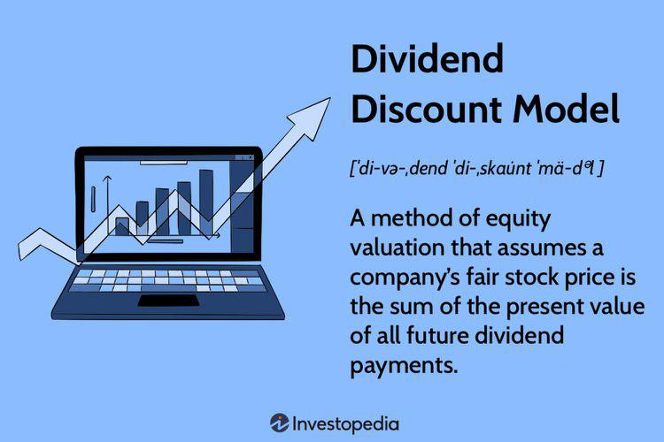

Stock valuation is a cornerstone of financial analysis, offering a systematic approach to determine the intrinsic value of a company's stock. This process is crucial for investors and analysts as it guides their decisions to buy, hold, or sell stocks based on whether the market price reflects the stock's underlying value. Among the various models used for stock valuation, the Dividend Discount Model (DDM) serves a significant role, particularly for valuing dividend-paying stocks. The DDM posits that the intrinsic value of a stock is equal to the present value of all its expected future dividends. 

The Dividend Discount Model is built on the premise that dividends are a direct return on investment for shareholders, making it a favored tool for evaluating companies with consistent and predictable dividend policies. This model integrates into a broader financial analysis, offering a quantitative foundation for algorithmic trading strategies. By understanding and applying DDM, individual investors and financial analysts can gain insights into the valuation process that are crucial for making informed investment decisions. 

Algorithmic trading systems increasingly incorporate insights from models like the DDM, merging these traditional valuation techniques with advanced technology to enhance trading efficiency and accuracy. For investors and analysts alike, understanding the nuances of DDM valuation methods becomes paramount, not only for standalone analysis but as a component of a comprehensive investment strategy.

This article will explore the Dividend Discount Model in detail, discussing its foundations, applications, and integration in financial analysis and algorithmic trading systems. We will cover different variations of the DDM, valuation methods using the model, practical considerations when applying DDM, and how these insights can be seamlessly integrated into modern trading practices. Through this discussion, readers will gain a deeper understanding of the critical role DDM plays in stock valuation and its evolving application in the dynamic landscape of financial markets.

## Table of Contents

## Understanding the Dividend Discount Model (DDM)

The Dividend Discount Model (DDM) is a fundamental approach to valuing a company's stock, predicated on the notion that a stock's value is equivalent to the present value of all its anticipated future dividends. The rationale behind DDM is straightforward: dividends represent cash flows to the shareholder, thus anchoring the stock's intrinsic value on these distributions provides an insightful gauge of its worth in the market.

### Assumptions Underlying the DDM

The model is based on several key assumptions. Primarily, it assumes that dividends will continue to grow at a constant rate indefinitely. This assumption is pivotal in simplifying the valuation process, although it often does not align perfectly with real-world scenarios. The DDM also presupposes the availability of historical data to project future dividends and assumes those projections remain unaffected by macroeconomic changes or internal business operations. Finally, DDM is most applicable to companies with a stable dividend payout history.

### Variations of the Model

The basic version of the DDM can be expanded into several variations to address different growth scenarios. 

1. **Gordon Growth Model**: This is the most well-known version of DDM, which assumes that dividends will grow at a constant rate $g$. The formula for the Gordon Growth Model, named after Myron J. Gordon, is:
$$
   P_0 = \frac{D_1}{r - g}

$$

   where $P_0$ is the present value of the stock, $D_1$ is the expected dividend in the next period, $r$ is the required rate of return, and $g$ is the growth rate of the dividends.

2. **Multi-Stage DDM**: This approach is used when a company’s dividends are expected to grow at different rates over different periods. The model accommodates varying growth rates (e.g., an initial high growth phase followed by a gradual stable growth phase) and calculates the present value of dividends for each phase separately.

### Present Value of Expected Future Dividends

The essence of DDM is its emphasis on calculating the present value of expected future dividends. This involves discounting future dividends back to their present value using the required rate of return. This discounting reflects the time value of money — the principle that future money is worth less than the same amount today due to its potential [earning](/wiki/earning-announcement) capacity. The main equation for calculating the present value of dividends with a perpetual growth model is:

$$
P_0 = \sum_{t=1}^\infty \frac{D_t}{(1+r)^t}
$$

For practical computations, especially in fluctuating growth environments, financial analysts often rely on numerical methods or programming tools such as Python to automate these calculations.

### Practical Applications of DDM

The Dividend Discount Model is particularly useful in scenarios involving companies with a mature and stable business life cycle and a consistent dividend payment history. Utility companies are a textbook example as they typically exhibit slow, predictable growth and regular dividend distributions, making them ideal candidates for DDM application. Additionally, DDM can be employed as a benchmarking tool, helping investors and analysts compare the intrinsic value of dividend-paying stocks against their market price to identify potential investment opportunities.

In summary, while the Dividend Discount Model provides a structured methodology for evaluating stock value based on cash flows from dividends, its effectiveness is closely linked to the accuracy of its underlying assumptions and the reliability of its input data.

## Valuation Methods Using the Dividend Discount Model

The Dividend Discount Model (DDM) is a cornerstone of stock valuation, especially for dividend-paying stocks. Among its variations, the constant growth model, also known as the Gordon Growth Model, is appreciated for its simplicity and ease of application. This model assumes that dividends will grow at a consistent rate indefinitely, allowing for a straightforward calculation of a stock's intrinsic value. The formula for the constant growth model is:

$$
P_0 = \frac{D_1}{r - g}
$$

where $P_0$ is the present value of the stock, $D_1$ is the expected dividend in the next period, $r$ is the required rate of return, and $g$ is the growth rate of dividends.

### Multi-Stage Dividend Growth Approach

The constant growth model may not be adequate for all companies, particularly those with variable dividend growth rates. In such cases, a multi-stage dividend growth model is more applicable. This approach considers different growth phases: an initial period of high growth, followed by a transition period, and, finally, a stable growth period.

For instance, tech companies that reinvest heavily in the early stage might expect higher dividend growth once they stabilize. The multi-stage model calculates the present value of dividends during each phase and sums them:

$$
P_0 = \sum_{t=1}^{n} \frac{D_t}{(1 + r)^t} + \frac{D_n (1 + g)}{(r - g)(1 + r)^n}
$$

This approach allows a more granular assessment of a company's potential, accommodating different growth expectations over time.

### Estimating Future Dividends and Growth Rates

Accurate dividend predictions require historical analysis and a deep understanding of a company's business model and market conditions. Growth rates can be estimated from past performance, industry growth, and economic forecasts. Analysts commonly use historical dividend growth rates as a baseline, adjusting these figures based on strategic company developments or macroeconomic shifts.

### Importance of Choosing an Appropriate Discount Rate

The discount rate $r$ is critical in DDM, reflecting the opportunity cost of capital and the risk profile of the investment. It can be derived from the Capital Asset Pricing Model (CAPM), where:

$$
r = R_f + \beta (R_m - R_f)
$$

Here, $R_f$ is the risk-free rate, $\beta$ is the stock's beta, and $R_m$ is the expected market return. An accurate discount rate ensures the valuation reflects true risk and investor expectations.

### Examples of DDM Application

Consider a hypothetical company, ABC Corp, expected to pay a dividend of $2 next year, with a dividend growth rate of 5% and a required return of 10%. Using the Gordon Growth Model, the valuation would be:

$$
P_0 = \frac{2}{0.10 - 0.05} = 40
$$

For a company with variable dividend growth, suppose DEF Inc. is expected to grow dividends at 10% for the first five years before stabilizing at 3%. Calculating each phase separately provides a more nuanced valuation, accommodating the transition from growth to stability.

These valuation methods, while powerful, require careful consideration of assumptions, particularly regarding growth rates and discount rates, to mitigate model limitations and arrive at meaningful insights.

## Practical Considerations in Using DDM

The Dividend Discount Model (DDM) is a widely used method in stock valuation, particularly for companies that consistently pay dividends. However, its application is not without challenges and limitations. One of the primary challenges with the DDM is its reliance on future dividend projections, which can be uncertain. The model assumes that dividends will continue at a predictable growth rate indefinitely, an assumption that may not hold true for all companies.

Factors influencing dividend stability and predictability include a company's earnings stability, its payout policy, and broader economic conditions. Earnings fluctuations can lead to changes in dividend payments, making it difficult to forecast dividends accurately. Additionally, corporate decisions on reinvestment versus distribution of profits as dividends introduce variability. Companies may alter their dividend policies based on changing business strategies or financial health, affecting the reliability of DDM-based valuations.

Valuing non-dividend or low-dividend stocks is particularly challenging with the DDM. Since the model fundamentally relies on dividend payments to estimate stock value, companies that do not pay dividends or have unpredictable dividend policies cannot be readily assessed using this method. For such stocks, alternative valuation models like the Discounted Cash Flow (DCF) model might be more appropriate, as they consider cash flows beyond dividends.

Market conditions also significantly impact the assumptions and outcomes of the DDM. Economic downturns or shifts in market sentiment can influence investor expectations and consequently the discount rate applied in DDM calculations. A rising [interest rate](/wiki/interest-rate-trading-strategies) environment might increase the discount rate, reducing the present value of projected dividends and thereby the estimated stock value.

Key metrics to monitor when applying the DDM include the company's dividend yield, payout ratio, and earnings growth rates. The dividend yield, calculated as $\frac{\text{Annual Dividends Per Share}}{\text{Price Per Share}}$, provides insight into the income generated per dollar invested. The payout ratio, which is the proportion of earnings paid out as dividends ($\frac{\text{Dividends}}{\text{Net Income}}$), helps assess dividend sustainability. Monitoring these metrics along with broader market indicators ensures a more informed application of the DDM.

In conclusion, while the Dividend Discount Model is a valuable tool for valuing dividend-paying stocks, its effectiveness depends on the accurate estimation of future dividends, the predictability of those dividends, and stable market conditions. For investors and analysts, understanding these practical considerations is crucial for leveraging the DDM in financial analysis and strategic investment decisions.

## Integrating DDM Valuation in Financial Analysis

The Dividend Discount Model (DDM) serves as an integral component in comprehensive financial analysis, providing a precise approach for valuing dividend-paying stocks by calculating the present value of future expected dividends. When integrated with other valuation models such as the Price/Earnings (P/E) ratio and the Discounted Cash Flow (DCF) model, it enhances the robustness of investment analysis, offering a multi-dimensional perspective.

To combine DDM with the P/E ratio, analysts use the dividend information to gain insights into a company's profitability and future growth expectations. The P/E ratio helps in comparing the valuation of companies that might not pay dividends but possess high growth potential. Conversely, DDM provides clarity on the intrinsic value of companies that consistently pay dividends. The combination allows for a balanced view, where P/E reflects market sentiment and DDM grounds the analysis in dividend payouts.

The Discounted Cash Flow (DCF) model is another fundamental tool that complements DDM. While DCF focuses on the total cash flows of a business, DDM concentrates specifically on cash flows returned to shareholders as dividends. This synergy is particularly useful for financial analysts seeking to gauge a company's valuation from both a holistic and shareholder-centric perspective. When the outputs from DCF and DDM align, it provides corroborative evidence supporting the investment thesis.

Analysts leverage DDM results in decision-making by understanding the implications of dividend growth assumptions, discount rates, and the estimated terminal value. The model's sensitivity to these inputs necessitates careful judgment. For example, in stable, mature industries, DDM results might play a larger role in influencing investment decisions as they directly reflect the expected returns through dividends.

Beyond numerical analysis, the importance of qualitative factors becomes apparent. Corporate governance, economic conditions, competitive positioning, regulatory impacts, and management strategies significantly influence a company's capacity to maintain or grow dividends. Therefore, while DDM provides quantitative insights, it is crucial to evaluate these qualitative aspects to ensure a comprehensive analysis.

Interpreting DDM results within the context of market trends is vital. During times of economic uncertainty, where dividend policies might be volatile, reliance solely on DDM could be misleading. Analysts must incorporate broader market trends and economic indicators to adjust their assumptions, making their valuations resilient to market fluctuations. This broader context enables investors to make informed decisions that align with prevailing market dynamics.

In summary, integrating DDM with other valuation models and considering qualitative factors enriches the financial analysis process. By placing DDM results within a broader context of market trends and combining them with other methodologies, analysts can derive actionable insights that guide sound investment decisions.

## Using Algorithmic Trading with DDM Insights

Algorithmic trading, the use of computer algorithms to execute trades in financial markets, has grown significantly in recent years. Its efficiency and speed have reshaped how stocks are traded, offering significant advantages over manual trading by minimizing human error, allowing high-frequency trading, and optimizing decision-making processes through complex data analysis. Algorithmic trading comprises a substantial portion of the [volume](/wiki/volume-trading-strategy) on major stock exchanges, indicating its growing prominence and importance.

Integrating Dividend Discount Model (DDM)-derived insights into [algorithmic trading](/wiki/algorithmic-trading) systems provides a powerful intersection between quantitative financial analysis and automated trading. The DDM, by estimating the intrinsic value of dividend-paying stocks based on the present value of expected future dividends, can generate valuable signals for trading algorithms. These algorithms can utilize DDM calculations to identify mispriced stocks, execute trades that capitalize on discrepancies, and optimize portfolio returns by aligning with a firm's fundamental value.

One major benefit of using DDM in algorithmic trading strategies is the enhancement of decision-making processes with [fundamental analysis](/wiki/fundamental-analysis). This combination enables traders to automate the evaluation of dividend stocks based on intrinsic value assessments, maintaining a data-driven approach to capturing market opportunities. Incorporating DDM into trading algorithms also allows for systematic and backtestable strategies that can adapt quickly to changing market conditions.

Implementing DDM insights in algorithmic trading involves leveraging various technological tools. Python, a favored language for financial modeling due to its extensive libraries like NumPy, pandas, and scipy, is frequently employed to compute DDM valuations. The use of [machine learning](/wiki/machine-learning) libraries such as scikit-learn can further refine predictive models, aiding in forecasting dividend growth rates and validating model assumptions. Additionally, platforms like MetaTrader and Bloomberg API facilitate real-time data access and trade execution, integral to implementing DDM-based strategies.

Risk management remains a critical aspect of employing DDM-derived strategies in algorithmic trading. Ensuring that algorithms have robust risk management protocols is essential to cope with market [volatility](/wiki/volatility-trading-strategies) and potential model inaccuracies. Techniques such as stop-loss limits, capital allocation rules, and scenario analysis can mitigate losses against unforeseen market movements. Regularly updating the DDM inputs, such as discount rates and growth projections, is equally crucial to reflecting current market conditions and maintaining the reliability of trading signals.

In summary, the synthesis of DDM insights with algorithmic trading underscores a significant advancement in financial market operations. As technology continues to evolve, so will the strategies combining fundamental analysis and automated execution, paving the way for more sophisticated and effective trading systems.

## Conclusion

The Dividend Discount Model (DDM) stands as a pivotal tool in stock valuation, particularly for dividend-paying stocks, emphasizing its significance in financial analysis and algorithmic trading. The DDM's ability to estimate the present value of expected future dividends provides investors and analysts with a quantitative foundation for evaluating stock worth. The integration of DDM insights into algorithmic trading illustrates its versatility, enhancing investment strategies through data-driven decisions.

Throughout the article, we've explored how the DDM, in its various forms like the Gordon Growth Model and multi-stage DDM, lends itself to different analytical contexts. It simplifies the complexity of stock valuation by focusing on dividend stability and growth estimations. These characteristics make it indispensable for investors who prioritize dividend income and require a systematic approach to valuation.

Readers are encouraged to incorporate DDM in their investment strategies, considering it alongside other valuation models such as Price/Earnings and Discounted Cash Flow. The potential to integrate qualitative assessment with quantitative analysis presents an opportunity for more comprehensive financial evaluations. Continuous learning and adaptation in DDM applications can yield insights into broader market trends and improve investment outcomes.

Future research in DDM could focus on refining assumptions related to dividend stability and exploring its applications in valuing non-dividend-paying stocks. Moreover, advancements in algorithmic trading provide an exciting frontier for further DDM integration, leveraging technological tools for risk management and efficiency.

As the landscape of stock valuation and trading methodologies evolves, embracing models like DDM enriches analytical capacities and supports informed decision-making. The synergy between traditional financial analysis and modern trading techniques continues to shape the future of investment strategies, promising innovation and growth opportunities for both individual and professional market participants.

## References & Further Reading

[1]: ["The Dividend Discount Model"](https://www.investopedia.com/terms/d/ddm.asp) on Investopedia

[2]: Gordon, M. J. (1959). ["Dividends, Earnings, and Stock Prices."](https://www.jstor.org/stable/1927792) The Review of Economics and Statistics, 41(2), 99-105.

[3]: ["Myron J. Gordon, Pioneer of the Dividend Discount Model."](https://en.wikipedia.org/wiki/Myron_J._Gordon) Boston University Article.

[4]: ["Financial Analysis with DDM"](https://www.investopedia.com/terms/d/ddm.asp) by CFA Institute

[5]: Damodaran, A. (2012). ["Investment Valuation: Tools and Techniques for Determining the Value of Any Asset."](https://books.google.com/books/about/Investment_Valuation.html?id=5SRHAAAAQBAJ) John Wiley & Sons.