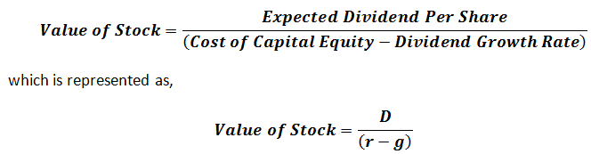

In today's rapidly evolving financial landscape, understanding investment valuation models is crucial for making informed decisions. These models aid investors in evaluating the intrinsic worth of securities, thereby facilitating better investment choices. One such model is the Dividend Discount Model (DDM), designed to determine the fair value of a stock based on anticipated dividend payments. This financial model is particularly useful for investors focused on dividend-paying stocks, as it considers the present value of future cash inflows from dividends.

The DDM operates on the core premise that a stock's intrinsic value is equivalent to the sum of all its expected future dividends, discounted back to their present value. This model helps investors assess whether a stock is undervalued or overvalued in the current market. By prioritizing the time value of money, the DDM provides a robust framework for evaluating stable dividend-paying companies.

In this article, we explore the DDM's relevance in investment valuation and its intersection with algorithmic trading. We examine how investors employ the model to forecast stock value and the role of technology in enhancing DDM-based strategies. Algorithmic trading, which leverages computer algorithms to automate trading decisions, can greatly benefit from integrating DDM calculations. This integration equips traders with rapid, data-driven insights, ultimately refining investment approaches.

Understanding the intricacies of the DDM, along with the advancements in algorithmic approaches, offers new opportunities for precision and efficiency in investment strategies. This foundational model, despite its limitations, continues to be a vital tool in the arsenal of traders and investors alike.

## Table of Contents

## Understanding the Dividend Discount Model (DDM)

The Dividend Discount Model (DDM) is a quantitative approach to valuing a stock based on the presumption that its worth is derived from the sum of all anticipated future dividend payments, discounted to their present value. This model is foundational in financial analysis and aids investors in determining if a stock is currently undervalued or overvalued by the market.

At its core, DDM is built on the principle of the time value of money, which posits that a dollar today is worth more than a dollar in the future. This model applies this principle by calculating the present value of expected future dividends. The basic premise is that dividends represent a company's ability to generate cash flow for shareholders; therefore, analyzing these dividends provides insight into the stock's true value.

The general formula for DDM is expressed as:

$$
P_0 = \sum_{t=1}^{\infty} \frac{D_t}{(1 + r)^t}
$$

where $P_0$ is the current price of the stock, $D_t$ is the dividend expected to be received in year $t$, and $r$ is the required rate of return. This infinite series can be simplified under certain conditions, such as assuming constant growth rates.

Investors often rely on the DDM for evaluating stocks that have stable and predictable dividend payouts. This reliance is due to the model's assumption that dividends will continue indefinitely and grow at a constant rate, which is a common characteristic of mature, established companies with consistent cash flow.

In practice, DDM is especially useful for valuing blue-chip stocks and utility companies known for maintaining regular dividend payments. Its effectiveness is, however, limited to such entities, as companies with irregular or no dividends cannot be accurately assessed using this model.

DDM facilitates a structured comparison between a stock's market price and its intrinsic value, enabling investors to make more informed investing choices based on their risk profiles and investment goals. However, it is important for investors to consider the model's assumptions and ensure they align with the actual conditions of the company being evaluated for an accurate valuation.

## Formula and Variations

The Dividend Discount Model (DDM) is built on the premise that the value of a stock is the present value of all its future dividends. The fundamental formula for DDM is expressed as:

$$
\text{Value of Stock} = \frac{D_1}{r - g}
$$

where $D_1$ represents the expected dividend in the next year, $r$ is the cost of equity, and $g$ is the growth rate of the dividends. This straightforward formula is the core of the DDM, often applied under the assumption of constant growth, widely known as the Gordon Growth Model (GGM).

The GGM is suitable for stable, mature companies where a constant dividend growth rate is anticipated. However, in practice, different companies exhibit varying dividend behaviors, necessitating adaptations to this basic model:

1. **Zero Growth DDM**: This variation is employed when a company consistently pays the same dividend over time. In such cases, the formula reduces to simply dividing the fixed dividend by the cost of equity ($r$), as there is no growth factor to consider. This version is useful for valuing stocks in mature industries with a stable dividend history.

2. **Multi-Stage DDMs**: Companies with fluctuating growth rates require more intricate models. Multi-stage DDMs consider different growth phases: an initial period with high or variable growth followed by a mature phase with stable growth. This provides a nuanced approach to valuation by accounting for more complex dividend growth paths, especially in transitioning companies.

Selecting the appropriate DDM variation depends heavily on a company’s life cycle and its dividend growth record. A young company with a volatile growth trajectory may be better suited for a multi-stage model, whereas large, established firms often align with the Gordon Growth Model. By tailoring the model to the specific growth characteristics of a firm, investors can gain more accurate insights into the stock's intrinsic value.

## Calculating Stock Value Using DDM

Calculating the stock value using the Dividend Discount Model (DDM) requires a firm grasp of several key assumptions related to future dividends and growth rates. At its core, DDM applies the financial principle that a stock's value is based on the present value of its expected future dividends. The most commonly used variation is the Gordon Growth Model (GGM), which is suitable for companies with a stable dividend growth rate. The formula for GGM is:

$$
\text{Value of Stock} = \frac{D_1}{r - g}
$$

where:
- $D_1$ is the expected dividend for the next period,
- $r$ is the required rate of return or cost of equity,
- $g$ is the constant growth rate of the dividends.

For example, suppose a company is expected to pay a dividend of $2 next year, with a required rate of return of 8%, and a constant growth rate of 4%. The stock value would be calculated as follows:

$$
\text{Value of Stock} = \frac{2}{0.08 - 0.04} = \frac{2}{0.04} = 50
$$

This estimation shows that small changes in either the growth rate ($g$) or the required return ($r$) can have substantial impacts on the stock's calculated value. For instance, an adjustment of 0.5% in the growth rate can lead to a significant value shift, underscoring the sensitivity of the DDM formula to its inputs.

Understanding these sensitivities is critical, as misjudgments could lead to overvaluing or undervaluing a stock. Therefore, using historical data and projections for stable companies can enhance accuracy. For example, case studies of firms like The Coca-Cola Company, known for a long history of consistent dividend payments, illustrate the practical application of the DDM. By examining their dividend patterns and stable growth rate, analysts can effectively apply the GGM to assess fair stock values.

Additionally, a thorough understanding of these computations forms a foundation for more sophisticated financial modeling techniques. Advanced strategies in computational finance often integrate DDM with other valuation models and market data analytics, accommodating more complex growth scenarios and enhancing overall investment decision-making accuracy.

## Shortcomings and Challenges of DDM

The Dividend Discount Model (DDM), while useful for evaluating dividend-paying stocks, presents several limitations that investors must consider. Its primary shortcoming is its inherent dependence on forecasts. Since future dividends form the core of the model's valuation, any inaccuracy in predicting these payments can lead to substantial errors in determining a stock's fair value.

One significant challenge arises when dealing with stocks that do not offer regular or predictable dividends. The DDM assumes a degree of dividend stability, which may not be present in certain industries or during specific economic periods. For companies with inconsistent dividend records, the model's predictive power weakens, making it less effective for valuation purposes.

Moreover, the model presumes a constant growth rate for dividends. This assumption is particularly problematic when applied to newer companies or those in volatile sectors where dividend growth can fluctuate significantly. In such cases, the DDM may fail to accurately reflect the true financial health and potential of a business.

Market dynamics further complicate the DDM's application, especially during periods of economic uncertainty or change. Fluctuating interest rates, inflation, and shifts in investor sentiment can impact both the cost of equity and expected growth rates, which are vital inputs in the DDM formula. As a result, the model can provide misleading valuations that do not align with market realities.

To address these challenges, it is crucial for investors to use the DDM alongside other valuation methods, such as discounted cash flow analysis, price-to-earnings ratios, or even more advanced computational techniques. This diversified approach helps mitigate risks and compensate for the potential inaccuracies of relying solely on the DDM. By integrating multiple models, investors can achieve a more robust and nuanced understanding of a stock's intrinsic value, thereby enhancing their decision-making process in a complex financial environment.

## Integrating DDM with Algorithmic Trading

Algorithmic trading, often known as algo trading, employs sophisticated computer algorithms to execute trading decisions at speeds and frequencies that would be impossible for human traders. By integrating financial models like the Dividend Discount Model (DDM) into these algorithms, traders can automate investment strategies based on dividend valuations, allowing for more precise and rapid execution of buy and sell orders.

The core concept of using DDM in [algorithmic trading](/wiki/algorithmic-trading) is leveraging its capacity to assess the intrinsic value of dividend-paying stocks. The DDM calculates the fair value of a stock by projecting future dividend payments and discounting them to their present value. When integrated with algorithmic systems, DDM aids in generating reliable buy/sell signals—especially crucial for stocks with significant dividend histories.

To implement such a strategy, an algorithm might include steps to:

1. **Identify Stocks with Consistent Dividend Histories**: Focus on stocks with predictable dividend patterns. This stability allows for more accurate DDM valuations.

2. **Calculate Intrinsic Value Using DDM**: Employ the DDM formula, $V = \frac{D_1}{r - g}$, where $D_1$ is the expected dividend, $r$ is the required rate of return, and $g$ is the growth rate. This calculation helps identify whether the stock is undervalued or overvalued.

3. **Set Buy/Sell Thresholds**: Use the intrinsic value derived from DDM to set thresholds for initiating buy or sell orders. If the market price of the stock is below the intrinsic value, a buy signal may be generated, whereas a market price above intrinsic value may prompt a sell signal.

4. **Continuously Update with Market Data**: Algo trading systems can be designed to continuously update DDM calculations as new market data and dividend announcements become available. This ensures that trading signals remain accurate and relevant.

5. **Implement Risk Management Protocols**: Integrate risk management strategies to mitigate potential losses. This includes stop-loss orders and diversification among different asset classes.

The integration of DDM within algorithmic trading systems can significantly improve investment portfolio optimization. By combining the model’s precision in evaluating stock valuations with the rapid execution capabilities of algo trading, investors can enhance the efficiency and accuracy of their trading strategies.

Modern traders benefit enormously from such hybrid models, which cater to their need for swift, data-driven insights. The automation provided by algorithmic trading reduces emotional biases and systematic errors often seen in manual trading. As a result, traders are equipped to swiftly capitalize on market opportunities, ensuring a competitive edge in an increasingly complex financial landscape.

## Conclusion

The Dividend Discount Model (DDM) remains a crucial tool in the world of financial valuation despite its inherent limitations. Primarily used for valuing stocks based on anticipated future dividends, DDM provides a mathematical approach to investment valuation by discounting these expected dividends to their present value. This enduring relevance of DDM in assessing dividend-paying stocks is shaped by its methodical framework, offering investors a quantifiable metric to evaluate stock worth. 

Although DDM is bounded by assumptions like a constant growth rate of dividends, it excels when integrated with modern algorithmic trading strategies. Algorithmic trading leverages the computational power of algorithms to automate trading decisions swiftly and efficiently. By incorporating DDM into these algorithms, traders can swiftly identify potential investment opportunities by analyzing dividend valuations and generating buy or sell signals. This synthesis enhances the accuracy and speed, offering traders a blend of traditional valuation methods with cutting-edge technological advancements.

In the increasingly complex financial markets, investors are urged to diversify their evaluation strategies. Augmenting DDM with other valuation models, such as discounted cash flow analysis and price-to-earnings ratios, allows for a more comprehensive investment appraisal. Embracing technological advancements, such as algorithmic trading systems and [machine learning](/wiki/machine-learning), further boosts the potential for informed decision-making. Constant learning and adaptation to emerging financial technologies are essential for successful investing, ensuring that investors remain responsive to rapid market changes and economic fluctuations.

Ultimately, DDM's role in evaluating dividend-paying stocks endures partly due to its precision and ease of understanding. When paired with advanced trading techniques, DDM not only maintains its fundamental utility but expands the horizons for achieving optimal investment outcomes. The synergy of traditional and modern approaches symbolizes the future of financial valuation, highlighting the indispensable nature of DDM in a dynamic investment environment.

## References & Further Reading

[1]: Damodaran, A. (2012). ["Investment Valuation: Tools and Techniques for Determining the Value of Any Asset."](https://books.google.com/books/about/Investment_Valuation.html?id=5SRHAAAAQBAJ) John Wiley & Sons.

[2]: Gordon, M. J., & Shapiro, E. (1956). ["Capital Equipment Analysis: The Required Rate of Profit."](https://www.jstor.org/stable/pdf/2627177.pdf) Management Science, 3(1), 102-110.

[3]: ["The Intelligent Investor: The Definitive Book on Value Investing."](https://www.amazon.com/Intelligent-Investor-3rd-Ed/dp/0063356724) by Benjamin Graham

[4]: Williams, J. B. (1938). ["The Theory of Investment Value."](https://www.jstor.org/stable/1826645) Harvard University Press.

[5]: Bodie, Z., Kane, A., & Marcus, A. J. (2013). ["Investments (10th Edition)."](https://www.amazon.com/Investments-10th-Zvi-Bodie/dp/0077861671) McGraw-Hill Education.

[6]: ["Valuation: Measuring and Managing the Value of Companies, University Edition"](https://books.google.com/books/about/Valuation.html?id=fGXjDwAAQBAJ) by McKinsey & Company Inc.