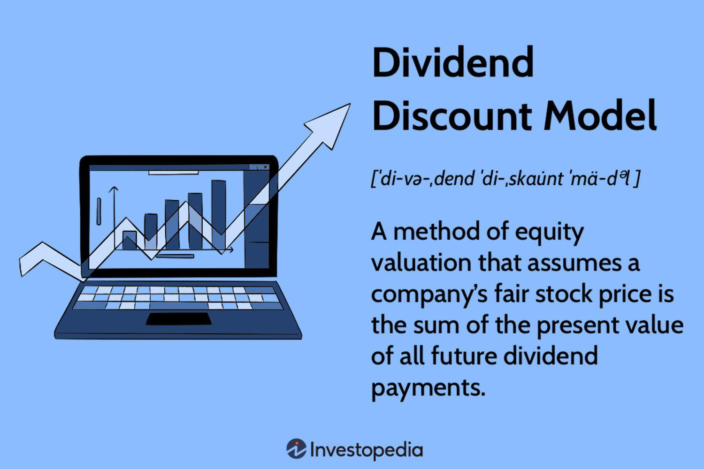

## Table of Contents

## What is the Dividend Discount Model (DDM)?

The Dividend Discount Model (DDM) is a way to figure out how much a stock is worth by looking at the dividends it pays out. It's based on the idea that the value of a stock is the sum of all its future dividend payments, discounted back to their present value. This means that if you know how much a company will pay in dividends in the future, you can work out what the stock is worth today.

To use the DDM, you need to make some guesses about the future. You have to estimate how much the dividends will grow each year and what rate you should use to discount those future dividends back to the present. The most common version of the DDM is the Gordon Growth Model, which assumes that dividends will grow at a steady rate forever. While this model can be useful, it's important to remember that it relies on these guesses about the future, so it's not always perfect.

## How does the Dividend Discount Model work?

The Dividend Discount Model (DDM) is a way to figure out how much a stock is worth by looking at the dividends it will pay in the future. The basic idea is that the value of a stock today is the total of all the future dividends it will pay, but you have to adjust those future payments to what they're worth right now. This adjustment is called discounting, and it's done using a discount rate, which is like an interest rate that shows how much you value money now compared to money later.

To use the DDM, you need to guess how much the dividends will grow each year. The most common way to do this is with the Gordon Growth Model, which assumes that dividends will keep growing at a steady rate forever. You take the expected dividend for next year, divide it by the difference between the discount rate and the growth rate, and that gives you the value of the stock today. It's a simple way to value a stock, but it depends a lot on your guesses about future growth and the right discount rate to use.

## What is the basic formula for the Dividend Discount Model?

The basic formula for the Dividend Discount Model (DDM) is simple but relies on a few key pieces of information. The formula is: Stock Value = Dividend / (Discount Rate - Growth Rate). Here, the "Dividend" is the expected dividend payment for the next year, the "Discount Rate" is the rate used to discount future payments back to the present, and the "Growth Rate" is the expected annual growth rate of the dividends.

To use this formula, you first need to estimate what the next year's dividend will be. Then, you need to decide on a discount rate, which often reflects the risk of the investment or the rate of return you expect. Finally, you need to guess how fast the dividends will grow each year. The difference between the discount rate and the growth rate is used to calculate the present value of all future dividends, giving you the value of the stock today.

## Can you explain the Gordon Growth Model, a variation of the DDM?

The Gordon Growth Model is a simple way to figure out how much a stock is worth by using the Dividend Discount Model. It assumes that the dividends a company pays out will keep growing at a steady rate forever. To use this model, you need to know the dividend the company is expected to pay next year, the rate at which you think the dividends will grow each year, and the discount rate, which is like an interest rate that shows how much you value money now compared to money later.

The formula for the Gordon Growth Model is easy: you take the expected dividend for next year and divide it by the difference between the discount rate and the growth rate. So if a company is expected to pay a $2 dividend next year, and you think the dividends will grow by 3% each year, and you use a discount rate of 8%, the value of the stock would be $2 divided by (8% - 3%), which is $40. This model is handy because it's simple, but it depends a lot on your guesses about the future growth of dividends and the right discount rate to use.

## What are the key assumptions behind the Dividend Discount Model?

The Dividend Discount Model (DDM) relies on a few important guesses about the future. The main one is that the company will keep paying dividends to its shareholders. This means the company has to make enough money to be able to pay these dividends. Another big guess is that the dividends will grow at a steady rate. This rate of growth is really important because it affects how much the stock is worth today.

Another key assumption is about the discount rate. This rate is used to figure out what future dividends are worth now. It's like an interest rate that shows how much you value money now compared to money later. Picking the right discount rate is tricky because it depends on how risky you think the investment is. If you guess wrong about any of these things—like how much the dividends will grow or what the right discount rate is—the value you come up with for the stock could be way off.

## How do you estimate future dividends for the DDM?

To estimate future dividends for the Dividend Discount Model, you need to look at the company's past dividends and see how they've changed over time. If the dividends have been going up by a certain percentage each year, you might guess they'll keep growing at that same rate. You also need to think about the company's earnings because dividends usually come from the money the company makes. If you think the company will make more money in the future, you might guess that the dividends will go up too.

Another way to estimate future dividends is by looking at what the company says about its plans. If a company says it wants to pay out more dividends in the future, you can use that information to make your guess. But remember, these are just guesses, and things can change. The economy might get worse, or the company might have a bad year, which could mean they pay less in dividends than you expected. So, when you're trying to figure out future dividends, you have to think about a lot of different things and be ready for your guesses to be a bit off.

## What are the limitations of using the Dividend Discount Model?

The Dividend Discount Model has some problems that can make it hard to use. One big issue is that it relies on guesses about the future, like how fast dividends will grow and what the right discount rate is. If your guesses are wrong, the value you come up with for the stock could be way off. Another problem is that the model works best for companies that pay steady dividends and are expected to keep doing so. If a company doesn't pay dividends or if the dividends change a lot, the model doesn't work as well.

Another limitation is that the DDM doesn't take into account other ways a company can give value to shareholders, like buying back its own stock or growing in value without paying dividends. It also assumes that the growth rate of dividends will stay the same forever, which isn't realistic for most companies. This can make the model less useful for companies that are growing quickly or going through big changes. So, while the DDM can be a helpful tool, it's important to know its limits and use it carefully.

## How does the multi-stage DDM differ from the single-stage model?

The multi-stage Dividend Discount Model is different from the single-stage model because it lets you change how fast you think the dividends will grow over time. In the single-stage model, you guess that dividends will keep growing at the same rate forever. But in the real world, companies often grow fast for a while and then slow down. So, the multi-stage model lets you break the future into different parts, or stages, where the growth rate can be different in each part. You might think a company will grow really fast for the next five years, then slow down after that. The multi-stage model helps you take that into account.

Using the multi-stage DDM can make your guesses about a stock's value more realistic because it lets you match the growth rate to what you think will really happen. For example, you might use a high growth rate for the first few years, then a lower rate after that, and maybe even a steady rate forever after a certain point. This way, you can better capture how a company might change over time. But it also makes the model more complicated because you have to make more guesses about the future, and if any of those guesses are wrong, it can mess up your final number.

## What are some common variations of the Dividend Discount Model?

The Dividend Discount Model has different versions that help people figure out how much a stock is worth. One common version is the Gordon Growth Model, which assumes that dividends will keep growing at the same rate forever. It's simple to use because you just need to guess the next year's dividend, the growth rate, and the discount rate. Another version is the multi-stage DDM, which lets you change the growth rate over time. This is handy if you think a company will grow fast for a few years and then slow down. It's more complicated but can give a better guess about the stock's value.

Another variation is the H-Model, which is a mix of the single-stage and multi-stage models. It assumes that a company's dividends will grow fast for a while and then slow down to a steady rate. This model is good for companies that are going through big changes. There's also the Two-Stage DDM, which is a simpler version of the multi-stage model where you guess a high growth rate for the first stage and a lower, steady rate for the second stage. These different versions of the DDM help people make better guesses about a stock's value, but they all depend on making good guesses about the future.

## How can the Dividend Discount Model be adjusted for companies that do not pay dividends?

The Dividend Discount Model (DDM) is usually used for companies that pay dividends, but you can change it a bit to use it for companies that don't pay dividends. One way to do this is by using something called the "adjusted DDM" or "residual income model." Instead of looking at dividends, you look at the company's free cash flow, which is the money the company has left after it pays for everything it needs to run the business. You can then use this free cash flow as if it were a dividend and put it into the DDM formula to figure out what the stock is worth.

Another way to adjust the DDM for companies that don't pay dividends is by using the "earnings-based DDM." In this version, you guess what the company might pay in dividends if it did decide to start paying them. You look at the company's earnings and think about how much of those earnings could be paid out as dividends. Then, you use that guessed dividend in the DDM formula. Both of these ways help you use the DDM for companies that don't pay dividends, but they still depend a lot on your guesses about the future.

## What are the challenges in applying the Dividend Discount Model to high-growth companies?

Using the Dividend Discount Model (DDM) for high-growth companies can be tricky. High-growth companies often don't pay dividends because they're busy using their money to grow even bigger. They might be spending on new projects, hiring more people, or buying other companies. Because the DDM needs you to guess future dividends, it's hard to use it for these companies. You'd have to guess when they might start paying dividends and how much they'll pay, which can be really tough because their future is so uncertain.

Another problem is that high-growth companies usually have dividends that grow a lot in the beginning and then slow down. The basic DDM, like the Gordon Growth Model, assumes dividends grow at a steady rate forever, which doesn't fit well with these companies. You could use a multi-stage DDM to guess different growth rates over time, but that makes things more complicated. You have to make a lot of guesses about the future, and if any of those guesses are wrong, your estimate of the stock's value could be way off. So, while the DDM can be adjusted for high-growth companies, it's still a challenge to use it well.

## How does the sensitivity of inputs affect the reliability of the Dividend Discount Model?

The Dividend Discount Model (DDM) depends a lot on the numbers you put into it, like the next year's dividend, the growth rate of dividends, and the discount rate. If any of these numbers change even a little bit, the value you get for the stock can change a lot. For example, if you guess the growth rate will be 3% but it turns out to be 4%, the value of the stock can go up a lot. This means the DDM is very sensitive to the inputs you use, and small changes can make big differences in what you think the stock is worth.

Because the DDM is so sensitive to these inputs, it's important to be careful when you use it. You have to think hard about your guesses and be ready for them to be a bit off. If you're not sure about the growth rate or the discount rate, it's a good idea to try different numbers and see how much the stock's value changes. This can help you understand how reliable your final number is. The more unsure you are about your guesses, the less you should trust the value you get from the DDM.

## What is the Dividend Discount Model (DDM) and how does it work?

The Dividend Discount Model (DDM) is a quantitative approach to valuing a stock based on the presumption that its worth is derived from the sum of all anticipated future dividend payments, discounted to their present value. This model is foundational in financial analysis and aids investors in determining if a stock is currently undervalued or overvalued by the market.

At its core, DDM is built on the principle of the time value of money, which posits that a dollar today is worth more than a dollar in the future. This model applies this principle by calculating the present value of expected future dividends. The basic premise is that dividends represent a company's ability to generate cash flow for shareholders; therefore, analyzing these dividends provides insight into the stock's true value.

The general formula for DDM is expressed as:

$$
P_0 = \sum_{t=1}^{\infty} \frac{D_t}{(1 + r)^t}
$$

where $P_0$ is the current price of the stock, $D_t$ is the dividend expected to be received in year $t$, and $r$ is the required rate of return. This infinite series can be simplified under certain conditions, such as assuming constant growth rates.

Investors often rely on the DDM for evaluating stocks that have stable and predictable dividend payouts. This reliance is due to the model's assumption that dividends will continue indefinitely and grow at a constant rate, which is a common characteristic of mature, established companies with consistent cash flow.

In practice, DDM is especially useful for valuing blue-chip stocks and utility companies known for maintaining regular dividend payments. Its effectiveness is, however, limited to such entities, as companies with irregular or no dividends cannot be accurately assessed using this model.

DDM facilitates a structured comparison between a stock's market price and its intrinsic value, enabling investors to make more informed investing choices based on their risk profiles and investment goals. However, it is important for investors to consider the model's assumptions and ensure they align with the actual conditions of the company being evaluated for an accurate valuation.

## What is the Formula and its Variations?

The Dividend Discount Model (DDM) is built on the premise that the value of a stock is the present value of all its future dividends. The fundamental formula for DDM is expressed as:

$$
\text{Value of Stock} = \frac{D_1}{r - g}
$$

where $D_1$ represents the expected dividend in the next year, $r$ is the cost of equity, and $g$ is the growth rate of the dividends. This straightforward formula is the core of the DDM, often applied under the assumption of constant growth, widely known as the Gordon Growth Model (GGM).

The GGM is suitable for stable, mature companies where a constant dividend growth rate is anticipated. However, in practice, different companies exhibit varying dividend behaviors, necessitating adaptations to this basic model:

1. **Zero Growth DDM**: This variation is employed when a company consistently pays the same dividend over time. In such cases, the formula reduces to simply dividing the fixed dividend by the cost of equity ($r$), as there is no growth factor to consider. This version is useful for valuing stocks in mature industries with a stable dividend history.

2. **Multi-Stage DDMs**: Companies with fluctuating growth rates require more intricate models. Multi-stage DDMs consider different growth phases: an initial period with high or variable growth followed by a mature phase with stable growth. This provides a nuanced approach to valuation by accounting for more complex dividend growth paths, especially in transitioning companies.

Selecting the appropriate DDM variation depends heavily on a company’s life cycle and its dividend growth record. A young company with a volatile growth trajectory may be better suited for a multi-stage model, whereas large, established firms often align with the Gordon Growth Model. By tailoring the model to the specific growth characteristics of a firm, investors can gain more accurate insights into the stock's intrinsic value.

## How do you calculate stock value using the Dividend Discount Model (DDM)?

Calculating the stock value using the Dividend Discount Model (DDM) requires a firm grasp of several key assumptions related to future dividends and growth rates. At its core, DDM applies the financial principle that a stock's value is based on the present value of its expected future dividends. The most commonly used variation is the Gordon Growth Model (GGM), which is suitable for companies with a stable dividend growth rate. The formula for GGM is:

$$
\text{Value of Stock} = \frac{D_1}{r - g}
$$

where:
- $D_1$ is the expected dividend for the next period,
- $r$ is the required rate of return or cost of equity,
- $g$ is the constant growth rate of the dividends.

For example, suppose a company is expected to pay a dividend of $2 next year, with a required rate of return of 8%, and a constant growth rate of 4%. The stock value would be calculated as follows:

$$
\text{Value of Stock} = \frac{2}{0.08 - 0.04} = \frac{2}{0.04} = 50
$$

This estimation shows that small changes in either the growth rate ($g$) or the required return ($r$) can have substantial impacts on the stock's calculated value. For instance, an adjustment of 0.5% in the growth rate can lead to a significant value shift, underscoring the sensitivity of the DDM formula to its inputs.

Understanding these sensitivities is critical, as misjudgments could lead to overvaluing or undervaluing a stock. Therefore, using historical data and projections for stable companies can enhance accuracy. For example, case studies of firms like The Coca-Cola Company, known for a long history of consistent dividend payments, illustrate the practical application of the DDM. By examining their dividend patterns and stable growth rate, analysts can effectively apply the GGM to assess fair stock values.

Additionally, a thorough understanding of these computations forms a foundation for more sophisticated financial modeling techniques. Advanced strategies in computational finance often integrate DDM with other valuation models and market data analytics, accommodating more complex growth scenarios and enhancing overall investment decision-making accuracy.

## References & Further Reading

[1]: Damodaran, A. (2012). ["Investment Valuation: Tools and Techniques for Determining the Value of Any Asset."](https://books.google.com/books/about/Investment_Valuation.html?id=5SRHAAAAQBAJ) John Wiley & Sons.

[2]: Gordon, M. J., & Shapiro, E. (1956). ["Capital Equipment Analysis: The Required Rate of Profit."](https://www.jstor.org/stable/pdf/2627177.pdf) Management Science, 3(1), 102-110.

[3]: ["The Intelligent Investor: The Definitive Book on Value Investing."](https://www.amazon.com/Intelligent-Investor-3rd-Ed/dp/0063356724) by Benjamin Graham

[4]: Williams, J. B. (1938). ["The Theory of Investment Value."](https://www.jstor.org/stable/1826645) Harvard University Press.

[5]: Bodie, Z., Kane, A., & Marcus, A. J. (2013). ["Investments (10th Edition)."](https://www.amazon.com/Investments-10th-Zvi-Bodie/dp/0077861671) McGraw-Hill Education.

[6]: ["Valuation: Measuring and Managing the Value of Companies, University Edition"](https://books.google.com/books/about/Valuation.html?id=fGXjDwAAQBAJ) by McKinsey & Company Inc.