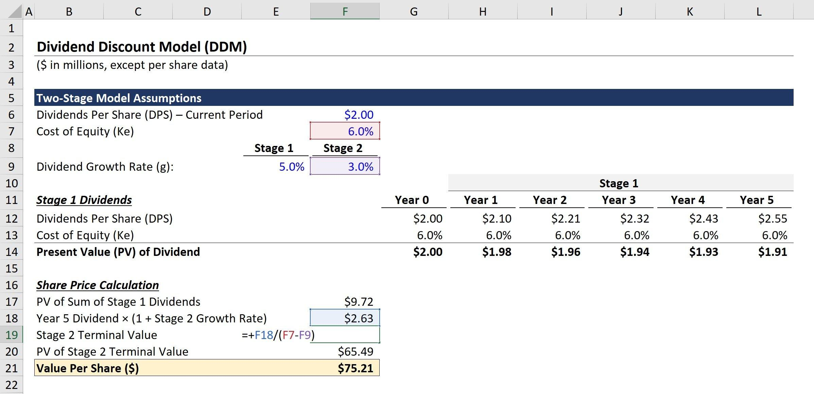

## Table of Contents

## What is the Dividend Discount Model (DDM)?

The Dividend Discount Model (DDM) is a way to figure out how much a company's stock is worth by looking at the money it pays to its shareholders, called dividends. The main idea is that the value of a stock is the total of all the future dividends it will pay, but we look at those future payments in today's money. To do this, we use something called a discount rate, which helps us understand what future dividends are worth right now.

There are different types of DDM, but the simplest one is the Gordon Growth Model. This model assumes that dividends will grow at a steady rate forever. To use it, you need to know the expected dividend per share for next year, the growth rate of dividends, and the discount rate. You then put these numbers into a formula to find out the stock's value. While DDM is useful, it works best for companies that pay regular dividends and have stable growth rates. For companies that don't pay dividends or have unpredictable growth, other methods might be better.

## How does the DDM help in valuing a stock?

The Dividend Discount Model (DDM) helps in valuing a stock by focusing on the dividends a company pays to its shareholders. It calculates the stock's value by adding up all the future dividends the company is expected to pay, but it does this in today's money. This means it takes the future dividends and uses a discount rate to figure out what they're worth right now. The discount rate is important because it reflects how much risk there is in getting those future dividends. If the stock is seen as risky, the discount rate will be higher, making the present value of the dividends lower.

Using DDM, investors can decide if a stock is a good buy. If the value calculated by DDM is higher than the current market price of the stock, it might be a good investment because the stock could be undervalued. On the other hand, if the DDM value is lower than the market price, the stock might be overvalued, and it might be better to look elsewhere. However, DDM works best for companies that regularly pay dividends and have predictable growth. For companies that don't pay dividends or have unpredictable growth, other valuation methods might be more useful.

## What are the basic assumptions of the DDM?

The Dividend Discount Model (DDM) is based on some important ideas. One big idea is that the value of a stock comes from the dividends it will pay in the future. This means that if a company doesn't pay dividends, or if it's not expected to pay them in the future, the DDM won't be very useful for figuring out the stock's value. Another key idea is that these future dividends can be turned into today's money using a discount rate. The discount rate helps us understand how much risk there is in getting those future dividends. If the stock is seen as risky, the discount rate will be higher, which means the value of the stock today will be lower.

Another assumption of the DDM is that dividends will grow at a steady rate over time. This is especially true for models like the Gordon Growth Model, which assume that dividends will keep growing at the same rate forever. This steady growth makes it easier to calculate the stock's value because you can use a simple formula. But this assumption might not always be true in real life, where growth rates can change a lot. So, DDM works best for companies that have a history of paying regular dividends and where the future looks pretty predictable. If a company's dividends are all over the place or if it's hard to guess what will happen in the future, the DDM might not give a good picture of the stock's value.

## Can you explain the formula for the DDM?

The basic formula for the Dividend Discount Model (DDM) is pretty simple. It says that the value of a stock today is the total of all the future dividends the company will pay, but we look at those dividends in today's money. The formula is: Value of the Stock = D1 / (r - g), where D1 is the dividend the company is expected to pay next year, r is the discount rate, and g is the growth rate of the dividends. The discount rate, r, is like the [interest rate](/wiki/interest-rate-trading-strategies) you use to turn future money into today's money. It shows how much risk there is in getting those future dividends. The growth rate, g, is how fast the dividends are expected to grow every year.

Let's break down the formula a bit more. D1 is the dividend you expect next year, so if a company paid $2 this year and you think it will grow by 5%, then D1 would be $2.10. The discount rate, r, might be something like 10% if the stock is seen as risky. The growth rate, g, could be that same 5% you used for D1. So, if you plug in these numbers, the formula would look like this: Value of the Stock = $2.10 / (0.10 - 0.05) = $2.10 / 0.05 = $42. This means the stock should be worth $42 today, based on the expected dividends and the risk involved.

## What is the difference between the Gordon Growth Model and the Multi-Period DDM?

The Gordon Growth Model and the Multi-Period DDM are both ways to figure out how much a stock is worth based on its future dividends, but they look at those dividends in different ways. The Gordon Growth Model is simpler because it assumes that dividends will grow at a steady rate forever. You just need to know the dividend expected next year, the growth rate of those dividends, and the discount rate. This makes it easy to use because you can put these numbers into one simple formula to find out the stock's value today.

On the other hand, the Multi-Period DDM is more flexible and can handle situations where dividends might change a lot from year to year. Instead of assuming a steady growth rate forever, this model lets you look at each year's dividends separately. You can predict different dividends for different years and then use a discount rate to turn those future dividends into today's money. This makes the Multi-Period DDM better for companies where the future is less predictable and dividends might not grow at a steady rate.

## How do you estimate the required rate of return for the DDM?

The required rate of return, often called the discount rate in the DDM, is what you use to figure out how much future dividends are worth today. To estimate this rate, you can use something called the Capital Asset Pricing Model (CAPM). CAPM says that the required rate of return is made up of a few parts: the risk-free rate, which is what you'd get from a safe investment like a government bond, plus a bit extra for taking on more risk. The extra part is called the equity risk premium, and it depends on how risky the stock is compared to the whole market. You find this out by looking at the stock's beta, which shows how much the stock's price moves with the market. So, the formula for the required rate of return using CAPM is: Required Rate of Return = Risk-Free Rate + (Beta × Equity Risk Premium).

Another way to estimate the required rate of return is to look at what investors expect from similar stocks. This is called the "build-up method." You start with the risk-free rate, then add premiums for different kinds of risk, like the size of the company, how easy it is to sell the stock, and other factors that might affect how risky the investment is. This method can be more detailed because it lets you think about all sorts of risks that might not show up in the stock's beta. Both methods help you figure out a fair discount rate to use in the DDM, but they might give you different answers depending on what you think is important.

## What are the limitations of using the DDM for stock valuation?

The Dividend Discount Model (DDM) has some problems when you use it to figure out how much a stock is worth. One big issue is that it only works well for companies that pay regular dividends. If a company doesn't pay dividends or if it's hard to guess what the dividends will be in the future, the DDM won't be very useful. Also, the DDM assumes that dividends will grow at a steady rate forever, which isn't always true in real life. If the growth rate changes a lot, the DDM might not give you a good picture of the stock's value.

Another limitation is that the DDM depends a lot on guessing the right discount rate and growth rate. If you get these numbers wrong, your calculation of the stock's value could be way off. The discount rate is tricky because it's supposed to show how much risk there is in getting those future dividends, but it's hard to know exactly what that risk is. The growth rate is also tough to predict, especially for companies where things can change quickly. So, even though the DDM can be a helpful tool, it's not perfect and might not work for every kind of company or situation.

## How can the DDM be adjusted for companies with non-constant growth rates?

The Dividend Discount Model (DDM) can be adjusted for companies that don't have a steady growth rate by using something called the Multi-Period DDM. Instead of assuming that dividends will grow at the same rate every year, this model lets you look at each year's dividends one by one. You can predict different dividends for different years and then use a discount rate to turn those future dividends into today's money. This way, you can handle situations where a company might have high growth for a few years and then settle down to a slower growth rate later on.

To use the Multi-Period DDM, you split the company's future into different time periods. For example, you might think the company will have fast growth for the next five years and then grow more slowly after that. You predict the dividends for each of those five years and discount them back to today's money. After those five years, you can use a model like the Gordon Growth Model for the slower growth period, but you still need to discount those future dividends back to today. This method makes the DDM more flexible and better for companies where the future isn't so easy to predict.

## What role does the terminal value play in the DDM?

The terminal value is really important in the Dividend Discount Model (DDM) because it helps figure out what all the future dividends after a certain point are worth today. When you use the DDM, you can't keep guessing dividends forever, so you pick a point in the future where you stop predicting each year's dividends one by one. After that point, you use the terminal value to sum up all the dividends from then on. This way, you can still include the value of those far-off dividends in your calculation of the stock's worth today.

To find the terminal value, you often use a simpler model like the Gordon Growth Model, which assumes dividends will grow at a steady rate forever after your chosen point. You calculate this value and then use the discount rate to turn it into today's money, just like you do with the other dividends. The terminal value is a big part of the total value because it covers a long time into the future, so getting it right is key to making a good guess about the stock's value.

## How do changes in dividend growth rates affect the valuation using DDM?

Changes in dividend growth rates can really change how much a stock is worth when you use the Dividend Discount Model (DDM). If the growth rate goes up, the stock's value will go up too because the future dividends will be bigger. For example, if you expect dividends to grow by 5% every year but then you find out they'll grow by 6% instead, the value of the stock today will be higher. On the other hand, if the growth rate goes down, the stock's value will drop because the future dividends won't be as big. So, guessing the right growth rate is super important when you're using the DDM.

The DDM is sensitive to these changes because it looks at all future dividends and turns them into today's money using a discount rate. If the growth rate is higher, those future dividends get bigger and bigger over time, and even after you discount them, they add up to a lot more. But if the growth rate is lower, the future dividends don't grow as much, so their total value today is less. That's why it's so important to get a good idea of what the growth rate will be, because even small changes can make a big difference in what you think the stock is worth.

## Can DDM be used effectively for companies that do not pay dividends?

The Dividend Discount Model (DDM) is not a good choice for companies that do not pay dividends. The whole idea behind the DDM is that the value of a stock comes from the dividends it will pay in the future. If a company doesn't pay dividends, there's nothing to add up and discount back to today's money, so the DDM can't really tell you what the stock is worth.

For companies that don't pay dividends, other ways of figuring out the stock's value might be better. For example, you could use the Discounted Cash Flow (DCF) model, which looks at the company's free cash flow instead of dividends. Or you could use models that look at the company's earnings or the value of its assets. These methods can give you a better idea of what a stock is worth when there are no dividends to consider.

## How can sensitivity analysis improve the reliability of DDM valuations?

Sensitivity analysis can make the Dividend Discount Model (DDM) more reliable by showing how changes in the numbers you use can affect the stock's value. When you do a sensitivity analysis, you change things like the growth rate of dividends or the discount rate a little bit at a time and see what happens to the stock's value. This helps you understand which numbers are most important and how sure you can be about your guesses. If small changes in the growth rate make a big difference in the stock's value, you know that getting the growth rate right is really important.

By doing this, sensitivity analysis can help you see how risky your valuation is. If the stock's value stays pretty much the same even when you change the numbers a lot, you can feel more confident about your valuation. But if the value changes a lot with small changes in the numbers, you know there's more risk involved. This can help you make better decisions about whether to invest in the stock or not, and it gives you a clearer picture of what might happen in different situations.

## What is the Dividend Discount Model (DDM) and how does it work?

The Dividend Discount Model (DDM) is a financial model utilized to ascertain the intrinsic value of a stock. This model is grounded in the principle that the true worth of a stock is equivalent to the present value of its anticipated future dividends. Essentially, it attempts to capture a company's ability to generate cash flow for its shareholders through dividend payments.

In its simplest form, the DDM is expressed with the formula:

$$
V_0 = \frac{D_1}{r - g}
$$

where $V_0$ represents the current value of the stock, $D_1$ is the expected dividend in the next period, $r$ is the required rate of return, and $g$ is the growth rate of the dividends. This specific version is often referred to as the Gordon Growth Model, which assumes dividends will increase at a constant rate indefinitely.

The utility of the DDM lies in its ability to provide investors insights into whether a stock is currently undervalued or overvalued by comparing the model's output to the current market price. If the calculated present value of expected dividends is higher than the market price, the stock might be undervalued and considered a potential buying opportunity. Conversely, if the value is lower, the stock may be overvalued.

The model is predicated on the assumption that dividends are a direct indicator of a company's financial health and its commitment to shareholder returns. Therefore, companies with a regular and stable dividend history are well-suited to this model. However, its application is less effective for companies that do not issue dividends or have inconsistent dividend policies.

## What is the Formula and what are its Variations?

The Dividend Discount Model (DDM) is a key method to gauge the present value of expected future dividends, offering insights into a stock’s intrinsic value. The fundamental formula for DDM is expressed as:

$$
P_0 = \frac{D_1}{r - g}
$$

where $P_0$ is the current stock price, $D_1$ is the expected dividend in the next period, $r$ represents the required rate of return, and $g$ indicates the growth rate of the dividends. This formula, often recognized as the Gordon Growth Model (GGM), assumes a perpetual and constant growth of dividends, making it particularly useful for companies with stable and predictable dividend policies.

Beyond the basic model, several variations of DDM address different growth scenarios:

1. **Zero Growth DDM**: This variation applies when a company’s dividends remain constant over time, meaning the growth rate $g$ is zero. The formula simplifies to:

   \[ P_0 = \frac{D}{r}
$$

   Here, the intrinsic value is derived by dividing the expected constant dividend, $D$, by the required rate of return, $r$.

2. **Multi-Stage DDM**: This variation is essential for companies experiencing varying growth phases. The multi-stage DDM accounts for different growth rates over distinct time periods. For example, a company might have a high growth rate initially, which gradually transitions to a stable growth rate. The model sums the present value of dividends during the high-growth phase and transitions to a stable growth phase using the standard GGM for the terminal value. 

Selecting the appropriate DDM variation is largely contingent upon a company’s life cycle and historical dividend growth pattern. Firms in their infancy or rapid expansion phase might not fit well with the GGM due to unpredictable dividend payouts. Conversely, mature companies with consistent dividend histories are suitable candidates for the standard or zero growth models. Understanding these models and their applications enables investors to make reasoned assessments of a stock’s value based on expected dividend flows.

## How can you calculate stock value using the Dividend Discount Model (DDM)?

Calculating the stock value using the Dividend Discount Model (DDM) involves estimating the present value of anticipated dividend payments. At its core, DDM is founded on assumptions about future dividends and growth rates, making these components critical to valuation accuracy.

The core formula of the DDM is as follows:

$$
P_0 = \frac{D_1}{r - g}
$$

where:
- $P_0$ is the current stock price.
- $D_1$ represents the expected dividend in the next period.
- $r$ is the required rate of return.
- $g$ denotes the growth rate of dividends.

### Gordon Growth Model (GGM)

The Gordon Growth Model (GGM) is a common variation of the DDM. It is particularly suitable for evaluating businesses with stable dividend growth rates. In GGM, it is assumed that dividends will grow at a constant rate indefinitely. This model is applied primarily to mature companies with predictable dividend patterns.

The formula for GGM mirrors the general DDM formula but emphasizes stable growth, thereby simplifying analysis. By estimating a constant growth rate, GGM facilitates a straightforward evaluation of intrinsic value based on projected dividends.

### Practical Application: The Coca-Cola Company Case Study

The Coca-Cola Company's relatively stable dividend payments make it an apt candidate for analysis using DDM. Assume Coca-Cola is expected to pay a dividend of $1.76 next year, with a growth rate of 5% and a required rate of return of 8%. Utilizing GGM, the stock's intrinsic value can be calculated as follows:

```python
D1 = 1.76  # Expected dividend next year
r = 0.08   # Required rate of return
g = 0.05   # Growth rate

P0 = D1 / (r - g)
print(f"The intrinsic value of Coca-Cola's stock: ${P0:.2f}")
```

The Python code computes the intrinsic stock value by applying the GGM formula. If the calculated intrinsic value surpasses the market price, the stock may be undervalued, suggesting a potential investment opportunity.

### Assumptions and Considerations

When using DDM, investors must carefully forecast future dividends and growth rates. The decision-making process should include a comprehensive analysis of financial performance, market conditions, and macroeconomic trends. Small deviations in growth rate estimations or required return rates can lead to significant variations in the calculated stock value.

Hence, accurately predicting these variables is pivotal. Additionally, applying sensitivity analyses can help investors understand how changes in these assumptions impact stock valuation, thereby reducing risk.

In conclusion, while the Dividend Discount Model and its variations like the Gordon Growth Model provide insightful frameworks for evaluating stocks, their dependence on assumptions underscores the necessity for precise forecasts and continuous assessment.

## References & Further Reading

- Damodaran, A. (2012). *Investment Valuation: Tools and Techniques for Determining the Value of Any Asset*. This book provides a comprehensive guide to various valuation models, including the Dividend Discount Model (DDM), helping investors understand how to determine the fair value of financial assets. [ISBN: 978-1-118-01152-2]

- Gordon, M. J., & Shapiro, E. (1956). *Capital Equipment Analysis: The Required Rate of Profit*. This seminal paper lays the groundwork for the Gordon Growth Model, a specific form of the DDM, explaining how expected dividends and growth rates influence stock valuation.

- Bodie, Z., Kane, A., & Marcus, A. J. (2013). *Investments* (10th Edition). This textbook offers insights into financial markets, instruments, and theories, including an in-depth examination of investment valuation techniques such as the DDM. [ISBN: 978-0-07-786167-4]

- McKinsey & Company Inc. (2020). *Valuation: Measuring and Managing the Value of Companies, University Edition*. This resource provides practical approaches to company valuation, applicable to both novice and experienced investors, with relevant sections for understanding and applying models like the DDM. [ISBN: 978-1-119-61786-2]

