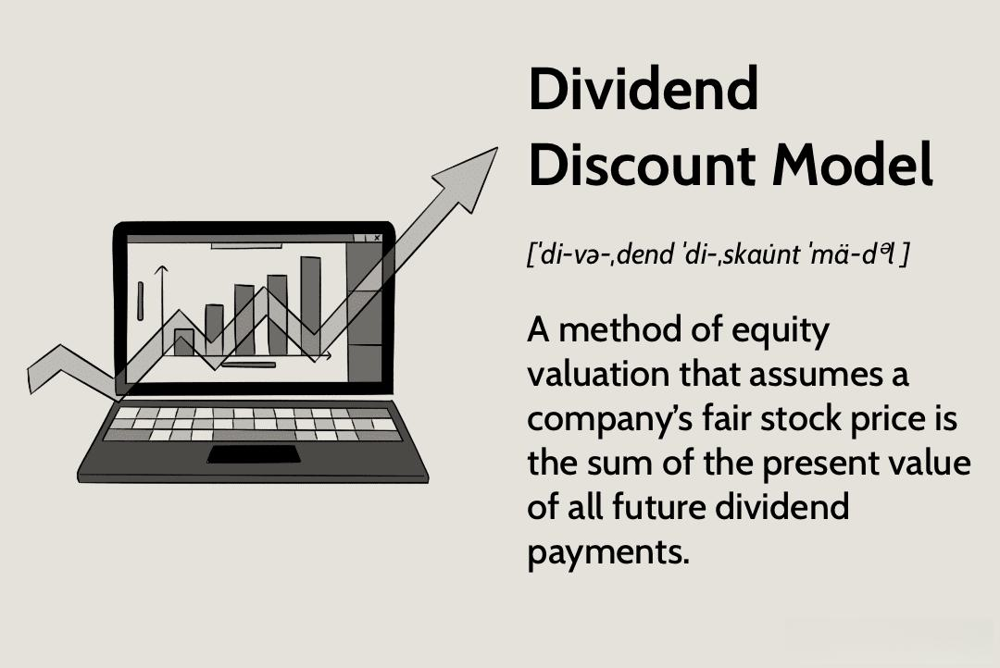

In today's rapidly evolving financial landscape, understanding investment valuation models is crucial for making informed decisions. As markets grow increasingly complex, investors require robust frameworks to assess the intrinsic value of financial assets accurately. One such model is the Dividend Discount Model (DDM), a staple in the valuation toolkit for equity analysts and investors. The DDM is designed to determine the fair value of a stock based primarily on anticipated dividend payments. It achieves this by estimating the present value of expected future dividends, thus providing a measure of a stock's intrinsic value relative to its current market price.

The relevance of the DDM in investment valuation cannot be overstated. By focusing on dividends, which are tangible returns to shareholders, the DDM offers a pragmatic approach to evaluating a company's financial health and future prospects. It assumes that dividends are the primary means through which a company delivers value to its shareholders, reflecting the company's cash flow generation ability.



In recent years, the integration of traditional valuation models like the DDM with modern algorithmic trading systems has marked a significant advancement in the field of investment analysis. Algorithmic trading, which employs sophisticated algorithms to execute trades based on defined criteria, can leverage the insights provided by the DDM to identify investment opportunities with efficiency and precision. This hybrid approach not only enhances the speed and accuracy of trading decisions but also allows for continuous adaptation to real-time market conditions.

This article explores the Dividend Discount Model's relevance in investment valuation and its intersection with algorithmic trading, providing a comprehensive understanding of how this traditional model can be synergistically combined with cutting-edge trading technologies.

## Table of Contents

## Understanding the Dividend Discount Model (DDM)

The Dividend Discount Model (DDM) is a financial model utilized to ascertain the intrinsic value of a stock. This model is grounded in the principle that the true worth of a stock is equivalent to the present value of its anticipated future dividends. Essentially, it attempts to capture a company's ability to generate cash flow for its shareholders through dividend payments.

In its simplest form, the DDM is expressed with the formula:

$$
V_0 = \frac{D_1}{r - g}
$$

where $V_0$ represents the current value of the stock, $D_1$ is the expected dividend in the next period, $r$ is the required rate of return, and $g$ is the growth rate of the dividends. This specific version is often referred to as the Gordon Growth Model, which assumes dividends will increase at a constant rate indefinitely.

The utility of the DDM lies in its ability to provide investors insights into whether a stock is currently undervalued or overvalued by comparing the model's output to the current market price. If the calculated present value of expected dividends is higher than the market price, the stock might be undervalued and considered a potential buying opportunity. Conversely, if the value is lower, the stock may be overvalued.

The model is predicated on the assumption that dividends are a direct indicator of a company's financial health and its commitment to shareholder returns. Therefore, companies with a regular and stable dividend history are well-suited to this model. However, its application is less effective for companies that do not issue dividends or have inconsistent dividend policies.

## Formula and Variations

The Dividend Discount Model (DDM) is a key method to gauge the present value of expected future dividends, offering insights into a stock’s intrinsic value. The fundamental formula for DDM is expressed as:

$$
P_0 = \frac{D_1}{r - g}
$$

where $P_0$ is the current stock price, $D_1$ is the expected dividend in the next period, $r$ represents the required rate of return, and $g$ indicates the growth rate of the dividends. This formula, often recognized as the Gordon Growth Model (GGM), assumes a perpetual and constant growth of dividends, making it particularly useful for companies with stable and predictable dividend policies.

Beyond the basic model, several variations of DDM address different growth scenarios:

1. **Zero Growth DDM**: This variation applies when a company’s dividends remain constant over time, meaning the growth rate $g$ is zero. The formula simplifies to:

   \[ P_0 = \frac{D}{r}
$$

   Here, the intrinsic value is derived by dividing the expected constant dividend, $D$, by the required rate of return, $r$.

2. **Multi-Stage DDM**: This variation is essential for companies experiencing varying growth phases. The multi-stage DDM accounts for different growth rates over distinct time periods. For example, a company might have a high growth rate initially, which gradually transitions to a stable growth rate. The model sums the present value of dividends during the high-growth phase and transitions to a stable growth phase using the standard GGM for the terminal value. 

Selecting the appropriate DDM variation is largely contingent upon a company’s life cycle and historical dividend growth pattern. Firms in their infancy or rapid expansion phase might not fit well with the GGM due to unpredictable dividend payouts. Conversely, mature companies with consistent dividend histories are suitable candidates for the standard or zero growth models. Understanding these models and their applications enables investors to make reasoned assessments of a stock’s value based on expected dividend flows.

## Calculating Stock Value Using DDM

Calculating the stock value using the Dividend Discount Model (DDM) involves estimating the present value of anticipated dividend payments. At its core, DDM is founded on assumptions about future dividends and growth rates, making these components critical to valuation accuracy.

The core formula of the DDM is as follows:

$$
P_0 = \frac{D_1}{r - g}
$$

where:
- $P_0$ is the current stock price.
- $D_1$ represents the expected dividend in the next period.
- $r$ is the required rate of return.
- $g$ denotes the growth rate of dividends.

### Gordon Growth Model (GGM)

The Gordon Growth Model (GGM) is a common variation of the DDM. It is particularly suitable for evaluating businesses with stable dividend growth rates. In GGM, it is assumed that dividends will grow at a constant rate indefinitely. This model is applied primarily to mature companies with predictable dividend patterns.

The formula for GGM mirrors the general DDM formula but emphasizes stable growth, thereby simplifying analysis. By estimating a constant growth rate, GGM facilitates a straightforward evaluation of intrinsic value based on projected dividends.

### Practical Application: The Coca-Cola Company Case Study

The Coca-Cola Company's relatively stable dividend payments make it an apt candidate for analysis using DDM. Assume Coca-Cola is expected to pay a dividend of $1.76 next year, with a growth rate of 5% and a required rate of return of 8%. Utilizing GGM, the stock's intrinsic value can be calculated as follows:

```python
D1 = 1.76  # Expected dividend next year
r = 0.08   # Required rate of return
g = 0.05   # Growth rate

P0 = D1 / (r - g)
print(f"The intrinsic value of Coca-Cola's stock: ${P0:.2f}")
```

The Python code computes the intrinsic stock value by applying the GGM formula. If the calculated intrinsic value surpasses the market price, the stock may be undervalued, suggesting a potential investment opportunity.

### Assumptions and Considerations

When using DDM, investors must carefully forecast future dividends and growth rates. The decision-making process should include a comprehensive analysis of financial performance, market conditions, and macroeconomic trends. Small deviations in growth rate estimations or required return rates can lead to significant variations in the calculated stock value.

Hence, accurately predicting these variables is pivotal. Additionally, applying sensitivity analyses can help investors understand how changes in these assumptions impact stock valuation, thereby reducing risk.

In conclusion, while the Dividend Discount Model and its variations like the Gordon Growth Model provide insightful frameworks for evaluating stocks, their dependence on assumptions underscores the necessity for precise forecasts and continuous assessment.

## Shortcomings and Challenges of DDM

The Dividend Discount Model (DDM) is a prominent tool in financial analysis, yet it faces several challenges and limitations that can impact its effectiveness and accuracy. One significant shortcoming is its reliance on dividend forecasts, making it highly sensitive to prediction inaccuracies. Future dividends need to be estimated precisely to ensure the model's reliability, but unforeseeable changes in a company's financial health, macroeconomic conditions, and management strategies can lead to inaccuracies in these forecasts. Such discrepancies can severely affect the calculated intrinsic value of a stock.

Furthermore, the DDM struggles when applied to stocks with irregular or unpredictable dividend records. Companies that pay dividends inconsistently or have recently changed their dividend policies introduce variability that the DDM cannot easily accommodate. The model assumes a certain continuity and predictability in dividend payments, which is not present in such cases, leading to less meaningful valuations.

Another critical challenge arises from the DDM's fundamental assumption of constant dividend growth rates. This assumption, while simplifying the valuation process, does not hold in all market sectors, especially in volatile industries or rapidly changing economic environments. Companies in such sectors may experience substantial fluctuations in their growth rates, rendering the constant growth rate assumption unrealistic and potentially misleading. This requirement for stability in growth limits the DDM's applicability, causing issues in sectors with high [volatility](/wiki/volatility-trading-strategies) or companies undergoing significant structural changes.

These limitations suggest that while the DDM can be a powerful tool under the right conditions, it necessitates careful consideration of the underlying assumptions and their appropriateness for each specific stock and market context. For investors and analysts, understanding and adjusting for these challenges is crucial for using DDM effectively as part of a broader investment evaluation strategy.

## Integrating DDM with Algorithmic Trading

Algorithmic trading employs computer algorithms to automate trading strategies, executing transactions at speeds and frequencies that are impossible for human traders. The integration of the Dividend Discount Model (DDM) into these systems offers distinct advantages for traders focusing on dividend-paying stocks.

DDM evaluates the intrinsic value of a stock by calculating the present value of expected future dividends. This model is particularly effective for stocks with a predictable dividend schedule. By incorporating DDM into [algorithmic trading](/wiki/algorithmic-trading) systems, analysts can automatically generate buy or sell signals based on whether a stock's intrinsic value is above or below its current market price.

### Python Example for DDM Integration

```python
def calculate_intrinsic_value(dividend, growth_rate, discount_rate):
    """
    Calculate the intrinsic value of a stock using the Gordon Growth Model variant of DDM.

    :param dividend: The expected dividend per share next year.
    :param growth_rate: The expected constant growth rate of dividends.
    :param discount_rate: The required rate of return.
    :return: The intrinsic value of the stock.
    """
    intrinsic_value = dividend / (discount_rate - growth_rate)
    return intrinsic_value

def trading_signal(market_price, intrinsic_value):
    """
    Generate a trading signal based on comparison between market price and intrinsic value.

    :param market_price: The current market price of the stock.
    :param intrinsic_value: The calculated intrinsic value of the stock.
    :return: A string indicating the trading action: 'Buy', 'Sell', or 'Hold'.
    """
    if intrinsic_value > market_price:
        return 'Buy'
    elif intrinsic_value < market_price:
        return 'Sell'
    else:
        return 'Hold'

# Example values
dividend = 3.00  # Expected dividend for next year
growth_rate = 0.05  # 5% growth rate
discount_rate = 0.10  # 10% discount rate
market_price = 50.00  # Current market price of the stock

intrinsic_value = calculate_intrinsic_value(dividend, growth_rate, discount_rate)
action = trading_signal(market_price, intrinsic_value)
print(f"Intrinsic Value: {intrinsic_value:.2f}, Action: {action}")
```

### Continuous Updates and Market Responsiveness

The effectiveness of integrating DDM into algorithmic trading is amplified by the ability to continuously update inputs with real-time market data. This capability ensures that trading signals are not only timely but also responsive to changing market dynamics. By leveraging data feeds, algorithms can promptly adjust to new information about dividend announcements, [interest rate](/wiki/interest-rate-trading-strategies) changes, and broader market trends. This responsiveness minimizes the risk of outdated valuations, which can lead to suboptimal investment decisions.

Overall, the combination of DDM's [fundamental analysis](/wiki/fundamental-analysis) framework with the automation and speed of algorithmic trading creates a powerful tool for investors. It helps navigate the complexities of the stock market with precision, focusing on stocks where dividend predictability is a key [factor](/wiki/factor-investing).

## Conclusion

The Dividend Discount Model (DDM) remains a pivotal tool for investors seeking to discern the intrinsic value of dividend-paying stocks. By focusing on anticipated dividend cash flows, DDM provides a structured framework to evaluate whether a stock is under or overvalued in the market. This approach is particularly valuable for stocks in companies with a stable dividend payout history.

However, the financial landscape is constantly evolving, and with it, the methodologies and tools investors need. Integrating DDM into algorithmic trading strategies can significantly enhance both efficiency and accuracy. Algorithmic trading systems, equipped with up-to-date market data, can process DDM calculations rapidly and execute investment decisions in real-time. This integration is especially potent for generating buy or sell signals for stocks with reliable dividend patterns, where the model's assumptions hold true.

Despite its utility, reliance solely on DDM can be risky due to its inherent limitations, such as sensitivity to dividend prediction inaccuracies and the assumption of constant growth rates. Therefore, investors are advised to diversify their evaluation strategies. By combining DDM with other models, like discounted cash flow analysis or price-earnings ratios, investors can attain a more comprehensive understanding of a stock's value. This multi-faceted approach mitigates the risks associated with potential inaccuracies in any single model.

Thus, while DDM retains its status as a vital tool in investment valuation, enhancing its application through algorithmic integration and model diversification ensures more robust and informed decision-making processes in the dynamic financial landscape.

## References & Further Reading

- Damodaran, A. (2012). *Investment Valuation: Tools and Techniques for Determining the Value of Any Asset*. This book provides a comprehensive guide to various valuation models, including the Dividend Discount Model (DDM), helping investors understand how to determine the fair value of financial assets. [ISBN: 978-1-118-01152-2]

- Gordon, M. J., & Shapiro, E. (1956). *Capital Equipment Analysis: The Required Rate of Profit*. This seminal paper lays the groundwork for the Gordon Growth Model, a specific form of the DDM, explaining how expected dividends and growth rates influence stock valuation.

- Bodie, Z., Kane, A., & Marcus, A. J. (2013). *Investments* (10th Edition). This textbook offers insights into financial markets, instruments, and theories, including an in-depth examination of investment valuation techniques such as the DDM. [ISBN: 978-0-07-786167-4]

- McKinsey & Company Inc. (2020). *Valuation: Measuring and Managing the Value of Companies, University Edition*. This resource provides practical approaches to company valuation, applicable to both novice and experienced investors, with relevant sections for understanding and applying models like the DDM. [ISBN: 978-1-119-61786-2]