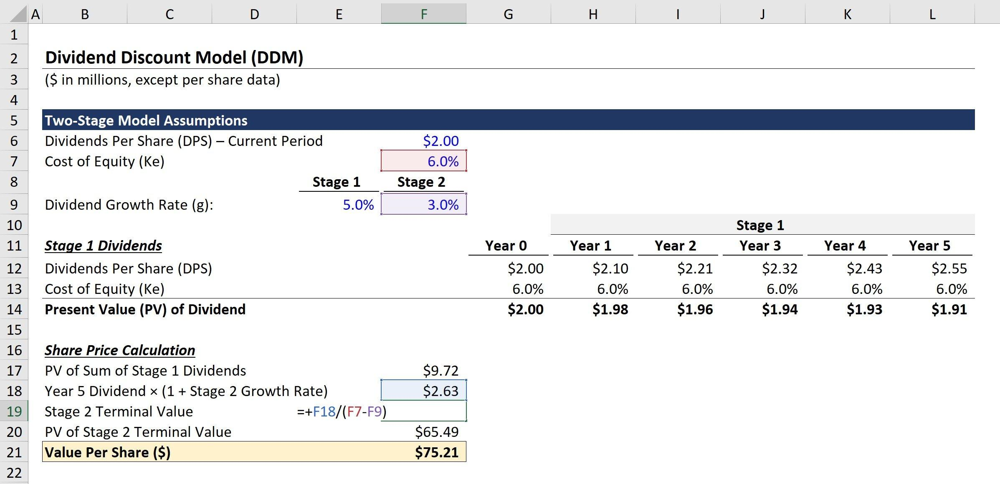

## Table of Contents

## What is the Dividend Discount Model (DDM)?

The Dividend Discount Model (DDM) is a way to figure out how much a stock is worth based on the dividends it pays out. It works by adding up all the future dividends a company is expected to pay and then figuring out what those dividends are worth today. The main idea is that the value of a stock is the sum of all its future dividends, discounted back to the present.

To use the DDM, you need to guess what dividends the company will pay in the future and pick a discount rate. The discount rate is like an interest rate that shows how much you value money now compared to money later. If the dividends are expected to grow at a steady rate, you can use a simple formula to calculate the stock's value. But if the growth rate changes, you might need a more complicated version of the model.

## How does the Dividend Discount Model work?

The Dividend Discount Model (DDM) is a way to figure out how much a stock is worth by looking at the dividends it will pay in the future. Imagine you own a stock that pays you money every year. The DDM says the value of that stock today is the total of all those future payments, but you have to adjust them to today's value. This adjustment is done using a discount rate, which is like an interest rate that shows how much you value money now compared to money you'll get later.

To use the DDM, you need to guess how much the company will pay in dividends each year and decide on a discount rate. If you think the dividends will grow at a steady rate, you can use a simple formula to calculate the stock's value. But if the growth rate changes over time, you might need a more complex version of the model. The key idea is to add up all the future dividends, discounted back to today, to find out what the stock is worth right now.

## What are the key assumptions of the Dividend Discount Model?

The Dividend Discount Model assumes that dividends are the main reason people invest in stocks. It believes that the value of a stock today comes from adding up all the future dividends it will pay, but you have to adjust those future payments to what they're worth now. This adjustment is done using a discount rate, which is like an [interest rate](/wiki/interest-rate-trading-strategies) that shows how much you value money now compared to money you'll get later.

Another important assumption is that the company will keep paying dividends forever. This means the model works best for companies that have a history of paying steady dividends and are expected to keep doing so. If a company doesn't pay dividends or if its dividends are unpredictable, the DDM might not be the best way to figure out its value.

Lastly, the DDM assumes you can predict how much dividends will grow in the future. This growth rate is really important because it affects the value you calculate for the stock. If you guess the growth rate wrong, your estimate of the stock's value could be way off. So, the model relies on good guesses about future dividends and growth rates.

## What is the difference between the Gordon Growth Model and the Multi-Period DDM?

The Gordon Growth Model, also known as the constant growth DDM, is a simple version of the Dividend Discount Model. It assumes that dividends will grow at a steady rate forever. This makes it easy to use because you only need to know the next dividend, the expected growth rate of the dividends, and the discount rate. You can then use a simple formula to calculate the stock's value. This model is best for companies that have a stable history of paying dividends and are expected to keep growing their dividends at a constant rate.

On the other hand, the Multi-Period DDM is used when the growth rate of dividends is expected to change over time. Instead of assuming a constant growth rate, this model breaks the future into different periods where the growth rate might be different. For example, a company might have a high growth rate for the first few years and then a lower, stable growth rate after that. You need to estimate the dividends for each period and discount them back to today's value. This makes the Multi-Period DDM more complex but also more flexible, as it can handle companies with changing dividend patterns.

## How do you calculate the intrinsic value of a stock using the DDM?

To calculate the intrinsic value of a stock using the Dividend Discount Model (DDM), you need to add up all the future dividends the company is expected to pay and then figure out what those dividends are worth today. This is done by using a discount rate, which is like an interest rate that shows how much you value money now compared to money you'll get later. If you think the dividends will grow at a steady rate, you can use a simple formula called the Gordon Growth Model. You just need to know the next dividend, the expected growth rate of the dividends, and the discount rate. For example, if the next dividend is $2, the growth rate is 3%, and the discount rate is 10%, you can plug these numbers into the formula to find the stock's value.

But if the dividends are expected to grow at different rates over time, you need to use a more complex version called the Multi-Period DDM. In this case, you break the future into different periods where the growth rate might change. For example, a company might have a high growth rate for the first few years and then a lower, stable growth rate after that. You need to estimate the dividends for each period and then discount them back to today's value using the discount rate. This makes the calculation more complicated, but it can give you a better estimate of the stock's value if the company's dividends are expected to change over time.

## What are the limitations of the Dividend Discount Model?

The Dividend Discount Model has some big limits that you should know about. One big problem is that it only works well for companies that pay steady dividends. If a company doesn't pay dividends, or if its dividends change a lot, the DDM can't really tell you what the stock is worth. Also, the DDM assumes you can guess how much dividends will grow in the future. If your guess is wrong, your estimate of the stock's value could be way off. This means the model relies a lot on your guesses about the future, which can be hard to get right.

Another limit of the DDM is that it doesn't look at other things that might affect a stock's value. For example, it doesn't consider how much money a company makes, how much it grows, or how risky it is. The model just focuses on dividends, but there are other important things investors care about. Also, the DDM assumes that the discount rate you use stays the same, but in real life, this rate can change based on what's happening in the economy. So, while the DDM can be a helpful tool, it's not perfect and should be used along with other ways to figure out a stock's value.

## How can the Dividend Discount Model be adjusted for companies that do not pay dividends?

The Dividend Discount Model (DDM) is tricky to use for companies that don't pay dividends because it's all about adding up future dividends. But you can still use a similar idea by thinking about what the company might pay in dividends if it decided to start. Imagine the company could pay out all its extra money as dividends. You can guess how much that would be and use the DDM to figure out the stock's value based on those pretend dividends.

This way of adjusting the DDM is called the "potential dividend" approach. It's not perfect because it's hard to guess what a company might do if it started paying dividends. But it can give you a rough idea of what the stock might be worth if the company ever decided to share its profits with shareholders. Keep in mind, though, that this method still relies a lot on your guesses about the future, so it's best used with other ways to figure out a stock's value.

## What role does the required rate of return play in the DDM?

The required rate of return is really important in the Dividend Discount Model because it's the number you use to figure out what future dividends are worth today. It's like an interest rate that shows how much you value money now compared to money you'll get later. If you want a high return on your investment, you'll use a high required rate of return. This makes future dividends worth less today, so the stock's value goes down. But if you're okay with a lower return, you'll use a lower rate, which makes future dividends worth more today and the stock's value goes up.

So, the required rate of return is a big deal because it can change the stock's value a lot. It depends on things like how risky the stock is and what other investments you could make instead. If the stock is risky, you might want a higher return to make up for that risk, which would lower the stock's value in the DDM. But if the stock is safe, you might be okay with a lower return, which would make the stock's value higher. It's all about balancing what you want from your investment with how much risk you're willing to take.

## How does the growth rate affect the valuation in the DDM?

The growth rate is a big deal in the Dividend Discount Model because it decides how much the dividends will go up each year. If you think the dividends will grow a lot, the stock's value will be higher. That's because bigger dividends in the future are worth more when you add them up and bring them back to today's value. But if you think the dividends won't grow much, the stock's value will be lower. So, guessing the right growth rate is really important because it can make a big difference in what you think the stock is worth.

The growth rate also works with the required rate of return to figure out the stock's value. If the growth rate is close to the required rate of return, the math can get tricky. The Gordon Growth Model, which is a simple version of the DDM, says the stock's value is the next dividend divided by the difference between the required rate of return and the growth rate. If the growth rate is too close to the required rate of return, this difference gets really small, and the stock's value can shoot up a lot. So, you have to be careful with your guesses about the growth rate because it can change the stock's value in big ways.

## Can the Dividend Discount Model be used for high-growth companies? If so, how?

The Dividend Discount Model can be used for high-growth companies, but it needs some adjustments. High-growth companies often don't pay dividends because they're busy using all their money to grow the business. To use the DDM for these companies, you can imagine what the company might pay in dividends if it decided to start. This is called the "potential dividend" approach. You guess how much money the company could pay out as dividends if it wanted to, and then you use those pretend dividends in the DDM to figure out the stock's value.

This method isn't perfect because it's hard to guess what a high-growth company might do if it started paying dividends. But it can give you a rough idea of what the stock might be worth if the company ever decided to share its profits with shareholders. Another way to use the DDM for high-growth companies is to break the future into different periods where the growth rate might change. You can use a more complex version of the DDM, called the Multi-Period DDM, to estimate the dividends for each period and then discount them back to today's value. This makes the calculation more complicated, but it can give you a better estimate of the stock's value if the company's growth and dividends are expected to change over time.

## How do changes in dividend policy impact the valuation using DDM?

Changes in a company's dividend policy can have a big effect on how much a stock is worth when you use the Dividend Discount Model. If a company decides to pay more dividends, the stock's value goes up because you're getting more money in the future. But if the company decides to pay less or stop paying dividends, the stock's value goes down because you're getting less money. The DDM looks at all the future dividends and figures out what they're worth today, so any change in how much the company pays out can change the stock's value a lot.

It's also important to think about why the company is changing its dividend policy. If a company starts paying more dividends because it's doing really well and making more money, that's good news, and the stock's value might go up even more. But if the company is paying more dividends because it doesn't have any good ways to grow the business, that might not be so good, and the stock's value might not go up as much. So, when you use the DDM, you have to think about the reasons behind the changes in dividend policy and how those changes might affect the company's future.

## What are some advanced techniques for refining the Dividend Discount Model?

One way to make the Dividend Discount Model better is by using different growth rates for different times. Instead of guessing that dividends will grow at the same rate forever, you can break the future into parts where the growth rate might change. For example, a company might grow fast for a few years and then slow down. You can use the Multi-Period DDM to guess the dividends for each part and then figure out what they're worth today. This makes the model more complicated, but it can give you a better guess of the stock's value if the company's growth changes over time.

Another way to refine the DDM is by thinking about how the company might change its dividend policy. If a company decides to pay more or less dividends, that can change what the stock is worth. You can use the DDM to see how these changes might affect the stock's value. Also, you can use something called the "potential dividend" approach for companies that don't pay dividends yet. You imagine what the company might pay if it started paying dividends and use those pretend dividends in the DDM. This can give you a rough idea of what the stock might be worth if the company ever decides to share its profits with shareholders.

Lastly, you can make the DDM more accurate by adjusting the discount rate to match how risky the stock is. If a stock is riskier, you might want a higher return, so you use a higher discount rate. This makes future dividends worth less today, so the stock's value goes down. But if the stock is safer, you might be okay with a lower return, so you use a lower discount rate. This makes future dividends worth more today, so the stock's value goes up. By changing the discount rate to fit the stock's risk, you can get a better guess of what the stock is really worth.

## What is the Formula and what are its Variations?

The Dividend Discount Model (DDM) serves as a foundational approach to valuing stocks by equating their value to the present value of expected future dividends. The basic formula of DDM is given by:

$$
P_0 = \frac{D_1}{r - g}
$$

where:
- $P_0$ represents the present value of the stock,
- $D_1$ is the expected dividend in the next period,
- $r$ denotes the required rate of return, and
- $g$ stands for the growth rate of the dividends.

This formula assumes that dividends will grow at a constant rate indefinitely, which is suitable for companies exhibiting stable growth. 

**Variations of the Dividend Discount Model**

1. **Gordon Growth Model**: This is a special case of DDM applicable to companies with stable, predictable dividend growth. It assumes constant dividend growth over time, making it ideal for mature companies with established dividend policies. The formula remains the same as the basic DDM equation, capturing the perpetual growth scenario.

2. **Zero Growth DDM**: This variant assumes that dividends are constant in perpetuity, effectively setting $g = 0$. The formula simplifies to:

   \[ P_0 = \frac{D}{r}
$$

   This approach is typically used for companies that pay a consistent dividend without any growth expectations.

3. **Multi-Stage DDM**: This model accommodates variations in dividend growth rates, making it suitable for companies undergoing different phases of growth. Initially, dividends may grow rapidly, followed by a more stable, mature growth rate. The formula is more complex, requiring the valuation of dividends in different stages and involves:
$$
   P_0 = \sum_{t=1}^{N} \frac{D_t}{(1 + r)^t} + \frac{D_{N+1}}{(r - g)} \times \frac{1}{(1 + r)^N}

$$

   Here, $N$ represents the number of periods with non-constant growth, and $D_{N+1}$ is the dividend in the subsequent period where a perpetual growth rate $g$ applies.

The Multi-Stage DDM can be numerically evaluated using programming methods such as Python, facilitating the computation of present stock values for companies with varying growth profiles. Through these variations, DDM provides a flexible framework to accommodate different growth expectations in dividend distributions.

## Can you provide real-world examples and case studies?

In understanding the practical applications of the Dividend Discount Model (DDM), several real-world examples offer valuable insights into how different variations of the model can be applied to diverse industry contexts. One prominent example of a company effectively evaluated using the Gordon Growth Model is Johnson & Johnson. Known for its consistent and stable dividend payment history, Johnson & Johnson provides an ideal scenario where the Gordon Growth Model, a variation of DDM, is utilized. The formula $P_0 = \frac{D_1}{r - g}$ helps in forecasting the intrinsic value of the company’s stock, where $D_1$ is the expected dividend, $r$ is the required rate of return, and $g$ is the growth rate of the dividends. 

Procter & Gamble serves as a case study for the application of the Multi-Stage Dividend Discount Model. Due to its transitional growth phases, Procter & Gamble benefits from a more nuanced approach to valuation that accounts for different growth stages over time. Initially, higher growth phases tapering to relatively stable and lower growth rates. This adaptation of DDM helps capture the changing dynamics of the company’s dividend growth expectations.

In the technology sector, companies with a high initial growth rate, such as those in the early stages of expansion, often transition to a more stable growth phase as they mature. For these companies, the H-Model can be particularly useful. This model accommodates the distinct characteristics of technology firms, which may experience rapid growth initially before stabilizing. The H-Model is represented by the formula:

$$
P_0 = \frac{D_0 \times (1 + g_L)}{r - g_L} + \frac{D_0 \times H \times (g_S - g_L)}{r - g_L}
$$

where $D_0$ is the current dividend, $g_S$ is the short-term growth rate, $g_L$ is the long-term sustainable growth rate, $r$ is the discount rate, and $H$ is the half-life of the high-growth period. Utilizing this model allows for a comprehensive valuation as these companies mature and exhibit more predictable growth patterns.

These examples illustrate how the Dividend Discount Model, though varying in complexity and form, serves as a pivotal tool in assessing the intrinsic value of stocks across different industries and growth stages. Each variation of the DDM caters to specific dividend and growth profiles, ensuring that investors can align their valuation approach with the financial characteristics of the company in question.

## References & Further Reading

[1]: Gordon, M. J. (1959). ["Dividends, Earnings, and Stock Prices."](http://piketty.pse.ens.fr/files/Gordon1959.pdf) The Review of Economics and Statistics, 41(2), 99-105.

[2]: Damodaran, A. (2012). ["Investment Valuation: Tools and Techniques for Determining the Value of Any Asset."](https://books.google.com/books/about/Investment_Valuation.html?id=5SRHAAAAQBAJ) 3rd Edition, Wiley.

[3]: Brealey, R. A., Myers, S. C., & Allen, F. (2011). ["Principles of Corporate Finance."](https://archive.org/details/principlesofcor000brea) 11th Edition, McGraw-Hill.

[4]: Fernandez, P. (2002). ["Valuation Methods and Shareholder Value Creation."](https://www.sciencedirect.com/book/9780122538414/valuation-methods-and-shareholder-value-creation) Academic Press.

[5]: Lintner, J. (1962). ["Dividends, Earnings, Leverage, Stock Prices and the Supply of Capital to Corporations."](https://www.semanticscholar.org/paper/Dividends%2C-Earnings%2C-Leverage%2C-Stock-Prices-and-the-Lintner/e4e8937d6b07d22ce64f686377dcdcfca18b2dc6) The Review of Economics and Statistics, 44(3), 243-269.

[6]: Fabozzi, F. J., & Drake, P. P. (2009). ["Finance: Capital Markets, Financial Management, and Investment Management."](https://books.google.com/books/about/Finance.html?id=mUBsAwAAQBAJ) Wiley.