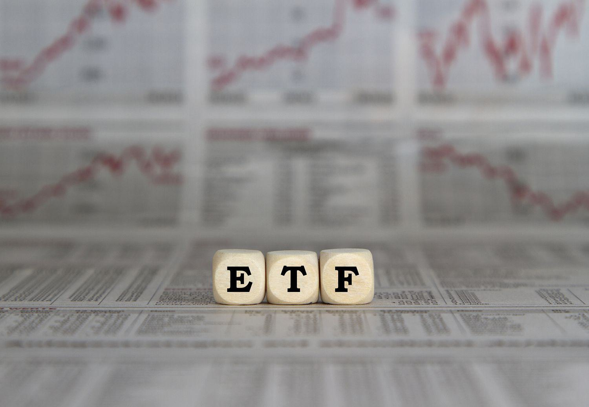

Investment strategies in today's financial landscape are diverse, encompassing approaches like Exchange-Traded Funds (ETFs), stock dividends, and various investment funds. These strategies cater to different investor needs and risk appetites. ETFs, for instance, offer a practical way to gain exposure to a diversified portfolio, often tracking a specific index. They combine the benefits of mutual funds with the liquidity of stocks, making them a popular choice for both retail and institutional investors. Stock dividends, on the other hand, provide a passive income stream, rewarding shareholders with a portion of the company's profits, typically paid quarterly. This strategy appeals to those seeking regular income alongside capital appreciation.

Investment funds, including mutual funds and index funds, play a crucial role in diversification and risk management. They allow investors to pool resources to access a diversified portfolio of assets, managed by professional fund managers. This diversity reduces individual risk and provides exposure to a wide array of asset classes, sectors, or geographical regions.



Simultaneously, algorithmic trading is reshaping the financial markets. Algo trading employs computers to execute trading strategies at speeds and frequencies that are impossible for human traders. Its relevance in modern finance is undeniable, significantly enhancing the efficiency and liquidity of markets. Algorithms can process vast amounts of data to identify patterns and make trading decisions, offering a competitive edge to those who leverage them effectively.

The purpose of this article is to explore how these investment strategies and technologies intersect and complement each other. By understanding the synergies between ETFs, stock dividends, investment funds, and algorithmic trading, investors can formulate more robust, informed investment strategies designed to meet their unique financial goals.

## Table of Contents

## Understanding Stock and ETF Dividends

Dividends represent a portion of a company's earnings distributed to shareholders and serve as a form of income from stock and ETF investments. In the context of stocks, dividends are generally periodic payments made by a corporation to its shareholders. These distributions can be in the form of cash payments, additional shares, or other property. The dividend yield for a stock is calculated as:

$$
\text{Dividend Yield} = \left( \frac{\text{Annual Dividends per Share}}{\text{Price per Share}} \right) \times 100\%
$$

Dividend-paying stocks often belong to well-established companies with a history of stable earnings, such as utilities, consumer goods companies, and financial institutions.

For Exchange-Traded Funds (ETFs), dividends operate similarly but have distinct characteristics. An [ETF](/wiki/etf-trading-strategies) is a pooled investment fund that holds a collection of assets such as stocks, bonds, or commodities. When these assets pay dividends, the ETF aggregates these payments and distributes them to its shareholders, typically on a quarterly basis. The dividend yield of an ETF is computed using the same formula as for individual stocks.

Comparing stock dividends to ETF dividends, there are some notable differences. Stocks can have variable dividend payment schedules, but ETFs generally distribute dividends quarterly or semi-annually, providing a more predictable income stream. Additionally, the yield from ETFs can be lower due to their diverse asset base, which may include stocks with lower dividends to maintain broader exposure and manage risk.

Popular dividend-paying ETFs include Vanguard Dividend Appreciation ETF (VIG) and iShares Select Dividend ETF (DVY). VIG focuses on companies with a history of growing dividends, whereas DVY targets higher-yielding U.S. stocks. Notable dividend-paying stocks are Johnson & Johnson (JNJ), known for its long streak of consecutive dividend increases, and Procter & Gamble (PG), which has consistently rewarded shareholders with regular payouts.

In summary, dividends from stocks and ETFs are vital for income-oriented investors, providing a blend of cash flow and potential growth. Understanding the distinction between their yields and distributions is crucial for effectively incorporating them into investment strategies.

## Investment Funds: Types and Their Roles

Investment funds are collective investment schemes that pool resources from multiple investors to invest in a diversified portfolio of assets. Three of the most common types of investment funds are mutual funds, index funds, and exchange-traded funds (ETFs), each serving distinct purposes and offering various benefits.

**Mutual Funds, Index Funds, and ETFs**

1. **Mutual Funds**: These are investment vehicles managed by professional fund managers who allocate the pooled money into different securities, such as stocks, bonds, and other assets. They are actively managed, meaning managers make investment decisions based on research, trends, and economic indicators. Mutual funds offer diversification as they invest in a range of securities, reducing the risk associated with investing in a single asset. They are often purchased directly from the fund company.

2. **Index Funds**: These are a type of mutual or exchange-traded fund designed to replicate the performance of a specific index, such as the S&P 500. Index funds are passively managed, which typically results in lower fees compared to actively managed funds. By mirroring an index, they offer broad market exposure and diversification. Index funds are beneficial for investors seeking long-term growth with relatively lower costs.

3. **Exchange-Traded Funds (ETFs)**: Similar to index funds, ETFs are designed to track specific indices, but they are traded on stock exchanges like individual stocks. This allows investors to buy and sell ETFs throughout the trading day at market prices. ETFs combine the diversification benefits of mutual funds with the liquidity of stocks. They are versatile tools used for achieving broader portfolio strategies.

**Role and Benefits in Diversification and Risk Management**

Investment funds, by design, facilitate diversification and risk management. By pooling resources, they enable individual investors to access a wide array of securities. This reduces unsystematic risk as exposure is spread across different asset classes or sectors, lessening the impact of poor performance in any one area. Moreover, professional management in mutual funds and the structured tracking of indices in index funds and ETFs provide investors with streamlined portfolio management solutions, often aligning investments with broader financial goals and market benchmarks.

**Contribution to Portfolio Strategy**

Investment funds can substantially influence an investor's portfolio strategy. They allow for a strategic allocation of assets across varying risk levels and sectors, tailored to an investor’s risk tolerance, investment timeframe, and financial objectives. For instance, a mix of mutual funds could provide growth, stability, and income. Index funds and ETFs contribute by enabling cost-effective exposure to entire markets or specific sectors, aligning the portfolio with benchmark performance. 

Moreover, the [liquidity](/wiki/liquidity-risk-premium) of ETFs provides investors with the flexibility to rebalance their portfolios efficiently, responding to market shifts. Ultimately, investment funds serve as critical components in crafting an optimized investment portfolio, effectively balancing risk and return to achieve desired financial outcomes.

## Algorithmic Trading: Transforming Investment Strategies

Algorithmic trading refers to the use of computer algorithms to automate trading decisions and processes in financial markets. These algorithms are programmed to follow specific instructions to execute orders for stocks, bonds, futures, and other financial instruments at a speed and frequency impossible for the human trader. By eliminating manual intervention, [algorithmic trading](/wiki/algorithmic-trading) enhances efficiency, reduces human errors, and allows traders to capitalize on market opportunities in milliseconds.

One of the primary advantages of algorithmic trading is speed. Algorithms can process vast amounts of data and execute trades faster than any human could. They can instantly analyze real-time market conditions, historical data, and other external inputs to make calculated trading decisions. This speed is critical in markets where prices can change rapidly within moments. Efficiency is another significant advantage, as algorithms can monitor and trade across multiple markets and instruments simultaneously, which optimizes trading opportunities and maximizes potential returns. Furthermore, algorithmic trading allows for [backtesting](/wiki/backtesting) strategies, using historical data to assess which trading strategies might be successful, thereby enabling refinement before actual capital is deployed.

Exchange-Traded Funds (ETFs) and other investment funds are well-suited for algorithmic trading strategies. Algorithms can be crafted to trade ETFs based on various inputs such as price trends, [volume](/wiki/volume-trading-strategy), and other market indicators. This approach can involve strategies such as statistical [arbitrage](/wiki/arbitrage), [trend following](/wiki/trend-following), and [market making](/wiki/market-making). For instance, an algorithm might be programmed to execute trades when an ETF's price deviates from its expected range, capitalizing on the mean reversion strategy.

Python is a preferred language for developing algorithmic trading strategies due to its extensive libraries and tools for data analysis. A simple example of a moving average crossover strategy using Python might look like this:

```python
import pandas as pd

# Assume `df` is a DataFrame containing historical price data with a date index
short_window = 40
long_window = 100

# Calculate the short and long moving averages
df['short_mavg'] = df['Close'].rolling(window=short_window, min_periods=1).mean()
df['long_mavg'] = df['Close'].rolling(window=long_window, min_periods=1).mean()

# Generate signals
df['signal'] = 0
df['signal'][short_window:] = np.where(df['short_mavg'][short_window:] > df['long_mavg'][short_window:], 1, 0)

# Calculate trading orders
df['positions'] = df['signal'].diff()

# The `positions` column indicates where buy (+1) or sell (-1) orders should be placed
```

In this example, the algorithm calculates short-term and long-term moving averages. A buy signal is generated when the short-term average crosses above the long-term average, indicating a potential upward trend. Conversely, a sell signal is issued when the short-term average crosses below the long-term average.

Algorithmic trading plays a transformative role in modern financial markets, providing traders and fund managers with tools to manage investments systematically and efficiently. By integrating such strategies with ETFs and other funds, investors can enhance their portfolio's performance, diversify risk effectively, and respond promptly to market dynamics.

## Interplay Between Dividends, Investment Funds, and Algo Trading

Dividend-paying ETFs and stocks are integral components of many investment portfolios, providing a steady income stream to investors. When coupled with algorithmic trading, these financial instruments can be optimized to enhance returns and manage risks more effectively.

### Optimizing Dividend-Paying ETFs and Stocks Through Algorithmic Trading

Algorithmic trading involves the use of computer programs to execute trading strategies at speeds and frequencies that are impossible for human traders. With specific algorithms, dividend-paying stocks and ETFs can be monitored and traded based on dividend yield events and anticipated market movements. 

For instance, a common algorithmic tactic is dividend capture, which seeks to buy stocks just before the ex-dividend date and sell them shortly after capturing the dividend while minimizing risk. This strategy takes advantage of predictable dividend cycles and can be implemented through simple Python code using libraries such as `pandas` and `numpy` to analyze historical dividend data and stock price movements:

```python
import pandas as pd

# Example data: stock prices and ex-dividend dates
data = {
    'dates': ['2023-03-01', '2023-03-02', '2023-03-03', '2023-03-04'],
    'price': [100, 102, 103, 101],
    'dividend': [0, 1, 0, 0]
}

df = pd.DataFrame(data)
df['yield'] = df['dividend'] / df['price']

# Calculate the potential profit from dividend capture
df['profit'] = df['price'].shift(-1) - df['price'] + df['dividend']
print(df)
```

### Impact on Fund Management and Dividend Reinvestment

Algorithmic trading strategies can significantly impact how investment funds manage dividends. By using algorithms, funds can automate the process of reinvesting dividends, allowing them to compound returns without manual intervention. This is especially beneficial for index funds and ETFs, where maintaining a precise balance of securities in line with their benchmarks is crucial. Algorithms can dynamically adjust portfolio weights to reinvest dividends efficiently.

### Case Studies and Examples

A notable example includes the Medallion Fund, overseen by Renaissance Technologies, which leverages algorithms to execute trades with precision and timing that captures optimal dividend payouts, contributing to its impressive annualized returns. Similarly, BlackRock, the world's largest asset manager, employs sophisticated algorithms to manage its ETF offerings, optimizing for both capital appreciation and dividend income.

These cases illustrate how algorithmic trading, when applied to dividend-focused strategies, can provide robust solutions for achieving risk-adjusted returns. They demonstrate the potential for such strategies to evolve as computing power increases and data analytics become more sophisticated.

By integrating algorithmic trading with dividend-paying stocks and ETFs, investors and fund managers can more effectively leverage market opportunities, manage risks, and refine their investment strategies for enhanced financial outcomes.

## Risks and Considerations in Dividend and Algo Trading Strategies

Dividend investing and algorithmic trading, though beneficial, come with their own set of risks and considerations that investors must carefully evaluate. 

Dividend investing, an appealing strategy for generating passive income, involves several inherent risks. First, the stability of dividends is not guaranteed, as companies can reduce or eliminate payouts during financial strain or challenging economic conditions. Companies experiencing declining profits or increasing debts might cut dividends to preserve capital, impacting income-dependent investors.

Furthermore, dividend stocks may face [interest rate](/wiki/interest-rate-trading-strategies) risk. Rising interest rates can lead to reduced attractiveness of dividend-paying stocks compared to fixed-income investments, subsequently lowering stock prices. Investors should also consider concentration risk; over-reliance on dividend-paying stocks in particular sectors, like utilities or banking, might result in higher [volatility](/wiki/volatility-trading-strategies) in a downturn affecting these industries.

Algorithmic trading, on the other hand, introduces technological and market-related risks. Algorithms can malfunction or fail, leading to considerable financial losses. This risk, compounded by high-frequency trading, demands robust algorithm testing and monitoring systems. Additionally, market liquidity risk can arise; algorithms trading large volumes can inadvertently impact stock prices, especially in low liquidity conditions.

From a regulatory standpoint, both strategies require careful navigation. Dividend investors need to be aware of tax implications, as dividends may be taxed differently from capital gains or interest income, affecting overall returns. Algorithmic traders face stringent regulations designed to maintain fair and transparent markets. Compliance with regulations like the SEC's rule for "Market Access" necessitates accurate and comprehensive risk management systems.

Investors aiming to integrate these strategies should prioritize diversification to mitigate risks associated with dividend investing. Diversifying across sectors and geographies can minimize concentration risks and safeguard against sector-specific downturns. For algorithmic trading, implementing robust risk management frameworks and staying informed about regulatory changes are crucial steps. 

Understanding market conditions is paramount; algorithmic traders must design adaptable strategies responsive to changing market dynamics. Similarly, dividend investors must assess broader economic trends impacting company earnings and interest rates.

In conclusion, a comprehensive understanding of risks and proactive management strategies is essential for investors incorporating dividend and algorithmic trading into their portfolios. Recognizing market conditions and navigating the regulatory landscape can significantly enhance the success of these investment strategies.

## Conclusion

The exploration of ETF dividends, stock dividends, and algorithmic trading reveals the intricate dynamics and diverse opportunities present in modern investment strategies. Dividend-paying stocks and ETFs, as important pillars of income generation, offer investors a relatively stable return through periodic cash flows. Their ability to provide regular income complements growth-focused assets and positions them as essential components in diversified portfolios.

Algorithmic trading, marked by its speed and precision, revolutionizes how these instruments are traded, enabling more efficient execution and management of investment strategies. By employing sophisticated algorithms, investors and fund managers can optimize returns, reduce market impact, and enhance liquidity, thus transforming traditional approaches to managing dividends and funds.

Looking forward, the integration of technology in trading and investment strategies is expected to intensify. Advancements in [machine learning](/wiki/machine-learning) and data analytics are likely to further enhance the capabilities of algorithmic trading, offering more nuanced insights and predictive power. This evolution suggests a future where machine-driven strategies could dominate market activities, leading to more efficient and transparent markets.

For investors, balancing these strategies entails a thorough understanding of their individual risk appetites, financial goals, and market conditions. Diversification remains key, with a combination of dividend-paying assets and algorithmic methodologies potentially yielding robust outcomes. Investors must also stay informed about regulatory changes and technological advancements to adapt and optimize their strategies effectively. By carefully integrating these elements, investors can position themselves to achieve their financial objectives while mitigating risks associated with each approach.

## References & Further Reading

[1]: ["Exchange-Traded Funds (ETFs) Research Reports"](https://money.usnews.com/funds/etfs), FactSet Research Systems

[2]: ["Algorithmic Trading: Winning Strategies and Their Rationale"](https://www.wiley.com/en-us/Algorithmic+Trading%3A+Winning+Strategies+and+Their+Rationale-p-9781118460146) by Ernie Chan

[3]: ["ETFs for the Long Run: What They Are, How They Work, and Simple Strategies for Successful Long-Term Investing"](https://www.amazon.com/ETFs-Long-Run-Strategies-Successful/dp/0470138947) by Lawrence Carrel

[4]: ["Investing in Dividend Stocks for Dummies"](https://www.dummies.com/article/business-careers-money/personal-finance/investing/investment-vehicles/dividends/dividend-stocks-for-dummies-cheat-sheet-209141/) by Lawrence Carrel

[5]: Mackenzie, G. A. (2006). ["An Introduction to ETF Dividend Practices."](https://www.mackenzieinvestments.com/en/investments/by-type/etfs/etfs-list)

[6]: ["Renaissance Technologies: Simons’ Medallion Fund"](https://financhill.com/blog/investing/can-i-invest-in-the-medallion-fund), Institutional Investor. 

[7]: ["BlackRock's Approach to Income Investing"](https://www.blackrock.com/us/individual/themes/income-investing), BlackRock Asset Management.