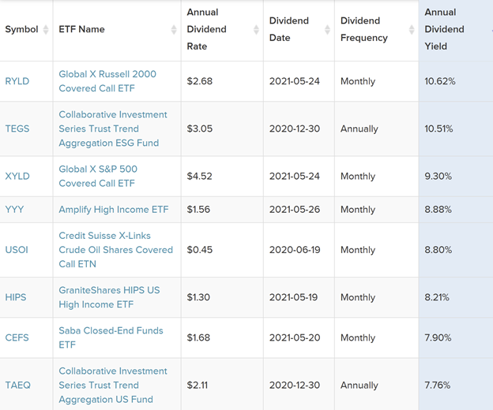

## Table of Contents

## What is a dividend?

A dividend is a payment that a company gives to its shareholders from its profits. When a company makes money, it can choose to share some of that money with the people who own its stock. This payment is usually given out in cash, but sometimes it can be in the form of more stock.

Dividends are important because they can provide investors with a steady income. For example, if you own shares in a company that pays dividends, you will get a little bit of money regularly, like every three months. This can be a good way to earn money without selling your shares. Companies that pay dividends are often seen as stable and reliable, which can make their stocks more attractive to investors.

## What are ETFs and how do they work?

ETFs, or Exchange-Traded Funds, are a type of investment that combines the benefits of stocks and mutual funds. They are like baskets that hold a collection of different investments, such as stocks, bonds, or commodities. You can buy and sell ETFs on a stock exchange, just like you would with individual stocks. This makes them easy to trade throughout the day at market prices.

ETFs work by tracking an index, like the S&P 500, which represents a broad market or a specific sector. When you invest in an ETF, you're essentially investing in all the assets that make up that index. This gives you a way to diversify your investments without having to buy each asset separately. For example, if you buy an ETF that tracks the S&P 500, you're investing in the performance of the 500 largest companies in the U.S. all at once. This can help spread out your risk and potentially increase your returns over time.

## How do ETFs distribute dividends?

ETFs distribute dividends in a similar way to how individual stocks do. When the companies inside an ETF pay dividends, the ETF collects these payments. Then, the ETF manager decides what to do with the money. Most ETFs pass these dividends on to the investors who own the ETF. This usually happens on a quarterly basis, but it can vary.

The way you get your dividends from an ETF depends on where you hold your investment. If you have your ETF in a brokerage account, the dividends are usually automatically added to your account as cash. You can then choose to spend this money, reinvest it to buy more shares of the ETF, or use it for other investments. If you have your ETF in a retirement account like an IRA, the dividends are usually reinvested automatically to help grow your investment over time.

## What factors influence the dividend distribution of ETFs?

The dividend distribution of ETFs is influenced by several factors. One key [factor](/wiki/factor-investing) is the type of assets the ETF holds. If an ETF invests in companies that pay high dividends, like utility or consumer staple companies, the ETF itself will likely distribute higher dividends to its investors. On the other hand, if an ETF focuses on [growth stocks](/wiki/growth-stocks) that reinvest their earnings instead of paying dividends, the ETF's dividend payouts will be lower.

Another factor is the ETF's strategy and management decisions. Some ETFs are designed to maximize dividend income, and their managers will actively choose investments that generate high dividends. Other ETFs might aim to track a specific index, and their dividend distributions will depend on the performance and dividend policies of the companies in that index. The frequency and timing of dividend distributions can also vary based on the ETF's policies and the schedules of the underlying companies.

Overall, the amount and frequency of dividends from an ETF depend on the types of investments it holds, the strategy of its managers, and the dividend policies of the companies within the ETF. Understanding these factors can help investors choose ETFs that align with their income goals.

## Can you explain the difference between qualified and non-qualified dividends from ETFs?

Qualified dividends from ETFs are a type of dividend that gets taxed at a lower rate, similar to the tax rates on long-term capital gains. To be considered qualified, the dividends must come from stocks of U.S. companies or certain foreign companies, and you need to have held the ETF for a specific period of time, usually more than 60 days during the 121-day period that begins 60 days before the ex-dividend date. This lower tax rate can make qualified dividends more attractive to investors looking to minimize their tax burden.

On the other hand, non-qualified dividends from ETFs are taxed at your ordinary income tax rate, which is usually higher than the rate for qualified dividends. These dividends can come from various sources, like real estate investment trusts (REITs) or certain foreign companies, and they don't have the same holding period requirements as qualified dividends. Knowing the difference between these two types of dividends can help you plan your investments better and understand how much of your earnings will go to taxes.

## How often do ETFs typically pay dividends?

ETFs usually pay dividends about once every three months, or quarterly. This is because many of the companies inside the ETFs pay their dividends on a quarterly schedule too. But, it's not the same for every ETF. Some might pay dividends every month, while others might only pay once or twice a year. It all depends on what kinds of investments the ETF holds and what the ETF's rules are.

When you invest in an ETF, it's a good idea to check how often it pays dividends. This can help you plan your money better. If you need regular income, you might want an ETF that pays monthly dividends. If you don't mind waiting a bit longer, a quarterly or yearly payout might be okay for you. Knowing the dividend schedule can help you pick the right ETF for your needs.

## What is the impact of dividend reinvestment plans (DRIPs) on ETF investments?

Dividend reinvestment plans (DRIPs) can have a big impact on your ETF investments. When you use a DRIP, instead of getting your dividends as cash, the money is used to buy more shares of the ETF. This means your investment can grow over time without you having to do anything extra. It's like your money is working harder for you because you're buying more shares, which can lead to more dividends in the future. This can help your investment grow faster thanks to something called compound growth.

Using a DRIP with ETFs can also help you save on costs. When you reinvest your dividends, you often don't have to pay any fees or commissions to buy more shares. This can make a big difference over time because you're not losing money to fees. Plus, since you're buying more shares regularly, you're spreading out your investment over time, which can help reduce the risk of investing all your money at once. So, DRIPs can be a smart way to grow your ETF investments over the long term.

## How do taxes affect dividend distributions from ETFs?

Taxes can have a big impact on the money you get from ETF dividends. If the dividends are qualified, they are taxed at a lower rate, like the rate for long-term capital gains. This can be between 0% and 20%, depending on your income. But if the dividends are non-qualified, they are taxed at your regular income tax rate, which can be much higher. Knowing if your ETF dividends are qualified or non-qualified can help you understand how much you'll keep after taxes.

Taxes also depend on where you hold your ETF. If your ETF is in a regular brokerage account, you'll have to pay taxes on the dividends every year. But if your ETF is in a tax-advantaged account like an IRA or 401(k), you won't have to pay taxes on the dividends until you take the money out. This can be a good way to let your investment grow without worrying about taxes right away. So, the type of account you use can make a big difference in how taxes affect your ETF dividends.

## What are the key considerations when selecting ETFs for dividend income?

When [picking](/wiki/asset-class-picking) ETFs for dividend income, it's important to look at the types of investments the ETF holds. Some ETFs focus on companies that pay high dividends, like those in the utilities or consumer staples sectors. These ETFs can give you a steady stream of income. On the other hand, ETFs that invest in growth companies might not pay as much in dividends because those companies often reinvest their profits to grow their business. So, think about what kind of companies the ETF invests in and how much income you want to get from your dividends.

Another thing to consider is the ETF's expense ratio, which is the cost of owning the ETF. A lower expense ratio means more of the dividends go into your pocket instead of being used to pay for the ETF's fees. Also, check how often the ETF pays dividends. Some pay monthly, which can be good if you need regular income, while others pay quarterly or even yearly. Knowing the dividend schedule can help you plan your income better. Finally, think about where you're holding your ETF. If it's in a tax-advantaged account like an IRA, you won't have to worry about taxes on the dividends right away, which can help your investment grow faster.

## How do sector-specific ETFs affect dividend distribution strategies?

Sector-specific ETFs can change how you plan for dividend income. When you pick an ETF that focuses on one type of industry, like utilities or real estate, you need to know that these sectors might have different habits for paying dividends. For example, utility companies often pay high dividends because they make steady money and want to share it with their investors. So, if you choose an ETF that only invests in utilities, you might get more dividend income than from an ETF that invests in tech companies, which usually focus on growing their business instead of paying dividends.

This focus on one sector can also mean your dividend income might go up and down more than if you picked an ETF with a mix of different industries. If the sector does well, the dividends might be higher, but if it has a tough time, your dividends could drop. So, it's important to think about how stable you want your income to be. If you need a steady income, you might want to mix sector-specific ETFs with others that invest in a wider range of companies. This can help balance out the ups and downs and give you a more predictable dividend stream.

## What are the risks associated with relying on ETF dividends for income?

Relying on ETF dividends for income can be risky because the amount of dividends can change. Companies inside the ETF might decide to pay less in dividends or even stop paying them if they're not making enough money. This means your income from the ETF could go down when you're not expecting it. Also, if the ETF focuses on one type of industry, like real estate or utilities, and that industry has a tough time, the dividends could drop a lot. So, it's important to pick ETFs that invest in different kinds of companies to help keep your income steady.

Another risk is taxes. If you're getting dividends from an ETF in a regular account, you'll have to pay taxes on them every year. This can take a big bite out of your income. If the dividends are non-qualified, you'll pay even more in taxes. But if you put your ETF in a special account like an IRA, you won't have to worry about taxes on the dividends until you take the money out. This can help your investment grow faster, but you still need to think about taxes when you start using the money.

## How can advanced investors use options strategies to enhance returns from ETF dividends?

Advanced investors can use options strategies to boost their returns from ETF dividends by selling options against their ETF holdings. One common strategy is called a covered call. This means you own the ETF and then sell call options on those shares. When you sell a call option, you get a premium, which is extra money. If the ETF's price stays below the option's strike price until the option expires, you keep the premium and the ETF, and you still get your dividends. This can add to your income from the ETF. But if the ETF's price goes above the strike price, you might have to sell your ETF at the strike price, which could mean missing out on some gains if the price keeps going up.

Another strategy is using a protective put. This means you buy a put option while you own the ETF. The put option gives you the right to sell your ETF at a certain price if it drops a lot. This can protect your investment if the ETF's price falls, but it costs money to buy the put option. If the ETF's price stays stable or goes up, you can still collect the dividends, and the put option might expire without being used. But if the ETF's price drops, the put option can help limit your losses. Using options like this can help manage risk and possibly increase your income from ETF dividends, but it's important to understand the risks and costs involved.

## What is the understanding of stock and ETF dividends?

Dividends represent a portion of a company's earnings distributed to shareholders and serve as a form of income from stock and ETF investments. In the context of stocks, dividends are generally periodic payments made by a corporation to its shareholders. These distributions can be in the form of cash payments, additional shares, or other property. The dividend yield for a stock is calculated as:

$$
\text{Dividend Yield} = \left( \frac{\text{Annual Dividends per Share}}{\text{Price per Share}} \right) \times 100\%
$$

Dividend-paying stocks often belong to well-established companies with a history of stable earnings, such as utilities, consumer goods companies, and financial institutions.

For Exchange-Traded Funds (ETFs), dividends operate similarly but have distinct characteristics. An [ETF](/wiki/etf-trading-strategies) is a pooled investment fund that holds a collection of assets such as stocks, bonds, or commodities. When these assets pay dividends, the ETF aggregates these payments and distributes them to its shareholders, typically on a quarterly basis. The dividend yield of an ETF is computed using the same formula as for individual stocks.

Comparing stock dividends to ETF dividends, there are some notable differences. Stocks can have variable dividend payment schedules, but ETFs generally distribute dividends quarterly or semi-annually, providing a more predictable income stream. Additionally, the yield from ETFs can be lower due to their diverse asset base, which may include stocks with lower dividends to maintain broader exposure and manage risk.

Popular dividend-paying ETFs include Vanguard Dividend Appreciation ETF (VIG) and iShares Select Dividend ETF (DVY). VIG focuses on companies with a history of growing dividends, whereas DVY targets higher-yielding U.S. stocks. Notable dividend-paying stocks are Johnson & Johnson (JNJ), known for its long streak of consecutive dividend increases, and Procter & Gamble (PG), which has consistently rewarded shareholders with regular payouts.

In summary, dividends from stocks and ETFs are vital for income-oriented investors, providing a blend of cash flow and potential growth. Understanding the distinction between their yields and distributions is crucial for effectively incorporating them into investment strategies.

## References & Further Reading

[1]: ["Exchange-Traded Funds (ETFs) Research Reports"](https://money.usnews.com/funds/etfs), FactSet Research Systems

[2]: ["Algorithmic Trading: Winning Strategies and Their Rationale"](https://www.wiley.com/en-us/Algorithmic+Trading%3A+Winning+Strategies+and+Their+Rationale-p-9781118460146) by Ernie Chan

[3]: ["ETFs for the Long Run: What They Are, How They Work, and Simple Strategies for Successful Long-Term Investing"](https://www.amazon.com/ETFs-Long-Run-Strategies-Successful/dp/0470138947) by Lawrence Carrel

[4]: ["Investing in Dividend Stocks for Dummies"](https://www.dummies.com/article/business-careers-money/personal-finance/investing/investment-vehicles/dividends/dividend-stocks-for-dummies-cheat-sheet-209141/) by Lawrence Carrel

[5]: Mackenzie, G. A. (2006). ["An Introduction to ETF Dividend Practices."](https://www.mackenzieinvestments.com/en/investments/by-type/etfs/etfs-list)

[6]: ["Renaissance Technologies: Simons’ Medallion Fund"](https://financhill.com/blog/investing/can-i-invest-in-the-medallion-fund), Institutional Investor. 

[7]: ["BlackRock's Approach to Income Investing"](https://www.blackrock.com/us/individual/themes/income-investing), BlackRock Asset Management.