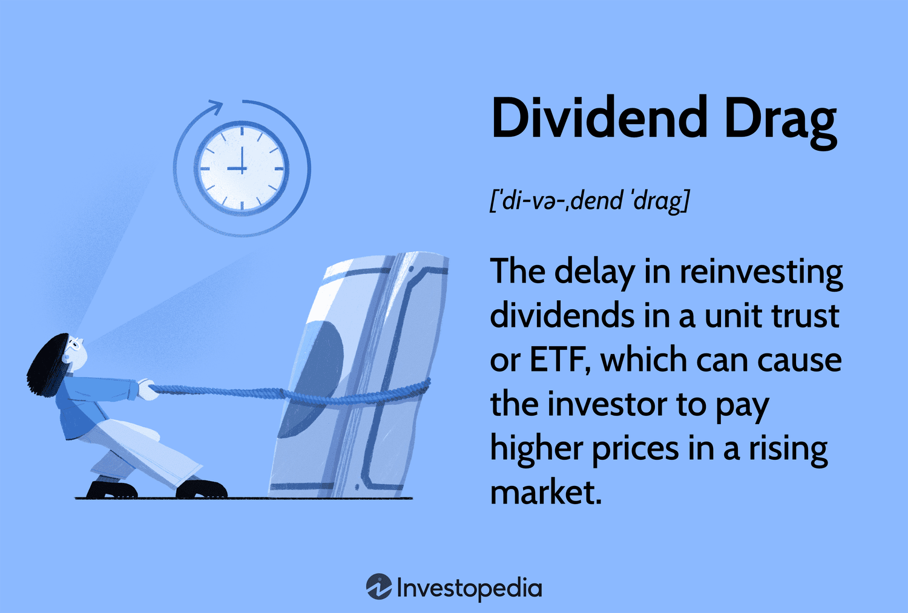

The stock market serves as a fundamental component of the global financial ecosystem, providing a platform for buying and selling ownership stakes in companies. This financial marketplace enables companies to raise capital by issuing stocks and offers investors opportunities for wealth accumulation through capital gains and dividends. Dividends, a noteworthy concept within investment strategy, are portions of a company's earnings distributed to shareholders, typically in the form of cash payments or additional shares. They represent a source of passive income and can significantly enhance total investment returns over time, making them highly valued by income-focused investors.

Despite their benefits, dividends introduce a phenomenon known as 'dividend drag,' which can impact overall investment performance. Dividend drag occurs when the reinvestment of dividends is delayed, suboptimal, or involves high transaction costs, leading to a potential reduction in compounding growth. This drag is often exacerbated by taxes and fees, creating a challenge for investors seeking maximum returns.



Algorithmic trading has emerged as a modern investment technique, leveraging computer algorithms and quantitative analysis to execute trades with speed and precision. By automating buy and sell decisions, algorithmic trading can enhance efficiency, reduce human error, and optimize investment strategies for better financial outcomes.

The purpose of this article is to explore the impact of dividend drag on investment returns and to examine how algorithmic trading strategies can be utilized to mitigate its effects. By understanding the interplay between dividends, dividend drag, and algorithmic trading, investors can employ more effective strategies to enhance their investment portfolios.

## Table of Contents

## Understanding Dividend Drag

Dividends are a portion of a company's earnings that are distributed to shareholders. Typically, dividends are paid in cash on a per-share basis, although they can also be distributed as additional shares of stock. Companies usually pay dividends quarterly, and the amount can vary depending on their profitability and dividend policy. The primary aim of dividends is to share the company's profits with its investors, offering them a return on their investment independent of any capital gains realized from selling the stock.

Dividend drag refers to the potential reduction in an investment portfolio’s performance due to the delay between the ex-dividend date and the reinvestment of dividends. During this period, the dividend income is not actively invested, which can result in missed opportunities for growth. The drag becomes more significant in a volatile market where substantial gains could occur during the interim period. The concept is predicated on the time value of money principle, where not having money actively invested equates to opportunity costs and potential losses over time.

Reinvesting dividends can help in mitigating dividend drag. By using dividends to purchase additional shares, investors can take advantage of compounding returns, which over time could significantly enhance the growth of their investment portfolios. The reinvestment process effectively reduces the time period where funds remain uninvested, thus minimizing the opportunity costs associated with dividend drag.

To illustrate the impact of dividend drag, consider an initial investment of $10,000 in a dividend-paying stock yielding 4%. Assuming the dividends are not reinvested, the investor would earn $400 annually. However, reinvesting the dividends could result in a compounded growth rate, potentially leading to a larger portfolio value over a decade. The dividend drag effect is evident when comparing the portfolios with and without dividend reinvestment over the same period. For example, in an upward-trending market, the reinvested dividends purchase additional shares that appreciate in value, while non-reinvested dividends remain static, resulting in foregone growth potential.

Several other factors contribute to dividend drag, including taxes and transaction fees. Dividends are typically subject to taxation, which can significantly reduce the actual return earned by investors. Depending on the jurisdiction, dividends may be taxed at a rate different from capital gains, which can affect the net income available for reinvestment. Additionally, transaction fees incurred during the reinvestment process can further diminish the net benefit of reinvested dividends. For instance, brokerage fees applied to reinvestment transactions can reduce the number of additional shares purchased, impacting the potential for compounded growth.

Understanding how dividends and dividend drag operate is crucial for investors seeking to optimize their portfolios. Mitigation strategies, such as automatic dividend reinvestment plans (DRIPs) and tax-efficient investment vehicles, can play a significant role in countering the effects of dividend drag and improving long-term investment outcomes.

## The Impact of Dividend Drag on Investment Portfolios

Dividend drag refers to the reduction in investment returns due to the time delay in reinvesting dividends and various associated costs such as taxes and fees. This concept poses significant implications for the performance of investment portfolios over time.

### Long-term Effects on Portfolio Growth

Dividend drag can notably hinder the compounded growth of investment portfolios. When dividends are paid out but not immediately reinvested, the potential of generating further returns on these payouts is lost. This issue is compounded by taxes that may apply to dividend income, reducing the net amount available for reinvestment. The compounding effect, a central principle of portfolio growth, is thus impaired, resulting in a slower growth trajectory over the long term. For instance, a seemingly small drag of 0.5% annually can substantially reduce the overall returns when compounded over several decades.

### Asset Classes and Susceptibility to Dividend Drag

Different asset classes exhibit varying levels of susceptibility to dividend drag. Equity investments with high dividend yields are particularly prone due to the frequency and amount of dividends distributed. Fixed-income securities, such as bonds that periodically pay interest, may experience a similar phenomenon termed "interest drag." Conversely, [growth stocks](/wiki/growth-stocks), which often reinvest profits rather than distributing dividends, are less affected. Real estate investment trusts (REITs) also face pronounced effects of dividend drag due to their structure, which mandates high dividend payouts.

### Influence on Investment Strategies

The presence of dividend drag necessitates specific strategies for stock investors, especially those focusing on income-generating assets. Investors might prioritize reinvesting their after-tax dividends promptly to mitigate the drag. Alternatively, favoring growth-oriented stocks could reduce reliance on dividends, thus diminishing the impact of dividend drag. A balanced strategy that combines dividend-income stocks with growth stocks can offer a compromise, providing income while allowing room for capital appreciation.

### Real-world Impact: Data and Case Studies

Empirical data illustrating the impact of dividend drag often underscores the importance of minimizing this inefficiency. Historical analyses, for instance, have shown that portfolios reinvesting dividends consistently outperform those that do not. A case study might demonstrate that a $10,000 investment in a high-dividend stock, with a 4% annual yield and a 0.5% drag rate, significantly lags behind a reinvested scenario over a multi-decade period.

### Investor Awareness and Mitigation Strategies

Investor awareness of dividend drag is crucial for optimizing portfolio performance. Investors can employ several strategies to mitigate its effects. Utilizing dividend reinvestment plans (DRIPs) can automate the reinvestment process, minimizing delays. Additionally, tax-advantaged accounts such as IRAs can help in reducing the tax impact on dividends. Seeking tax-efficient dividend strategies, for instance, placing high-yield stocks in tax-sheltered accounts, can also be an effective approach. 

By understanding the intricacies and implications of dividend drag, investors can better navigate its challenges, optimizing their portfolio strategies to enhance long-term growth.

## Algorithmic Trading and Its Role in Mitigating Dividend Drag

Algorithmic trading refers to the use of computer algorithms to execute trading orders automatically, making decisions based on pre-defined criteria at speeds and frequencies that are impossible for human traders. It has gained significant popularity in modern finance due to its ability to process vast amounts of data swiftly, minimize human error, and optimize trading strategies for better outcomes. In the context of mitigating dividend drag, [algorithmic trading](/wiki/algorithmic-trading) offers the potential to enhance investment returns by optimizing the timing and efficiency of buy/sell decisions and reinvestments.

Algorithms can counteract dividend drag by analyzing data patterns to identify optimal moments for buying and selling stocks. By executing buy or sell orders at precise times, algorithmic systems can minimize the cash drag associated with holding onto dividends before reinvestment. For instance, algorithms can be programmed to reinvest dividends immediately after they are paid, reducing idle cash time and potentially boosting returns. Moreover, these algorithms can incorporate predictive analytics to forecast the performance of dividend-paying stocks, thereby optimizing portfolio compositions to counteract potential drags.

In terms of tax efficiency, algorithmic strategies can be tailored to address the complexities that arise from differing tax treatments of dividends. Algorithms can be designed to take advantage of tax-loss harvesting, where losses on certain investments are realized to offset taxable gains, thus enhancing post-tax returns. Moreover, algorithms can be programmed to prioritize investments that qualify for lower tax rates, such as qualified dividends, thereby improving the tax efficiency of dividend portfolios.

An example of an algorithmic trading strategy that targets dividend-paying stocks is the Dividend Growth Strategy. This strategy involves algorithms selecting stocks with a history of increasing dividend payouts and executing trades that capitalize on price appreciation associated with anticipated future payouts. Such algorithms analyze historical dividend data and forecast future performance, making adjustments as necessary to optimize returns.

Despite these advantages, algorithmic trading is not without its challenges and risks in minimizing dividend drag. One significant concern is the reliance on accurate and timely data; erroneous data can lead to poor trading decisions. Additionally, algorithmic systems are susceptible to technical failures and require ongoing supervision and adjustments to remain effective. Market [volatility](/wiki/volatility-trading-strategies) and unexpected economic events can also disrupt algorithmic models, potentially leading to substantial losses if not managed properly.

In conclusion, while algorithmic trading offers promising solutions to mitigate dividend drag, investors must consider the inherent risks and ensure robust systems and strategies are in place to harness its full potential.

## Case Studies: Successful Mitigation of Dividend Drag Through Algo Trading

Case studies involving algorithmic trading offer valuable insights into how dividend drag can be effectively minimized. In this section, we will explore various examples where algorithmic trading strategies have successfully countered dividend drag, analyze the strategies employed, and discuss the adaptability of these strategies in various market environments. Additionally, we will compare the performance of algorithmic trading strategies to traditional dividend reinvestment strategies.

### Example Case Study 1: Optimizing Reinvestment Schedules

One notable example is the use of algorithmic models to optimize dividend reinvestment schedules. Traditionally, dividends are reinvested at predetermined intervals without considering market conditions. Algorithmic trading, however, utilizes real-time data and predictive analytics to determine the optimal timing for reinvesting dividends. By ensuring that dividends are reinvested during favorable market conditions, these algorithms minimize the negative impact of dividend drag and maximize long-term portfolio growth.

**Strategy and Outcome:** In this approach, algorithms analyze historical price trends, volatility, and economic indicators to forecast short-term market movements. For instance, if a dividend payout occurs during a market dip, the algorithm may delay reinvestment until a recovery trend is identified. This approach has led to an increase in annualized returns by 1-2% over traditional methods, demonstrating a clear benefit in mitigating dividend drag.

**Lessons Learned:** The key takeaway from this strategy is the importance of timing in reinvestment. By aligning dividend reinvestments with favorable market conditions, investors can significantly enhance their return on investment.

### Example Case Study 2: Tax Efficiency Strategies

Another case study involves the application of algorithmic trading to enhance tax efficiency in dividend reinvestment. Taxes on dividend income can significantly contribute to dividend drag. By employing algorithms that consider tax implications, investors can optimize their portfolios for greater tax efficiency.

**Strategy and Outcome:** This approach utilizes tax-aware algorithms that determine the tax impact of different reinvestment scenarios. For example, in jurisdictions with varying tax rates on short-term and long-term capital gains, algorithms can time the sale and reinvestment of assets to minimize tax liability. In one study, portfolios managed with tax-efficient algorithmic strategies showed a reduction in tax-related costs by up to 30%, leading to higher net returns.

**Lessons Learned:** The primary insight here is that tax considerations must be integrated into algorithmic trading strategies to mitigate dividend drag effectively. Algorithms that adapt to changing tax regulations and market conditions offer a strategic advantage to investors.

### Adaptability of Algorithmic Strategies

The adaptability of algorithmic trading strategies is a critical [factor](/wiki/factor-investing) in their success. Unlike traditional methods, algorithms can be tailored to address specific market conditions and investor preferences. They are highly flexible and can be adjusted based on changes in economic indicators, regulatory environments, and individual investment goals.

**Comparative Analysis:** In comparing algorithmic trading strategies to traditional dividend reinvestment strategies, research indicates that algorithm-driven approaches consistently outperform their conventional counterparts. On average, portfolios utilizing algorithmic trading exhibit higher returns and reduced exposure to market volatility.

### Conclusion from Case Studies

These case studies illustrate the effectiveness of algorithmic trading in minimizing the impact of dividend drag. By employing sophisticated algorithms that consider market timing, tax efficiency, and adaptability to various conditions, investors can optimize their portfolio performance. The experiences gained from these real-world examples provide valuable insights for future improvements in algorithmic trading strategies and their application in dividend investment. As technology continues to evolve, the potential for even greater optimization of dividend strategies through algorithmic means is likely to expand, emphasizing the need for investors to incorporate such tools in their investment approach.

## Future Trends: Evolution of Dividend Strategies in an Algorithmic Era

Predicting future developments in algorithmic trading, particularly in the context of dividend investments, involves understanding the trajectory of technological advancements and regulatory changes while integrating emerging investment criteria such as Environmental, Social, and Governance ([ESG](/wiki/esg-investing)) factors.

Algorithmic trading has progressively merged with advanced technologies such as [artificial intelligence](/wiki/ai-artificial-intelligence) (AI) and [machine learning](/wiki/machine-learning) (ML), offering unprecedented optimization in dividend strategy. These technologies can enhance predictive analytics, providing investors with insightful patterns and trends in dividend payments and stock price fluctuations. AI and ML algorithms can process vast amounts of data to identify signals indicating when dividends are likely to increase or which stocks are likely to outperform based on historical dividend payments. By utilizing these insights, investors can algorithmically optimize their portfolios to maximize returns and minimize dividend drag.

```python
# Example Python code demonstrating a basic machine learning approach for predicting dividend increases
from sklearn.model_selection import train_test_split
from sklearn.linear_model import LinearRegression
import pandas as pd

# Sample data preparation
data = pd.read_csv('dividends.csv')  # A CSV file containing historical dividend data
features = data.drop(columns=['Future Dividend'])
targets = data['Future Dividend']

# Split the data into training and testing sets
X_train, X_test, y_train, y_test = train_test_split(features, targets, test_size=0.2, random_state=42)

# Model training
model = LinearRegression()
model.fit(X_train, y_train)

# Making predictions
predictions = model.predict(X_test)
```

Technological advancements will not only refine analyses but also facilitate real-time trading, enabling quicker response to market changes—thus, addressing dividend drag more efficiently. In addition, blockchain technology may offer enhanced transparency and efficiency in dividend processing.

Regulatory landscapes are likely to adapt to these technological changes, with an increasing need for frameworks that ensure fair trading practices and manage potential risks associated with high-frequency algorithmic trading. Regulators may focus on issues such as market manipulation and the ethical use of AI-driven strategies, which could impact how these algorithms function in practice.

ESG factors are gaining significant importance as investors increasingly demand socially responsible investment options. Algorithmic trading can incorporate ESG scores to select dividend-paying stocks that align with investor values. This can involve adjusting algorithms to prioritize companies with strong ESG credentials, thus not only optimizing for financial returns but also for social impact.

The convergence of these trends suggests a dynamic future where algorithmic trading will play a pivotal role in structuring dividend strategies—integrating cutting-edge technology, regulatory compliance, and values-based investing to mitigate dividend drag and enhance overall portfolio performance.

## Conclusion

Understanding and addressing dividend drag is crucial for investors aiming to maximize the growth potential of their investment portfolios. Dividend drag, which encompasses the reduction in investment returns due to factors such as taxes, fees, and opportunity costs, can significantly impact long-term portfolio performance. By gaining a comprehensive understanding of this phenomenon, investors can better position themselves to make informed decisions that mitigate its effects.

Algorithmic trading emerges as a potent tool in this landscape, offering investors sophisticated methods to enhance their dividend strategies. By leveraging algorithms, investors can optimize their buy and sell decisions, ensuring not only efficient dividend reinvestment but also improved tax efficiency. These strategies can significantly reduce the impact of dividend drag, thus preserving more of the investors' capital for growth.

A well-informed approach to dividend investments can yield substantial benefits. Investors who understand not only the mechanics of dividend drag but also the technological advancements in algorithmic trading stand to improve their returns. They are better equipped to implement strategies that account for dividend drag and can therefore realize appreciable gains over time.

Looking forward, the evolution of investment technologies promises continual refinement in the ways dividend strategies are formulated and executed. As artificial intelligence and machine learning become more deeply integrated into financial models, we can anticipate even more robust methods for optimizing dividend investments. These advancements will likely be coupled with regulatory changes and a growing emphasis on Environmental, Social, and Governance (ESG) factors, further shaping the investment landscape.

In conclusion, as dividend investments continue to evolve with technological progress, investors who embrace these changes and incorporate algorithmic solutions will be well-positioned to navigate and capitalize on future market opportunities.

## References & Further Reading

[1]: Bodie, Z., Kane, A., & Marcus, A. J. (2014). ["Investments"](https://www.mheducation.com/highered/product/Investments-Bodie.html). McGraw-Hill Education.

[2]: Lopez de Prado, M. (2018). ["Advances in Financial Machine Learning"](https://www.amazon.com/Advances-Financial-Machine-Learning-Marcos/dp/1119482089). Wiley.

[3]: Chan, E. P. (2008). ["Quantitative Trading: How to Build Your Own Algorithmic Trading Business"](https://github.com/ftvision/quant_trading_echan_book). Wiley.

[4]: Jansen, S. (2018). ["Machine Learning for Algorithmic Trading: Predictive Models to Extract Signals from Market and Alternative Data for Systematic Trading Strategies with Python"](https://github.com/stefan-jansen/machine-learning-for-trading). Packt Publishing.

[5]: Graham, B., & Zweig, J. (2003). ["The Intelligent Investor: The Definitive Book on Value Investing. A Book of Practical Counsel."](https://www.amazon.com/Intelligent-Investor-Definitive-Investing-Essentials/dp/0060555661) Harper Business.

[6]: Marks, H. (2011). ["The Most Important Thing: Uncommon Sense for the Thoughtful Investor"](https://www.jstor.org/stable/10.7312/mark15368). Columbia University Press.