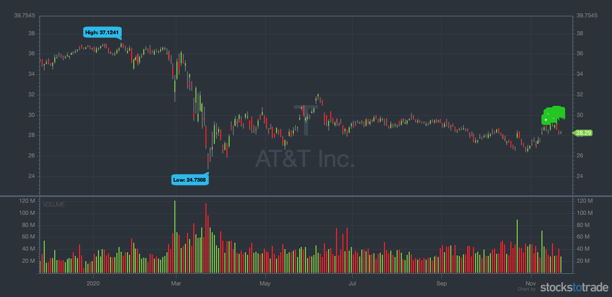

## Table of Contents

## What are penny stocks?

Penny stocks are stocks that trade for a very low price, usually less than a dollar. They are often from small companies that are just starting out or are not doing well. Because they are cheap, some people think they can buy a lot of them and make a big profit if the stock price goes up. But penny stocks can be risky because they are not traded on big stock exchanges like the New York Stock Exchange. This means they can be harder to buy and sell, and the prices can change a lot very quickly.

Investing in penny stocks can be exciting because of the chance to make a lot of money quickly. But it's important to know that it can also be easy to lose money. Many penny stock companies do not have a lot of information available about them, so it can be hard to know if they are a good investment. Because of this, penny stocks are often seen as very risky, and many people suggest only investing money that you can afford to lose.

## What are dividends?

Dividends are payments that companies give to their shareholders. When a company makes a profit, it can choose to share some of that profit with the people who own its stock. This sharing happens in the form of dividends, which are usually paid out in cash, but sometimes in more stock or other property. The amount of the dividend is decided by the company's board of directors and can change depending on how well the company is doing.

Not all companies pay dividends. Some, especially newer or growing companies, might choose to use their profits to reinvest in the business instead of paying out dividends. For people who invest in stocks, dividends can be a nice extra income. They can also be a sign that a company is doing well and has steady profits. But it's important to remember that dividends are not guaranteed and can be changed or stopped at any time by the company.

## Can penny stocks pay dividends?

Yes, penny stocks can pay dividends, but it's not common. Penny stocks are usually from small companies that don't make a lot of money. Because they don't have much profit, they often can't afford to pay dividends to their shareholders. Instead, these companies might use any profits they have to grow their business or to keep running.

If a penny stock does pay a dividend, it's usually a very small amount. This is because the company's profits are small, so they can only share a little bit. Investors who buy penny stocks are usually looking for the stock price to go up, not for dividends. So, even if a penny stock pays a dividend, it's not usually a big reason why people invest in them.

## How do you determine if a penny stock is eligible to pay dividends?

To determine if a penny stock is eligible to pay dividends, you need to look at the company's financial health. A company can only pay dividends if it has enough profit. If a penny stock company is making money, it might be able to share some of that profit with its shareholders as dividends. But if the company is losing money or just breaking even, it won't have the extra cash to pay dividends.

You can check a company's financial statements to see if it's making a profit. These statements are usually available on the company's website or through financial news websites. If you see that the company has been making consistent profits over time, it might be more likely to pay dividends. But remember, even if a company can pay dividends, it might choose not to if it wants to use the money to grow the business instead.

## What are the typical dividend yields for penny stocks?

Dividend yields for penny stocks are usually very low. This is because penny stock companies often don't make much money, so they can't afford to pay big dividends. If a penny stock does pay a dividend, the yield might be just a few percent, like 1% or 2%. This is much less than what you might get from bigger, more established companies.

Sometimes, a penny stock might offer a higher dividend yield to attract investors. But be careful, because a high yield could mean the company is in trouble and the stock price might drop a lot. It's important to look at the whole picture, not just the dividend yield, when deciding if a penny stock is a good investment.

## What factors influence a penny stock's ability to pay dividends?

A penny stock's ability to pay dividends depends a lot on how much money the company is making. If the company is making good profits, it might share some of that money with its shareholders as dividends. But if the company is not making much money or is losing money, it won't have the extra cash to pay dividends. So, the most important thing is the company's financial health.

Another factor is what the company wants to do with its money. Even if a company has enough profit to pay dividends, it might decide to use that money to grow the business instead. This is common with penny stock companies because they are often small and trying to get bigger. So, the company's goals and plans can affect whether it pays dividends or not.

## How does a company's financial health affect dividend eligibility for penny stocks?

A company's financial health is really important when it comes to deciding if it can pay dividends, especially for penny stocks. If a penny stock company is making good profits, it might have enough money to share some of those profits with its shareholders as dividends. But if the company is not doing well and is losing money, it won't have the extra cash to pay dividends. So, the first thing to look at is how much money the company is making.

Another thing to think about is what the company wants to do with its money. Even if a penny stock company has enough profit to pay dividends, it might choose to use that money to grow the business instead. This is common because penny stock companies are often small and trying to get bigger. So, even if a company is making money, it might not pay dividends if it thinks it can use that money better in other ways.

## What are the risks associated with investing in dividend-paying penny stocks?

Investing in dividend-paying penny stocks can be risky. One big risk is that these companies are often small and might not have a lot of money. If they start losing money, they might have to stop paying dividends. This can be a problem if you were counting on that money. Also, because penny stocks are not traded on big stock exchanges, it can be hard to sell them quickly if you need to. This means you might not be able to get your money out when you want to.

Another risk is that the stock price can change a lot very quickly. If the company has bad news or if people stop wanting to buy the stock, the price can drop a lot. This can make your investment worth less, even if you are getting dividends. Also, some penny stock companies might not be honest about how well they are doing. They might say they are making money when they are not, just to keep the stock price up. This can be hard to find out because these companies often don't have to share a lot of information.

## How can investors assess the sustainability of dividends from penny stocks?

To figure out if the dividends from penny stocks will keep coming, investors need to look at how much money the company is making. If a company is making good profits and has been doing so for a while, it's more likely that it can keep paying dividends. You can check this by looking at the company's financial statements, which show how much money they are making or losing. If the company is always making money, that's a good sign. But if they are losing money or just breaking even, it might be hard for them to keep paying dividends.

Another thing to think about is what the company wants to do with its money. Even if a company has enough profit to pay dividends, it might choose to use that money to grow the business instead. This is common with penny stock companies because they are often small and trying to get bigger. So, even if a company is making money, it might not pay dividends if it thinks it can use that money better in other ways. It's important to read what the company says about its plans and goals to see if they are more focused on growing or on paying dividends.

## What are the tax implications of dividends from penny stocks?

When you get dividends from penny stocks, you have to pay taxes on them. The tax you pay depends on how much money you make in a year. If you make a lot of money, you might have to pay more tax on your dividends. The tax rate can be different depending on if the dividends are "qualified" or "non-qualified." Qualified dividends are usually taxed at a lower rate, like the tax rate for long-term capital gains. Non-qualified dividends are taxed at your normal income tax rate, which can be higher.

To figure out if your dividends are qualified or non-qualified, you need to know how long you owned the stock before you got the dividend. If you owned the stock for more than 60 days during the 121-day period that starts 60 days before the ex-dividend date, the dividend is usually qualified. If you owned it for less time, it's non-qualified. It's a good idea to keep good records of when you buy and sell your penny stocks so you can figure out your taxes correctly.

## How do regulatory requirements impact dividend payments for penny stocks?

Regulatory requirements can make it harder for penny stock companies to pay dividends. These companies often have to follow rules from places like the Securities and Exchange Commission (SEC). The SEC has rules to make sure companies are honest about their money and how they are doing. If a penny stock company does not follow these rules, it might get in trouble and have to pay fines. This can take away money that could have been used for dividends. Also, some penny stocks are traded on smaller markets called "over-the-counter" markets, which have their own rules. These rules can make it hard for the company to pay dividends if they are not making enough money or if they are not following the rules.

Another way regulatory requirements can impact dividend payments is by making it harder for penny stock companies to raise money. If a company wants to pay dividends, it needs to have enough cash. But if the company is having a hard time following the rules, it might not be able to get loans or sell more stock to raise money. This can make it tough for the company to keep paying dividends. So, even if a penny stock company wants to pay dividends, it might not be able to because of the rules it has to follow.

## What advanced strategies can investors use to maximize returns from dividend-paying penny stocks?

One advanced strategy for maximizing returns from dividend-paying penny stocks is to reinvest the dividends. When you get a dividend, instead of spending it, you can use it to buy more shares of the same stock. This can help your investment grow faster because you will get more dividends in the future from the extra shares. It's like planting a seed and letting it grow into a bigger plant. Over time, this can make a big difference in how much money you make, especially if the stock price goes up too.

Another strategy is to look for penny stocks that are in industries that are growing fast. If you can find a small company that is doing well in a growing industry, it might be able to keep paying dividends and even increase them over time. This can be a good way to make more money because the stock price might go up as the company gets bigger. But it's important to do a lot of research to make sure the company is really doing well and not just saying it is. You can look at the company's financial statements and read news about the industry to see if it's a good investment.

## What is the role of dividends in investing and how can they be understood?

Dividends are financial distributions made by corporations to their shareholders, typically derived from the company's earnings. These payments are a pivotal aspect of investment strategies for individuals seeking a consistent revenue stream from their investments. Dividends are often distributed quarterly, although some companies may opt for a semi-annual or annual distribution model.

The decision to pay dividends, and how much, generally hinges on the company's financial health and strategic objectives. Companies with robust and stable earnings are more inclined to offer dividends to attract and retain investors, while younger, growth-oriented companies might reinvest profits back into the business rather than issuing dividends. This reflects the trade-off between distributing earnings to shareholders and retaining earnings for potential reinvestment opportunities, which might lead to greater long-term growth.

Dividends can take several forms, including cash dividends and stock dividends. Cash dividends are the most common type, providing shareholders with a straightforward cash payment per share owned. On the other hand, stock dividends involve issuing additional shares to shareholders, which increases the total number of shares they own but does not directly provide cash.

A key metric used to assess the attractiveness of a dividend-paying stock is the dividend yield, expressed as:

$$
\text{Dividend Yield} = \left( \frac{\text{Annual Dividends Per Share}}{\text{Price Per Share}} \right) \times 100
$$

This formula calculates the percentage return a shareholder receives from dividends, relative to the stock's current market price. A higher dividend yield may indicate a potentially attractive investment, but it is important for investors to consider other factors, such as the company's payout ratio and financial stability.

The payout ratio, which is the proportion of earnings paid out as dividends to shareholders, is another critical metric:

$$
\text{Payout Ratio} = \left( \frac{\text{Dividends Per Share}}{\text{Earnings Per Share}} \right) \times 100
$$

A high payout ratio might suggest that a company is returning most of its profits to investors, which could limit its ability to reinvest in future growth. Conversely, a low ratio may imply either conservative financial management or efficient reinvestment strategies aimed at boosting future earnings.

In conclusion, while dividends provide stability and income, not all companies opt to distribute profits to shareholders. The decision is closely tied to a company's financial health, growth prospects, and overall strategy, making dividends a multifaceted component of investment considerations.

## How can dividend-paying penny stocks enhance your portfolio?

Dividend-paying penny stocks represent a niche investment opportunity that combines the allure of high-risk, high-reward penny stocks with the steady income provided by dividends. Although these stocks are volatile, they can significantly enhance an investment portfolio when incorporated with a strategic dividend approach. The primary advantage of dividend-paying penny stocks lies in their ability to offer a supplementary income stream that can either mitigate losses or augment profits.

For instance, dividends received from these stocks contribute to overall portfolio income, which can be particularly advantageous during market downturns. In situations where other investments might be underperforming, these dividends can help cushion the blow by providing a consistent return. Suppose an investor holds a diversified portfolio with exposure to various sectors, including these penny stocks. If a particular sector underperforms, the dividends from the penny stocks can potentially compensate for those losses, thus stabilizing the portfolio's value.

Moreover, achieving a favorable return on investment (ROI) can be realized by combining capital appreciation with dividend income. Assuming an investor purchases a dividend-paying penny stock at $2 per share, and the company pays an annual dividend of $0.10 per share, the dividend yield can be calculated as follows:

$$
\text{Dividend Yield} = \left( \frac{\text{Annual Dividends per Share}}{\text{Price per Share}} \right) \times 100 = \left( \frac{0.10}{2} \right) \times 100 = 5\%
$$

This yield is a critical [factor](/wiki/factor-investing) in assessing the stock's potential profitability, especially when the share price appreciates. For example, if the stock price increases to $3, the investor not only benefits from this capital gain but continues to receive the dividend yield, further boosting portfolio returns.

To effectively integrate dividend-paying penny stocks into a portfolio, investors typically employ stock screeners to extract valuable insights. These tools allow for filtering specific criteria such as dividend yield, market capitalization, and price per share, aiding investors in identifying stocks that align with their financial goals. By systematically evaluating these stocks, investors can capitalize on dividend opportunities while maintaining a strategic balance within their broader investment strategy.

## References & Further Reading

[1]: ["Advances in Financial Machine Learning"](https://www.amazon.com/Advances-Financial-Machine-Learning-Marcos/dp/1119482089) by Marcos Lopez de Prado

[2]: ["Quantitative Trading: How to Build Your Own Algorithmic Trading Business"](https://www.amazon.com/Quantitative-Trading-Build-Algorithmic-Business/dp/1119800064) by Ernest P. Chan

[3]: ["Evidence-Based Technical Analysis: Applying the Scientific Method and Statistical Inference to Trading Signals"](https://www.amazon.com/Evidence-Based-Technical-Analysis-Scientific-Statistical/dp/0470008741) by David Aronson

[4]: ["Machine Learning for Algorithmic Trading"](https://github.com/stefan-jansen/machine-learning-for-trading) by Stefan Jansen

[5]: Securities and Exchange Commission (SEC) - ["Penny Stock Rules."](https://www.sec.gov/rules-regulations/2005/07/amendments-penny-stock-rules)