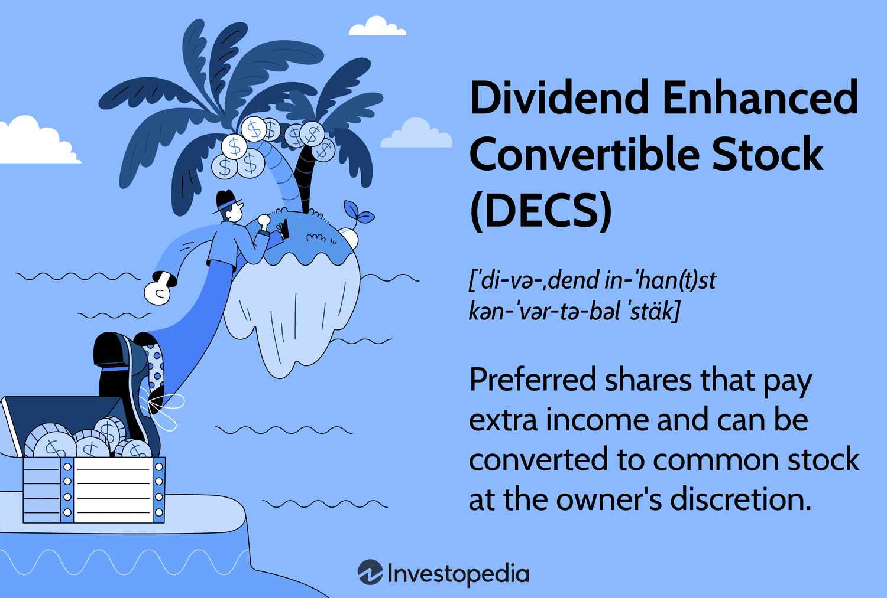

Investing in the stock market has undergone significant transformations, driven by the increasing sophistication of investment strategies designed to enhance returns. Two concepts that have gained prominence in this landscape are dividend convertible stocks and algorithmic trading. Dividend convertible stocks offer a hybrid investment opportunity by combining features of both dividend-paying equities and convertible securities. These instruments provide investors with the potential for regular income through dividends, alongside the possibility of capital appreciation if the underlying equity's price increases sufficiently.

Algorithmic trading, on the other hand, represents a technological advancement in the execution of trades, facilitating decisions based on complex algorithms at speeds far surpassing human capability. As a modern approach to trading, it allows investors to exploit market inefficiencies and streamline the trading process by utilizing predefined criteria to execute trades. By leveraging the power of computational algorithms, investors can enhance the precision and efficiency of their transactions, thereby optimizing investment outcomes.



This article aims to examine the complex aspects of investing in dividend convertible stocks and explore the role of algorithmic trading in enhancing these investments. We will dissect the components of dividend convertible stocks, evaluate their potential benefits and risks, and discuss how algorithmic trading strategies improve investment results. By the conclusion of this article, readers will gain a comprehensive understanding of these sophisticated investment concepts, empowering them to harness these tools to their advantage.

## Table of Contents

## Understanding Dividend Convertible Stocks

Dividend Enhanced Convertible Stocks (DECS) are a sophisticated type of financial instrument that blend the features of both preferred stocks and bonds, aiming to provide investors with a combination of dividend income and potential capital gains. These instruments function similarly to traditional convertible bonds, but with added features that enhance their appeal to certain investors.

DECS offer investors the option to convert their preferred stock into a predetermined number of common shares of the issuing company after a specified date. This conversion feature is a pivot point for potential capital appreciation—if the company’s stock price rises, the conversion option allows investors to capture this upside. The formula for conversion is generally based on a predefined conversion ratio, calculated as follows:

$$
\text{Conversion Ratio} = \frac{\text{Par Value of DECS}}{\text{Conversion Price}}
$$

For example, if a DECS has a par value of $1,000 and a conversion price of $50, the conversion ratio would be 20 common shares per DECS.

The design of DECS typically results in higher dividend yields compared to standard preferred stocks, which is one of their most attractive features for income-focused investors. The enhanced yield is a reflection of the additional risk assumed by investors due to the instrument’s complexity and the conditional nature of the conversion feature.

It is essential for investors to thoroughly understand the conversion terms of DECS. Key considerations include the conversion ratio and the timing of conversion. Clear comprehension of these terms enables effective management of investment positions and optimization of returns. 

Deciding when to convert DECS depends not only on the specific terms of the instrument but also on prevailing market conditions and the performance of the issuing company. Investors should consistently monitor the company’s financial health, its stock price movements, and broader market dynamics to make informed decisions about the conversion timing.

In summary, while DECS provide a unique opportunity for income and growth, navigating their complexities requires a keen awareness of market trends and a solid understanding of the instrument’s mechanics.

## Algorithmic Trading: An Overview

Algorithmic trading employs computer algorithms to automate the process of executing trades. These algorithms follow pre-established criteria, enabling transactions to occur at speeds and frequencies far beyond human capability. By leveraging technology, traders can achieve greater precision and efficiency in executing trade orders. This advancement has fundamentally reshaped the trading environment, providing a competitive edge through timely decision-making and execution.

One of the primary benefits of [algorithmic trading](/wiki/algorithmic-trading) is the ability to back-test strategies using historical data. This process allows traders to evaluate the viability of trading strategies before applying them in real market conditions. Back-testing helps in optimizing parameters and refining strategies to maximize returns and minimize risks.

Moreover, algorithmic trading significantly reduces human error. By relying on predefined rules and logic, algorithms execute trades without the emotional and cognitive biases that often impact human traders. This approach also enhances the capacity to exploit market inefficiencies. For example, algorithms can identify [arbitrage](/wiki/arbitrage) opportunities where prices of assets differ across markets, executing trades to capture these discrepancies almost instantaneously.

In the context of dividend convertible stocks, algorithms can be programmed to recognize favorable conversion opportunities. For instance, when the price of a convertible rises past a certain threshold, an algorithm could automatically initiate a conversion or sale, thus capitalizing on the potential gains. This capability is particularly valuable in managing complex investments, where quick responses to market changes are crucial.

To successfully deploy algorithmic trading, a robust understanding of both programming and financial markets is essential. Traders typically use programming languages such as Python or C++ to develop their algorithms. Access to reliable trading platforms and live data feeds is critical for testing and implementing these algorithms. This infrastructure enables traders to maintain a bird’s-eye view of the market while fine-tuning their algorithms based on real-time data and evolving market conditions.

In summary, algorithmic trading offers powerful tools for executing trades with precision and speed while mitigating human errors and optimizing investment strategies through back-testing and automatic execution. Its application to dividend convertible stocks exemplifies how technology can enhance financial strategies, adapting rapidly to shifts in the market and maximizing potential returns.

## Combining DECS and Algorithmic Trading

Integrating Dividend Enhanced Convertible Stocks (DECS) with algorithmic trading systems presents significant opportunities for investors seeking dynamic and responsive investment strategies. The automation and precision afforded by algorithmic trading can enhance the management and outcomes of DECS investments.

Algorithms, when integrated with DECS, can continuously monitor market conditions and execute trades or conversions automatically based on pre-determined thresholds or signals. This capability allows investors to optimize return potential by seizing favorable opportunities promptly and minimizing the lag associated with manual trading. For example, algorithms can identify when the market price of DECS or its underlying common stock reaches a level that makes conversion advantageous, triggering an automatic conversion or sale.

Moreover, algorithmic tools offer robust mechanisms for hedging against the inherent risks associated with DECS. By automatically adjusting positions in response to observed market [volatility](/wiki/volatility-trading-strategies), algorithms can help mitigate potential losses. This dynamic risk management can involve reallocating assets, adjusting stop-loss limits, or employing derivatives to cover downside risks, all actions that can be taken without direct human intervention based on real-time data analysis.

Developing an effective algorithmic trading strategy for DECS requires careful planning and a deep understanding of the factors influencing DECS pricing. These factors include interest rates, the issuing company's stock volatility, and broader market movements. Algorithms should be tailored to capture the nuances of DECS pricing dynamics, which may involve complex calculations and simulations to predict market behavior accurately.

A basic example of such a strategy in Python could involve setting up triggers for conversion:

```python
def should_convert(decs_price, common_stock_price, conversion_ratio):
    """
    Determines whether to convert DECS based on current prices.

    Parameters:
    decs_price (float): Current price of the DECS.
    common_stock_price (float): Current price of the company's common stock.
    conversion_ratio (float): Number of shares received per DECS during conversion.

    Returns:
    bool: True if conversion is advantageous, False otherwise.
    """
    conversion_value = common_stock_price * conversion_ratio
    return conversion_value > decs_price

# Example usage
decs_price = 100
common_stock_price = 110
conversion_ratio = 1.2

if should_convert(decs_price, common_stock_price, conversion_ratio):
    print("Execute conversion.")
else:
    print("Hold DECS.")
```
The integration of algorithmic trading with DECS not only enhances investment flexibility and potential returns but also requires rigorous risk assessment and continuous monitoring to ensure that algorithms remain responsive to market conditions.

## Risks and Challenges

The integration of Dividend Convertible Stocks (DECS) and algorithmic trading offers substantial potential to enhance investment returns, but it is crucial to acknowledge and address the associated risks and challenges. One significant concern is market volatility, which can lead to swift and unpredictable changes in asset prices, directly affecting the performance of trading algorithms. These algorithms, which operate based on historical data and predefined sets of rules, may fail to adapt quickly to sharp market movements, rendering them less effective or even harmful to the investment portfolio.

Another critical risk is the possibility of incorrect algorithmic assumptions. Algorithms are built upon models that necessitate assumptions about market behavior and stock fundamentals. If these assumptions do not hold, the strategies can lead to significant losses. For example, if an algorithm assumes low volatility and sets tight bounds on trades, an unexpected market swing could trigger unfavorable trades or missed opportunities.

Moreover, changes in a company’s fundamentals can alter the attractiveness of DECS. Sudden shifts in a company’s financial health, leadership, or policy could affect its stock price unpredictably. Algorithms, which may predominantly rely on technical indicators, could miss such fundamental changes, necessitating constant scrutiny by human operators.

Investors must also be vigilant about the potential for technology failures. The reliance on technology implies a susceptibility to glitches, bugs, or connectivity issues, which could lead to execution errors or missed trades. This highlights the importance of maintaining rigorous back-testing and real-time monitoring of algorithms to ensure their functionality and effectiveness under different market conditions.

Risk management is an essential component of deploying algorithmic trading strategies. Implementing stop-loss mechanisms is vital to limit potential losses incurred from adverse movements. Regularly reviewing and updating strategies ensures they remain aligned with current market conditions and are based on the latest data. By monitoring the performance and continuously upgrading the algorithms, investors can better mitigate the risks inherent in automated trading.

In summary, while DECS combined with algorithmic trading can be a powerful tool for investors, these strategies should be approached with caution and preparedness. Thorough understanding, continuous monitoring, and robust risk management strategies are crucial to effectively navigate the risks involved.

## Conclusion

Dividend convertible stocks (DECS) represent a compelling investment vehicle by merging aspects of fixed-income securities with the growth potential of equities. This duality affords investors the opportunity to benefit from regular dividend payments while also participating in capital appreciation should the underlying common stock price increase. The strategic allure of DECS is augmented when combined with algorithmic trading techniques, which facilitate the seamless execution of trades based on complex quantitative models.

Algorithmic trading, with its capacity for high-frequency execution and analytical precision, can optimize investment outcomes in DECS. By automating decision-making processes, algorithms can quickly react to market movements, assess conversion opportunities, and execute trades with minimal latency, thus maximizing potential returns while minimizing human error. This methodology requires a deep understanding of both DECS and algorithmic trading systems, as well as the broader market dynamics that influence asset behavior.

For investors, mastering the nuances of investing in DECS through algorithmic trading involves a commitment to detailed analysis and an understanding of risk management practices. This includes setting appropriate stop-loss levels and continuously monitoring algorithm performance to ensure alignment with evolving market conditions. As financial markets become increasingly digital and interconnected, these sophisticated trading strategies may soon become integral to modern portfolio management, offering a smart path to income generation and capital growth.

Institutions and individual investors alike are poised to benefit from the convergence of technological advancements and innovative financial instruments such as DECS. By staying informed and leveraging cutting-edge tools, market participants can enhance their investment processes and potentially improve returns, paving the way for a new standard in investment strategy execution.

## Further Reading

To gain a more comprehensive understanding of dividend convertible stocks and algorithmic trading, several resources and approaches can be explored. Websites like Investopedia offer extensive articles and tutorials that cover the basic concepts and advanced strategies involved in these financial instruments. Additionally, enrolling in financial trading courses can provide structured learning and insights into the technical and practical aspects of investing and trading.

Understanding how economic indicators and market trends influence financial markets is crucial for successfully applying strategies involving dividend convertible stocks and algorithmic trading. Economic indicators such as GDP growth rates, unemployment figures, and inflation rates can have significant impacts on stock prices and market dynamics. Such knowledge aids in assessing the potential performance and risks associated with investments.

Engaging with investment forums or communities offers valuable opportunities for learning and sharing experiences with other investors and algorithmic trading experts. Platforms like Reddit's r/investing or specialized financial forums provide discussions, recommendations, and real-world experiences that can enhance one's strategies and decision-making processes. Networking with experienced traders can also lead to mentorship opportunities and collaborations, facilitating skill enhancement and strategy refinement. 

For those interested in algorithmic trading, exploring coding platforms such as QuantConnect or using Python libraries like NumPy and pandas can help in developing and testing custom trading algorithms. These tools allow investors to back-test strategies using historical data to optimize their trading decisions.

Lastly, staying updated with financial news and analysis through reputable outlets like Bloomberg or The Wall Street Journal can provide current insights into market conditions and emerging trends, thereby enriching the strategic approach to investments involving dividend convertible stocks and algorithmic trading.

## References & Further Reading

[1]: ["Advances in Financial Machine Learning"](https://www.amazon.com/Advances-Financial-Machine-Learning-Marcos/dp/1119482089) by Marcos Lopez de Prado

[2]: ["Machine Learning for Algorithmic Trading"](https://github.com/stefan-jansen/machine-learning-for-trading) by Stefan Jansen

[3]: ["Understanding Options"](https://www.investopedia.com/options-basics-tutorial-4583012) by Michael Sincere

[4]: ["Quantitative Trading: How to Build Your Own Algorithmic Trading Business"](https://www.amazon.com/Quantitative-Trading-Build-Algorithmic-Business/dp/1119800064) by Ernest P. Chan

[5]: ["Evidence-Based Technical Analysis: Applying the Scientific Method and Statistical Inference to Trading Signals"](https://www.amazon.com/Evidence-Based-Technical-Analysis-Scientific-Statistical/dp/0470008741) by David Aronson

[6]: Bergstra, J., Bardenet, R., Bengio, Y., & Kégl, B. (2011). ["Algorithms for Hyper-Parameter Optimization."](https://dl.acm.org/doi/10.5555/2986459.2986743) Advances in Neural Information Processing Systems 24.