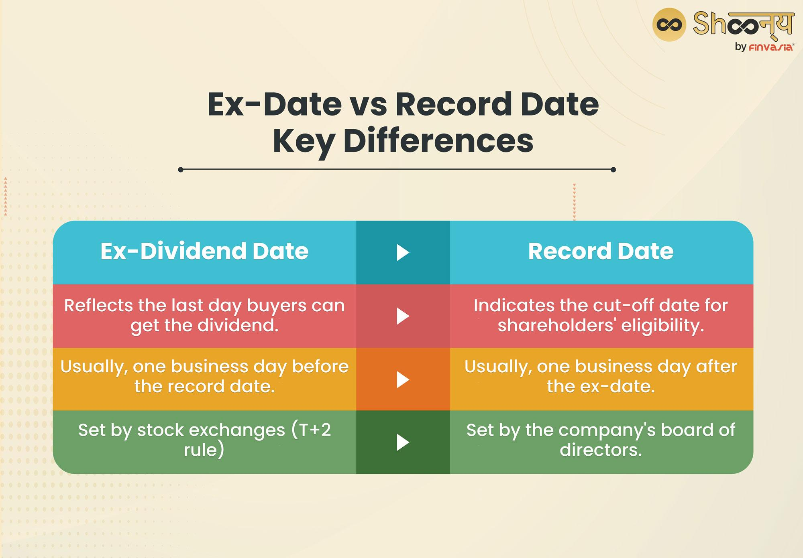

## Table of Contents

## What is a dividend?

A dividend is money that a company pays to its shareholders. When a company makes a profit, it can choose to share some of that profit with the people who own its stock. This payment is called a dividend. Shareholders usually receive dividends every three months, but some companies pay them more or less often.

Dividends are important because they can provide a steady income for investors. For example, if you own shares in a company that pays regular dividends, you can use that money for your living expenses or to reinvest in more shares. Not all companies pay dividends, though. Some, especially newer or fast-growing companies, might choose to use their profits to grow the business instead of paying them out to shareholders.

## What is a long call option?

A long call option is when you buy the right to buy a stock at a certain price before a certain date. Imagine you think a stock's price will go up. You can buy a call option, which gives you the chance to buy that stock later at today's price, even if it goes up. This can be a good deal if the stock price does go up because you can buy it cheaper than the market price and then sell it for a profit.

However, there's a catch. You have to pay for the option, which is called the premium. If the stock price doesn't go up as you hoped, you might lose the money you paid for the option. The option has an expiration date, so you need to decide whether to use it before it expires. If you don't use it, it becomes worthless, and you lose the premium you paid. So, while a long call option can lead to big gains, it also comes with risks.

## What is a stock record date?

A stock record date, also known as the record date, is an important date set by a company. It is the day the company looks at its records to see who owns its stock. If you own the stock on this date, you get to receive any dividends or other benefits the company is giving out.

The record date is set after the company announces it will pay a dividend or have a special event like a stock split. It is important because it helps the company know exactly who should get the dividends. If you buy the stock after the record date, you won't get the next dividend payment. So, if you want to receive a dividend, you need to own the stock before the record date.

## How does owning a long call option affect dividend entitlement?

Owning a long call option does not make you eligible to receive dividends directly. When you buy a call option, you're buying the right to buy the stock at a set price before a certain date, but you don't actually own the stock until you exercise that option. Since dividends are paid to shareholders who own the stock on the record date, you won't get any dividends just by holding the option.

If you want to receive a dividend, you need to exercise your call option and buy the stock before the record date. This means you'll have to pay the strike price for the stock, and then you'll be eligible for any dividends paid after you become a shareholder. Keep in mind, though, that exercising the option early might not always be the best financial move, as you'll lose the remaining time value of the option. So, you need to weigh the benefits of getting the dividend against the costs and potential lost value.

## What happens if I exercise my call option before the record date?

If you exercise your call option before the record date, you will buy the stock at the strike price and become a shareholder. This means you will be eligible to receive the upcoming dividend because you will own the stock on the record date. The company checks who owns the stock on this date to decide who gets the dividend, so by exercising your option early, you make sure you are on that list.

However, exercising your option early can have some downsides. You will lose the remaining time value of your option, which could be worth something if the stock price keeps going up. Also, you will need to pay the full strike price to buy the stock, which might use up money you could have used for other investments. So, you need to think carefully about whether getting the dividend is worth these costs and potential lost value.

## Can I receive dividends if I hold a call option on the record date but do not own the stock?

No, you cannot receive dividends just by holding a call option on the record date if you do not own the stock. A call option gives you the right to buy the stock at a certain price before a certain date, but it does not make you a shareholder until you actually buy the stock. The company only pays dividends to people who own the stock on the record date, so if you only have the option and not the stock, you won't get any dividends.

To get the dividend, you would need to exercise your call option and buy the stock before the record date. This means you would have to pay the strike price to become a shareholder. But remember, exercising your option early might not always be the best choice because you could lose the option's remaining value, and you'll need to use money to buy the stock. So, think carefully about whether getting the dividend is worth these costs.

## What are the key dates to be aware of for dividend entitlement with call options?

When you have a call option and want to get a dividend, there are two main dates you need to know about. The first one is the record date. This is the day the company checks who owns the stock to see who gets the dividend. If you want the dividend, you need to own the stock on this date. The second date is the ex-dividend date, which is usually a few days before the record date. If you buy the stock on or after the ex-dividend date, you won't get the next dividend.

If you have a call option and want to get the dividend, you need to exercise your option before the record date. This means you'll buy the stock at the strike price and become a shareholder. But be careful, because exercising your option early can mean you lose the option's time value, and you'll need to pay for the stock. So, think about if getting the dividend is worth these costs.

## How does the ex-dividend date impact the value of a call option?

The ex-dividend date can change the value of a call option. This date is when a stock starts trading without the value of its next dividend. If you buy the stock on or after this date, you won't get the next dividend. Because of this, the stock price usually drops a bit on the ex-dividend date. This drop can make your call option less valuable because the stock price is lower, and you might not want to buy the stock at the higher strike price if it's worth less.

But there's another thing to think about. If you have a call option and you think the dividend is going to be big, you might want to exercise your option before the ex-dividend date. This way, you can buy the stock and get the dividend. This can make your call option more valuable because you can get the dividend. But remember, exercising your option early means you lose the time value of the option, and you have to pay for the stock. So, you need to think about if the dividend is worth these costs.

## What strategies can be used to potentially benefit from dividends with call options?

One way to try to get dividends with call options is to exercise your option before the record date. This means you buy the stock at the strike price and become a shareholder. If you do this before the record date, you'll get the next dividend. But, you need to be careful because exercising your option early means you lose the time value of the option, which could be worth something if the stock price keeps going up. Also, you'll have to pay the full strike price to buy the stock, which might use up money you could have used for other investments. So, you need to think carefully about whether getting the dividend is worth these costs and potential lost value.

Another strategy is to sell your call option just before the ex-dividend date. The stock price usually drops a bit on the ex-dividend date because it's no longer including the value of the next dividend. If other people want to buy the stock to get the dividend, they might be willing to pay more for your call option right before the ex-dividend date. This could let you sell your option for a higher price than usual. But this strategy depends on what other people are doing and what they think the stock is worth, so it's not always going to work out.

These strategies can help you try to make the most of dividends with call options, but they come with risks. You need to think about the costs, the potential lost value, and how the stock price might change. Dividends can be a good way to make money, but you have to be smart about how you use call options to try to get them.

## How do tax implications vary for dividends received through exercising call options?

When you exercise a call option to buy stock and then receive a dividend, you have to pay taxes on that dividend. The tax rate depends on how long you held the stock. If you held it for less than 61 days around the ex-dividend date, the dividend is taxed at your regular income tax rate. This is called "qualified dividend" treatment. But if you held the stock for at least 61 days, the dividend might be taxed at a lower rate, which is usually better for you.

The tricky part is that exercising a call option to get a dividend can change how long you're considered to have held the stock. If you exercise your option right before the record date, you might not meet the 61-day holding period. This means you could end up paying more in taxes than if you had held the stock longer. So, when you're thinking about exercising a call option to get a dividend, you need to think about the tax costs too. It's not just about the money you get from the dividend; it's also about how much you'll have to pay in taxes.

## What are the differences in dividend entitlement rules between American and European style options?

American style options and European style options have different rules about when you can exercise them, which affects how you can get dividends. With American style options, you can exercise them any time before they expire. This means if you want to get a dividend, you can exercise your option before the record date, buy the stock, and then get the dividend. But, you need to think about if it's worth it because exercising early can mean you lose the option's time value and have to pay for the stock.

European style options are different because you can only exercise them on the expiration date. This makes it harder to get dividends because you can't exercise the option before the record date. If the record date is before the expiration date, you won't be able to exercise your option in time to get the dividend. So, if you have a European style option and you want the dividend, you need to sell the option before the ex-dividend date or find another way to get the stock before the record date.

## How do market expectations of dividends affect the pricing of call options?

When people think a company will pay a big dividend, it can change how much a call option is worth. If the dividend is expected to be large, the stock price might drop a bit on the ex-dividend date because the stock no longer includes the value of that dividend. This drop can make the call option less valuable because the stock price is lower, and you might not want to buy the stock at the higher strike price if it's worth less. But, if you think the dividend is going to be big, you might want to exercise your option before the ex-dividend date to buy the stock and get the dividend. This can make your call option more valuable because you can get the dividend.

The timing of when the dividend is paid also matters. If the record date is close to the expiration date of the option, it can make the option's price go up or down. If the record date is before the expiration date, and you have an American style option, you might exercise it early to get the dividend. This can make the option more valuable right before the record date. But if you have a European style option, you can't exercise it early, so the option's price might not change as much because you can't get the dividend. So, what people think about dividends can really affect how much a call option is worth.

## What is the importance of understanding dividend entitlement and stock record dates?

A dividend is a distribution of a portion of a corporation's earnings to its shareholders, representing a reward for their investment in the company. These payouts can be issued in the form of cash, additional shares, or other property. Understanding when one is entitled to receive a dividend involves comprehending key dates associated with the dividend distribution process. 

The stock record date plays a critical role in determining shareholder eligibility for receiving dividends. It is the date set by a corporation to identify the shareholders entitled to the declared dividend. To be eligible for a dividend, an investor must be listed as a shareholder in the company’s records as of the close of business on the record date. 

However, there is an important date preceding the record date that investors must bear in mind: the ex-dividend date. The ex-dividend date is typically set one business day before the record date. Investors must own the stock before the ex-dividend date to receive the upcoming dividend, as it is on this date that the stock begins trading without the right to receive the dividend. For example, if the record date is on a Thursday, the ex-dividend date is usually on the preceding Wednesday. This time frame is necessitated by the T+2 settlement period in most stock exchanges, which is the time it takes for a stock transaction to be settled.

This timing ensures that the transfer of stock ownership is completed by the record date. Investors acquiring the stock on or after the ex-dividend date will not qualify for the dividend, as they will not be recorded as shareholders by the record date. This schedule can be represented as:

$$
\text{Ex-Dividend Date} = \text{Record Date} - 1 \text{ Business Day}
$$

Understanding these dates is crucial for investors to make informed decisions, especially for those employing strategies to maximize returns from dividend distributions.

## What is the impact of dividends on options pricing?

Dividends play a crucial role in the pricing of options, particularly influencing call and put options differently as the ex-dividend date approaches. Generally, when a company pays a dividend, it reduces the stock price by the dividend amount. This anticipated decrease in stock price tends to lead call options to lose value before the ex-dividend date. Put options may, conversely, gain value due to the expected drop in stock price post-dividend payout.

For options traders, this dynamic offers both challenges and opportunities. Call options, especially American-style options, which can be exercised at any point before expiration, may become less attractive as the likelihood of an exercise profit diminishes with the approaching ex-dividend date. As a strategy, traders often opt to exercise American call options before this date to capture the dividend and mitigate potential losses from a decline in the option's value. This exercise is effective if the expected drop in the stock price due to the dividend exceeds the time value lost by exercising early.

Options pricing can typically be modeled by the Black-Scholes formula, adjusted for dividends. The formula for a call option price $C$ that accounts for dividends is:

$$
C = S_0e^{-qT}N(d_1) - Xe^{-rT}N(d_2)
$$

where:
- $S_0$ is the current stock price,
- $X$ is the strike price,
- $T$ is the time to expiration,
- $r$ is the risk-free interest rate,
- $q$ is the dividend yield,
- $N(\cdot)$ is the cumulative distribution function of the standard normal distribution,
- $d_1$ and $d_2$ are calculated as:

$$
d_1 = \frac{\ln(S_0/X) + (r - q + \sigma^2/2)T}{\sigma\sqrt{T}}
$$

$$
d_2 = d_1 - \sigma\sqrt{T}
$$

Here, $\sigma$ represents stock [volatility](/wiki/volatility-trading-strategies). This model illustrates how the dividend yield $q$ impacts call option pricing, reducing it further as $q$ increases.

Strategically, options traders might adopt several approaches to leverage dividend-driven price movements. Beyond early exercise, they might explore dividend capture strategies involving both call and put options. Additionally, they benefit from understanding implied volatility changes around dividend periods, which can influence option pricing and provide further trading insights. By anticipating these shifts and price adjustments, adept options traders can effectively use dividends to enhance their trading outcomes and achieve better risk-adjusted returns.

## References & Further Reading

[1]: Hull, J. C. (2014). ["Options, Futures, and Other Derivatives."](https://www.amazon.com/Options-Futures-Other-Derivatives-9th/dp/0133456315) Pearson Education.

[2]: Black, F., & Scholes, M. (1973). ["The Pricing of Options and Corporate Liabilities."](https://www.cs.princeton.edu/courses/archive/fall09/cos323/papers/black_scholes73.pdf) Journal of Political Economy, 81(3), 637-654.

[3]: Sharpe, W. F., Alexander, G. J., & Bailey, J. V. (1999). ["Investments."](https://archive.org/details/investments0000shar) Prentice Hall.

[4]: Hull, J. C. (2017). ["Risk Management and Financial Institutions."](https://www.amazon.com/Management-Financial-Institutions-Wiley-Finance/dp/1119932483) Wiley.

[5]: Haug, E. G. (2007). ["The Complete Guide to Option Pricing Formulas."](https://www.amazon.com/Complete-Guide-Option-Pricing-Formulas/dp/0071389970) McGraw-Hill Education.