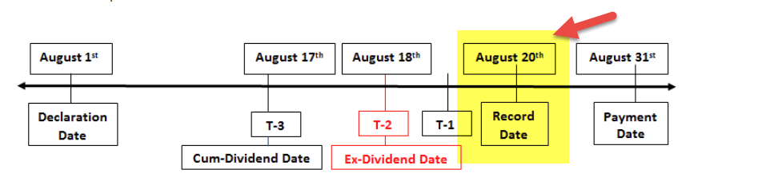

In the world of finance, dividends, stock record dates, long call options, and algorithmic trading are key elements that can significantly enhance an investor's strategic approach. Dividends, which are distributions of a corporation's earnings to its shareholders, play a crucial role in determining stock valuation and influence investment strategies. To benefit from dividends, investors need to comprehend the timing and eligibility rules, primarily dictated by the stock record date. The ex-dividend date, which precedes the record date, is the deadline by which investors must own shares to qualify for dividends.

Furthermore, dividends have a direct impact on options, particularly on their pricing, as the approach of an ex-dividend date typically influences market behavior. Long call options, offering the right to purchase a stock at a specified price before a certain expiration date, can be a strategic tool when managing dividend-related stock movements. Investors need to assess whether to exercise these options before the ex-dividend date to capture potential dividend benefits. 



Algorithmic trading represents an advanced method to optimize trading strategies amid dividend-related stock fluctuations. By using sophisticated algorithms, trades can be executed with speed and precision to take advantage of favorable market conditions such as price changes or volatility spikes associated with dividend events. Implementing algorithmic trading methods allows for enhanced timing and execution, contributing to improved overall trading outcomes.

This article will explore these critical relationships and provide insights into effectively leveraging dividends, options, and trading strategies to maximize investment returns.

## Table of Contents

## Understanding Dividend Entitlement and Stock Record Dates

A dividend is a distribution of a portion of a corporation's earnings to its shareholders, representing a reward for their investment in the company. These payouts can be issued in the form of cash, additional shares, or other property. Understanding when one is entitled to receive a dividend involves comprehending key dates associated with the dividend distribution process. 

The stock record date plays a critical role in determining shareholder eligibility for receiving dividends. It is the date set by a corporation to identify the shareholders entitled to the declared dividend. To be eligible for a dividend, an investor must be listed as a shareholder in the company’s records as of the close of business on the record date. 

However, there is an important date preceding the record date that investors must bear in mind: the ex-dividend date. The ex-dividend date is typically set one business day before the record date. Investors must own the stock before the ex-dividend date to receive the upcoming dividend, as it is on this date that the stock begins trading without the right to receive the dividend. For example, if the record date is on a Thursday, the ex-dividend date is usually on the preceding Wednesday. This time frame is necessitated by the T+2 settlement period in most stock exchanges, which is the time it takes for a stock transaction to be settled.

This timing ensures that the transfer of stock ownership is completed by the record date. Investors acquiring the stock on or after the ex-dividend date will not qualify for the dividend, as they will not be recorded as shareholders by the record date. This schedule can be represented as:

$$
\text{Ex-Dividend Date} = \text{Record Date} - 1 \text{ Business Day}
$$

Understanding these dates is crucial for investors to make informed decisions, especially for those employing strategies to maximize returns from dividend distributions.

## Impact of Dividends on Options Pricing

Dividends play a crucial role in the pricing of options, particularly influencing call and put options differently as the ex-dividend date approaches. Generally, when a company pays a dividend, it reduces the stock price by the dividend amount. This anticipated decrease in stock price tends to lead call options to lose value before the ex-dividend date. Put options may, conversely, gain value due to the expected drop in stock price post-dividend payout.

For options traders, this dynamic offers both challenges and opportunities. Call options, especially American-style options, which can be exercised at any point before expiration, may become less attractive as the likelihood of an exercise profit diminishes with the approaching ex-dividend date. As a strategy, traders often opt to exercise American call options before this date to capture the dividend and mitigate potential losses from a decline in the option's value. This exercise is effective if the expected drop in the stock price due to the dividend exceeds the time value lost by exercising early.

Options pricing can typically be modeled by the Black-Scholes formula, adjusted for dividends. The formula for a call option price $C$ that accounts for dividends is:

$$
C = S_0e^{-qT}N(d_1) - Xe^{-rT}N(d_2)
$$

where:
- $S_0$ is the current stock price,
- $X$ is the strike price,
- $T$ is the time to expiration,
- $r$ is the risk-free interest rate,
- $q$ is the dividend yield,
- $N(\cdot)$ is the cumulative distribution function of the standard normal distribution,
- $d_1$ and $d_2$ are calculated as:

$$
d_1 = \frac{\ln(S_0/X) + (r - q + \sigma^2/2)T}{\sigma\sqrt{T}}
$$

$$
d_2 = d_1 - \sigma\sqrt{T}
$$

Here, $\sigma$ represents stock [volatility](/wiki/volatility-trading-strategies). This model illustrates how the dividend yield $q$ impacts call option pricing, reducing it further as $q$ increases.

Strategically, options traders might adopt several approaches to leverage dividend-driven price movements. Beyond early exercise, they might explore dividend capture strategies involving both call and put options. Additionally, they benefit from understanding implied volatility changes around dividend periods, which can influence option pricing and provide further trading insights. By anticipating these shifts and price adjustments, adept options traders can effectively use dividends to enhance their trading outcomes and achieve better risk-adjusted returns.

## Long Call Options and Dividend Strategies

A long call option grants an investor the ability to buy a stock at a predetermined price, known as the strike price, before or on the expiration date. This type of option provides potential for significant profit if the stock price rises above the strike price. However, when it comes to capitalizing on dividends, the timing of exercising these options is critical.

Investors looking to benefit from dividends must be aware that they generally need to exercise their long call options prior to the ex-dividend date. This is because only holders of the underlying stock on the ex-dividend date are eligible to receive the dividend. Exercising the call option before this date ensures that the investor becomes a shareholder of record, thus qualifying for the dividend payout.

**Covered Call Strategy**: One straightforward strategy to maximize gains involves employing covered calls. In this scenario, an investor holds a long position in the underlying stock and sells a call option on the same stock. This approach allows the investor to earn premium income from selling the call option while still capturing any dividends paid on the underlying stock. The strategy can mitigate risk by generating additional income, but it also caps potential gains if the stock price exceeds the strike price of the sold call option.

**Dividend Arbitrage Strategy**: Another sophisticated approach is dividend arbitrage, which seeks to exploit discrepancies in pricing due to dividend-related movements. This can involve taking simultaneous positions in derivative products like options and the underlying stock to capture the value of upcoming dividends without holding the stock through to the payment date. The strategy typically involves buying calls, selling puts, and shorting the stock around the ex-dividend date. Calculating the breakeven point of this strategy is crucial and involves understanding the implied volatility and expected dividend payouts.

For those engaging in these strategies, recognizing how dividends affect the pricing of options is essential. Normally, call options tend to lose value as the ex-dividend date approaches due to the anticipation of a drop in the stock price after the dividend is paid. This is reflected in the option's pricing models, such as the Black-Scholes model, which may need adjustments to account for expected dividends.

Overall, by employing long call options and related strategies, investors can potentially enhance their earnings from dividend-related stock movements. The successful execution of these strategies relies on precise timing and a deep understanding of the underlying market dynamics and option performance relative to dividends.

## Algorithmic Trading: Enhancing Dividend Strategies

Algorithmic trading utilizes advanced computational algorithms to execute trades with speed and precision, offering a unique advantage in capturing opportunities around dividend events. These algorithms are designed to manage large volumes of data and make decisions based on pre-set criteria, which is particularly advantageous when examining market behaviors around dividend events, such as ex-dividend dates.

One of the primary ways [algorithmic trading](/wiki/algorithmic-trading) enhances dividend strategies is through identifying patterns and trends around these events. By analyzing historical price data, algorithms can recognize typical behavior such as price drops after the ex-dividend date or heightened volatility leading to this date. For instance, stocks often experience a decrease in price approximately equivalent to the dividend amount on the ex-dividend date. Algorithms can be structured to detect these predictable movements, enabling traders to anticipate and respond effectively.

Algorithms can also monitor multiple securities simultaneously, optimizing the timing for order placements to capitalize on the anticipated price shifts. Consider a scenario where a stock price is expected to decline by the dividend amount on the ex-dividend date:

```python
import numpy as np

# Hypothetical stock parameters
initial_price = 100
dividend = 5
volatility = 0.2
num_simulations = 10000

# Simulating price movements
def simulate_dividend_impact(initial_price, dividend, volatility, days=1):
    daily_return = np.random.normal(0, volatility, num_simulations)
    price_change = initial_price * (1 + daily_return) - dividend
    return price_change

simulated_prices = simulate_dividend_impact(initial_price, dividend, volatility)
expected_price_after_dividend = np.mean(simulated_prices)
print(f"Expected price after dividend: {expected_price_after_dividend}")
```

This simulation helps determine the expected post-dividend stock price, allowing the trader to decide whether to buy, sell, or hold the stock or its derivatives based on the algorithm's output.

Furthermore, algorithms can adapt to market conditions by incorporating [machine learning](/wiki/machine-learning) techniques. These systems learn from new data, adjusting strategies in real-time to refine predictions and enhance execution efficiency. This adaptability is crucial in volatile markets where dividend-announced stocks might experience sudden price fluctuations. 

Incorporating trading algorithms not only improves the speed of transactions but also minimizes errors commonly associated with manual trading. By providing consistent execution, traders are better positioned to achieve optimal results, enhancing overall portfolio performance. The strategic integration of algorithmic trading in dividend-related strategies enables a systematic approach to exploiting market inefficiencies, thus potentially increasing returns while managing risk.

## Conclusion

Understanding the relationships between dividends, stock record dates, options, and trading strategies is crucial for maximizing investment returns. Dividends, inherently tied to company earnings, influence stock prices and options' value; thus, recognizing their impact enables investors to align their strategies accordingly. The stock record date determines dividend eligibility, emphasizing the importance of precise timing and informed decision-making. Options, particularly long call options, offer avenues for strategic advantage, although they require a keen understanding of market movements and dividend-related dynamics.

Algorithmic trading, with its computational power and speed, enhances the ability to effectively capitalize on these dynamics. By deploying sophisticated algorithms, investors can automate the identification of optimal trading conditions, such as those surrounding ex-dividend dates. This technological edge facilitates more precise and effective trades, potentially increasing profitability through improved timing and execution.

Informed decision-making, underpinned by a thorough understanding of these financial elements, remains essential. Continual education and market analysis are the pillars upon which investors can build resilient strategies. By staying informed, adapting to market changes, and leveraging the power of technology, investors position themselves to optimize their portfolios and achieve sustained financial success. Through such comprehensive strategies, the intricate web binding dividends, record dates, options, and trading methodologies can be navigated effectively, transforming potential market challenges into opportunities for growth.

## References & Further Reading

[1]: Hull, J. C. (2014). ["Options, Futures, and Other Derivatives."](https://www.amazon.com/Options-Futures-Other-Derivatives-9th/dp/0133456315) Pearson Education.

[2]: Black, F., & Scholes, M. (1973). ["The Pricing of Options and Corporate Liabilities."](https://www.cs.princeton.edu/courses/archive/fall09/cos323/papers/black_scholes73.pdf) Journal of Political Economy, 81(3), 637-654.

[3]: Sharpe, W. F., Alexander, G. J., & Bailey, J. V. (1999). ["Investments."](https://archive.org/details/investments0000shar) Prentice Hall.

[4]: Hull, J. C. (2017). ["Risk Management and Financial Institutions."](https://www.amazon.com/Management-Financial-Institutions-Wiley-Finance/dp/1119932483) Wiley.

[5]: Haug, E. G. (2007). ["The Complete Guide to Option Pricing Formulas."](https://www.amazon.com/Complete-Guide-Option-Pricing-Formulas/dp/0071389970) McGraw-Hill Education.