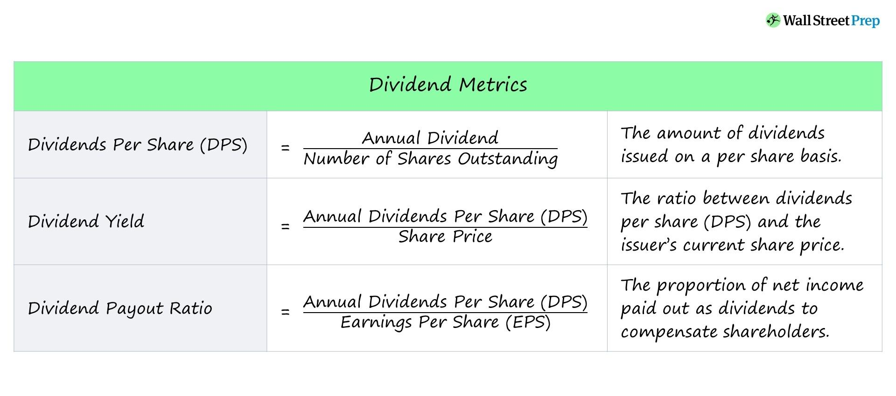

## Table of Contents

## What is a dividend?

A dividend is money that a company pays to its shareholders. It's like a reward for owning part of the company. When a company makes a profit, it can choose to share some of that profit with its shareholders by giving them dividends. Shareholders usually get these payments a few times a year, depending on what the company decides.

Not all companies pay dividends. Some companies, especially newer ones, might use all their profits to grow the business instead of paying dividends. Companies that do pay dividends often do so regularly, which can make them attractive to investors looking for a steady income from their investments. The amount of the dividend can change, and companies can also decide to stop paying dividends if they need to keep more money for other purposes.

## What does it mean to short sell a stock?

Short selling a stock means borrowing shares from someone else, selling those shares right away, and hoping to buy them back later at a lower price. When you short sell, you're betting that the stock's price will go down. If it does, you can buy the shares back cheaper than you sold them, return the borrowed shares, and keep the difference as profit.

But short selling can be risky. If the stock price goes up instead of down, you could lose money. You'll have to buy back the shares at the higher price to return them, which means you'll lose the difference. Also, there's no limit to how much you could lose because a stock's price can keep going up without a cap. That's why short selling is considered more advanced and riskier than just buying and holding stocks.

## How does dividend entitlement work for long shareholders?

When you own a stock for a long time, you get to enjoy the dividends the company pays out. To get a dividend, you need to own the stock on a specific date called the "record date." If you own the stock on this date, the company will send you a dividend payment on the "payment date." This means long-term shareholders can keep getting dividends as long as they keep owning the stock and the company keeps paying them.

Sometimes, companies change how much they pay in dividends. They might increase the dividend if they're doing well and making more money, or they might decrease it if they need to save money for other things. Long-term shareholders need to keep an eye on these changes because they can affect how much money they get from their investments. Even if the dividend amount changes, as long as you own the stock on the record date, you'll get whatever dividend is paid out at that time.

## Do short sellers receive dividends?

Short sellers do not receive dividends. When you short sell a stock, you borrow shares from someone else and sell them. If the company pays a dividend during the time you're holding the short position, you have to pay that dividend to the person you borrowed the shares from. This is because the person who lent you the shares is still entitled to the dividend, even though you're the one holding the short position.

This can make short selling even riskier. Not only do you have to worry about the stock price going up, but you also have to pay any dividends that come due while you're short. This extra cost can eat into your potential profits or increase your losses if the stock price doesn't go down as you hoped.

## What is the process of dividend payment for short sellers?

When a company pays a dividend, short sellers don't get to keep it. Instead, they have to pay the dividend to the person they borrowed the shares from. This happens because the person who lent the shares is still the real owner and should get the dividend. So, if you're short selling and the company announces a dividend, you'll have to give that money to the lender.

This process can make short selling more complicated and risky. If you're holding a short position and a dividend is paid, you'll need to come up with the money to cover the dividend payment. This can cut into your profits or increase your losses, especially if the stock price doesn't go down as you expected. It's an important thing to think about before deciding to short sell a stock.

## How does short selling affect the dividend payout to the original shareholder?

When someone short sells a stock, they borrow shares from the original shareholder and sell them. Even though the shares are sold, the original shareholder still owns them and should get the dividend. So, the short seller has to pay the dividend to the original shareholder. This means the original shareholder gets the dividend they were supposed to get, even if their shares are being used in a short sale.

The process doesn't change the dividend payout for the original shareholder. They still get the same amount of money they would have gotten if their shares weren't borrowed. The short seller just acts as a middleman, making sure the dividend goes to the right person. This way, the original shareholder's dividend is protected, and they don't lose out because of the short sale.

## What are the tax implications for short sellers regarding dividends?

When you short sell a stock and a dividend is paid, you have to pay the dividend to the person you borrowed the shares from. This payment is not considered income for you as the short seller. Instead, it's seen as a cost of doing the short sale. You can't deduct this payment from your taxes as an expense because it's considered a return of capital to the original shareholder.

For the original shareholder, the dividend they receive, even if it comes from the short seller, is still treated as dividend income. They have to report it on their taxes and pay any taxes due on it, just like they would if they received the dividend directly from the company. So, the tax situation stays the same for the original shareholder, but the short seller has to deal with the cost of the dividend without any tax benefits.

## How can short sellers manage dividend risk?

Short sellers can manage dividend risk by keeping an eye on when companies might pay dividends. If a company usually pays dividends at certain times of the year, short sellers can plan around those dates. They might choose to close their short position before the dividend is paid to avoid having to pay it to the person they borrowed the shares from. This way, they don't have to worry about the extra cost of the dividend.

Another way to manage dividend risk is to think about the cost of the dividend when deciding to short sell. If a company pays big dividends, it might not be worth shorting their stock because the dividend payment could eat into any profits or make losses worse. Short sellers can also look for companies that don't pay dividends at all, which would remove the risk of having to pay dividends entirely. By being careful and planning ahead, short sellers can handle the risks that come with dividends.

## What are the differences in dividend treatment between short selling in the U.S. and other countries?

In the U.S., when you short sell a stock and the company pays a dividend, you have to pay that dividend to the person you borrowed the shares from. This is because the original shareholder is still entitled to the dividend, even if their shares are being used in a short sale. The short seller doesn't get to keep the dividend and has to cover the cost, which can make short selling riskier. The tax treatment in the U.S. means the short seller can't deduct the dividend payment as an expense, and the original shareholder still has to pay taxes on the dividend they receive.

In other countries, the rules might be different. For example, in some places, the short seller might not have to pay the dividend to the original shareholder. Instead, the original shareholder might have to wait until the short seller returns the shares to get their dividend. This can change how short sellers plan their trades and manage their risks. Also, tax rules can vary; in some countries, the short seller might be able to deduct the dividend payment as a cost of doing business, which could affect their decision to short sell stocks that pay dividends.

Overall, understanding the local rules about dividends and short selling is important. What works in the U.S. might not work the same way in other countries, so short sellers need to know the specific rules where they are trading. This helps them avoid unexpected costs and manage their investments better.

## How do dividend announcements impact short selling strategies?

When a company announces it will pay a dividend, it can change how short sellers plan their moves. Short sellers need to think about the cost of paying the dividend to the person they borrowed the shares from. If the dividend is big, it might make the short sale less profitable or even lead to bigger losses. So, when a dividend announcement comes, short sellers might decide to close their short position before the dividend is paid out. This way, they don't have to pay the dividend and can avoid that extra cost.

Dividend announcements can also affect which stocks short sellers choose to target. If a company regularly pays high dividends, short sellers might avoid those stocks because of the added risk and cost. On the other hand, if a company doesn't pay dividends, it might be more appealing to short sellers because they won't have to worry about paying dividends. Knowing when dividends will be paid helps short sellers plan their strategies better and decide when it's a good time to start or end a short sale.

## What are the potential legal and regulatory considerations for short sellers concerning dividends?

Short sellers need to be aware of the rules and laws that can affect them when it comes to dividends. In many places, including the U.S., short sellers have to pay any dividends to the person they borrowed the shares from. If they don't do this, they could face legal trouble or fines. Different countries have different rules, so short sellers need to know the laws where they are trading. For example, some places might not make short sellers pay the dividend right away, which can change how they plan their trades.

Regulators also keep an eye on short selling to make sure it's done fairly and doesn't harm the market. They might have rules about how short sellers report their positions or how they handle dividends. Breaking these rules can lead to penalties or even bans from trading. Short sellers need to stay up-to-date with these regulations to avoid any legal issues. Knowing the rules helps them manage their risks and make better decisions about when and how to short sell stocks that pay dividends.

## How can advanced traders use dividend dates to optimize short selling positions?

Advanced traders can use dividend dates to plan their short selling better. They know that if they are short selling a stock and a dividend is coming up, they will have to pay that dividend to the person they borrowed the shares from. To avoid this extra cost, they might close their short position before the dividend is paid. This way, they don't have to pay the dividend and can keep their profits or cut their losses. By keeping track of when dividends are paid, traders can choose the best times to start and end their short sales.

Another way traders can use dividend dates is by [picking](/wiki/asset-class-picking) which stocks to short sell. If a company pays big dividends, traders might avoid shorting that stock because the dividend payment could make the trade less profitable. On the other hand, if a company doesn't pay dividends, it might be a better choice for short selling because there's no risk of having to pay dividends. By understanding when and how much dividends are paid, traders can make smarter choices about which stocks to short sell and when to do it.

## What is Dividend Investing?

Dividend investing is a strategy that focuses on purchasing stocks that regularly distribute dividends to shareholders. These dividends are typically paid in cash or additional shares, providing investors with a stream of passive income. For many investors, dividend investing serves as a cornerstone for building a stable and predictable cash flow, making it a preferred strategy for those seeking passive income or aiming for long-term capital growth.

### Benefits of Dividend Investing

Dividend-paying stocks are often considered less volatile than their non-dividend counterparts, making them attractive to conservative investors. These stocks are typically issued by well-established companies with strong cash flows, contributing to their perceived stability.

### Key Considerations

Several factors should be considered when engaging in dividend investing to ensure the sustainability and profitability of the strategy:

1. **Dividend Yield**: The dividend yield is a critical metric that represents the annual dividend payment as a percentage of the stock price. It is calculated as:
$$
   \text{Dividend Yield} = \frac{\text{Annual Dividends per Share}}{\text{Price per Share}} \times 100

$$

   While a high dividend yield may seem attractive, it is important to assess the reasons behind it, as an unusually high yield may indicate financial distress or an unsustainable dividend policy.

2. **Payout Ratio**: This ratio measures the proportion of earnings paid out as dividends to shareholders. Lower payout ratios suggest that a company is retaining more earnings for growth, while higher ratios may indicate less room to maintain dividends during economic downturns. The payout ratio is typically calculated as:
$$
   \text{Payout Ratio} = \frac{\text{Dividends per Share}}{\text{Earnings per Share}} \times 100

$$

3. **Company’s Financial Health**: Assessing a company's ability to sustain and grow its dividends over time is crucial. This involves examining financial statements, cash flow stability, debt levels, and the company's business model resilience.

4. **Dividend Growth Rate**: The rate at which a company increases its dividends is an indicator of financial health and management's commitment to returning value to shareholders. A consistent dividend growth rate can be a sign of a company's robust financial performance and future prospects.

### Strategy Implementation

Investors implementing a dividend investing strategy might consider constructing a diversified portfolio of dividend-paying stocks across various industries to mitigate sector-specific risks. Additionally, reinvesting dividends through a Dividend Reinvestment Plan (DRIP) can compound returns over time, enhancing long-term capital growth.

In summary, dividend investing can be a powerful method for generating income and accumulating wealth, provided investors diligently evaluate the sustainability of dividend yields and the financial health of potential investments.

## What is Short Selling?

Short selling is an advanced investment strategy utilized by investors intending to benefit from the anticipated decline in a stock's price. This process begins by borrowing shares from a broker, typically in exchange for a fee, and then selling them at the prevailing market price. The objective behind this maneuver is to repurchase these shares later at a reduced price, thus profiting from the price differential. The net profit from a short sale is calculated as follows:

$$
\text{Profit} = (\text{Sell Price} - \text{Buy Back Price}) \times \text{Number of Shares} - \text{Borrowing Fee}
$$

Despite its potential for significant returns, short selling is inherently risky and primarily suited for investors with a comprehensive understanding of market dynamics. One of the key risks short sellers face is the theoretical possibility of unlimited losses. Unlike conventional stock purchases where the maximum loss is limited to the initial investment, a shorted stock's price can rise indefinitely. Consequently, if the stock price surges instead of falling, the short seller must purchase it back at a higher price, leading to losses that can exceed the original sale amount.

A short squeeze is another risk associated with this strategy. It occurs when a heavily shorted stock's price begins to increase sharply, prompting short sellers to buy shares to cover their positions, thereby adding more upward pressure on the stock price. This capitulation can drive stock prices even higher and further exacerbate losses for short sellers.

The practice of short selling requires access to a margin account since it involves borrowing shares. The use of margin introduces additional risks, such as margin calls. A margin call occurs when the value of the investor's margin account falls below the broker's required amount. In this scenario, the short seller might be compelled to add more funds to the account or cover the short position, often at an inopportune time.

Short selling plays a pivotal role in maintaining market efficiency by enabling [liquidity](/wiki/liquidity-risk-premium) and helping price discovery. However, due to its complexities and potential consequences, this strategy is often favored by seasoned investors who possess an in-depth knowledge of financial markets and the ability to mitigate associated risks.

## References & Further Reading

[1]: ["The Power of Dividends"](https://www.hartfordfunds.com/insights/market-perspectives/equity/the-power-of-dividends.html) by Paul L. Bernstein.

[2]: Aldridge, I. (2013). ["High-Frequency Trading: A Practical Guide to Algorithmic Strategies and Trading Systems"](https://www.amazon.com/High-Frequency-Trading-Practical-Algorithmic-Strategies/dp/1118343506).

[3]: ["The Essentials of Trading: From the Basics to Building a Winning Strategy"](https://www.amazon.com/Essentials-Trading-Building-Winning-Strategy/dp/047179063X) by John Forman.

[4]: Chan, E. (2009). ["Quantitative Trading: How to Build Your Own Algorithmic Trading Business"](https://github.com/ftvision/quant_trading_echan_book).

[5]: ["Machine Learning for Algorithmic Trading"](https://github.com/stefan-jansen/machine-learning-for-trading) by Stefan Jansen.