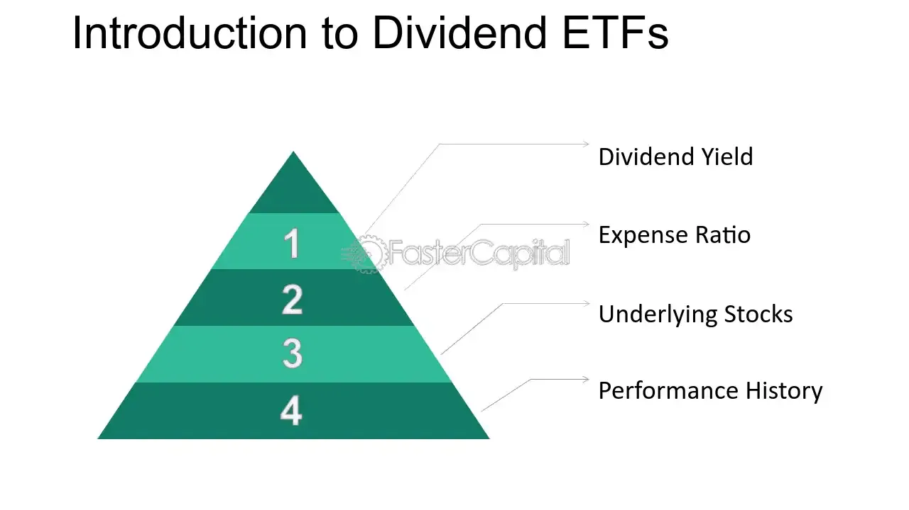

## Table of Contents

## What is a dividend ETF?

A dividend ETF, or Exchange-Traded Fund, is a type of investment fund that holds a collection of stocks that pay dividends. Dividends are payments made by a company to its shareholders, usually from its profits. A dividend ETF aims to provide investors with a steady stream of income by investing in companies known for paying regular dividends. This can be attractive for people looking to earn money from their investments without selling their shares.

These ETFs are traded on stock exchanges, just like individual stocks, which makes them easy to buy and sell. They often track a specific index of dividend-paying companies, such as the S&P 500 Dividend Aristocrats, which includes companies that have consistently increased their dividends over many years. By investing in a dividend ETF, you get the benefit of diversification, as your money is spread across many different companies, reducing the risk compared to owning just one or a few stocks.

## How does a dividend ETF work?

A dividend ETF works by pooling money from many investors to buy a collection of stocks that pay dividends. These dividends are payments made by companies to their shareholders, usually from their profits. The ETF then collects these dividends from all the different companies it owns and typically distributes them to its own shareholders on a regular basis, like monthly or quarterly. This gives investors a steady stream of income without needing to sell their shares in the ETF.

The value of the ETF can also go up or down based on how well the stocks it holds are doing. If the companies in the ETF do well, the price of the ETF might go up, and if they don't do well, the price might go down. Investors can buy and sell shares of the ETF on a stock exchange, just like they would with individual stocks. This makes it easy to get in and out of the investment. By owning a dividend ETF, investors get the benefits of diversification, as their money is spread across many different companies, which can help reduce risk.

## What are the benefits of investing in dividend ETFs?

Investing in dividend ETFs can provide you with a regular income. This is because the ETF holds stocks that pay dividends, and these dividends are then passed on to you. This can be a good way to earn money without having to sell your shares. It's like getting paid just for owning the ETF, which can be especially helpful if you're looking for a steady income stream, like during retirement.

Another benefit is that dividend ETFs can help spread out your risk. Instead of putting all your money into one or two stocks, you're investing in a whole bunch of different companies. This diversification means that if one company doesn't do well, it won't hurt your investment as much because the others might still be doing okay. Plus, dividend ETFs are easy to buy and sell because they trade on stock exchanges, just like regular stocks.

Lastly, companies that pay regular dividends are often financially stable and well-managed. By investing in a dividend ETF, you're focusing on these kinds of companies. Over time, this can lead to steady growth in both the value of your ETF and the dividends you receive, helping your investment grow more reliably.

## What are the risks associated with dividend ETFs?

Investing in dividend ETFs can be risky because the value of the ETF can go up and down. If the companies in the ETF don't do well, the price of the ETF might drop. This means you could lose money if you need to sell your shares when the price is low. Also, even though dividend ETFs focus on companies that pay dividends, there's no guarantee that these companies will keep paying them. If a company cuts or stops its dividend, the income you get from the ETF could go down.

Another risk is that dividend ETFs might not grow as fast as other types of investments. Companies that pay big dividends might not have as much money left to grow their business, so their stock prices might not go up as quickly as companies that reinvest their profits. This means that over time, a dividend ETF might not give you as much growth as other investments. It's important to think about what you want from your investments - steady income or fast growth - when deciding if a dividend ETF is right for you.

## How are dividends distributed in a dividend ETF?

Dividends in a dividend ETF come from the companies that the ETF owns. These companies pay dividends to the ETF, and then the ETF collects all these dividends. The ETF usually pays out these dividends to its own shareholders on a regular schedule, like once a month or every three months. This means if you own shares in the ETF, you get a part of the total dividends the ETF has collected, based on how many shares you own.

The exact amount of dividends you get can change. It depends on how well the companies in the ETF are doing and how much they decide to pay out. Sometimes, a company might decide to pay less or even stop paying dividends, which would mean the ETF has less money to give to its shareholders. But overall, a dividend ETF tries to give you a steady stream of income from the dividends it collects.

## What factors should be considered when choosing a dividend ETF?

When picking a dividend ETF, it's important to look at the dividend yield. This is how much money you get back from your investment as dividends each year, shown as a percentage. A higher yield can mean more income for you, but be careful. A very high yield might mean the ETF is risky because the companies it holds might not be doing well. You should also check the expense ratio, which is how much it costs to own the ETF. Lower costs are better because they leave more money in your pocket.

Another thing to consider is the track record of the companies in the ETF. Look for ETFs that hold companies with a history of paying and even increasing their dividends over time. These are often more stable and can give you a more reliable income. Also, think about how the ETF is diversified. A good ETF should have a mix of different companies from different industries. This can help spread out your risk and make your investment safer.

Lastly, consider your own goals. If you need regular income, a dividend ETF might be a good choice. But if you're looking for your investment to grow a lot over time, you might want to look at other options too. It's all about finding the right balance between income and growth that fits what you want from your investment.

## How do dividend ETFs compare to individual dividend stocks?

Dividend ETFs and individual dividend stocks both give you money from dividends, but they work a bit differently. When you buy a dividend ETF, you're investing in a bunch of different companies all at once. This means if one company doesn't do well, it won't hurt your investment as much because the others might still be doing okay. This spreading out of risk is called diversification. On the other hand, if you buy individual dividend stocks, you're putting all your money into just one company. If that company does badly, your investment could lose a lot of value.

Another difference is how easy it is to buy and sell them. Dividend ETFs trade on stock exchanges, just like regular stocks, so you can buy and sell them easily whenever the market is open. This makes it simple to get in and out of your investment. With individual stocks, you still buy and sell on the stock exchange, but you have to pick each company carefully. This can take more time and research because you need to make sure each company is a good investment. Also, ETFs usually have lower costs because they're managed in a way that spreads the expenses over many investors.

## What is the expense ratio of a dividend ETF and how does it impact returns?

The expense ratio of a dividend ETF is a fee that the ETF charges to cover its operating costs. It's shown as a percentage of the ETF's total assets. For example, if an ETF has an expense ratio of 0.5%, it means you'll pay $0.50 every year for every $100 you have invested in the ETF. This fee is taken out of the ETF's assets, so it reduces the total return you get from your investment.

The expense ratio can have a big impact on your returns over time. Even a small difference in the expense ratio can add up to a lot of money, especially if you're investing for many years. For example, if one ETF has an expense ratio of 0.2% and another has 0.5%, the one with the lower fee will leave more money in your pocket over time. So, when choosing a dividend ETF, it's a good idea to look for one with a lower expense ratio to keep more of your investment returns.

## How can dividend ETFs be used in a diversified investment portfolio?

Dividend ETFs can be a great way to add diversity to your investment portfolio. When you invest in a dividend ETF, you're buying into a bunch of different companies all at once. This means you're not putting all your eggs in one basket. If one company doesn't do well, it won't hurt your investment as much because the others might still be doing okay. This spreading out of risk helps make your overall portfolio safer. Plus, since dividend ETFs focus on companies that pay dividends, they can give you a steady stream of income, which is good if you're looking for regular money coming in.

You can use dividend ETFs alongside other types of investments to build a well-rounded portfolio. For example, you might have some money in growth stocks, which are companies that are growing fast but might not pay dividends. You could also have some in bonds, which are usually safer but might not grow as much. Adding a dividend ETF can balance out these other investments by giving you both income and some growth. This way, you're not relying on just one type of investment to meet all your needs. It's like having a mix of different foods in your diet to stay healthy and strong.

## What are some popular dividend ETFs available in the market?

Some popular dividend ETFs include the Vanguard Dividend Appreciation ETF (VIG) and the Schwab U.S. Dividend Equity ETF (SCHD). The Vanguard Dividend Appreciation ETF focuses on companies that have a history of increasing their dividends over time. This makes it a good choice if you're looking for steady growth in your dividend income. The Schwab U.S. Dividend Equity ETF, on the other hand, aims to provide a high dividend yield while still focusing on companies that are financially healthy. Both of these ETFs are well-known and can be a good starting point if you're new to investing in dividend ETFs.

Another popular option is the iShares Select Dividend ETF (DVY). This ETF targets companies that have paid above-average dividends for a long time. It's a bit different because it focuses more on the current dividend yield rather than growth. This can be good if you want a higher income right away. All these ETFs are traded on major stock exchanges, so they're easy to buy and sell. They also have different expense ratios, so it's a good idea to compare them and see which one fits best with your investment goals and how much you're willing to pay in fees.

## How do tax considerations affect investments in dividend ETFs?

When you invest in dividend ETFs, you need to think about taxes. The money you get from dividends is usually taxed as income. This means you'll have to pay taxes on it every year, even if you don't sell your shares in the ETF. The tax rate you pay depends on your income and the type of dividends. Some dividends are qualified and get a lower tax rate, while others are non-qualified and get taxed at your regular income tax rate. It's important to know the difference because it can affect how much money you keep after taxes.

Another thing to consider is that if you sell your shares in a dividend ETF for more than you paid for them, you'll have to pay capital gains tax. This tax is on the profit you make from selling the shares. If you hold the shares for more than a year before selling, you'll pay a long-term capital gains tax, which is usually lower than the short-term rate you'd pay if you sold them sooner. To manage your taxes better, you might want to hold your dividend ETFs in tax-advantaged accounts like IRAs or 401(k)s, where you can delay paying taxes on your dividends and gains until you take the money out.

## What advanced strategies can be employed with dividend ETFs for income generation?

One advanced strategy for using dividend ETFs to generate income is called dividend reinvestment. Instead of taking the dividend money as cash, you can use it to buy more shares of the ETF. Over time, this can help your investment grow bigger because you're getting more shares without spending extra money. As you own more shares, you get more dividends, which you can then reinvest again. This cycle can lead to a lot more income in the long run, especially if the ETF's value goes up too.

Another strategy is to use a covered call strategy with your dividend ETF. This means you own the ETF and also sell call options on it. A call option gives someone else the right to buy your ETF shares at a certain price before a certain date. You get paid for selling the option, which can add to your income. If the ETF's price stays below the option's price, you keep the ETF and the money from the option. If the price goes above, you might have to sell your shares, but you still keep the option money and the dividends you've earned up to that point. This can be a bit trickier and riskier, so it's something to think about carefully.

## How do AI and Machine Learning transform ETF investments?

Artificial Intelligence (AI) and Machine Learning (ML) have emerged as pivotal tools in the modernization of investment strategies, particularly in the management of Exchange-Traded Funds (ETFs). These technologies enhance algorithmic trading strategies by employing data-driven insights to optimize decision-making processes in the volatile financial markets.

Firstly, AI-driven insights play a crucial role in predicting market trends, a fundamental aspect of ETF management. Through the analysis of historical data and real-time information, AI systems can identify patterns and anomalies that humans may overlook. For instance, [machine learning](/wiki/machine-learning) algorithms can process vast datasets at high speeds to detect subtle correlations and market signals that inform buy, hold, or sell decisions. These predictions are achieved through supervised learning models, where algorithms are trained on historical price movements and market indicators to forecast future prices.

Mathematically, a simple predictive model might use a linear regression algorithm, where the future price of an ETF $P_t$ could be estimated using a formula such as:

$$
P_t = \beta_0 + \beta_1 X_1 + \beta_2 X_2 + \ldots + \beta_n X_n + \varepsilon
$$

Here, $\beta_0$ is the intercept, $\beta_1, \beta_2, \ldots, \beta_n$ are the coefficients of the predictor variables $X_1, X_2, \ldots, X_n$, and $\varepsilon$ represents the error term.

Moreover, AI applications are instrumental in monitoring market conditions and optimizing trading algorithms. With [reinforcement learning](/wiki/reinforcement-learning), a subfield of AI, systems can learn optimal trading strategies by simulating various market scenarios. Reinforcement learning models evaluate successful actions to maximize a specific reward, such as return on investment, under different market conditions. This approach is particularly useful for ETFs, which require adaptive strategies due to their sensitivity to market fluctuations.

A practical implementation using Python might involve the use of libraries such as TensorFlow or PyTorch to construct neural networks for these tasks. Below is a simplified code snippet illustrating how a [neural network](/wiki/neural-network) might be initialized for predicting ETF prices:

```python
import tensorflow as tf
from tensorflow.keras.models import Sequential
from tensorflow.keras.layers import Dense

# Initialize the neural network
model = Sequential([
    Dense(units=64, activation='relu', input_shape=(input_dim,)),
    Dense(units=64, activation='relu'),
    Dense(units=1)  # Output layer for regression
])

# Compile the model
model.compile(optimizer='adam', loss='mean_squared_error')

# Summary of the model
model.summary()
```

This network would be trained on features such as historical prices, trading volumes, and macroeconomic indicators to predict future ETF prices.

In conclusion, AI and ML are not only transforming ETF investment strategies but also ensuring that these investments are more responsive and adaptive to market conditions. By leveraging machine learning techniques, ETF managers can achieve more precise market predictions and implement sophisticated trading strategies that were previously unattainable through traditional methods. These advancements are making ETF investments smarter and more efficient, promising enhanced returns and reduced risks for investors.

## References & Further Reading

[1]: Bergstra, J., Bardenet, R., Bengio, Y., & Kégl, B. (2011). ["Algorithms for Hyper-Parameter Optimization."](https://papers.nips.cc/paper/4443-algorithms-for-hyper-parameter-optimization) Advances in Neural Information Processing Systems 24.

[2]: ["Advances in Financial Machine Learning"](https://www.amazon.com/Advances-Financial-Machine-Learning-Marcos/dp/1119482089) by Marcos Lopez de Prado

[3]: ["Evidence-Based Technical Analysis: Applying the Scientific Method and Statistical Inference to Trading Signals"](https://www.amazon.com/Evidence-Based-Technical-Analysis-Scientific-Statistical/dp/0470008741) by David Aronson

[4]: ["Machine Learning for Algorithmic Trading"](https://github.com/stefan-jansen/machine-learning-for-trading) by Stefan Jansen

[5]: ["Quantitative Trading: How to Build Your Own Algorithmic Trading Business"](https://www.amazon.com/Quantitative-Trading-Build-Algorithmic-Business/dp/1119800064) by Ernest P. Chan