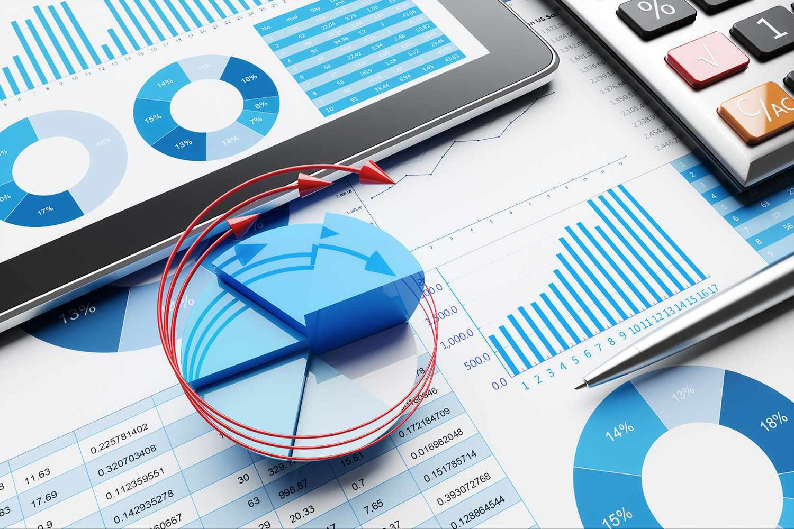

Dividend payments represent a crucial component of many investment strategies, offering investors a source of regular income and potentially enhancing portfolio stability. Dividends, paid by companies to their shareholders, can take various forms, including cash or stock dividends. These distributions serve as a testament to a company's profitability and financial health, thereby influencing an investor's decision to purchase or retain shares. A consistent dividend policy may signal stability and a company's strength, making dividend-paying stocks attractive to many investors.

Dividend frequency plays a significant role in shaping an investor's decision-making process. Companies may choose from various dividend schedules, such as monthly, quarterly, biannual, or annual payments. The chosen frequency directly impacts an investor’s cash flow, thereby affecting investment planning and liquidity management. Higher frequency dividend payments can provide more regular income streams, potentially matching the cash flow needs of investors more closely and contributing positively to investment performance metrics such as dividend yield.



Algorithmic trading, a sophisticated method of executing trades using pre-set rules and computational algorithms, has gained prominence in the context of dividend investing. This approach leverages technology to optimize trading strategies, enhance the precision of dividend capture, and minimize manual intervention. Algorithmic trading systems incorporate complex financial models and data analytics to identify lucrative opportunities tied to dividend payments of different frequencies, thereby maximizing returns and efficiency.

The objective of this article is to examine the interaction between dividend payments, their frequency, and the potential benefits derived from algorithmic trading strategies. By exploring this synergy, the article aims to provide insights into how investors can strategically leverage these elements to enhance their investment strategies, optimize income generation, and manage risks effectively.

## Table of Contents

## Understanding Dividend Payments

Dividend payments represent a portion of a company's earnings distributed to its shareholders and serve as a key component in an investor's portfolio, playing a vital role in income generation and reflecting a company's financial health. There are primarily two types of dividends: cash dividends and stock dividends. Cash dividends involve the distribution of a specific amount of money per share held by shareholders, while stock dividends provide shareholders with additional shares of the company's stock, usually proportional to the number of shares already owned.

Several critical dates structure the dividend payment process:

1. **Declaration Date**: The declaration date is when a company's board of directors announces the intention to pay a dividend. On this day, the dividend amount, the ex-dividend date, the record date, and the payment date are specified.

2. **Ex-Dividend Date**: The ex-dividend date is typically set one business day before the record date. To qualify for the dividend, investors must purchase the stock before this date. After the ex-dividend date, the stock is traded without the pending dividend payout, often resulting in a price reduction approximately equal to the dividend amount.

3. **Record Date**: On the record date, the company reviews its records to determine the shareholders eligible to receive the dividend. Only those who own the stock as of the close of business on this date will be entitled to the dividend.

4. **Payment Date**: This is the date on which the dividend is actually paid out to shareholders, marking the culmination of the dividend distribution process.

Dividend payments play a critical role in an investor's portfolio by providing a steady income stream, especially valuable in low-interest-rate environments where fixed income yields might be less attractive. They can be reinvested to purchase more shares of the issuing company, commonly known as a dividend reinvestment plan (DRIP), which offers a way to compound returns over time.

Regular and stable dividend payments often signal a company's financial health and confidence in its ongoing profitability. Companies with a history of consistent dividends are often viewed as less risky since they demonstrate an ability to generate adequate earnings and cash flow. Such consistency can be indicative of robust business models and sound financial management. However, companies that offer unpredictable or suspended dividend payments might raise concerns among investors regarding future profitability and financial stability.

Understanding these aspects of dividend payments can aid investors in making informed decisions about incorporating dividend-paying stocks into their investment strategies, focusing not only on potential capital gains but also on reliable income generation and the financial stability of the investment.

## Dividend Frequency and Its Impact

Dividend frequency refers to how often a company pays dividends to its shareholders within a fiscal year. The schedules typically include monthly, quarterly, biannual, and annual payments. Understanding these frequencies is crucial for investors who rely on dividend income for cash flow and as part of their overall investment strategy.

**Monthly Dividends**: These are dividends paid every month, providing a steady income stream for investors. Monthly dividends enhance cash flow, making them particularly attractive to retirees or others needing regular income. Companies like Realty Income Corporation (NYSE: O) are well-known for monthly payouts.

**Quarterly Dividends**: This is the most common dividend schedule, where companies distribute profits every three months. It balances regular income with administrative efficiency. Companies such as Apple Inc. (NASDAQ: AAPL) and Microsoft Corporation (NASDAQ: MSFT) follow this schedule.

**Biannual and Annual Dividends**: Less frequent than monthly or quarterly, these dividends are paid twice a year or once a year, respectively. This schedule might appeal to companies with more cyclical cash flow patterns or those preferring to retain earnings for growth. Examples include large multinational corporations and companies in the energy sector that often distribute dividends on an annual basis.

The choice of dividend frequency can significantly impact an investor's cash flow and decision-making. More frequent dividends can lead to a quicker reinvestment cycle, known as the “snowball effect,” where dividends are reinvested to purchase more shares, leading to exponential growth over time. Conversely, receiving dividends less frequently could mean that investors need strategic planning to align cash flow with their personal financial needs.

An essential performance metric influenced by dividend frequency is the dividend yield, calculated as:

$$
\text{Dividend Yield} = \left( \frac{\text{Annual Dividends per Share}}{\text{Price per Share}} \right) \times 100
$$

The timing of dividend payments affects this yield, with more frequent distributions potentially boosting short-term yield attractiveness, especially in stable or declining market conditions.

Several companies demonstrate the impact of varied dividend frequencies on market performance. Realty Income Corporation, with its monthly dividends, is often considered a safe investment, exhibiting lower [volatility](/wiki/volatility-trading-strategies)*. In contrast, tech giant Apple, with quarterly dividends, reflects a balance of capital growth and income, appealing to a broad investor base. Energy companies with annual dividends might display higher volatility, as their payouts are subject to industry cycles and commodity price fluctuations.

These examples illustrate the complexity and strategic importance of dividend frequency in shaping investment portfolios.

## Algorithmic Trading in Dividend Investments

Algorithmic trading, also known as algo trading, involves the use of computer algorithms to execute trades at high speed and frequency, relying on pre-defined criteria and strategies. It has transformed the financial landscape by allowing investors to optimize trading decisions based on complex calculations and vast amounts of data. In the context of dividend investments, algo trading provides a powerful tool for capturing and exploiting dividend payment opportunities.

The primary advantage of using [algorithmic trading](/wiki/algorithmic-trading) strategies in dividend investing is the ability to efficiently capture dividends and enhance portfolio returns. Algorithms can be designed to automatically execute trades around key dividend events, such as the ex-dividend date, ensuring timely entry and [exit](/wiki/exit-strategy) positions to maximize the potential for capturing dividend payouts. This capability is particularly beneficial when dealing with stocks that offer frequent dividends, such as monthly or quarterly payouts, as it allows for efficient cash flow management and maximization of income.

A specific example of an algorithmic strategy for dividend capture is the "Dividend Capture Strategy," which involves purchasing a stock just before its ex-dividend date and selling it shortly after. This approach aims to collect the dividend while minimizing exposure to price fluctuations associated with dividend announcements. In addition, algorithms can consider factors like dividend yield, historical volatility, and [momentum](/wiki/momentum) indicators to refine entry and exit points, thus optimizing returns.

Python has emerged as a preferred programming language for developing algorithmic trading systems due to its simplicity, versatility, and extensive libraries tailored for finance. Libraries like Pandas and NumPy provide powerful data manipulation capabilities, while specialized libraries such as Backtrader and Zipline enable [backtesting](/wiki/backtesting) trading strategies. Here's an example of a simple Python script for a dividend capture strategy, using the Backtrader library:

```python
import backtrader as bt

class DividendCapture(bt.Strategy):
    def __init__(self):
        self.dividends = self.datas[0].dividends

    def next(self):
        if self.dividends[0] > 0:  # Dividend detected
            self.buy(size=100)  # Buy 100 shares

        if len(self) >= self.bar_executed + 3:  # Exit after 3 days
            self.sell(size=100)  # Sell 100 shares

cerebro = bt.Cerebro()
data = bt.feeds.YahooFinanceData(dataname='AAPL', fromdate=datetime(2022, 1, 1), todate=datetime(2022, 12, 31))
cerebro.adddata(data)
cerebro.addstrategy(DividendCapture)
cerebro.run()
```

This script represents a basic dividend capture strategy that buys a stock upon detecting a dividend and sells it after three trading days. In practice, algorithms can be more sophisticated, integrating [machine learning](/wiki/machine-learning) techniques to predict dividend announcements and price movements.

Algorithmic trading strategies also facilitate optimization of dividend payment schedules. For instance, they can help identify optimal holding periods that align with an investor's cash flow needs and tax considerations, thus improving the overall investment efficacy. Such strategic use of algorithms enables better risk management, ensuring that investors capitalize on dividend opportunities while mitigating potential losses.

Overall, the integration of algorithmic trading in dividend investing offers substantial benefits by automating processes, enhancing decision-making, and delivering competitive edge in a fast-paced trading environment.

## The Synergy Between Dividend Frequency and Algo Trading

Combining dividend frequency data with algorithmic trading offers a potent strategy to enhance investment returns. This approach leverages regular income from dividends with the precision of automated trading algorithms, presenting opportunities for optimizing both cash flow and capital appreciation.

### Practical Implementations and Strategies

Algorithmic trading uses computer algorithms to execute trades at high speeds based on predetermined criteria. When integrated with dividend frequency, such strategies can schedule trades around key dividend dates, like the ex-dividend date, to capture dividend payments efficiently. A common technique is the "dividend capture strategy," where shares are purchased just before the ex-dividend date and sold immediately after. This approach, while straightforward, can be optimized further with algorithmic trading to manage timing and execution price precision.

In practice, strategies may vary based on investor goals, such as maximizing yield or maintaining tax efficiency. Python, for example, offers various libraries like Pandas for financial data analysis and Zipline for backtesting trading algorithms. A simple Python script to implement a basic dividend capture strategy may look like this:

```python
import pandas as pd

# Assuming df is a DataFrame containing stock data including ex-dividend dates
def dividend_capture_strategy(df):
    positions = []
    for index, row in df.iterrows():
        if row['ex_dividend_date']:
            positions.append({'buy_date': row['prev_close_date'], 'sell_date': row['next_open_date']})
    return positions

# Example DataFrame structure
df = pd.DataFrame({
    'prev_close_date': ['2023-01-10', '2023-02-10'],
    'next_open_date': ['2023-01-11', '2023-02-11'],
    'ex_dividend_date': [True, False]
})

positions = dividend_capture_strategy(df)
print(positions)
```

### Assessing Risk and Reward Dynamics

While the synergy of dividend frequency and algorithmic trading promises enhanced returns, it is not devoid of risks. High-frequency strategies can incur significant transaction costs and may be sensitive to market volatility. Additionally, the regulatory environment may pose challenges, especially concerning dividend taxation and short-term trading rules.

Investors must weigh the potential for increased returns against the risks of market fluctuations and changes in dividend policies by companies. It's critical to have robust risk management protocols, including stop-loss orders and portfolio diversification, to mitigate these risks.

### Real-World Applications and Case Studies

Several investors and funds have successfully integrated dividend frequency data with algorithmic trading. For instance, high-frequency trading firms often leverage dividend schedules to identify lucrative short-term trading opportunities. In one case study, a [hedge fund](/wiki/hedge-fund-trading-strategies) implemented an algorithm that monitored quarterly dividend announcements, allowing it to adjust its positioning in time to capture competitive yields and optimize returns.

Furthermore, investors have applied machine learning techniques to predict future dividend changes, using historical dividend frequency and company performance data. These techniques can provide actionable insights, boosting the effectiveness of dividend-focused trading strategies.

In summary, the combination of dividend frequency data and algorithmic trading strategies provides a sophisticated method for enhancing investment returns. However, investors should carefully assess the associated risks and develop a comprehensive strategy encompassing both technical and strategic elements for sustainable success.

## Risks and Considerations

High-frequency dividend strategies and algorithmic trading, while offering opportunities for increased returns, also pose various risks. It is essential to recognize these risks and develop strategies to mitigate them.

**Market Volatility and Its Impact**

Market volatility can significantly affect both dividends and algorithmic trades. High-frequency dividend strategies depend on market stability to accurately predict and capture dividends. In volatile markets, stock prices can fluctuate rapidly, affecting the timing and profitability of these strategies. For example, during market turmoil, companies may alter their dividend policies, making it challenging to rely on historical trends for future predictions.

Algorithmic trading systems are particularly vulnerable to sudden market shifts because they execute trades at high speeds based on pre-programmed instructions. These systems can exacerbate market spreads and lead to increased transaction costs or losses if they are not designed to handle rapid changes efficiently.

**Regulatory Compliance and Tax Implications**

Regulatory compliance is crucial for investors engaging in high-frequency trading and dividend strategies. Regulations such as the Dodd-Frank Act and MiFID II impose strict requirements on trading practices to ensure market integrity and protection for retail investors.

Understanding tax implications is equally important. Different jurisdictions have distinct rules regarding dividend taxation, which can affect net returns. For instance, dividends are often subject to withholding tax in the source country, and investors may be eligible for tax credits or deferments. Investors should seek advice from tax professionals to optimize their strategies while maintaining compliance with local and international regulations.

**Best Practices for Risk Management and Portfolio Diversification**

Effective risk management is essential for mitigating the challenges associated with high-frequency dividend strategies and algorithmic trading. Diversifying across different asset classes, sectors, and geographies can reduce exposure to the specific risks associated with individual stocks or market segments.

Investors should employ advanced risk management tools to monitor their portfolios continuously. Techniques such as Value at Risk (VaR), stress testing, and scenario analysis can provide insights into potential risks and facilitate the development of contingency plans.

Algorithmic trading strategies should include built-in stop-loss orders and automated checks to prevent excessive losses. It's important to conduct rigorous back-testing and real-time monitoring to ensure algorithm performance aligns with market conditions.

By acknowledging potential risks and implementing robust risk management practices, investors can enhance their ability to capitalize on the benefits of high-frequency dividend strategies and algorithmic trading while safeguarding their portfolios against adverse outcomes.

## Conclusion

In concluding this exploration of dividend payments, their frequency, and algorithmic trading, it is evident that integrating these investment strategies can lead to more robust and diversified portfolios. Dividend payments, whether monthly, quarterly, or annually, provide investors with steady income streams and signals of a company's financial health. The regularity and schedule of these payments can significantly impact cash flow management and investment decision-making.

Algorithmic trading enhances the ability to capitalize on dividend schedules by employing automated systems to execute trades based on predetermined criteria and market signals. The synergy between dividend frequency and algorithmic trading lies in optimizing time-sensitive opportunities, such as capturing dividends efficiently while mitigating human error or emotional trading bias.

Incorporating these strategies requires careful consideration of one's risk tolerance and financial goals. While algorithmic trading offers potential for increased returns, it also carries risks, particularly in volatile markets. It's crucial for investors to balance this strategy with comprehensive risk management practices, such as diversification and adherence to regulatory standards, to safeguard against potential pitfalls.

Investors are encouraged to evaluate their portfolios and assess how these strategies might enhance their investment outcomes. By understanding the interplay between regular dividend income and algorithmic efficiency, investors can make informed decisions that align with their financial objectives.

For those interested in deepening their knowledge, exploring advanced literature and resources on dividend investing and algorithmic trading can provide valuable insights. Continued learning and adaptation to evolving market conditions will be key in successfully navigating the complexities of these investment strategies.

## References & Further Reading

1. **Books:**
   - "The Intelligent Investor" by Benjamin Graham: A comprehensive guide that covers investment principles, including dividend investing.
   - "A Random Walk Down Wall Street" by Burton G. Malkiel: Offers insights into market behavior and strategies, with sections on dividends.
   - "Quantitative Trading: How to Build Your Own Algorithmic Trading Business" by Ernie Chan: Focuses on starting algorithmic trading systems, with applicable strategies for dividend investing.

2. **Articles:**
   - "The Dividend Aristocrats: Workhorses of the Passive Income Factory" – This article offers a deep dive into companies with stable, increasing dividend payouts, showcasing their long-term performance ([Source](https://www.investopedia.com/articles/investing/070714/are-dividend-aristocrats-good-investment.asp)).
   - "High Dividend Yield Investing" by CFA Institute: Discusses strategies for investing in high-yield dividend stocks and their benefits.
   - "The Impact of Dividend Frequency on Stock Returns" published in the Financial Analysts Journal: Explores empirical data on how dividend frequency affects stock performance.

3. **Online Resources:**
   - **Investopedia**: An online financial encyclopedia that provides extensive information on dividend strategies and algorithmic trading.
     - [Dividend Types - Investopedia](https://www.investopedia.com/articles/investing/102914/introduction-dividends.asp)
     - [Algorithmic Trading Strategies](https://www.investopedia.com/articles/trading/06/algorithmictrading.asp)

   - **Yahoo Finance**: Offers up-to-date market data, including dividend information for various stocks ([Yahoo Finance Dividends](https://finance.yahoo.com/trending-tickers)).

4. **Research Papers & Studies:**
   - Fama, E.F., & French, K.R. (1992). "The Cross‐Section of Expected Stock Returns." *Journal of Finance*, which discusses factors contributing to stock returns, including dividends.
   - "Performance of Dividend Stocks and their Role in Optimal Portfolios" – A research paper that analyzes the historical performance of dividend-paying stocks.

5. **Programming Resources:**
   - **Python for Algorithmic Trading**: Online courses and tutorials such as "Python for Finance: Investment Fundamentals & Data Analytics" on platforms like Udemy.
   - **QuantConnect**: An open-source algorithmic trading platform providing data libraries and learning resources for trading strategies, including dividend capture.

These resources will provide readers with comprehensive insights and tools to enhance their knowledge and strategies in dividend investing and algorithmic trading.

