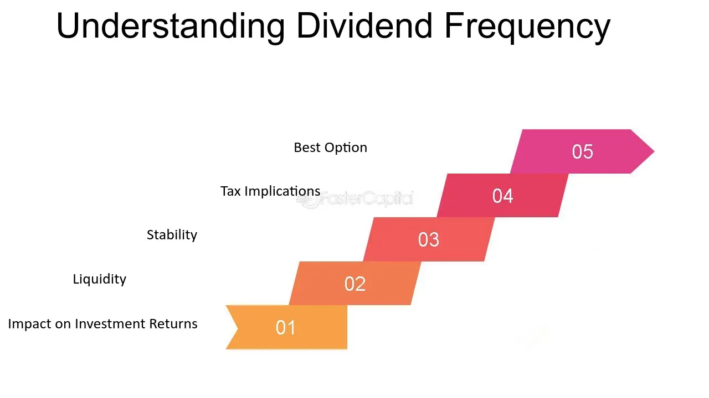

## Table of Contents

## What is a dividend?

A dividend is money that a company pays to its shareholders. When a company makes a profit, it can choose to share some of that profit with the people who own its stocks. This payment is called a dividend. Shareholders usually get dividends a few times a year, like every three months or once a year.

Dividends are important because they give investors a regular income from their investments. Some people invest in stocks just to get these payments. Not all companies pay dividends, though. Some companies, especially new or growing ones, might use all their profits to grow the business instead of paying dividends. So, when choosing stocks, investors often look at whether a company pays dividends and how much.

## How often are dividends typically paid?

Dividends are usually paid out to shareholders a few times a year. The most common schedule is every three months, which is called quarterly. Some companies might pay dividends every six months, which is called semi-annually, or even once a year, which is called annually.

The exact timing can depend on the company's rules and how they decide to share their profits. For example, a company might choose to pay dividends at the end of each quarter to give shareholders a regular income. Other companies might pay dividends at the end of the year, especially if they want to show how well they did over the whole year.

## What are the different types of dividend frequencies?

Dividends can be paid out in different ways depending on how often a company wants to give money to its shareholders. The most common way is quarterly, which means every three months. Many big companies choose this because it gives shareholders a regular income four times a year. 

Another way is semi-annually, which means every six months. This is less common but still used by some companies. It gives shareholders money twice a year, which can be good for those who want a bit less frequent payments.

Lastly, there's annually, which means once a year. Some companies pay their dividends at the end of the year to show how well they did over the whole year. This can be good for companies that want to give a big payment all at once.

## What factors influence a company's choice of dividend frequency?

A company's choice of how often to pay dividends depends on a few things. One big thing is the company's cash flow. If a company makes money steadily throughout the year, it might choose to pay dividends every three months, or quarterly. This helps keep shareholders happy with regular payments. But if a company's money comes in big chunks, like at the end of the year, it might pay dividends once a year, or annually. This way, the company can give a bigger payment all at once.

Another thing that matters is the company's growth plans. If a company is growing fast and needs a lot of money to do that, it might not pay dividends often or at all. Instead, it might use the money to grow the business. But if a company is more stable and not growing as fast, it might pay dividends more often, like every six months or semi-annually, to share its profits with shareholders.

Lastly, the company might also think about what its shareholders want. Some investors like getting money more often, so they might prefer quarterly or semi-annual dividends. Others might be okay with waiting for a bigger payment once a year. So, the company might choose a dividend frequency that makes its shareholders happy and fits with its own financial needs.

## How do dividend reinvestment plans (DRIPs) work with different dividend frequencies?

A dividend reinvestment plan, or DRIP, is a way for shareholders to use their dividend payments to buy more shares in the company instead of getting cash. When a company pays dividends, if you're in a DRIP, the money you would have gotten as cash goes towards buying more shares. This can happen no matter how often the company pays dividends, whether it's quarterly, semi-annually, or annually. The key is that each time dividends are paid, the money is used to buy more shares, helping your investment grow over time.

Different dividend frequencies affect how often you can reinvest your dividends through a DRIP. If a company pays dividends quarterly, you'll have four chances each year to reinvest and buy more shares. This can be good because you're adding to your investment more often. On the other hand, if the company pays dividends annually, you'll only get one chance each year to reinvest. While this means fewer chances to buy more shares, it can still be a good way to grow your investment over time, especially if the company gives a big dividend payment at the end of the year.

## What is the impact of dividend frequency on investment returns?

The frequency of dividends can affect your investment returns in a few ways. If a company pays dividends more often, like every three months, you get more chances to reinvest those dividends through a DRIP. This means you can buy more shares more often, which can help your investment grow faster over time. It's like adding a little bit of money to your investment more often, which can add up to a lot over the years.

On the other hand, if a company pays dividends less often, like once a year, you have fewer chances to reinvest. But this doesn't mean it's bad. If the company gives a big dividend at the end of the year, you can still use that money to buy more shares. It might take longer to see your investment grow compared to getting smaller dividends more often, but it can still be a good way to increase your returns over time.

## How can dividend frequency affect an investor's cash flow?

Dividend frequency can change how much money an investor has coming in regularly. If a company pays dividends every three months, or quarterly, an investor gets money four times a year. This can help the investor plan their money better because they know when the money will come. It's like getting a small paycheck every few months, which can be helpful for people who need regular income from their investments.

On the other hand, if a company pays dividends once a year, or annually, the investor gets all the money at once at the end of the year. This can be good for someone who doesn't need money often but wants a bigger amount at one time. But it can make it harder to plan monthly expenses because the money comes in big chunks instead of smaller, regular amounts. So, the frequency of dividends can really change how an investor manages their cash flow.

## What are the tax implications of different dividend frequencies?

The tax implications of dividend frequency are the same no matter how often you get dividends. Whether you get dividends every three months, every six months, or once a year, you have to pay taxes on them. The tax you pay depends on how much money you make from dividends in a year, not on how often you get them. So, if you get $1,000 in dividends over the year, you pay taxes on that $1,000, no matter if it came in four payments of $250 or one big payment of $1,000.

However, the timing of when you get your dividends can affect when you have to pay taxes. If you get dividends more often, like every three months, you might have to pay taxes on them more often too. This means you need to keep track of your dividends throughout the year and might need to make estimated tax payments. If you get dividends once a year, you only have to worry about taxes at the end of the year. So, while the total tax you pay is the same, the frequency of dividends can change when and how often you deal with taxes.

## How do companies decide on the amount of dividends to pay out?

Companies decide on the amount of dividends to pay out based on how much money they make and what they want to do with it. If a company is making a lot of profit, it might decide to share some of that profit with its shareholders as dividends. But the company also has to think about its future plans. If it wants to grow bigger or start new projects, it might keep more of the profit instead of paying it out as dividends. So, the amount of dividends depends on how much money the company has left after taking care of its expenses and plans for growth.

Another thing companies think about is what their shareholders expect. Some investors like getting a lot of dividends because it gives them regular income. If a company knows its shareholders want more dividends, it might decide to pay out more. But if the shareholders are more interested in the company growing and the stock price going up, the company might pay less in dividends and use the money to grow the business. So, the amount of dividends a company pays can change based on what the company needs and what its shareholders want.

## What is the relationship between dividend frequency and stock price stability?

The frequency of dividends can affect how stable a company's stock price is. When a company pays dividends often, like every three months, it can make the stock price more stable. This is because investors know they will get money regularly, which can make them feel more confident about the company. If investors are happy and feel good about the company, they are less likely to sell their shares quickly, which helps keep the stock price from going up and down a lot.

On the other hand, if a company pays dividends less often, like once a year, the stock price might be less stable. Investors might get nervous waiting for their money, and if they don't get it when they expect, they might sell their shares. This can make the stock price go up and down more. But if the company is doing well and investors trust it, even annual dividends might not cause big changes in the stock price. So, how often a company pays dividends can play a part in how steady its stock price stays.

## How do international dividend payment schedules vary, and what should investors be aware of?

Dividend payment schedules can be different around the world. In the United States, many companies pay dividends every three months, which is called quarterly. But in other countries, like the United Kingdom, it's more common for companies to pay dividends twice a year, or semi-annually. Some places, like Australia, might have companies that pay dividends once a year, or annually. So, if you're investing in companies from different countries, you need to know when you'll get your dividends.

Investors should be aware of a few things when dealing with international dividends. First, the timing of when you get your dividends can affect your cash flow. If you're used to getting money every three months but a foreign company pays only once a year, you might need to plan your money differently. Second, different countries have different tax rules for dividends. You might have to pay taxes in the country where the company is based, and also in your own country. This can make things more complicated, so it's good to understand the tax rules before investing in foreign stocks.

## What advanced strategies can investors use to optimize returns based on dividend frequency?

Investors can use a few smart strategies to make the most of their money when it comes to how often they get dividends. One way is to use a dividend reinvestment plan, or DRIP, to buy more shares every time they get a dividend. If a company pays dividends every three months, an investor can use those dividends to buy more shares four times a year. This can help their investment grow faster over time, especially if they choose companies that pay dividends often. Another strategy is to mix up their investments with companies that pay dividends at different times. This way, they can get money coming in all year long, not just at certain times. It's like having a steady stream of income instead of waiting for one big payment.

Another smart move is to look at the company's history and future plans. Some companies might increase their dividends over time, which can mean more money for investors. If an investor picks companies that regularly raise their dividends, they can see their returns go up even if the dividend frequency stays the same. Also, investors should think about their own needs. If they need money more often, they might want to focus on companies that pay dividends every three months. But if they can wait for a bigger payment, they might choose companies that pay once a year. By understanding their own cash flow needs and how companies pay dividends, investors can make better choices to grow their money.

## How does dividend frequency impact its effects?

Dividend frequency refers to how often a company pays dividends to its shareholders within a fiscal year. The schedules typically include monthly, quarterly, biannual, and annual payments. Understanding these frequencies is crucial for investors who rely on dividend income for cash flow and as part of their overall investment strategy.

**Monthly Dividends**: These are dividends paid every month, providing a steady income stream for investors. Monthly dividends enhance cash flow, making them particularly attractive to retirees or others needing regular income. Companies like Realty Income Corporation (NYSE: O) are well-known for monthly payouts.

**Quarterly Dividends**: This is the most common dividend schedule, where companies distribute profits every three months. It balances regular income with administrative efficiency. Companies such as Apple Inc. (NASDAQ: AAPL) and Microsoft Corporation (NASDAQ: MSFT) follow this schedule.

**Biannual and Annual Dividends**: Less frequent than monthly or quarterly, these dividends are paid twice a year or once a year, respectively. This schedule might appeal to companies with more cyclical cash flow patterns or those preferring to retain earnings for growth. Examples include large multinational corporations and companies in the energy sector that often distribute dividends on an annual basis.

The choice of dividend frequency can significantly impact an investor's cash flow and decision-making. More frequent dividends can lead to a quicker reinvestment cycle, known as the “snowball effect,” where dividends are reinvested to purchase more shares, leading to exponential growth over time. Conversely, receiving dividends less frequently could mean that investors need strategic planning to align cash flow with their personal financial needs.

An essential performance metric influenced by dividend frequency is the dividend yield, calculated as:

$$
\text{Dividend Yield} = \left( \frac{\text{Annual Dividends per Share}}{\text{Price per Share}} \right) \times 100
$$

The timing of dividend payments affects this yield, with more frequent distributions potentially boosting short-term yield attractiveness, especially in stable or declining market conditions.

Several companies demonstrate the impact of varied dividend frequencies on market performance. Realty Income Corporation, with its monthly dividends, is often considered a safe investment, exhibiting lower [volatility](/wiki/volatility-trading-strategies)*. In contrast, tech giant Apple, with quarterly dividends, reflects a balance of capital growth and income, appealing to a broad investor base. Energy companies with annual dividends might display higher volatility, as their payouts are subject to industry cycles and commodity price fluctuations.

These examples illustrate the complexity and strategic importance of dividend frequency in shaping investment portfolios.

## References & Further Reading

1. **Books:**
   - "The Intelligent Investor" by Benjamin Graham: A comprehensive guide that covers investment principles, including dividend investing.
   - "A Random Walk Down Wall Street" by Burton G. Malkiel: Offers insights into market behavior and strategies, with sections on dividends.
   - "Quantitative Trading: How to Build Your Own Algorithmic Trading Business" by Ernie Chan: Focuses on starting algorithmic trading systems, with applicable strategies for dividend investing.

2. **Articles:**
   - "The Dividend Aristocrats: Workhorses of the Passive Income Factory" – This article offers a deep dive into companies with stable, increasing dividend payouts, showcasing their long-term performance ([Source](https://www.investopedia.com/articles/investing/070714/are-dividend-aristocrats-good-investment.asp)).
   - "High Dividend Yield Investing" by CFA Institute: Discusses strategies for investing in high-yield dividend stocks and their benefits.
   - "The Impact of Dividend Frequency on Stock Returns" published in the Financial Analysts Journal: Explores empirical data on how dividend frequency affects stock performance.

3. **Online Resources:**
   - **Investopedia**: An online financial encyclopedia that provides extensive information on dividend strategies and algorithmic trading.
     - [Dividend Types - Investopedia](https://www.investopedia.com/articles/investing/102914/introduction-dividends.asp)
     - [Algorithmic Trading Strategies](https://www.investopedia.com/articles/trading/06/algorithmictrading.asp)

   - **Yahoo Finance**: Offers up-to-date market data, including dividend information for various stocks ([Yahoo Finance Dividends](https://finance.yahoo.com/trending-tickers)).

4. **Research Papers & Studies:**
   - Fama, E.F., & French, K.R. (1992). "The Cross‐Section of Expected Stock Returns." *Journal of Finance*, which discusses factors contributing to stock returns, including dividends.
   - "Performance of Dividend Stocks and their Role in Optimal Portfolios" – A research paper that analyzes the historical performance of dividend-paying stocks.

5. **Programming Resources:**
   - **Python for Algorithmic Trading**: Online courses and tutorials such as "Python for Finance: Investment Fundamentals & Data Analytics" on platforms like Udemy.
   - **QuantConnect**: An open-source algorithmic trading platform providing data libraries and learning resources for trading strategies, including dividend capture.

These resources will provide readers with comprehensive insights and tools to enhance their knowledge and strategies in dividend investing and algorithmic trading.

