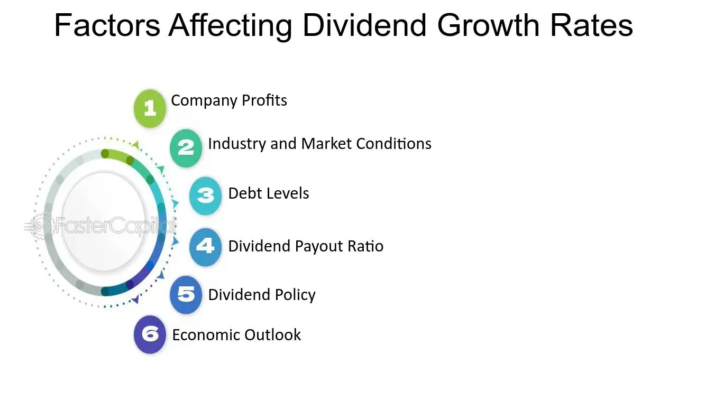

## Table of Contents

## What is a dividend?

A dividend is money that a company pays to its shareholders. When a company makes a profit, it can choose to share some of that profit with the people who own its stock. This payment is called a dividend. Shareholders usually get dividends a few times a year, depending on what the company decides.

Dividends are important because they give investors a regular income from their investments. Not all companies pay dividends, though. Some companies, especially newer ones, might use their profits to grow the business instead of paying dividends. But for companies that do pay them, dividends can be a big reason why people choose to invest in those companies.

## How does dividend growth work?

Dividend growth means that the amount of money a company pays to its shareholders as dividends increases over time. When a company is doing well and making more profit, it might decide to give its shareholders a bigger dividend than before. This is good for investors because it means they get more money without having to buy more shares. Companies usually try to increase their dividends slowly and steadily, so investors can count on getting a bit more each year.

Sometimes, a company might not be able to increase its dividend if it's not making enough profit or if it needs to use the money for other important things, like expanding the business. But when a company has a history of growing its dividends, it shows that the company is stable and doing well. Investors like this because it means their investment is likely to keep giving them more money in the future.

## Why is dividend growth important for investors?

Dividend growth is important for investors because it means they get more money from their investments over time. When a company keeps increasing its dividends, it shows that the company is doing well and making more profit. This is good news for investors because they can count on getting a little more money each year without having to buy more shares. It's like getting a raise at work, but for their investments.

Also, dividend growth can help protect investors from inflation. Inflation means that the cost of things goes up over time, so the money you have today might not buy as much in the future. But if the dividends from a company keep growing, they can help keep up with or even beat inflation. This means the money investors get from dividends will still be worth a lot, even as prices go up. So, dividend growth is a big reason why some investors choose certain companies to invest in.

## What are the key factors that influence dividend growth?

The main things that affect how much a company can grow its dividends are how much money it makes and how well it manages its money. If a company is making more profit, it has more money to share with its shareholders. But it's not just about making money; the company also needs to be smart about how it spends that money. If it's spending too much on growing the business or paying off debts, there might not be enough left over for bigger dividends. So, good money management is really important for dividend growth.

Another big [factor](/wiki/factor-investing) is the overall health of the company and the economy. If a company is doing well and the economy is strong, it's easier for the company to increase its dividends. But if the company is struggling or if there's a big economic downturn, it might have to cut back on dividends instead of growing them. Also, the company's industry can play a role. Some industries, like utilities or consumer goods, tend to have more stable profits and can grow their dividends more easily than industries that are more up and down, like technology or energy.

## How can dividend growth impact the total return of an investment?

Dividend growth can make a big difference in the total return of an investment. Total return is all the money you make from an investment, including both the price of the stock going up and the dividends you get. When a company keeps increasing its dividends, it means you get more money each year from the same number of shares. This extra money can add up over time, making your investment worth more than if the company just kept the dividends the same.

Also, growing dividends can help make your investment grow even if the stock price doesn't go up much. If you take the dividends and use them to buy more shares, you'll get even more dividends next time. This is called "reinvesting" the dividends, and it can help your investment grow faster. So, dividend growth is a big part of what makes some investments do really well over the long term.

## What is the difference between dividend yield and dividend growth?

Dividend yield and dividend growth are two different ways to look at how much money you can make from dividends. Dividend yield is like a snapshot of how much money you get from dividends right now. It's calculated by taking the yearly dividend and dividing it by the current price of the stock. So, if a stock costs $100 and pays $5 in dividends each year, the dividend yield is 5%. It tells you how much income you can expect from the stock at that moment.

Dividend growth, on the other hand, is about how the amount of dividends changes over time. If a company is doing well and making more profit, it might decide to pay bigger dividends to its shareholders. This means that over the years, the dividend you get from each share goes up. For example, if a company starts paying $1 per share and then increases it to $1.10 the next year, that's dividend growth. Investors like dividend growth because it means their income from the investment keeps getting bigger without them having to buy more shares.

## How do companies decide to increase their dividends?

Companies decide to increase their dividends when they are making more money and want to share some of that extra profit with their shareholders. They look at how much profit they are making and how much money they need to keep for other important things, like growing the business or paying off debts. If they have enough left over, they might decide to give a little more to shareholders. This decision is usually made by the company's board of directors, who think about what's best for the company and its investors.

Sometimes, a company might also want to show that it is doing well and is confident about the future. By increasing the dividend, they send a message to investors that the company is stable and expects to keep making good profits. But they have to be careful not to promise more than they can deliver. If they increase the dividend too much and then can't keep it up, it could make investors lose trust in the company. So, companies usually try to increase their dividends slowly and steadily, to keep investors happy and confident.

## What are the risks associated with investing in dividend growth stocks?

Investing in dividend [growth stocks](/wiki/growth-stocks) can be a good way to make money, but it also comes with some risks. One big risk is that a company might not be able to keep growing its dividends. If the company starts making less profit or if it needs to use more money for other things, like paying off debts or expanding the business, it might have to cut back on dividends instead of increasing them. This can be a problem for investors who were counting on getting more money each year.

Another risk is that the stock price might go down even if the dividends are going up. Sometimes, other things can affect the stock price, like changes in the economy or problems in the company's industry. If the stock price drops a lot, the total value of your investment could go down, even if you're getting more dividends. So, it's important to think about both the dividends and the stock price when you're deciding whether to invest in a dividend growth stock.

## How can dividend reinvestment enhance the impact of dividend growth?

Dividend reinvestment means taking the money you get from dividends and using it to buy more shares of the same stock. When you do this, you can make your investment grow faster, especially if the company keeps increasing its dividends. Let's say you own some shares and the company raises its dividend. If you reinvest those bigger dividends, you'll get even more shares than before. Next time the company pays a dividend, you'll get paid on all those extra shares too. This can really add up over time, making your investment worth a lot more.

This process can help you beat inflation and grow your money over the long term. As the company's dividends keep going up, the number of shares you own keeps growing too. It's like a snowball rolling down a hill, getting bigger and bigger. By reinvesting your dividends, you're not just getting a little more money each year; you're also setting yourself up for even bigger dividends in the future. This can make a big difference in how much your investment grows over many years.

## What metrics should investors use to evaluate a company's potential for dividend growth?

Investors should look at a few key things to see if a company can keep growing its dividends. One important thing is the company's earnings growth. If a company is making more money each year, it's more likely to be able to pay bigger dividends. Another thing to check is the payout ratio, which is how much of the company's profit it pays out as dividends. A lower payout ratio means the company has more room to increase dividends in the future. Also, it's good to look at the company's free cash flow, which is the money left over after the company pays for everything it needs to run. More free cash flow means more money to share with shareholders.

Another thing to consider is the company's history of dividend growth. If a company has been raising its dividends for many years, it's a good sign that it might keep doing so. Investors should also think about the company's industry and how it's doing. Some industries are more stable and can grow dividends more easily than others. Finally, it's important to look at the company's debt levels. If a company has a lot of debt, it might have to use its profits to pay it off instead of increasing dividends. By looking at all these things, investors can get a better idea of whether a company is likely to keep growing its dividends.

## How does dividend growth strategy compare to other investment strategies?

A dividend growth strategy focuses on investing in companies that regularly increase their dividend payments. This can be a good choice for people who want a steady income from their investments. As the dividends grow, investors get more money each year without having to buy more shares. This can help protect against inflation because the money you get keeps up with rising prices. But there are risks too. If a company can't keep growing its dividends, your income might go down. Also, the stock price might drop, which can affect the total value of your investment.

Other investment strategies might focus on different things. For example, a growth strategy looks for companies that are growing fast and might not pay dividends at all. These companies could see their stock prices go up a lot, but they don't give you regular income. A value strategy looks for stocks that are cheap compared to what the company is worth. These stocks might not grow as fast, but they could be a good deal if the company does well. Each strategy has its own risks and rewards, and what works best depends on what you want from your investments and how much risk you're willing to take.

## What are some advanced techniques for forecasting future dividend growth?

One advanced way to guess how much a company's dividends might grow in the future is to look at its past. If a company has been increasing its dividends every year for a long time, it's a good sign that it might keep doing that. You can also look at how much the company's earnings are growing. If the company is making more money each year, it's more likely to be able to pay bigger dividends. Another thing to check is the payout ratio, which is how much of the company's profit it pays out as dividends. If the payout ratio is low, the company has more room to increase dividends in the future.

Another way to forecast future dividend growth is to look at the company's free cash flow. This is the money left over after the company pays for everything it needs to run. If a company has a lot of free cash flow, it can use that money to pay bigger dividends. It's also important to think about the company's industry and how it's doing. Some industries are more stable and can grow dividends more easily than others. Finally, you can use financial models like the Gordon Growth Model, which helps you guess how much dividends might grow based on the company's current dividend, its expected growth rate, and the rate you want to earn on your investment.

## What is Understanding Dividend Growth?

Dividend growth is a fundamental component of income-focused investment strategies. It offers investors a consistent stream of income with the potential for growth over time. Selecting stocks with a robust history of dividend growth is vital to capitalizing on this investment strategy. Companies that have managed to increase their dividends consistently are often financially stable, indicating a well-managed business.

### Importance of Selecting Stocks with Dividend Growth

When investors prioritize stocks with a history of dividend growth, they are essentially choosing companies that show a commitment to returning profits to shareholders regularly. One important metric used to identify such stocks is the Dividend Growth Rate (DGR), which measures the annualized percentage rate of growth in a company’s dividend. Consistent dividend growth suggests a company is generating sufficient cash flow and earnings to support regular payouts, often reflecting a strong financial standing and sustainable business model.

### Dividend Growth Model

The dividend growth model is a valuable tool for investors aiming to assess the intrinsic value of a stock based on its expected future dividends. The Gordon Growth Model (GGM), in particular, is frequently used. It is represented as:

$$
P = \frac{D_1}{r - g}
$$

where $P$ is the price of the stock, $D_1$ is the expected dividend in the next period, $r$ is the required rate of return, and $g$ is the constant growth rate of the dividend. This model helps investors identify companies with potential for sustained profitability by focusing on those that can continually increase their dividend payouts.

### Dividend Yield and Payout Ratios

Dividend yield and payout ratios are key indicators of a company's ability to maintain and grow its dividends. The dividend yield, calculated as the annual dividends per share divided by the price per share, provides insight into the income generated relative to the stock price, offering a snapshot of short-term return on investment. The payout ratio, which is the proportion of earnings paid out as dividends, serves as a measure of dividend sustainability. A lower payout ratio may suggest that a company retains enough of its profits to reinvest back into the business, supporting future growth.

### Real-world Examples of Successful Dividend Growth Strategies

Real-world examples highlight the effectiveness of dividend growth strategies. Companies like Johnson & Johnson and Procter & Gamble have long histories of dividend increases and are often cited for their strong balance sheets and ability to adapt to market conditions. These companies have built reputations for shareholder-friendly policies, making them attractive investments for those seeking reliable income.

Dividend growth is an attractive strategy for those looking to build a resilient portfolio. By focusing on companies with strong dividend histories and using key financial metrics, investors can make informed decisions that align with their income and growth objectives.

## What are the essentials of investment calculation?

Effective investment strategies are contingent upon robust financial calculations that provide a clear assessment of potential returns and risks. Central to these evaluations are essential metrics like the Compound Annual Growth Rate (CAGR) and the dividend yield, which investors utilize to gauge the performance and profitability of investments.

### Compound Annual Growth Rate (CAGR)

The CAGR is a crucial metric that reflects the geometric progression ratio that provides a constant rate of return over a time period. It is used to measure and compare the past performance of investments or to project their expected future returns. The formula for CAGR is:

$$

\text{CAGR} = \left( \frac{\text{Ending Value}}{\text{Beginning Value}} \right)^{\frac{1}{n}} - 1 
$$

where:
- $\text{Ending Value}$ is the investment's value at the end of the period,
- $\text{Beginning Value}$ is the investment's value at the start of the period,
- $n$ is the number of years.

CAGR provides a smoothed annual rate of growth, helping investors to understand an investment's growth rate over specific periods, thus removing the effects of [volatility](/wiki/volatility-trading-strategies) during the period measured.

### Dividend Yield

Dividend yield represents a stock's annual dividend payments as a percentage of the stock’s current price. This metric is crucial for income-focused investors seeking consistent returns. The formula for dividend yield is:

$$
\text{Dividend Yield} = \frac{\text{Annual Dividends per Share}}{\text{Price per Share}}
$$

High dividend yields can indicate an attractive income source, but investors should consider the sustainability of the yields over time, considering potential changes in company policy or market conditions.

### Tax Implications on Net Returns

Tax considerations are an integral part of calculating net returns on investment, as they directly reduce the realized gains. Different types of investments are subjected to varied tax rates, and understanding these is critical. For example, qualified dividends are taxed at a lower rate than ordinary income. Calculating net returns typically involves estimating the tax liability under current laws and considering tax-efficient investment vehicles such as tax-deferred accounts.

### Tools and Calculators for Investment Analysis

Aiding in the simplification of these calculations and decisions, numerous financial tools and calculators are available. Software like Excel provides built-in functions for CAGR, allowing users to employ formulas such as `=RATE()` to calculate CAGR over specified intervals. Additionally, online financial platforms often feature calculators that automatically compute potential returns, adjusted for factors like taxes and risk preferences.

```python
# Python example to calculate CAGR
def calculate_cagr(beginning_value, ending_value, years):
    return (ending_value / beginning_value) ** (1 / years) - 1

# Example usage
beginning_value = 1000
ending_value = 2000
years = 5
cagr = calculate_cagr(beginning_value, ending_value, years)
print("CAGR: {:.2%}".format(cagr))
```

### Practical Examples

Consider an investor analyzing a stock that was worth \$10,000 five years ago and is now valued at \$16,105, alongside annual dividends amounting to \$500. By computing the CAGR, the investor finds a growth rate of approximately 10% per year. The cumulative dividend yield, considering a stable share price, would be 5% annually. Incorporating estimated taxes on dividends, the effective yield might adjust to around 4%, necessitating a thorough consideration of post-tax returns.

Through the strategic use of financial calculations and analytical tools, investors can optimize their strategies, driving informed decision-making and enhanced portfolio construction.

## What are some Case Studies and Practical Applications?

### Case Studies and Practical Applications

Real-world applications of investment strategies illustrate the practical utility of theoretical concepts. Examining specific cases, such as Johnson & Johnson for dividend growth and Renaissance Technologies for [algorithmic trading](/wiki/algorithmic-trading), alongside the calculation-driven approach of Warren Buffett, provides valuable insights for investors seeking to optimize their strategies.

#### **Johnson & Johnson: Dividend Growth**

Johnson & Johnson, a prominent dividend-paying stock, exemplifies successful dividend growth strategies. The company has consistently increased its dividend payout annually for over 50 years, [earning](/wiki/earning-announcement) it the classification of a Dividend Aristocrat. This consistent growth is an indicator of strong company performance and financial health, reassuring investors of continued profitability and stability. Metrics such as the dividend yield, calculated as:

$$
\text{Dividend Yield} = \frac{\text{Annual Dividends per Share}}{\text{Price per Share}}
$$

and the dividend payout ratio, defined as:

$$
\text{Payout Ratio} = \frac{\text{Dividends per Share}}{\text{Earnings per Share}}
$$

are crucial in evaluating dividend sustainability. Johnson & Johnson's strategy of maintaining a balanced payout ratio while ensuring dividend growth has been instrumental in fostering investor confidence.

#### **Renaissance Technologies: Algorithmic Trading**

Renaissance Technologies is renowned for its innovative use of algorithmic trading, primarily through its Medallion Fund. The fund's success is attributed to its sophisticated mathematical models and data analysis techniques, which enable lightning-fast trade executions and superior market insights. By employing strategies such as [momentum](/wiki/momentum) trading, which capitalizes on existing market trends, and mean-reversion, which predicts price corrections, Renaissance has achieved outstanding returns. Python-based algorithms, capable of analyzing large datasets and executing predefined trading strategies, form the cornerstone of their approach:

```python
import pandas as pd
import numpy as np

def momentum_trading(prices, window=10):
    returns = prices.pct_change()
    signals = np.where(returns.rolling(window=window).sum() > 0, 1, -1)
    return signals

# Assuming `prices` is a DataFrame containing historical stock data
trade_signals = momentum_trading(prices)
```

#### **Warren Buffett: Calculation-Based Investment Approach**

Warren Buffett, known for his value investing methodology, emphasizes the significance of intrinsic value calculation and long-term investment horizons. By focusing on companies with strong fundamentals and undervalued stock prices, Buffett's approach involves meticulous financial analysis and a deep understanding of market dynamics. Key calculations include the determination of intrinsic value using discounted cash flows (DCF), where future cash flows are estimated and discounted back to present value:

$$
\text{Intrinsic Value} = \sum \frac{\text{Cash Flow}_t}{(1 + r)^t}
$$

where $r$ represents the discount rate. This model aids investors in identifying stocks with high growth potential relative to their market price.

#### **Lessons for Individual Investors**

The lessons from these case studies underscore the importance of integrating diverse strategies to craft a robust investment portfolio:

1. **Consistency in Dividend Growth**: Emphasizing companies with a proven track record of dividend increases can provide reliable income streams.

2. **Innovation in Algo Trading**: Leveraging algorithmic strategies allows investors to capitalize on market inefficiencies and make data-driven decisions.

3. **Precision in Calculations**: Employing precise financial calculations enhances the ability to gauge investment potential and make informed decisions.

By applying these principles, individual investors can develop tailored strategies that align with their financial objectives and risk tolerance, ensuring long-term success in an ever-evolving market environment.

## References & Further Reading

[1]: Bergstra, J., Bardenet, R., Bengio, Y., & Kégl, B. (2011). ["Algorithms for Hyper-Parameter Optimization."](https://dl.acm.org/doi/10.5555/2986459.2986743) Advances in Neural Information Processing Systems 24.

[2]: ["Advances in Financial Machine Learning"](https://www.amazon.com/Advances-Financial-Machine-Learning-Marcos/dp/1119482089) by Marcos Lopez de Prado

[3]: ["Evidence-Based Technical Analysis: Applying the Scientific Method and Statistical Inference to Trading Signals"](https://www.amazon.com/Evidence-Based-Technical-Analysis-Scientific-Statistical/dp/0470008741) by David Aronson

[4]: ["Machine Learning for Algorithmic Trading"](https://github.com/stefan-jansen/machine-learning-for-trading) by Stefan Jansen

[5]: ["Quantitative Trading: How to Build Your Own Algorithmic Trading Business"](https://github.com/LucindaYa/quant-resources/blob/master/Quantitative%20Trading%20How%20to%20Build%20Your%20Own%20Algorithmic%20Trading%20Business.pdf) by Ernest P. Chan