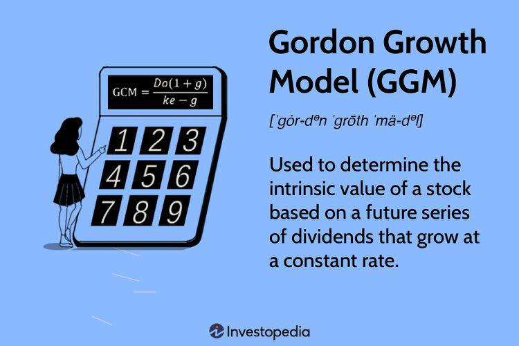

In the ever-evolving landscape of financial markets, investors are perpetually in search of strategies that can optimize their returns. The interplay of dividend growth, investment strategies, and algorithmic trading represents a multifaceted approach that addresses both the aspirations and challenges of modern investing. This article examines the integration of these elements into a cohesive investment framework, which can be instrumental in constructing a portfolio resilient to market volatility.

Dividend growth forms a cornerstone of income-focused investment strategies by offering a steady stream of income through regular dividend payouts. Selecting stocks with a robust track record of dividend growth is vital for investors aiming for sustained cash flow and capital appreciation. Central to this process is the understanding of metrics such as the Compound Annual Growth Rate (CAGR) and dividend yield, which provide insights into a company's potential for sustained profitability. These calculations are essential in assessing potential returns and should be included in the broader strategic framework.



Investment strategies also hinge on precise calculations, which are necessary to evaluate potential outcomes and adjust for variables such as tax implications. Employing tools and calculators can augment the analysis and facilitate sound decision-making, thus providing a clearer picture of net returns and aiding in strategic planning.

Algorithmic trading further enhances this strategic ensemble by leveraging advanced computer algorithms to execute trades with precision and speed unattainable by human traders. This aspect of modern trading employs data analysis to identify trends and capitalize on market movements, employing strategies like momentum and mean-reversion.

By embracing the integration of dividend growth, robust investment calculations, and algorithmic trading, investors can craft a diversified and resilient portfolio. Such a strategy not only stands to enhance returns but also embodies the adaptability needed to thrive in shifting market conditions. Through exploration and practical application, this article aims to empower both novice and seasoned investors to transform their investment strategies.

## Table of Contents

## Understanding Dividend Growth

Dividend growth is a fundamental component of income-focused investment strategies. It offers investors a consistent stream of income with the potential for growth over time. Selecting stocks with a robust history of dividend growth is vital to capitalizing on this investment strategy. Companies that have managed to increase their dividends consistently are often financially stable, indicating a well-managed business.

### Importance of Selecting Stocks with Dividend Growth

When investors prioritize stocks with a history of dividend growth, they are essentially choosing companies that show a commitment to returning profits to shareholders regularly. One important metric used to identify such stocks is the Dividend Growth Rate (DGR), which measures the annualized percentage rate of growth in a company’s dividend. Consistent dividend growth suggests a company is generating sufficient cash flow and earnings to support regular payouts, often reflecting a strong financial standing and sustainable business model.

### Dividend Growth Model

The dividend growth model is a valuable tool for investors aiming to assess the intrinsic value of a stock based on its expected future dividends. The Gordon Growth Model (GGM), in particular, is frequently used. It is represented as:

$$
P = \frac{D_1}{r - g}
$$

where $P$ is the price of the stock, $D_1$ is the expected dividend in the next period, $r$ is the required rate of return, and $g$ is the constant growth rate of the dividend. This model helps investors identify companies with potential for sustained profitability by focusing on those that can continually increase their dividend payouts.

### Dividend Yield and Payout Ratios

Dividend yield and payout ratios are key indicators of a company's ability to maintain and grow its dividends. The dividend yield, calculated as the annual dividends per share divided by the price per share, provides insight into the income generated relative to the stock price, offering a snapshot of short-term return on investment. The payout ratio, which is the proportion of earnings paid out as dividends, serves as a measure of dividend sustainability. A lower payout ratio may suggest that a company retains enough of its profits to reinvest back into the business, supporting future growth.

### Real-world Examples of Successful Dividend Growth Strategies

Real-world examples highlight the effectiveness of dividend growth strategies. Companies like Johnson & Johnson and Procter & Gamble have long histories of dividend increases and are often cited for their strong balance sheets and ability to adapt to market conditions. These companies have built reputations for shareholder-friendly policies, making them attractive investments for those seeking reliable income.

Dividend growth is an attractive strategy for those looking to build a resilient portfolio. By focusing on companies with strong dividend histories and using key financial metrics, investors can make informed decisions that align with their income and growth objectives.

## Investment Calculation Essentials

Effective investment strategies are contingent upon robust financial calculations that provide a clear assessment of potential returns and risks. Central to these evaluations are essential metrics like the Compound Annual Growth Rate (CAGR) and the dividend yield, which investors utilize to gauge the performance and profitability of investments.

### Compound Annual Growth Rate (CAGR)

The CAGR is a crucial metric that reflects the geometric progression ratio that provides a constant rate of return over a time period. It is used to measure and compare the past performance of investments or to project their expected future returns. The formula for CAGR is:

$$

\text{CAGR} = \left( \frac{\text{Ending Value}}{\text{Beginning Value}} \right)^{\frac{1}{n}} - 1 
$$

where:
- $\text{Ending Value}$ is the investment's value at the end of the period,
- $\text{Beginning Value}$ is the investment's value at the start of the period,
- $n$ is the number of years.

CAGR provides a smoothed annual rate of growth, helping investors to understand an investment's growth rate over specific periods, thus removing the effects of [volatility](/wiki/volatility-trading-strategies) during the period measured.

### Dividend Yield

Dividend yield represents a stock's annual dividend payments as a percentage of the stock’s current price. This metric is crucial for income-focused investors seeking consistent returns. The formula for dividend yield is:

$$
\text{Dividend Yield} = \frac{\text{Annual Dividends per Share}}{\text{Price per Share}}
$$

High dividend yields can indicate an attractive income source, but investors should consider the sustainability of the yields over time, considering potential changes in company policy or market conditions.

### Tax Implications on Net Returns

Tax considerations are an integral part of calculating net returns on investment, as they directly reduce the realized gains. Different types of investments are subjected to varied tax rates, and understanding these is critical. For example, qualified dividends are taxed at a lower rate than ordinary income. Calculating net returns typically involves estimating the tax liability under current laws and considering tax-efficient investment vehicles such as tax-deferred accounts.

### Tools and Calculators for Investment Analysis

Aiding in the simplification of these calculations and decisions, numerous financial tools and calculators are available. Software like Excel provides built-in functions for CAGR, allowing users to employ formulas such as `=RATE()` to calculate CAGR over specified intervals. Additionally, online financial platforms often feature calculators that automatically compute potential returns, adjusted for factors like taxes and risk preferences.

```python
# Python example to calculate CAGR
def calculate_cagr(beginning_value, ending_value, years):
    return (ending_value / beginning_value) ** (1 / years) - 1

# Example usage
beginning_value = 1000
ending_value = 2000
years = 5
cagr = calculate_cagr(beginning_value, ending_value, years)
print("CAGR: {:.2%}".format(cagr))
```

### Practical Examples

Consider an investor analyzing a stock that was worth \$10,000 five years ago and is now valued at \$16,105, alongside annual dividends amounting to \$500. By computing the CAGR, the investor finds a growth rate of approximately 10% per year. The cumulative dividend yield, considering a stable share price, would be 5% annually. Incorporating estimated taxes on dividends, the effective yield might adjust to around 4%, necessitating a thorough consideration of post-tax returns.

Through the strategic use of financial calculations and analytical tools, investors can optimize their strategies, driving informed decision-making and enhanced portfolio construction.

## The Role of Algorithmic Trading

Algorithmic trading leverages advanced computer algorithms to analyze market data and execute trades with unparalleled speed and precision. These systems are designed to optimize trading strategies by minimizing human intervention and harnessing computational power to respond to market changes in milliseconds. This approach provides significant advantages in portfolio management, offering increased efficiency, accuracy, and the ability to handle large volumes of transactions seamlessly.

One of the primary benefits of [algorithmic trading](/wiki/algorithmic-trading) is its capability to manage and process vast datasets to identify patterns and trends that would be impossible for human traders to detect in real-time. Algorithms can be programmed to analyze multiple market indicators, such as price movements, trading volumes, and other relevant economic signals. This enables traders to capitalize on market opportunities with a level of precision and timing that surpasses manual trading processes.

Momentum and mean-reversion are among the most popular algorithmic trading strategies employed in today's markets. Momentum strategies exploit the tendency of securities to continue moving in the same direction. Traders utilizing this approach use algorithms to identify stocks that are exhibiting strong upward or downward trends, allowing them to buy high-performing securities and sell those that are underperforming. On the other hand, mean-reversion strategies are based on the assumption that asset prices will revert to their historical averages over time. Algorithms implementing this strategy identify deviations from the norm and place trades expecting the price to return to its mean, thereby capturing profits from temporary market anomalies.

The future of algorithmic trading is poised to be even more transformative. With the advent of [artificial intelligence](/wiki/ai-artificial-intelligence) and [machine learning](/wiki/machine-learning), algorithms are becoming increasingly sophisticated, capable of learning from data patterns and adjusting strategies dynamically without explicit programming. This evolution is expected to enhance predictive accuracy and adaptive trading models, potentially revolutionizing investment strategies.

Incorporating algorithmic trading into investment strategies not only expedites trade execution and minimizes human error but also opens up new avenues for innovation in financial markets. As technology continues to advance, the role of algorithms in trading is likely to expand further, helping investors achieve more efficient and effective portfolio management.

## Case Studies and Practical Applications

### Case Studies and Practical Applications

Real-world applications of investment strategies illustrate the practical utility of theoretical concepts. Examining specific cases, such as Johnson & Johnson for dividend growth and Renaissance Technologies for algorithmic trading, alongside the calculation-driven approach of Warren Buffett, provides valuable insights for investors seeking to optimize their strategies.

#### **Johnson & Johnson: Dividend Growth**

Johnson & Johnson, a prominent dividend-paying stock, exemplifies successful dividend growth strategies. The company has consistently increased its dividend payout annually for over 50 years, [earning](/wiki/earning-announcement) it the classification of a Dividend Aristocrat. This consistent growth is an indicator of strong company performance and financial health, reassuring investors of continued profitability and stability. Metrics such as the dividend yield, calculated as:

$$
\text{Dividend Yield} = \frac{\text{Annual Dividends per Share}}{\text{Price per Share}}
$$

and the dividend payout ratio, defined as:

$$
\text{Payout Ratio} = \frac{\text{Dividends per Share}}{\text{Earnings per Share}}
$$

are crucial in evaluating dividend sustainability. Johnson & Johnson's strategy of maintaining a balanced payout ratio while ensuring dividend growth has been instrumental in fostering investor confidence.

#### **Renaissance Technologies: Algorithmic Trading**

Renaissance Technologies is renowned for its innovative use of algorithmic trading, primarily through its Medallion Fund. The fund's success is attributed to its sophisticated mathematical models and data analysis techniques, which enable lightning-fast trade executions and superior market insights. By employing strategies such as [momentum](/wiki/momentum) trading, which capitalizes on existing market trends, and mean-reversion, which predicts price corrections, Renaissance has achieved outstanding returns. Python-based algorithms, capable of analyzing large datasets and executing predefined trading strategies, form the cornerstone of their approach:

```python
import pandas as pd
import numpy as np

def momentum_trading(prices, window=10):
    returns = prices.pct_change()
    signals = np.where(returns.rolling(window=window).sum() > 0, 1, -1)
    return signals

# Assuming `prices` is a DataFrame containing historical stock data
trade_signals = momentum_trading(prices)
```

#### **Warren Buffett: Calculation-Based Investment Approach**

Warren Buffett, known for his value investing methodology, emphasizes the significance of intrinsic value calculation and long-term investment horizons. By focusing on companies with strong fundamentals and undervalued stock prices, Buffett's approach involves meticulous financial analysis and a deep understanding of market dynamics. Key calculations include the determination of intrinsic value using discounted cash flows (DCF), where future cash flows are estimated and discounted back to present value:

$$
\text{Intrinsic Value} = \sum \frac{\text{Cash Flow}_t}{(1 + r)^t}
$$

where $r$ represents the discount rate. This model aids investors in identifying stocks with high growth potential relative to their market price.

#### **Lessons for Individual Investors**

The lessons from these case studies underscore the importance of integrating diverse strategies to craft a robust investment portfolio:

1. **Consistency in Dividend Growth**: Emphasizing companies with a proven track record of dividend increases can provide reliable income streams.

2. **Innovation in Algo Trading**: Leveraging algorithmic strategies allows investors to capitalize on market inefficiencies and make data-driven decisions.

3. **Precision in Calculations**: Employing precise financial calculations enhances the ability to gauge investment potential and make informed decisions.

By applying these principles, individual investors can develop tailored strategies that align with their financial objectives and risk tolerance, ensuring long-term success in an ever-evolving market environment.

## Conclusion

As we have explored throughout this article, the integration of dividend growth, sound investment calculations, and algorithmic trading forms a robust strategy for enhancing investment portfolios. These strategies, when utilized effectively, can provide a comprehensive framework that empowers investors to maximize returns while minimizing risks. Dividend growth, with its focus on selecting stocks that consistently increase their payouts, offers a reliable means of generating income and capital appreciation. This approach ensures that investors hold shares in companies with a proven track record of financial stability and profitability.

Incorporating investment calculation essentials, such as the Compound Annual Growth Rate (CAGR) and the evaluation of tax implications, is paramount for accurately assessing potential returns. The use of these financial metrics enables investors to gauge the long-term profitability of their investments, ensuring well-informed decision-making. Tools and calculators further streamline this process, offering ease and precision in the analysis and management of investment portfolios.

Algorithmic trading, with its reliance on computer-driven analysis, presents a transformative opportunity in modern portfolio management. Algorithms execute trades with speed and accuracy that surpass human capabilities, analyzing vast quantities of market data to identify trends and opportunities. By embracing algorithmic strategies, especially those rooted in momentum and mean-reversion, investors can significantly enhance their market responsiveness.

A key takeaway is the necessity for investors to continually refine and adapt their strategies in alignment with evolving market conditions. This commitment to learning and flexibility is essential for achieving sustainable financial success. By harnessing the power of dividend growth, calculation-based assessment, and automated trading, investors can build a resilient, diversified portfolio tailored to withstand market volatility.

We invite readers to continue exploring these concepts, as this discourse forms the foundation of an ever-expanding field of study and practice. Readers are encouraged to deepen their understanding through further research and dialogue, ensuring they remain at the forefront of investment innovation. This knowledge base will be indispensable as they navigate the complexities of financial markets and pursue their investment aspirations.

## References & Further Reading

[1]: Bergstra, J., Bardenet, R., Bengio, Y., & Kégl, B. (2011). ["Algorithms for Hyper-Parameter Optimization."](https://dl.acm.org/doi/10.5555/2986459.2986743) Advances in Neural Information Processing Systems 24.

[2]: ["Advances in Financial Machine Learning"](https://www.amazon.com/Advances-Financial-Machine-Learning-Marcos/dp/1119482089) by Marcos Lopez de Prado

[3]: ["Evidence-Based Technical Analysis: Applying the Scientific Method and Statistical Inference to Trading Signals"](https://www.amazon.com/Evidence-Based-Technical-Analysis-Scientific-Statistical/dp/0470008741) by David Aronson

[4]: ["Machine Learning for Algorithmic Trading"](https://github.com/stefan-jansen/machine-learning-for-trading) by Stefan Jansen

[5]: ["Quantitative Trading: How to Build Your Own Algorithmic Trading Business"](https://github.com/LucindaYa/quant-resources/blob/master/Quantitative%20Trading%20How%20to%20Build%20Your%20Own%20Algorithmic%20Trading%20Business.pdf) by Ernest P. Chan