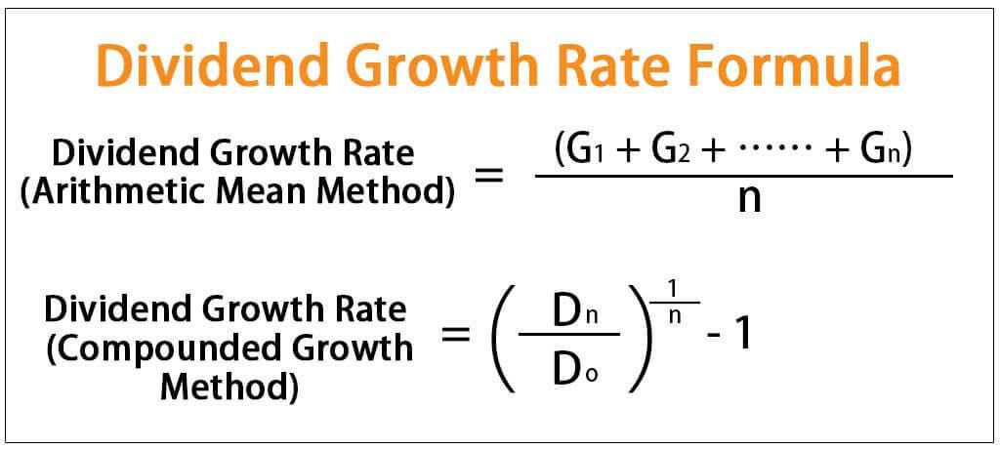

Investing in the financial markets can be a daunting task for beginners and seasoned investors alike. This article aims to simplify three key investment strategies: dividend growth, investment calculations, and algorithmic trading. These strategies form essential components of a robust investment approach by enabling investors to make informed decisions, optimize returns, and manage risks effectively.

We will explore the dividend growth model, a key tool for evaluating the potential of stocks based on their dividend histories and growth prospects. This model focuses on identifying companies that not only provide regular dividend payouts but also demonstrate consistent dividend increases, which can signal financial health and long-term profitability. By understanding the drivers of dividend growth, investors can identify opportunities for building wealth over time.



Investment calculations are crucial in guiding decision-making processes. We'll cover fundamental financial metrics such as the compound annual growth rate (CAGR), which provides insight into the growth of an investment over time, and dividend yield, a measure of dividend income relative to stock price. Additionally, understanding tax implications on dividends is vital for optimizing net returns. These calculations, supported by tools and calculators, are essential for evaluating potential investments and tailoring strategies to align with financial goals.

Algorithmic trading, a rapidly growing field, leverages computer programs to execute trades with high speed and precision. Algorithms analyze vast amounts of market data to identify trading opportunities and execute orders, often faster than human capability allows. By incorporating algorithmic trading into their strategies, investors can minimize human error and make data-driven, timely decisions, enhancing the efficiency and effectiveness of their trading activities.

Our goal is to provide readers with a comprehensive understanding of how these investment strategies can build a diversified portfolio. Through exploring investment calculations, dividend growth models, and algorithmic trading methods, investors, whether novice or experienced, can enhance their market navigation skills and pursue better returns. Let's get started on this journey of financial empowerment.

## Table of Contents

## Understanding Dividend Growth

Dividend growth is a significant consideration for investors who focus on generating income from their investments. It represents the annualized rate of increase in the dividends paid out by a company, showcasing its ability to enhance shareholder value over time.

Understanding how to calculate the dividend growth rate is critical. The formula for the dividend growth rate ($g$) using historical dividend data is:

$$

g = \left( \frac{D_n}{D_0} \right)^{\frac{1}{n}} - 1 
$$

where $D_n$ is the most recent dividend, $D_0$ is the dividend from $n$ years ago, and $n$ is the number of years over which the growth is measured. This exponential growth formula accounts for the compounding effect of dividend increases over time.

Investors look for companies that not only pay consistent dividends but also exhibit a history of consistent dividend growth. Companies capable of growing their dividends typically demonstrate financial health and strong cash flows, which can be indicative of stable long-term profitability. For example, businesses in defensive industries—such as consumer staples and utilities—often maintain robust dividend growth profiles, appealing to income-oriented investors.

Dividend growth is also a key [factor](/wiki/factor-investing) in stock valuation, particularly through models like the Gordon Growth Model (GGM), which assesses the value of a stock based on its future series of dividends that grow at a constant rate. The GGM formula is:

$$

P = \frac{D_1}{r - g} 
$$

where $P$ is the current stock price, $D_1$ is the expected dividend next year, $r$ is the required rate of return, and $g$ is the dividend growth rate.

The history and sustainability of a company's dividend payments can offer insights into its future performance. A consistently increasing dividend is often seen as a signal of financial health and effective management, making it an essential factor for investors aiming to build wealth through dividend reinvestment and compounded growth.

Analyzing a company's past dividend growth is not just a retrospective task but a forward-looking strategy that can potentially reveal significant investment opportunities. Companies with a strong track record of dividend growth are more likely to continue the trend, provided they operate in stable sectors and maintain sound financial practices. Therefore, dividend growth remains a cornerstone principle for income-focused investors striving for a sustainable and growing income stream.

## Investment Calculation Essentials

Sound financial calculations lie at the heart of making informed investment decisions. Understanding these calculations enables investors to evaluate potential returns accurately and assess associated risks, which is crucial for developing a tailored investment strategy. This section explores fundamental concepts such as the compound annual growth rate (CAGR), dividend yield, and the tax implications on dividends, each indispensable to the investment process.

The compound annual growth rate (CAGR) is a vital metric used to measure an investment's mean annual growth rate over a specified time period longer than one year. It is crucial for comparing the historical performance of investments. The formula for CAGR is given by:

$$
\text{CAGR} = \left( \frac{V_{\text{end}}}{V_{\text{start}}} \right)^{\frac{1}{n}} - 1
$$

where $V_{\text{end}}$ and $V_{\text{start}}$ are the ending and starting values of the investment, respectively, and $n$ is the number of years.

The dividend yield is another key calculation that helps investors understand the return on investment from dividends alone, independent of share price changes. It is expressed as a percentage and is calculated as:

$$
\text{Dividend Yield} = \frac{\text{Annual Dividends per Share}}{\text{Price per Share}} \times 100
$$

A higher dividend yield may indicate a potentially strong return from dividends but could also signal underlying risks if the yield is high due to a falling share price. Therefore, dividend yield should be considered alongside the company's dividend growth history and financial health.

Tax implications on dividends vary by jurisdiction, but understanding them is crucial for net return calculations. In many countries, dividends are taxed at a different rate than regular income, often with preferential rates. Investors should factor these tax implications into their after-tax return calculations to align with their financial goals effectively.

Various financial tools and calculators are available to automate these calculations, enhancing the efficiency of investment planning. For example, Python offers robust libraries like NumPy and Pandas for financial analysis. Below is a basic example to calculate CAGR in Python:

```python
def calculate_cagr(start_value, end_value, years):
    return (end_value / start_value) ** (1 / years) - 1

start_value = 1000
end_value = 2000
years = 5

cagr = calculate_cagr(start_value, end_value, years)
print(f"The CAGR is {cagr:.2%}")
```

Tools like these simplify the complex calculations required in investment analysis, allowing investors to focus more on strategy formulation. In summary, mastering these financial calculations equips investors with the ability to make informed decisions, thus optimizing their investment portfolios for enhanced outcomes.

## The Role of Algorithmic Trading

Algorithmic trading, commonly known as algo trading, leverages advanced computer programs to execute trades at speeds and accuracies unattainable by human traders. At its core, [algorithmic trading](/wiki/algorithmic-trading) automates the trading process by utilizing complex mathematical models and statistical analysis to make trading decisions. This automation allows for the analysis of vast amounts of market data, identification of trading opportunities, and execution of orders in milliseconds, providing a competitive edge in the financial markets.

### Analyzing Market Data and Identifying Trading Opportunities

Algorithms in trading primarily function by scanning the market for specific signals or patterns that meet predefined criteria. These can range from technical indicators, historical price movements to sophisticated quantitative models. The use of high-frequency data inputs allows algorithms to quickly assess the market environment and react to changes almost instantaneously.

A popular technique employed in algo trading is the use of moving averages, such as the Simple Moving Average (SMA) or the Exponential Moving Average (EMA), to identify trends. Algorithms can be programmed to execute buy or sell orders when short-term moving averages cross long-term moving averages, signaling potential market shifts.

Python is a widely used language for developing these algorithms due to its robust libraries and community support. The following is an example of how moving averages might be implemented in Python to create a simple trading signal:

```python
import pandas as pd

# Assume `data` is a pandas DataFrame with a datetime index and 'Close' prices
short_window = 40
long_window = 100

# Calculate the Simple Moving Averages
signals = pd.DataFrame(index=data.index)
signals['signal'] = 0.0
signals['short_mavg'] = data['Close'].rolling(window=short_window, min_periods=1, center=False).mean()
signals['long_mavg'] = data['Close'].rolling(window=long_window, min_periods=1, center=False).mean()

# Create signals
signals['signal'][short_window:] = np.where(signals['short_mavg'][short_window:] > signals['long_mavg'][short_window:], 1.0, 0.0)

# Generate trading orders
signals['positions'] = signals['signal'].diff()
```

### Efficient Execution of Orders

One of the primary advantages of algorithmic trading is its ability to execute trades with minimal delay, reducing the market impact and slippage costs that are often observed in manual trading. Algorithms can quickly translate a decision into an executed order, ensuring that trading is performed at the most favorable conditions possible.

Algorithms can also employ sophisticated order types, such as limit orders or stop-loss orders, automatically optimizing trade execution to align with the investor's strategy and risk tolerance.

### Benefits of Algorithmic Trading

Incorporating algorithmic trading strategies into an investment portfolio can yield numerous benefits:

1. **Speed and Efficiency**: Algorithms allow for rapid and efficient trade execution by eliminating the time lag associated with human decision-making.

2. **Reduction of Human Error**: Automated trading reduces the likelihood of human errors, such as emotional decision-making or miscalculations.

3. **Data-Driven Decisions**: Algorithms are inherently data-driven, meaning they can leverage large datasets to uncover insights and opportunities unknown to human traders.

### Real-World Applications: Momentum and Mean-Reversion Strategies

Algorithmic trading strategies are applied in various models, including [momentum](/wiki/momentum) and mean-reversion.

- **Momentum Trading**: This strategy capitalizes on the continuance of existing trends in the market. If a stock is demonstrating upward momentum, algorithms might buy the stock to capitalize on the expected continued increase.

- **Mean-Reversion**: This strategy is based on the principle that asset prices will return to their historical mean or average level over time. Algorithms detect discrepancies in price from their mean and execute trades accordingly, betting on the eventual reversion.

By effectively utilizing algorithms to analyze data, identify opportunities, and execute trades, investors can significantly enhance their trading performance, optimize their strategies, and potentially increase returns. As technology continues to advance, the role of algorithmic trading is only set to grow within the financial industry.

## Case Studies and Practical Applications

Case studies provide invaluable insights into how investment strategies can be practically applied to generate wealth. Several successful investors illustrate the effectiveness of dividend growth, investment calculations, and algorithmic trading.

### Dividend Growth: The Case of Johnson & Johnson

Johnson & Johnson (J&J) is a prime example of a company that has successfully implemented a dividend growth strategy. Over the past few decades, J&J has consistently increased its dividend payouts, making it a favorite among income-focused investors. The formula for calculating the Dividend Growth Rate is:

$$
\text{Dividend Growth Rate} = \left(\frac{\text{Dividend in the current year}}{\text{Dividend in the previous year}} - 1\right) \times 100
$$

Investors who identified J&J's reliable dividend growth early have benefited from compounded returns. The key takeaway here is the importance of analyzing a company's history of dividend payments to ascertain its potential for future earnings and its commitment to returning value to shareholders.

### Investment Calculations: Warren Buffett's Approach

Warren Buffett's investment strategy emphasizes the importance of sound financial calculations. One of his core principles is understanding the intrinsic value of a company compared to its market price. This can be assessed through the calculation of the Compound Annual Growth Rate (CAGR):

$$
\text{CAGR} = \left( \frac{\text{Ending Value}}{\text{Beginning Value}} \right)^{\frac{1}{n}} - 1
$$

where $n$ represents the number of years. By focusing on fundamental analyses and investment calculations, Buffett has consistently outperformed the market. The lesson here is the significance of using accurate financial metrics to evaluate investment opportunities thoroughly.

### Algorithmic Trading: Renaissance Technologies

Renaissance Technologies, founded by Jim Simons, operates on the forefront of algorithmic trading. The firm utilizes advanced mathematical models and data analysis to execute trades with remarkable precision. For example, a momentum trading algorithm may be implemented in Python as follows:

```python
import pandas as pd

# Assume 'data' is a pandas DataFrame containing historical stock prices
data['Returns'] = data['Close'].pct_change()
data['Signal'] = 0
data['Signal'][data['Returns'] > 0] = 1 

data['Position'] = data['Signal'].shift()
data['StrategyReturns'] = data['Returns'] * data['Position']

cumulative_strategy_returns = (1 + data['StrategyReturns']).cumprod() - 1
```

Renaissance Technologies leverages algorithmic strategies like these to minimize human error and optimize trading efficiency. Investors can learn from this approach by integrating technology-driven insights to enhance decision-making processes.

### Lessons Learned

From these case studies, several actionable insights emerge:
1. **Dividend Growth**: Focus on companies with a proven track record of increasing dividend payments for long-term revenue growth.
2. **Investment Calculations**: Utilize financial metrics like CAGR and Dividend Yield to objectively assess investment viability.
3. **Algorithmic Trading**: Incorporate automated systems to exploit market inefficiencies and improve trade execution timing.

By studying these strategies, investors can refine their approaches to investing, effectively tailoring them to align with their financial objectives and risk appetites. These case studies serve not only as inspirational success stories but as practical blueprints that can guide investors in their financial journeys.

## Conclusion

Investing requires a well-rounded understanding of various strategies to effectively navigate the complexities of the financial markets. By mastering dividend growth analysis, financial calculations, and algorithmic trading, investors can optimize their portfolios to achieve better returns. A thorough comprehension of dividend growth helps investors choose stocks that offer not only immediate income but also long-term value through consistently increasing dividends. Utilizing sound investment calculations, such as the Compound Annual Growth Rate (CAGR) and understanding the implications of taxes on dividends, further enhances investment decisions and tailors strategies to align with specific financial goals.

Algorithmic trading stands out as a powerful tool that enhances decision-making by leveraging data-driven approaches and executing trades with precision. By reducing human error and increasing the speed and accuracy of trades, algorithmic strategies facilitate timely and effective market participation. Real-world applications of these strategies demonstrate their potential to substantially impact portfolio performance when implemented correctly.

Continuous learning and adaptation form the core of successful investing, acknowledging the evolving nature of financial markets and the endless opportunities for growth and improvement. This article serves as a catalyst for further exploration into dividend analysis, financial calculations, and algorithmic trading, encouraging investors to deepen their knowledge and refine their techniques.

As you implement these strategies, it is crucial to tailor them to your unique financial situation and risk tolerance, ensuring that each decision aligns with your overall investment objectives. By doing so, you increase the likelihood of achieving sustainable financial success and resilience in the face of market fluctuations.

## References & Further Reading

[1]: Gordon, M. J. (1959). ["Dividends, Earnings, and Stock Prices."](https://www.jstor.org/stable/1927792) The Review of Economics and Statistics, 41(2), 99-105.

[2]: ["The Intelligent Investor: The Definitive Book on Value Investing"](https://www.amazon.com/Intelligent-Investor-3rd-Ed/dp/0063356724) by Benjamin Graham

[3]: Sharpe, W. F., Alexander, G. J., & Bailey, J. V. (1999). ["Investments."](https://archive.org/details/investments0000shar) Prentice Hall.

[4]: Asness, C. S. (1994). ["Variables that Explain Stock Returns."](https://www.semanticscholar.org/paper/Variables-that-explain-stock-returns-%3A-simulated-Asness/61f9cdcf444a82cf1dbb5abe9e0483404e8aa0aa) The American Economic Review, 83(3), 947-971.

[5]: ["Algorithmic Trading & DMA: An Introduction to Direct Access Trading Strategies"](https://www.amazon.com/Algorithmic-Trading-DMA-introduction-strategies/dp/0956399207) by Barry Johnson