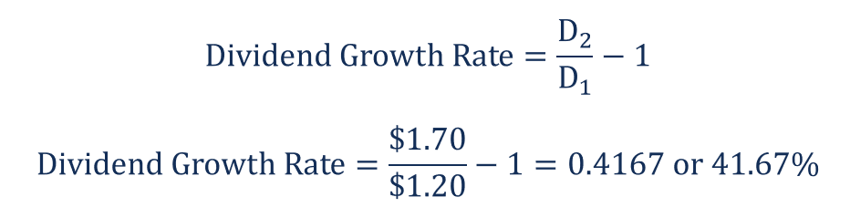

## Table of Contents

## What is a dividend?

A dividend is money that a company pays to its shareholders. It's like a reward for owning part of the company. When a company makes a profit, it can choose to share some of that profit with its shareholders instead of keeping it all for itself.

Companies usually pay dividends a few times a year. The amount you get depends on how many shares you own. If you own more shares, you get more money. Dividends can be a good way to earn extra income from your investments.

## What is the dividend growth rate?

The dividend growth rate is how fast a company's dividend payments are increasing over time. It's like checking how much more money you get from the company each year compared to the year before. If a company keeps raising its dividends, it shows that it's doing well and has confidence in its future earnings.

You can figure out the dividend growth rate by looking at the dividends from two different years and seeing how much they've grown. For example, if a company paid $1 per share last year and $1.10 this year, the growth rate would be 10%. This rate is important for investors because it helps them understand if their investment will keep giving them more money over time.

## Why is the dividend growth rate important for investors?

The dividend growth rate is important for investors because it shows how much more money they might get from their investment in the future. If a company keeps increasing its dividends, it means the company is doing well and expects to keep making more money. This can make investors feel more confident about keeping their money in that company.

Also, a growing dividend can help investors earn more income over time. If the dividends go up every year, the extra money can add up and make a big difference, especially for people who rely on their investments for regular income. So, looking at the dividend growth rate helps investors pick companies that might give them more money in the future.

## How do you calculate the dividend growth rate?

To calculate the dividend growth rate, you need to know the dividends paid in two different years. Let's say a company paid $1 per share last year and $1.10 this year. To find the growth rate, you subtract last year's dividend from this year's dividend, which gives you $0.10. Then, you divide that difference by last year's dividend, so $0.10 divided by $1 equals 0.10. Finally, you turn that into a percentage by multiplying by 100, which gives you a 10% growth rate.

This method works well for figuring out the growth rate over one year, but sometimes you might want to know the average growth rate over several years. To do this, you can use the compound annual growth rate (CAGR) formula. If a company paid $1 per share five years ago and now pays $1.50 per share, you can use the CAGR formula to find the average yearly growth rate. The formula is: CAGR = (Ending Value / Beginning Value)^(1 / Number of Years) - 1. Plugging in the numbers, it would be (1.50 / 1)^(1 / 5) - 1, which equals about 8.45%. This tells you the average yearly growth rate over those five years.

## What is the difference between simple and compound dividend growth rates?

The simple dividend growth rate looks at the increase in dividends from one year to the next. It's easy to calculate: you just take the difference between this year's dividend and last year's dividend, divide it by last year's dividend, and then turn it into a percentage. For example, if a company paid $1 per share last year and $1.10 this year, the simple growth rate would be 10%. This method is good for understanding short-term changes but doesn't tell you about the overall trend over many years.

The compound dividend growth rate, or CAGR, looks at the average yearly growth rate over a longer period. It takes into account the effect of compounding, where each year's increase builds on the previous year's growth. To calculate it, you use a formula that considers the starting and ending dividends and the number of years in between. For instance, if a company paid $1 per share five years ago and now pays $1.50 per share, the CAGR would show you the average yearly growth rate over those five years, which might be around 8.45%. This method gives you a better picture of long-term growth and is useful for planning future income from dividends.

## Can you provide an example of calculating the dividend growth rate for a single year?

Let's say a company paid $1 per share in dividends last year and this year they paid $1.10 per share. To find out the dividend growth rate for this year, you first take the difference between this year's dividend and last year's dividend. That's $1.10 minus $1, which equals $0.10. Then, you divide that $0.10 by last year's dividend of $1, which gives you 0.10. Finally, you turn that into a percentage by multiplying by 100, so the dividend growth rate for this year is 10%.

This simple calculation shows you how much more money you got from your shares this year compared to last year. It's a quick way to see if the company is doing better and paying more to its shareholders. If the growth rate is high, it could mean the company is doing well and might keep paying more in the future.

## How do you calculate the average dividend growth rate over multiple years?

To calculate the average dividend growth rate over multiple years, you use the compound annual growth rate (CAGR) formula. This formula helps you see how much the dividends grew each year on average, taking into account the effect of compounding. Let's say a company paid $1 per share five years ago and now pays $1.50 per share. To find the average yearly growth rate, you use the formula: CAGR = (Ending Value / Beginning Value)^(1 / Number of Years) - 1. Plugging in the numbers, it would be (1.50 / 1)^(1 / 5) - 1, which equals about 8.45%. This means the dividends grew by about 8.45% each year on average over those five years.

Using the CAGR is important because it gives you a better idea of how well the company is doing over time. It shows you the steady growth rate that would get you from the starting dividend to the ending dividend. This can help you plan for future income from your investments. If the average growth rate is high, it might mean the company is doing well and could keep paying more dividends in the future.

## What are the limitations of using historical dividend growth rates to predict future performance?

Using historical dividend growth rates to predict future performance can be tricky because past results don't always mean the same thing will happen in the future. A company might have had a high growth rate in the past, but things like changes in the economy, new competition, or problems within the company can make it hard to keep that up. For example, if a company was growing fast because it was the only one selling a new product, but now others are selling similar products, it might not be able to keep increasing its dividends as quickly.

Also, looking at historical growth rates doesn't tell you everything about a company's future plans. Sometimes, a company might decide to use its profits to grow the business instead of paying out more dividends. Or, it might have to deal with big costs that make it harder to increase dividends. So, while historical growth rates can give you some ideas about what might happen, they are just one piece of the puzzle and shouldn't be the only thing you look at when trying to guess what a company will do next.

## How does the dividend growth rate relate to the Gordon Growth Model?

The Gordon Growth Model, also called the Dividend Discount Model, is a way to figure out how much a stock is worth based on its future dividends. It uses the dividend growth rate to help with this. The model says that the value of a stock is the yearly dividend divided by the difference between the required rate of return and the dividend growth rate. If you think the dividends will keep growing at the same rate every year, this model can tell you what the stock should be worth today.

But, the Gordon Growth Model only works if you believe the dividend growth rate will stay the same forever. This can be a big problem because things change, and a company might not keep growing its dividends at the same speed. If the growth rate changes, the model won't be right anymore. So, while the dividend growth rate is a key part of the Gordon Growth Model, you have to be careful and think about whether it's really likely to stay the same in the future.

## What factors can influence a company's dividend growth rate?

A company's dividend growth rate can be affected by many things. One big thing is how much money the company is making. If a company is doing well and making more profit, it might decide to share some of that extra money with its shareholders by increasing the dividends. But if the company is not doing so well, it might have to keep the dividends the same or even lower them. Another thing that can change the dividend growth rate is what the company decides to do with its money. If it wants to grow bigger or buy new things, it might use the money for that instead of paying more dividends.

Also, things outside the company can make a difference. For example, if the economy is doing well, people might buy more of the company's products, which could lead to more profits and higher dividends. But if the economy is not doing well, the company might struggle to make money, and the dividends might not grow as fast. Competition can also play a role. If other companies start selling similar products and taking away customers, it might be harder for the company to keep growing its dividends. So, a lot of different things can affect whether a company's dividends go up, stay the same, or go down.

## How can investors use the dividend growth rate to assess the sustainability of a company's dividends?

Investors can use the dividend growth rate to see if a company's dividends are likely to keep going up in the future. If the dividend growth rate has been steady or going up over the years, it might mean the company is doing well and making enough money to keep paying more to its shareholders. This can make investors feel more confident that the company will keep paying dividends and maybe even raise them. But if the growth rate is going down or changing a lot, it could be a sign that the company is having trouble making money, and the dividends might not be as safe.

It's also important to look at why the dividend growth rate is what it is. If a company is growing its dividends because it's making more money, that's a good sign. But if it's just using money it saved up before, or borrowing money to pay dividends, that might not last. So, investors should check if the company's profits are going up along with the dividends. If they are, it's a better sign that the dividends will keep growing. If not, the company might have to cut the dividends later, which would not be good for investors.

## What advanced techniques can be used to forecast future dividend growth rates?

One advanced technique to forecast future dividend growth rates is using regression analysis. This method looks at past data to find patterns and then uses those patterns to predict what might happen next. For example, you could use historical data on a company's earnings, sales, and dividends to see how they've changed together over time. If you find that when earnings go up, dividends tend to go up too, you can use that relationship to guess future dividend growth based on expected future earnings. This can be a bit tricky because it relies on the past being a good guide for the future, but it can give you a more detailed prediction than just looking at the past growth rates.

Another technique is scenario analysis, which involves creating different possible futures for the company and seeing how the dividend growth rate might change in each one. For instance, you might make one scenario where the economy does well, another where it does poorly, and a third where a new competitor enters the market. By figuring out how the company's dividends might change in each of these situations, you can get a sense of how likely different growth rates are. This method helps you think about what could happen and plan for different possibilities, which can be really useful for making smarter investment choices.

## What is Understanding Dividend Growth?

Dividend growth is a significant consideration for investors who focus on generating income from their investments. It represents the annualized rate of increase in the dividends paid out by a company, showcasing its ability to enhance shareholder value over time.

Understanding how to calculate the dividend growth rate is critical. The formula for the dividend growth rate ($g$) using historical dividend data is:

$$

g = \left( \frac{D_n}{D_0} \right)^{\frac{1}{n}} - 1 
$$

where $D_n$ is the most recent dividend, $D_0$ is the dividend from $n$ years ago, and $n$ is the number of years over which the growth is measured. This exponential growth formula accounts for the compounding effect of dividend increases over time.

Investors look for companies that not only pay consistent dividends but also exhibit a history of consistent dividend growth. Companies capable of growing their dividends typically demonstrate financial health and strong cash flows, which can be indicative of stable long-term profitability. For example, businesses in defensive industries—such as consumer staples and utilities—often maintain robust dividend growth profiles, appealing to income-oriented investors.

Dividend growth is also a key [factor](/wiki/factor-investing) in stock valuation, particularly through models like the Gordon Growth Model (GGM), which assesses the value of a stock based on its future series of dividends that grow at a constant rate. The GGM formula is:

$$

P = \frac{D_1}{r - g} 
$$

where $P$ is the current stock price, $D_1$ is the expected dividend next year, $r$ is the required rate of return, and $g$ is the dividend growth rate.

The history and sustainability of a company's dividend payments can offer insights into its future performance. A consistently increasing dividend is often seen as a signal of financial health and effective management, making it an essential factor for investors aiming to build wealth through dividend reinvestment and compounded growth.

Analyzing a company's past dividend growth is not just a retrospective task but a forward-looking strategy that can potentially reveal significant investment opportunities. Companies with a strong track record of dividend growth are more likely to continue the trend, provided they operate in stable sectors and maintain sound financial practices. Therefore, dividend growth remains a cornerstone principle for income-focused investors striving for a sustainable and growing income stream.

## What are the essentials of investment calculation?

Sound financial calculations lie at the heart of making informed investment decisions. Understanding these calculations enables investors to evaluate potential returns accurately and assess associated risks, which is crucial for developing a tailored investment strategy. This section explores fundamental concepts such as the compound annual growth rate (CAGR), dividend yield, and the tax implications on dividends, each indispensable to the investment process.

The compound annual growth rate (CAGR) is a vital metric used to measure an investment's mean annual growth rate over a specified time period longer than one year. It is crucial for comparing the historical performance of investments. The formula for CAGR is given by:

$$
\text{CAGR} = \left( \frac{V_{\text{end}}}{V_{\text{start}}} \right)^{\frac{1}{n}} - 1
$$

where $V_{\text{end}}$ and $V_{\text{start}}$ are the ending and starting values of the investment, respectively, and $n$ is the number of years.

The dividend yield is another key calculation that helps investors understand the return on investment from dividends alone, independent of share price changes. It is expressed as a percentage and is calculated as:

$$
\text{Dividend Yield} = \frac{\text{Annual Dividends per Share}}{\text{Price per Share}} \times 100
$$

A higher dividend yield may indicate a potentially strong return from dividends but could also signal underlying risks if the yield is high due to a falling share price. Therefore, dividend yield should be considered alongside the company's dividend growth history and financial health.

Tax implications on dividends vary by jurisdiction, but understanding them is crucial for net return calculations. In many countries, dividends are taxed at a different rate than regular income, often with preferential rates. Investors should factor these tax implications into their after-tax return calculations to align with their financial goals effectively.

Various financial tools and calculators are available to automate these calculations, enhancing the efficiency of investment planning. For example, Python offers robust libraries like NumPy and Pandas for financial analysis. Below is a basic example to calculate CAGR in Python:

```python
def calculate_cagr(start_value, end_value, years):
    return (end_value / start_value) ** (1 / years) - 1

start_value = 1000
end_value = 2000
years = 5

cagr = calculate_cagr(start_value, end_value, years)
print(f"The CAGR is {cagr:.2%}")
```

Tools like these simplify the complex calculations required in investment analysis, allowing investors to focus more on strategy formulation. In summary, mastering these financial calculations equips investors with the ability to make informed decisions, thus optimizing their investment portfolios for enhanced outcomes.

## What are some case studies and practical applications?

Case studies provide invaluable insights into how investment strategies can be practically applied to generate wealth. Several successful investors illustrate the effectiveness of dividend growth, investment calculations, and algorithmic trading.

### Dividend Growth: The Case of Johnson & Johnson

Johnson & Johnson (J&J) is a prime example of a company that has successfully implemented a dividend growth strategy. Over the past few decades, J&J has consistently increased its dividend payouts, making it a favorite among income-focused investors. The formula for calculating the Dividend Growth Rate is:

$$
\text{Dividend Growth Rate} = \left(\frac{\text{Dividend in the current year}}{\text{Dividend in the previous year}} - 1\right) \times 100
$$

Investors who identified J&J's reliable dividend growth early have benefited from compounded returns. The key takeaway here is the importance of analyzing a company's history of dividend payments to ascertain its potential for future earnings and its commitment to returning value to shareholders.

### Investment Calculations: Warren Buffett's Approach

Warren Buffett's investment strategy emphasizes the importance of sound financial calculations. One of his core principles is understanding the intrinsic value of a company compared to its market price. This can be assessed through the calculation of the Compound Annual Growth Rate (CAGR):

$$
\text{CAGR} = \left( \frac{\text{Ending Value}}{\text{Beginning Value}} \right)^{\frac{1}{n}} - 1
$$

where $n$ represents the number of years. By focusing on fundamental analyses and investment calculations, Buffett has consistently outperformed the market. The lesson here is the significance of using accurate financial metrics to evaluate investment opportunities thoroughly.

### Algorithmic Trading: Renaissance Technologies

Renaissance Technologies, founded by Jim Simons, operates on the forefront of algorithmic trading. The firm utilizes advanced mathematical models and data analysis to execute trades with remarkable precision. For example, a momentum trading algorithm may be implemented in Python as follows:

```python
import pandas as pd

# Assume 'data' is a pandas DataFrame containing historical stock prices
data['Returns'] = data['Close'].pct_change()
data['Signal'] = 0
data['Signal'][data['Returns'] > 0] = 1 

data['Position'] = data['Signal'].shift()
data['StrategyReturns'] = data['Returns'] * data['Position']

cumulative_strategy_returns = (1 + data['StrategyReturns']).cumprod() - 1
```

Renaissance Technologies leverages algorithmic strategies like these to minimize human error and optimize trading efficiency. Investors can learn from this approach by integrating technology-driven insights to enhance decision-making processes.

### Lessons Learned

From these case studies, several actionable insights emerge:
1. **Dividend Growth**: Focus on companies with a proven track record of increasing dividend payments for long-term revenue growth.
2. **Investment Calculations**: Utilize financial metrics like CAGR and Dividend Yield to objectively assess investment viability.
3. **Algorithmic Trading**: Incorporate automated systems to exploit market inefficiencies and improve trade execution timing.

By studying these strategies, investors can refine their approaches to investing, effectively tailoring them to align with their financial objectives and risk appetites. These case studies serve not only as inspirational success stories but as practical blueprints that can guide investors in their financial journeys.

## References & Further Reading

[1]: Gordon, M. J. (1959). ["Dividends, Earnings, and Stock Prices."](https://www.jstor.org/stable/1927792) The Review of Economics and Statistics, 41(2), 99-105.

[2]: ["The Intelligent Investor: The Definitive Book on Value Investing"](https://www.amazon.com/Intelligent-Investor-3rd-Ed/dp/0063356724) by Benjamin Graham

[3]: Sharpe, W. F., Alexander, G. J., & Bailey, J. V. (1999). ["Investments."](https://archive.org/details/investments0000shar) Prentice Hall.

[4]: Asness, C. S. (1994). ["Variables that Explain Stock Returns."](https://www.semanticscholar.org/paper/Variables-that-explain-stock-returns-%3A-simulated-Asness/61f9cdcf444a82cf1dbb5abe9e0483404e8aa0aa) The American Economic Review, 83(3), 947-971.

[5]: ["Algorithmic Trading & DMA: An Introduction to Direct Access Trading Strategies"](https://www.amazon.com/Algorithmic-Trading-DMA-introduction-strategies/dp/0956399207) by Barry Johnson