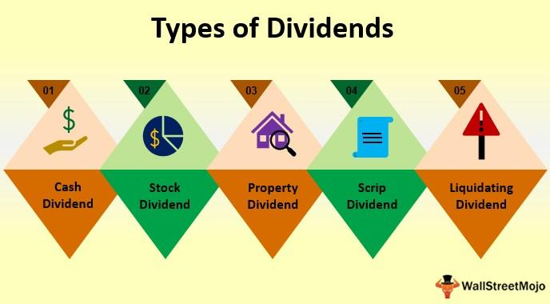

Investing is a crucial part of personal and institutional financial strategies, aiming to enhance wealth and achieve financial goals over the long term. A diversified investment strategy is vital as it helps balance risks and potentially improve returns by spreading investments across various asset classes and financial instruments. Among the myriad of investment options, dividends, interest payments, mutual funds, and algorithmic trading play significant roles, each offering unique advantages and challenges.

Dividends and interest payments are fundamental components of investment income. Dividends are payments made by a corporation to its shareholders, typically derived from profits, representing a shareholder's right to a portion of the company's earnings. In contrast, interest payments are compensation for lending money, often associated with bonds and fixed-income securities. Both serve to provide a steady income stream, essential for investors seeking regular returns without liquidating their holdings.

Mutual funds offer another avenue of investment, pooling resources from multiple investors to collectively invest in diversified portfolios of stocks, bonds, or other securities. This allows investors to partake in a wide range of assets under professional management, reducing individual risk and elevating potential returns. Mutual funds can be tailored to various investment goals through their structured diversification.

Algorithmic trading, or algo trading, represents a significant evolution in investment strategies, leveraging computer algorithms to execute trades at high speeds and frequencies. This technology-driven approach can process vast amounts of market data and identify opportunities with precision, overshadowing traditional trading methods in terms of efficiency and accuracy. The integration of artificial intelligence and machine learning further enhances these capabilities, promising adaptive strategies in dynamic market environments.

The modern landscape of investing has been progressively shaped by technological and financial innovations. These developments allow for more refined strategies that not only optimize returns but also mitigate risks associated with market volatility and economic uncertainties. The purpose of this article is to examine the aforementioned investment concepts and illustrate their interrelations, shedding light on how contemporary investors can strategically integrate them to construct robust portfolios tailored to their risk tolerance and financial aspirations.

## Table of Contents

## Understanding Dividends and Interest Payments

Dividends and interest payments are fundamental concepts in investment, providing investors with two primary sources of regular income. Understanding their mechanisms and differences is crucial for optimizing investment strategies.

**Dividends:**

Dividends are distributions of a portion of a company's earnings to eligible shareholders, typically paid on a quarterly basis. They serve as a reward to investors for their capital investment in the company. Companies that consistently generate profits often distribute dividends as a way to share financial success with shareholders. The decision to pay dividends, and the size of the dividend, is determined by the company's board of directors.

Sources of dividends mainly include stocks, where companies share a proportion of their profits with shareholders. Additionally, dividend funds, such as mutual funds or exchange-traded funds (ETFs) that invest in dividend-paying stocks, provide another source. These funds enable investors to receive a steady inflow of dividends from a diversified portfolio, reducing individual company risks.

**Interest Payments:**

Interest payments are regular compensation for lending money, commonly associated with bonds and fixed-income securities. When investors purchase bonds, they are essentially lending money to the bond issuer, often a corporation or government entity. In return, the issuer agrees to pay a fixed rate of interest over a specified period, culminating in the repayment of the bond's principal at maturity.

Bonds, savings accounts, and certificates of deposit (CDs) are primary examples of investment vehicles offering interest payments. These instruments are generally considered lower-risk compared to equities, providing predictable streams of income.

**Comparison:**

While both dividends and interest provide income, they differ in security and predictability. Dividends depend on company performance and board decisions, leading to potential variability. In contrast, interest payments are typically fixed and predetermined, offering more certainty. However, this comes at the cost of generally lower returns compared to equities, which have the potential for capital appreciation and growing dividends over time.

**The Role of Regular Income:**

Incorporating regular income through dividends and interest in an investment portfolio is pivotal for yield-focused investors. This income stream can be reinvested to benefit from compounding or used to satisfy cash flow needs. Diversifying income sources through both dividends and fixed-income securities helps balance risk and return, catering to varying investor preferences. A strategic allocation that includes these income sources can enhance portfolio stability and provide a buffer during market [volatility](/wiki/volatility-trading-strategies).

In conclusion, dividends and interest payments are indispensable elements within investment strategies, offering varied risk-return profiles. A thorough understanding aids in selecting the appropriate balance for sustaining income, managing risk, and achieving financial goals.

## Mutual Funds: A Deep Dive

Mutual funds are investment vehicles that pool capital from multiple investors to purchase a diversified portfolio of securities, such as stocks, bonds, and other financial instruments. They are managed by professional portfolio managers who allocate the fund's assets in accordance with the fund's investment objectives and strategy. Mutual funds play a crucial role in the investment landscape, offering individual and institutional investors an avenue to diversify their investment portfolios and access professional management and analysis.

There are several types of mutual funds, each catering to different investment objectives and risk tolerances:

1. **Equity Funds**: These funds primarily invest in stocks and aim for capital appreciation. They come in various sub-types, such as growth funds, which focus on high-growth companies, and value funds, which target undervalued stocks.

2. **Bond Funds**: Also known as fixed-income funds, these invest primarily in bonds and other debt instruments. They offer investors regular income, typically in the form of interest payments, and are generally considered less risky than equity funds.

3. **Hybrid Funds**: These funds invest in a mix of stocks, bonds, and other securities, combining elements of both equity and bond funds. They aim to provide both income and capital appreciation, achieving a balanced risk-return profile.

4. **Index Funds**: These are designed to replicate the performance of a specific index, such as the S&P 500. They typically have lower management fees compared to actively managed funds and are popular among investors seeking broad market exposure with minimal costs.

Investing in mutual funds offers several advantages:

- **Diversification**: By investing in a variety of assets, mutual funds help reduce the impact of poor performance by a single security, thereby lowering overall portfolio risk.

- **Professional Management**: Investors benefit from the expertise of professional fund managers who conduct thorough market research and analysis to make informed investment decisions.

When analyzing mutual fund investments, it is essential to consider both risk and return. Mutual funds come with varying levels of risk, linked to the underlying securities in their portfolios. For instance, equity funds typically exhibit higher volatility and potential returns compared to bond funds. Understanding the risk-return trade-off is crucial for aligning fund investments with personal financial goals and risk tolerance.

Mutual funds distribute income to their investors in two primary forms: dividends and interest. Dividends are typically paid from the income generated by the stocks held within the fund's portfolio. Interest is distributed from the income earned on bonds and other debt securities within the fund. These distributions can be reinvested in additional fund shares or received as cash payouts, depending on the investor's preference. 

Mutual funds, thus, provide a versatile and flexible investment option capable of achieving diversified exposure while benefiting from expert management, essential for both novice and seasoned investors striving for long-term financial success.

## The Emergence of Algorithmic Trading

Algorithmic trading, commonly referred to as algo trading, has revolutionized the financial markets by utilizing computer algorithms to execute trades systematically and efficiently. Its origins trace back to the development of electronic trading platforms and the increasing computational power available, which allowed for the processing of vast amounts of data at unprecedented speeds. The rise of algo trading can be attributed to its ability to capitalize on market inefficiencies and provide [liquidity](/wiki/liquidity-risk-premium), as well as the growing demand for speed and precision in financial transactions.

Algo trading operates through preprogrammed instructions that can include variables such as timing, price, quantity, and other mathematical models. Strategies employed in [algorithmic trading](/wiki/algorithmic-trading) vary widely and can be broadly categorized into market-making, statistical [arbitrage](/wiki/arbitrage), [trend following](/wiki/trend-following), and mean reversion, among others. For instance, arbitrage strategies may exploit price differentials of the same asset across different markets, while trend following strategies attempt to capitalize on the continuance of an existing market trend.

Technologically, algo trading relies heavily on advanced hardware and software systems. High-frequency trading ([HFT](/wiki/high-frequency-trading-strategies)) is one subset of algo trading that leverages ultrafast execution speeds, often needing infrastructure located in close proximity to exchanges to minimize latency. In terms of software, a combination of algorithms, [machine learning](/wiki/machine-learning) models, and data analytics tools are employed to enhance decision-making and improve trading outcomes.

The impact of algo trading on traditional investment methods has been profound. It has increased the complexity and efficiency of markets and altered the roles of traders and market analysts. Traditional methods, which relied extensively on human intuition and slower decision processes, have had to adapt to remain competitive in the new landscape dominated by algorithms. This adaptation often involves integrating technological and analytical tools into their processes to improve performance.

One of the key benefits of algo trading is its ability to execute trades with remarkable speed and accuracy, significantly reducing transaction time compared to traditional methods. This increased speed allows traders to benefit from fleeting opportunities in the market. Additionally, algo trading minimizes human emotional involvement, which can often lead to errors in decision-making. By relying on predefined rules and parameters, algorithmic systems are less prone to the biases and psychological pitfalls that human traders face.

However, despite these advantages, algo trading does present several risks and challenges. One notable risk is the potential for systemic errors due to faults in programming or unexpected market conditions, which can lead to significant losses. The infamous "flash crash" of 2010 is an example of how rapid, algorithm-driven sell-offs can temporarily disrupt markets. Furthermore, the complexity and opacity of some algorithms can lead to scenarios where the risk is not fully understood by those who deploy them. Maintaining the integrity and reliability of trading systems, as well as ensuring compliance with regulatory frameworks, are ongoing challenges for the industry.

In conclusion, while algorithmic trading offers enhanced speed, accuracy, and a reduction in human-related errors, it requires sophisticated technology and rigorous risk management. Understanding both its potential and limitations is essential for those participating in modern financial markets.

## Integrating Investment Strategies: Dividends, Mutual Funds, and Algo Trading

Investment strategies today often combine dividends, mutual funds, and algorithmic trading to create diversified portfolios aimed at maximizing returns while mitigating risk. Integrating these elements requires a strategic approach to meet both short-term and long-term investment objectives.

**Dividends and Interest Payments in Mutual Fund Strategies**

Dividends and interest payments serve as foundational income sources in mutual fund strategies. Mutual funds, especially income-focused ones like bond funds or dividend-oriented equity funds, distribute dividends and interest accrued from underlying securities to investors. These payments can be reinvested to compound growth or withdrawn as a steady income stream. For example, bond funds generate interest income through government or corporate bond holdings, which are periodically distributed to fund investors.

Mutual funds strategically select a mix of high-dividend stocks and dependable bonds to balance income generation and risk exposure. By doing so, they cater to investors seeking regular payouts without the volatility of direct equity investment.

**Influence of Algorithmic Trading on Modern Mutual Funds**

Algorithmic trading has revolutionized the execution and management of mutual funds by enabling rapid, data-driven decisions. By adopting advanced algorithms, fund managers can execute trades at optimal prices and with greater efficiency. These algorithms analyze vast datasets for patterns and predictions, anticipating market movements. For instance, algorithms can swiftly rebalance fund portfolios in response to market volatility, ensuring alignment with desired investment objectives.

**Examples of Hybrid Strategies**

A practical illustration of hybrid strategies is exchanged-traded funds (ETFs), which often use algorithmic models to maintain a target allocation of dividend-paying stocks and bonds. Another example includes Robo-advisors, which combine dividend and interest strategies within digital platforms using algorithmic input to offer personalized portfolios.

**Potential for Enhanced Returns**

Strategically integrating dividends, mutual funds, and algorithmic trading can boost portfolio performance. Investors benefit from diversified income sources and the precision of algorithmic decisions. For instance, algorithms detecting undervalued dividend stocks can prompt timely acquisitions, enhancing return potential without human biases. Additionally, mutual funds leveraging algorithmic trading can dynamically adjust to market conditions, capturing growth while shielding assets during downturns.

**Market Conditions and Investor Goals**

When integrating these strategies, it is crucial to consider prevailing market conditions and individual investor goals. Market volatility can affect dividend yields and bond interest rates, necessitating flexible strategies. An investor prioritizing income may tilt towards high-dividend mutual funds, whereas a growth-focused investor might prefer funds using aggressive algorithmic trading strategies to capitalize on market gains.

In essence, a seamless integration of dividends, mutual funds, and algorithmic trading creates a robust framework catering to diverse investor needs. By aligning these elements with prevailing market conditions and individual goals, investors can achieve optimized returns and strategic diversification.

## Technological Advances: The Future of Investing

Innovations in investment technology are significantly transforming how dividends and mutual funds operate, enhancing both accessibility and efficiency. The advancement of financial technology (fintech) platforms has facilitated easier management and distribution of dividends, particularly within mutual fund frameworks. Automation and data analysis have optimized the calculation and delivery of dividend payouts, enabling investors to receive timely updates on their returns. Additionally, robo-advisors are leveraging algorithms to manage funds, offering personalized investment strategies that incorporate dividend-paying stocks, thus facilitating strategic asset allocation tailored to individual risk preferences and financial goals.

The integration of Artificial Intelligence (AI) and machine learning in algorithmic trading is reshaping the future of financial markets. AI algorithms are capable of processing vast datasets at unprecedented speeds, identifying trading patterns and opportunities that humans might overlook. This capability enhances the accuracy and execution speed of trades, reducing transaction costs and potentially improving returns. For example, machine learning algorithms can analyze historical price data and economic indicators to forecast stock movements, thereby informing dividend strategy decisions. Such algorithms continuously improve through exposure to new data, offering adaptive strategies that evolve with market conditions.

Technological advancements also empower investors to make informed decisions through improved data accessibility and analysis tools. Platforms that aggregate financial news, stock performance data, and analysis from various sources provide investors with comprehensive insights into market trends. These tools often include visual analytics, allowing investors to quickly interpret complex data sets and make prudent investment decisions. Moreover, blockchain technology offers transparent and secure transaction recording, increasing trust in dividends payments and mutual fund transactions.

To remain competitive, it is crucial for investors to stay updated with technological trends. The rapid pace of innovation necessitates that both individual and institutional investors regularly evaluate new tools and platforms that can enhance their investment strategies. Continuous learning and adaptation to new technologies enable investors to capitalize on emerging opportunities and mitigate potential risks in a dynamic market environment.

Looking ahead, investment strategies over the next decade are likely to become increasingly technology-driven. AI and machine learning will continue to refine algorithmic trading, potentially leading to the development of fully autonomous trading models that minimize human intervention. Additionally, the increasing availability of big data is expected to enhance predictive analytics, offering deeper insights into market dynamics and reinforcing data-driven investment approaches. The use of decentralized finance (DeFi) platforms may also grow, providing more direct and efficient access to financial services, including investments with automated dividend reinvestment options. Ultimately, the integration of technological innovations will not only expand the possibilities for diversified investment strategies but also democratize access to sophisticated financial tools, promoting inclusivity in the investment landscape.

## Conclusion

In conclusion, the landscape of investing has evolved significantly, integrating both traditional elements such as dividends and interest payments with modern strategies like mutual funds and algorithmic trading. Dividends and interest payments continue to play a crucial role in providing regular income to investors, serving as a foundation for wealth accumulation and financial stability. Mutual funds offer a diversified approach to investing, allowing investors to benefit from professional management and a broad exposure to various asset classes. Algorithmic trading has further revolutionized the investment world by enhancing the efficiency and precision of trading operations.

A balanced approach, which harmonizes these various elements, is essential for modern investors. Such an approach not only maximizes potential returns but also mitigates risks, providing a robust defense against market volatility. Integrating traditional and modern strategies allows investors to leverage the stability of dividends and interest with the dynamic growth opportunities presented by mutual funds and algorithmic trading.

As market trends and technologies continue to develop, it's vital for investors to remain adaptable. Embracing innovation while maintaining the core principles of diversification and risk management ensures that one's investment strategy is well-positioned for future success. Investors are encouraged to conduct thorough research and continually refine their personal strategies, taking into account their financial goals and the ever-changing economic landscape. This proactive stance will enable them to harness the benefits of both time-tested and cutting-edge investment methods.

## References & Further Reading

[1]: ["The Intelligent Investor: The Definitive Book on Value Investing"](https://www.amazon.com/Intelligent-Investor-Definitive-Investing-Essentials/dp/0060555661) by Benjamin Graham and Jason Zweig

[2]: Elton, E. J., Gruber, M. J., Brown, S. J., & Goetzmann, W. N. (2014). ["Modern Portfolio Theory and Investment Analysis"](https://books.google.com/books/about/Modern_Portfolio_Theory_and_Investment_A.html?id=181CEAAAQBAJ) (9th Edition). 

[3]: ["Algorithmic Trading: Winning Strategies and Their Rationale"](https://www.wiley.com/en-us/Algorithmic+Trading%3A+Winning+Strategies+and+Their+Rationale-p-9781118460146) by Ernest P. Chan

[4]: Poterba, J. M. (2001). ["The Rise of the 'Equity Culture': U.S. Stock Ownership Patterns"](http://piketty.pse.ens.fr/files/PoterbaRESta2001.pdf) National Bureau of Economic Research.

[5]: Mullin, K. (2011). ["Mutual Funds for Dummies"](https://www.oreilly.com/library/view/mutual-funds-for/9780470623213/pr06.html) 7th Edition by Eric Tyson

[6]: ["Machine Learning in Finance: From Theory to Practice"](https://link.springer.com/book/10.1007/978-3-030-41068-1) by Matthew F. Dixon, Igor Halperin, and Paul Bilokon

[7]: Fama, E. F., & French, K. R. (1992). ["The Cross-Section of Expected Stock Returns."](https://onlinelibrary.wiley.com/doi/abs/10.1111/j.1540-6261.1992.tb04398.x) Journal of Finance, 47(2), 427–465.