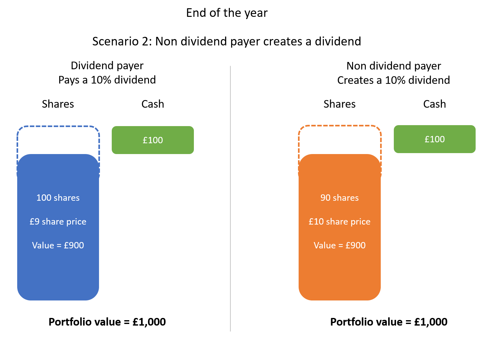

In today’s diversified investment world, it is crucial for investors to choose strategies that align with their long-term objectives and risk tolerance. Among these strategies, dividend investing has become increasingly popular due to its potential to provide steady income. This approach involves purchasing shares in companies that regularly distribute a portion of their earnings to shareholders in the form of dividends. Such companies often exhibit strong financial health and stability, attributes that tend to reassure investors during periods of market volatility.

Conversely, the rise of algorithmic trading, or algo trading, has introduced a sophisticated method for optimizing investment returns. By utilizing advanced computational tools, algorithmic trading can enhance decision-making processes, allowing for precise execution of trades based on multiple factors and data points.



This article explores the intersection of dividend investing and algorithmic trading, examining how these methods can be synergistically combined to establish a robust investment strategy. Understanding the fundamentals of dividend investing, including its typical return profiles and the types of investors who benefit from this strategy, is essential for leveraging its potential. Additionally, we will investigate how algorithmic trading can be utilized to enhance dividend strategies. The aim is to form a balanced portfolio that capitalizes on both steady income from dividends and growth opportunities derived from strategic trading.

By integrating the reliable income generation of dividend investing with the dynamic capabilities of algorithmic trading, investors may be able to create a strategy that not only meets but exceeds their financial goals.

## Table of Contents

## Understanding Dividend Investing

Dividend investing is a method where investors buy shares in companies that regularly distribute a portion of their earnings to shareholders as dividends. This strategy primarily appeals to investors seeking a steady stream of income, often through dividends paid quarterly. These regular payouts provide a predictable income, which is especially attractive to retirees or those seeking financial stability through investments.

### Financial Health and Stability

Companies that consistently pay dividends often demonstrate robust financial health and stability. These companies usually have strong cash flows, solid earnings, and a commitment to returning capital to shareholders. During periods of market [volatility](/wiki/volatility-trading-strategies), dividend-paying stocks can provide reassurance as they often belong to established firms with stable business models. Moreover, the ability to maintain or increase dividend payments over time is an indicator of management's confidence in the company's financial strength.

### Dividend Reinvestment Plans (DRIPs)

One of the advantages of dividend investing is the potential for compounding returns through Dividend Reinvestment Plans (DRIPs). DRIPs allow investors to automatically reinvest their dividends by purchasing additional shares of the company's stock. This reinvestment can enhance the overall return on investment as it benefits from the compound growth effect without the investor needing to make additional capital contributions. Over time, as more dividends are reinvested and additional shares are accumulated, the growth potential of the original investment can be significantly amplified.

### Advantages and Disadvantages

Dividend stocks can act as 'shock absorbers' during market fluctuations. The regular income from dividends can offset some of the volatility experienced in equity markets, providing a cushion against market downturns. However, there are potential downsides to consider. Companies that pay high dividends might have less capital available for reinvestment into their business operations, which could limit their growth potential. As a result, these stocks may lag behind non-dividend-paying stocks in terms of capital appreciation.

The choice between high dividend yield and dividend growth is pivotal. High-yield dividend stocks offer immediate income, but they might pose higher risks if the companies cannot sustain their payouts due to changing economic conditions or company-specific issues. On the other hand, dividend [growth stocks](/wiki/growth-stocks) focus on companies with a record of increasing dividends over time, potentially providing a balance between income and growth but generally offering lower initial yield.

### Mathematical Representation

Mathematically, the total return from a dividend-paying stock can be expressed as:

$$
\text{Total Return} = \left( \frac{\text{End Price} - \text{Start Price}}{\text{Start Price}} \right) + \left( \frac{\text{Dividend Payment}}{\text{Start Price}} \right)
$$

This formula articulates how the stock’s price appreciation and dividends contribute to an investor’s total return.

Dividend investing presents a valuable strategy for those seeking income and lower volatility, but it requires careful analysis of both company fundamentals and macroeconomic conditions to effectively balance risks and returns.

## Types of Dividend Strategies

Dividend strategies offer a diverse array of options tailored to meet various investor goals and risk tolerances. Prominent among these strategies are dividend growth strategies, high-yield strategies, and the dividend aristocrat approach. Each strategy stands distinct in its risk-reward profile and potential impact on portfolio performance.

**Dividend Growth Strategies:**
Dividend growth strategies focus on investing in companies that consistently increase their dividend payouts over time. Companies that exhibit steady growth in dividends typically demonstrate healthy earnings growth, sound financial management, and robust business models. This strategy aligns well with investors who are more interested in capital appreciation alongside income generation, as reinvesting dividends from growing stocks compounds both dividend and capital gains. The assumption is that a consistent increase in dividends signals a business with long-term growth prospects.

**High-Yield Strategies:**
High-yield strategies prioritize investments in stocks that offer dividend yields surpassing the market average. These stocks might be found in sectors like utilities, real estate investment trusts (REITs), or telecoms, which have stable cash flows suitable for high dividend payouts. While high yields can represent an attractive immediate income source, they often come with higher risk as they could indicate business stagnation or prospects of dividend cuts. The strategy is particularly appealing to income-focused investors prioritizing cash flow from their portfolios.

**Dividend Aristocrat Approach:**
The dividend aristocrat strategy seeks investments in companies with a long-standing history of increasing dividends, at least for the past 25 consecutive years. Such companies are generally large-cap, high-quality companies with a track record of withstanding economic fluctuations. This approach offers a blend of reliability and steady income, making it appealing for conservative investors valuing stability and solid growth over time.

Diversification is instrumental across these strategies to manage risk effectively. By diversifying dividend stocks across various sectors—such as consumer goods, healthcare, and technology—investors can mitigate sector-specific risks and enhance the resilience of their portfolios. Diversification within dividend strategies ensures the impact of any singular stock or sector downturn is softened by the performance of others, maintaining steady overall returns.

In summary, understanding and choosing the right dividend strategy is crucial for aligning one's investment portfolio with financial goals. Whether seeking income, growth, or a combination, diversifying investments can significantly improve results by spreading risk across different sectors and market conditions.

## The Role of Algorithmic Trading in Dividend Strategies

Algorithmic trading, characterized by its speed and precision, offers significant advantages in optimizing dividend investment strategies. By leveraging advanced computational tools, algorithms can analyze vast datasets to automate and enhance decision-making processes concerning the purchase and sale of dividend-paying stocks.

### Optimizing Buying and Selling Points

Algorithms can identify optimal buying and selling points by analyzing various factors such as dividend yield, payout ratios, stock price movements, and market volatility. The efficiency of [algorithmic trading](/wiki/algorithmic-trading) lies in its ability to process these complex data sets swiftly, allowing investors to capitalize on market fluctuations and achieve favorable returns.

For instance, an algorithm can prioritize stocks with a high dividend yield while assessing their payout ratios to ensure sustainability. If a company's dividend yield is exceptionally high relative to its peers, the algorithm might flag this as a potential opportunity but will also consider the payout ratio to evaluate the likelihood of future dividend payments.

### Automating Dividend Capture and Reinvestment Strategies

Algorithmic trading can enhance dividend capture strategies, where investors aim to buy stocks before the ex-dividend date to receive the dividend and sell them immediately afterward. Algorithms can effectively time these trades to maximize gains from dividend payments while minimizing the holding period, reducing exposure to market risk.

Additionally, reinvestment strategies, such as Dividend Reinvestment Plans (DRIPs), can be automated using algorithms. By automatically reinvesting received dividends into purchasing additional shares, algorithms can exploit compounding effects and increase the portfolio's overall return over time.

### Example Scenarios

Consider a scenario where an algorithm tracks not only dividend yields and payout ratios but also macroeconomic indicators and sentiment analysis from social media and news outlets. In such a case, the algorithm might make dynamic adjustments to foreign exchange risks or inflation expectations that could impact dividend payments, ensuring more stable returns.

In another scenario, an algorithm could apply [machine learning](/wiki/machine-learning) models to predict stock price movements based on historical patterns and real-time data, enabling investors to time their entry and [exit](/wiki/exit-strategy) points more precisely. By combining these models with fundamental dividend strategies, such as focusing on dividend aristocrats or high-yield stocks, investors may achieve superior returns. For example, a Python-based algorithmic model could look like this:

```python
import pandas as pd
from sklearn.ensemble import RandomForestRegressor
from sklearn.metrics import mean_squared_error

# Load and prepare the data (assuming 'data' is a DataFrame with relevant columns)
X = data[['dividend_yield', 'payout_ratio', 'volatility', 'macro_indicators']]
y = data['stock_price_next_day']

# Split the data into training and testing sets
X_train, X_test, y_train, y_test = train_test_split(X, y, test_size=0.2, random_state=42)

# Initialize and train the Random Forest Regressor
model = RandomForestRegressor(n_estimators=100, random_state=42)
model.fit(X_train, y_train)

# Make predictions and evaluate the model
y_pred = model.predict(X_test)
rmse = mean_squared_error(y_test, y_pred, squared=False)
print(f"Root Mean Square Error: {rmse}")

# Use the trained model to make predictions for future stock prices
future_data = pd.DataFrame({'dividend_yield': [...], 'payout_ratio': [...], 'volatility': [...], 'macro_indicators': [...]})
future_predictions = model.predict(future_data)
```

In this example, a Random Forest Regressor is employed to predict stock prices based on dividend-specific and broader economic factors, enhancing dividend strategy execution with machine learning insights.

Through the synergetic use of algorithmic trading and dividend strategies, investors can potentially enhance returns by effectively capturing short-term price movements while benefiting from long-term income stability.

## Risks and Considerations

### Risks and Considerations

Dividend investing, while generally considered a steady and income-focused strategy, is not without inherent risks. One primary concern is company-specific risks that arise when individual firms face financial difficulties, prompting them to cut or suspend dividend payments. Such actions can significantly affect the income stream for investors relying on these payouts. For instance, companies may reduce dividends during economic downturns to preserve cash, impacting investor expectations and portfolio performance. A real-world example was seen during the 2008 financial crisis when numerous firms in the banking sector cut their dividends.

Macroeconomic factors also present risks to dividend payouts. Changes in interest rates, fiscal policies, or inflation levels can alter a company's profitability and, consequently, their ability to maintain dividend payments. High inflation rates, for example, can erode purchasing power and lead to increased costs for companies, potentially forcing them to reconsider their dividend distribution strategies.

Algorithmic trading, while offering potential perks such as optimization of trading strategies, introduces its own set of challenges. The use of algorithmic systems demands a sophisticated technical infrastructure and a solid understanding of market dynamics, prerequisites that may not be within reach for all individual investors. High-frequency trading systems, for instance, require significant investments in computing resources and data analytics to operate effectively.

Moreover, algorithmic trading can increase exposure to market risks, particularly those due to the automated nature of the trades. Algorithms poorly designed or backtested can lead to significant financial losses. An infamous instance is the 2012 Knight Capital Group incident, where a trading error resulted in a $440 million loss in just 45 minutes due to faulty algorithms. This exemplifies the operational risks associated with algorithmic trading, which are exacerbated by the complex and fast-paced environment of the modern financial markets.

Investors eager to incorporate algorithmic trading into their dividend strategies need also to be wary of potential latency issues and slippage, both of which can affect the profitability of trades. Latency refers to the delay between the user input and execution of a trade, which can be detrimental during volatile market conditions. Similarly, slippage, the difference between expected and actual trade execution prices, can erode potential returns.

In conclusion, while both dividend investing and algorithmic trading offer unique benefits, they are accompanied by distinct risks. Acknowledging these risks and implementing mitigating strategies is essential for investors aiming to effectively leverage these investment approaches.

## Conclusion

The intersection of dividend investing and algorithmic trading represents a promising frontier for investors aiming to maximize returns through a blend of stability and dynamism. By integrating the predictable income streams from dividend-paying stocks with the precision and speed of algorithmic trading, investors can potentially achieve a more balanced and robust portfolio. This synergy allows for not only capturing long-term income and growth but also exploiting short-term market inefficiencies.

A strategic approach is crucial in harnessing these benefits. Investors should carefully align their investment strategies with their financial goals, taking into account their risk tolerance, time horizon, and market expectations. For instance, a strategy that prioritizes dividend income might employ algorithms to optimize the timing of reinvestment, thereby compounding returns more effectively. Conversely, those focusing on capital growth can use algorithms to capitalize on price volatility while still benefiting from steady dividend payouts.

The rapidly evolving landscape of finance and technology necessitates continuous learning and adaptation. As financial markets become increasingly complex, staying informed about technological advancements and market trends is essential for investors. Engaging with educational resources, attending financial workshops, and collaborating with financial experts can help investors update their strategies and remain competitive.

Ultimately, the combination of dividend investing and algorithmic trading offers a compelling opportunity for investors to enhance their portfolios. By maintaining a strategic, informed, and adaptable approach, investors can better navigate the challenges and opportunities presented by the modern financial environment.

## Frequently Asked Questions (FAQs)

### What is the difference between dividend investing and growth investing?

Dividend investing focuses on purchasing shares in companies that consistently pay dividends, providing regular income for investors. This strategy is often preferred by those who seek stable, periodic cash flows, akin to fixed-income investments. In contrast, growth investing targets companies expected to grow at an above-average rate compared to other firms, potentially leading to substantial capital gains. Growth investments may not offer immediate income, as these companies typically reinvest earnings to fuel expansion rather than distribute them as dividends.

### How can algorithmic trading be used in dividend strategies?

Algorithmic trading can enhance dividend strategies through automation and data-driven decision-making. By employing algorithms, investors can optimize the timing of purchases and sales, capturing dividends more efficiently and potentially maximizing returns. For example, an algorithm might be programmed to purchase stocks shortly before their ex-dividend dates to capitalize on the upcoming dividend, then sell afterward. Additionally, algorithms can identify trends such as changes in dividend yields or payout ratios, allowing investors to react quickly to market conditions.

Example in Python:
```python
# Example algorithm selecting stocks with high dividend yields
import yfinance as yf  # For more datasets, visit: https://paperswithbacktest.com/datasets
import pandas as pd

def screen_high_yield_stocks(tickers, yield_threshold):
    selected_stocks = []
    for ticker in tickers:
        stock = yf.Ticker(ticker)
        dividend_yield = stock.info['dividendYield']
        if dividend_yield and dividend_yield > yield_threshold:
            selected_stocks.append(ticker)
    return selected_stocks

tickers = ['AAPL', 'MSFT', 'KO', 'T']
high_yield_stocks = screen_high_yield_stocks(tickers, 0.03)
print(high_yield_stocks)
```

### What are the tax implications of dividend investing?

Dividends can be subject to taxation, with potential implications for an investor's net returns. In many jurisdictions, qualified dividends are taxed at a lower rate than ordinary income, while non-qualified dividends are taxed at the investor's regular income tax rate. It's important to consider the tax status of dividends when making investment decisions, as higher tax rates can erode the overall returns from dividend income. Additionally, reinvested dividends, such as those in a DRIP, may require investors to pay taxes on the dividends received, even if no cash is taken.

### How do dividend yields affect stock prices?

Dividend yield is calculated as the annual dividend per share divided by the stock's price per share. When dividend yields are high, it may attract income-seeking investors, potentially driving up demand and hence the stock price. However, a high dividend yield can also indicate a declining stock price, raising concerns about the company's financial health. Conversely, a low dividend yield could suggest a higher stock price or lower dividend payments, possibly deterring dividend-focused investors.

### Can individual investors effectively utilize algorithmic trading without specialized knowledge?

Utilizing algorithmic trading without specialized knowledge can pose significant challenges for individual investors. Algorithmic trading requires understanding of market mechanics, coding skills, and access to technology that enables the execution of trades at high speeds. While trading platforms offer tools and resources for DIY algo traders, there is a steep learning curve involved. Investors without the necessary skills might consider collaborating with professional services or using pre-built algorithms provided by some investment platforms to leverage algorithmic capabilities effectively.

## References & Further Reading

[1]: Bergstra, J., Bardenet, R., Bengio, Y., & Kégl, B. (2011). ["Algorithms for Hyper-Parameter Optimization."](https://papers.nips.cc/paper/4443-algorithms-for-hyper-parameter-optimization) Advances in Neural Information Processing Systems 24.

[2]: ["Advances in Financial Machine Learning"](https://www.amazon.com/Advances-Financial-Machine-Learning-Marcos/dp/1119482089) by Marcos Lopez de Prado

[3]: ["Evidence-Based Technical Analysis: Applying the Scientific Method and Statistical Inference to Trading Signals"](https://www.amazon.com/Evidence-Based-Technical-Analysis-Scientific-Statistical/dp/0470008741) by David Aronson

[4]: ["Machine Learning for Algorithmic Trading"](https://github.com/stefan-jansen/machine-learning-for-trading) by Stefan Jansen

[5]: ["Quantitative Trading: How to Build Your Own Algorithmic Trading Business"](https://books.google.com/books/about/Quantitative_Trading.html?id=j70yEAAAQBAJ) by Ernest P. Chan