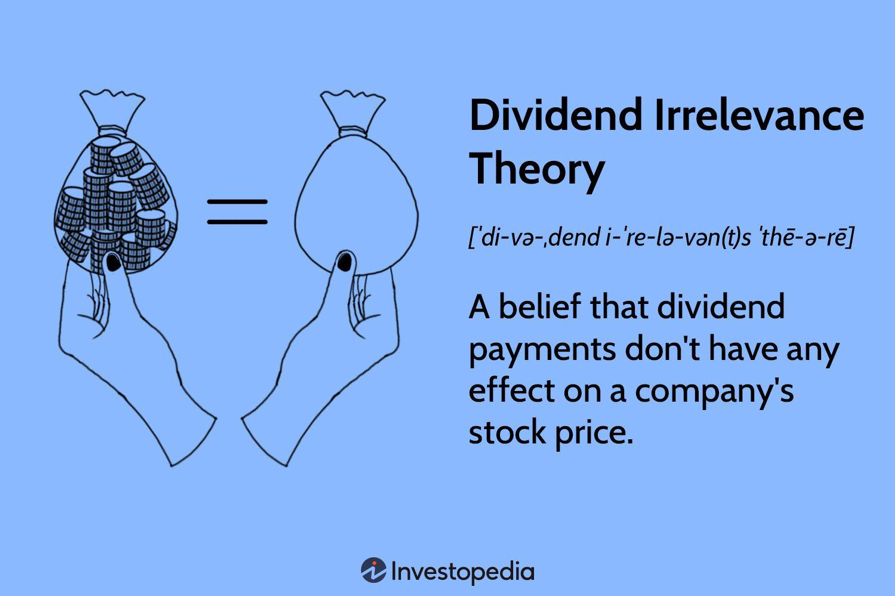

## Table of Contents

## What is the Dividend Irrelevance Theory?

The Dividend Irrelevance Theory is an idea in finance that says whether a company pays dividends or not doesn't really matter to its overall value. This theory was first talked about by two economists, Franco Modigliani and Merton Miller, in the 1960s. They said that the value of a company depends on how well it can make money from its investments, not on how it chooses to give that money back to its shareholders. So, if a company decides to pay dividends or to reinvest the money back into the business, it shouldn't change how much the company is worth.

In simpler terms, this theory suggests that shareholders are not bothered about getting dividends because they can sell some of their shares if they need cash. If a company keeps its earnings instead of paying them out as dividends, the share price should go up because the company is worth more. Shareholders can then sell a few shares to get the money they need. So, according to this theory, the choice between paying dividends and keeping earnings doesn't affect the total value of the company or the wealth of the shareholders.

## Who developed the Dividend Irrelevance Theory?

The Dividend Irrelevance Theory was developed by two economists, Franco Modigliani and Merton Miller, in the 1960s. They came up with this idea to explain that the way a company chooses to return money to its shareholders, either through dividends or by keeping the earnings, doesn't change the overall value of the company. They believed that what really matters is how well the company can use its money to make more money, not how it decides to share that money with its shareholders.

Modigliani and Miller argued that if a company decides to keep its earnings instead of paying them out as dividends, the value of the company should still stay the same. They thought that shareholders could simply sell some of their shares if they needed cash, and because the company is worth more by keeping the earnings, the share price would go up. So, shareholders could get the money they needed by selling a few shares, and this wouldn't affect the total value of the company or the wealth of the shareholders.

## What are the main assumptions of the Dividend Irrelevance Theory?

The Dividend Irrelevance Theory, developed by Franco Modigliani and Merton Miller, relies on some key assumptions to explain why the choice between paying dividends and keeping earnings doesn't affect a company's value. One main assumption is that there are no taxes or transaction costs. This means that when shareholders sell their shares to get cash instead of receiving dividends, they don't have to worry about paying taxes on the sale or any fees for making the transaction. If taxes and costs were a factor, it might make a difference whether a company pays dividends or not.

Another important assumption is that investors have the same information as the company's managers. This is called perfect information. If investors know as much as the people running the company, they can make smart choices about whether to keep their shares or sell them to get cash. Without this assumption, investors might not trust that the company is making the best decisions with its earnings, and this could affect the stock price and the company's value. So, the theory assumes that everyone knows everything they need to know to make good choices.

## How does the Dividend Irrelevance Theory relate to a firm's value?

The Dividend Irrelevance Theory says that whether a company pays out money to its shareholders as dividends or keeps it to reinvest in the business doesn't change how much the company is worth. This idea was created by economists Franco Modigliani and Merton Miller. They believed that what really matters for a company's value is how well it can use its money to make more money, not how it decides to share that money with its shareholders. So, if a company decides to keep its earnings instead of paying them out as dividends, the value of the company should stay the same.

The theory works under the assumption that there are no taxes or fees when shareholders sell their shares to get cash instead of receiving dividends. It also assumes that everyone knows as much about the company as its managers do. This means that if shareholders need money, they can simply sell some of their shares. Because the company is worth more by keeping its earnings, the share price should go up, and shareholders can sell a few shares to get the cash they need. This way, the total value of the company and the wealth of the shareholders stay the same, no matter if the company pays dividends or not.

## What is the difference between dividends and retained earnings according to this theory?

Dividends are payments that a company gives to its shareholders from its profits. Retained earnings, on the other hand, are the profits that a company decides to keep and reinvest back into the business instead of giving them out as dividends. According to the Dividend Irrelevance Theory, it doesn't matter if a company chooses to pay dividends or keep its earnings as retained earnings because this choice doesn't affect the overall value of the company.

The theory suggests that if a company keeps its earnings, the value of the company should still stay the same. This is because shareholders can simply sell some of their shares if they need cash. Since the company's value goes up by keeping the earnings, the share price should also go up. So, shareholders can get the money they need by selling a few shares, and this doesn't change the total value of the company or the wealth of the shareholders.

## Can you explain the Modigliani-Miller theorem in the context of dividend policy?

The Modigliani-Miller theorem, often called the MM theorem, says that in a perfect world, the way a company decides to give money back to its shareholders doesn't change how much the company is worth. This idea was developed by economists Franco Modigliani and Merton Miller. They argued that whether a company pays dividends or keeps its earnings to reinvest in the business, the value of the company should stay the same. This is because shareholders can always sell some of their shares if they need cash. If a company keeps its earnings, the share price should go up because the company is worth more, so shareholders can sell a few shares to get the money they need.

The MM theorem relies on some important assumptions to work. It assumes there are no taxes or fees when shareholders sell their shares. It also assumes that everyone knows as much about the company as its managers do, so investors can make smart choices about whether to keep their shares or sell them. Without these assumptions, the choice between paying dividends and keeping earnings might actually affect the company's value. But in the perfect world the theorem imagines, the dividend policy is irrelevant because the total value of the company and the wealth of the shareholders stay the same no matter what the company decides to do with its profits.

## How does the theory handle the impact of taxes on dividend policy?

The Dividend Irrelevance Theory assumes that there are no taxes or fees when shareholders sell their shares. This means that if a company decides to keep its earnings instead of paying them out as dividends, shareholders can sell some shares to get cash without worrying about taxes. If taxes were a factor, it might make a difference whether a company pays dividends or not. Shareholders might prefer dividends if they have to pay less tax on them compared to selling shares. But since the theory imagines a world without taxes, it says that the choice between paying dividends and keeping earnings doesn't change the company's value.

In the real world, though, taxes do matter. If a company pays dividends, shareholders have to pay taxes on that money. If the company keeps the earnings and the share price goes up, shareholders can sell shares to get cash, but they might have to pay taxes on the profit from selling the shares. This can make a big difference in how shareholders feel about dividends. Some might prefer dividends because they need the cash and don't want to deal with selling shares and paying taxes on the sale. So, while the Dividend Irrelevance Theory says taxes don't matter, in reality, they can make the dividend policy very important to shareholders.

## What are the criticisms of the Dividend Irrelevance Theory?

One big criticism of the Dividend Irrelevance Theory is that it doesn't take into account the real-world effects of taxes and fees. The theory says that whether a company pays dividends or keeps its earnings doesn't matter because shareholders can just sell their shares to get cash. But in the real world, if a company pays dividends, shareholders have to pay taxes on that money. If the company keeps the earnings and the share price goes up, shareholders might have to pay taxes on the profit when they sell shares. This can make a big difference in what shareholders prefer. Some might like dividends because they need the cash and don't want to deal with selling shares and paying taxes on the sale.

Another criticism is that the theory assumes everyone knows as much about the company as its managers do. This is called perfect information. In reality, investors often don't know everything the managers know. If investors don't trust that the company is making the best decisions with its earnings, they might not feel the same about the company's value. This can affect the stock price and the company's value. So, the idea that shareholders are okay with the company keeping earnings because they can just sell shares might not hold up if investors feel uncertain or uninformed.

Lastly, the theory doesn't consider that some investors might really need or want dividends. Some people invest in stocks because they need a regular income, like retirees. For them, dividends are important because they can't just sell shares whenever they need cash. If a company doesn't pay dividends, these investors might not want to invest in it, which could affect the company's stock price and its value. So, while the Dividend Irrelevance Theory says the choice between dividends and retained earnings doesn't matter, in the real world, it can make a big difference to certain investors.

## How does the Dividend Irrelevance Theory compare to other dividend theories like the Bird-in-the-Hand Theory?

The Dividend Irrelevance Theory, developed by Franco Modigliani and Merton Miller, says that whether a company pays dividends or keeps its earnings doesn't change how much the company is worth. They believed that what really matters is how well the company can make money from its investments, not how it chooses to give that money back to shareholders. If a company keeps its earnings, the share price should go up because the company is worth more, and shareholders can sell a few shares if they need cash. This theory assumes a perfect world with no taxes or fees and where everyone knows as much about the company as its managers do.

On the other hand, the Bird-in-the-Hand Theory suggests that investors actually prefer dividends over potential future gains from keeping earnings. This theory argues that dividends are more certain than future earnings, so shareholders feel safer getting money now rather than waiting for the company to reinvest and hoping the share price will go up later. Unlike the Dividend Irrelevance Theory, the Bird-in-the-Hand Theory believes that the choice between paying dividends and keeping earnings can affect a company's value because investors value the certainty of dividends more than the uncertainty of future growth.

These two theories offer different views on what investors care about. The Dividend Irrelevance Theory thinks that in a perfect world, investors don't care about dividends because they can get cash by selling shares whenever they need it. The Bird-in-the-Hand Theory, however, believes that in the real world, investors do care about dividends because they provide a more certain return than the possibility of future earnings. Both theories help explain how companies might think about their dividend policies, but they come to different conclusions about what matters to shareholders.

## In what ways has empirical research supported or challenged the Dividend Irrelevance Theory?

Empirical research has both supported and challenged the Dividend Irrelevance Theory. Some studies have found that in certain situations, the theory holds true. For example, research on companies in markets with low taxes and low transaction costs has shown that whether a company pays dividends or keeps its earnings doesn't seem to affect its overall value much. This supports the idea that in a world without taxes or fees, shareholders can easily sell shares to get cash if they need it, so they don't care if the company pays dividends or not.

However, other studies have shown that in the real world, where taxes and fees do exist, the theory doesn't hold up as well. Research has found that shareholders often do care about dividends because of tax differences. If dividends are taxed at a lower rate than the capital gains from selling shares, shareholders might prefer dividends. Also, some investors, like retirees, need regular income and prefer dividends over waiting for the share price to go up. These findings challenge the Dividend Irrelevance Theory by showing that dividend policy can matter to shareholders in real-world situations.

## How do market imperfections affect the validity of the Dividend Irrelevance Theory?

Market imperfections like taxes and transaction costs can make the Dividend Irrelevance Theory less valid. The theory says that whether a company pays dividends or keeps its earnings doesn't change its value because shareholders can sell shares to get cash if they need it. But in the real world, if a company pays dividends, shareholders have to pay taxes on that money. If the company keeps the earnings and the share price goes up, shareholders might have to pay taxes on the profit when they sell shares. These tax differences can make shareholders prefer dividends over selling shares, which means dividend policy can actually affect a company's value.

Another market imperfection is that investors often don't have the same information as the company's managers. The Dividend Irrelevance Theory assumes everyone knows as much about the company as its managers do, which is called perfect information. In reality, if investors don't trust that the company is making the best decisions with its earnings, they might not feel the same about the company's value. This uncertainty can affect the stock price and make the choice between dividends and retained earnings important to shareholders. So, market imperfections like taxes and imperfect information show that the Dividend Irrelevance Theory might not work as well in the real world as it does in theory.

## What are the implications of the Dividend Irrelevance Theory for corporate financial strategy?

The Dividend Irrelevance Theory suggests that companies don't need to worry too much about whether they pay dividends or keep their earnings. According to the theory, what really matters is how well the company can use its money to make more money, not how it decides to share that money with its shareholders. So, a company's financial strategy should focus on making smart investments that will grow the business, rather than trying to please shareholders with dividends. If a company can show that it's using its earnings to make the business more valuable, the share price should go up, and shareholders can sell shares if they need cash.

However, in the real world, things like taxes and the fact that investors might not know everything the company knows can make the theory less useful. If shareholders have to pay more taxes on the money they get from selling shares than on dividends, they might prefer dividends. Also, some investors, like retirees, need regular income and might not want to sell shares to get cash. So, while the Dividend Irrelevance Theory says that dividend policy doesn't matter, companies might still need to think about it when making their financial strategies. They might need to balance the benefits of keeping earnings to grow the business with the need to keep shareholders happy with dividends.

## What is the Understanding of Dividend Irrelevance Theory?

Dividend Irrelevance Theory, introduced by economists Merton Miller and Franco Modigliani in 1961, challenges the traditional view that dividend policies directly affect a firm's market valuation. According to this theory, in idealized financial markets, the choice of whether to distribute profits as dividends or to retain them does not influence the company's overall value. Instead, the focus should be on a company's ability to generate earnings and manage risk.

The theory operates under the assumption of perfect capital markets—scenarios where there are no taxes, transaction costs, or information asymmetries. In such markets, it presupposes that investors behave rationally and are indifferent between receiving immediate dividend payouts and accruing capital gains from future returns. The implication is that shareholders are capable of tailoring their own portfolio returns to their preferences, either by reinvesting dividends to mimic capital gains or by selling a portion of their portfolio to simulate a dividend-like cash flow.

Miller and Modigliani's proposition suggests the ex-dividend price drop should approximately equal the dividend amount, maintaining the equilibrium of shareholder wealth. Consequently, any perceived value from dividends is neutralized as investors can self-assess and adjust accordingly through their investment choices. The mathematical elegance of the theory is based on the balance between dividend payments (D) and the change in stock price (P), where any paid dividend results in an equal reduction in stock price: 

$$
P_{\text{before dividend}} - P_{\text{after dividend}} = D
$$

Despite its theoretical implications, Dividend Irrelevance Theory does not go unchallenged. Critics point to several real-world factors that impede the theory's application. Firstly, taxes on dividends and capital gains can differ, influencing investor preferences for one over the other. Transaction costs present another barrier, as frequent buying and selling to adjust a portfolio can incur added expenses for investors. Behavioral factors, such as investor preferences for immediate income or the signaling effects of dividends, further complicate the pure rationality assumption.

While Dividend Irrelevance Theory provides an essential framework for understanding the fundamental forces underlying dividend policies and stock valuation, the complexities of real markets necessitate consideration of additional variables. These include taxation, transaction costs, and investor behavior, all of which can significantly influence corporate finance decisions and investor outcomes.

## References & Further Reading

[1]: Miller, M. H., & Modigliani, F. (1961). ["Dividend Policy, Growth, and the Valuation of Shares."](https://www.jstor.org/stable/2351143) The Journal of Business, 34(4), 411-433.

[2]: Chan, E. P. (2009). ["Quantitative Trading: How to Build Your Own Algorithmic Trading Business."](https://github.com/ftvision/quant_trading_echan_book) John Wiley & Sons.

[3]: Jansen, S. (2018). ["Machine Learning for Algorithmic Trading."](https://www.amazon.com/Hands-Machine-Learning-Algorithmic-Trading/dp/178934641X) Packt Publishing.

[4]: Lopez de Prado, M. (2018). ["Advances in Financial Machine Learning."](https://www.amazon.com/Advances-Financial-Machine-Learning-Marcos/dp/1119482089) Wiley.

[5]: Aronson, D. R. (2006). ["Evidence-Based Technical Analysis: Applying the Scientific Method and Statistical Inference to Trading Signals."](https://www.amazon.com/Evidence-Based-Technical-Analysis-Scientific-Statistical/dp/0470008741) John Wiley & Sons.