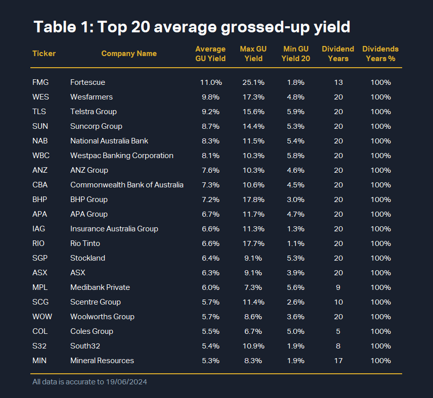

## Table of Contents

## What are dividend-paying mutual funds?

Dividend-paying mutual funds are investment funds that primarily invest in stocks or other securities that pay dividends. These dividends are then distributed to the investors in the mutual fund, providing a regular income stream. This can be attractive for people who want to earn money from their investments without having to sell their shares.

These funds are often chosen by investors who are looking for a steady income, such as retirees. By investing in a variety of dividend-paying stocks, the mutual fund can offer diversification, which helps reduce the risk compared to investing in single stocks. However, like all investments, dividend-paying mutual funds come with risks, and the dividends are not guaranteed, as they depend on the performance of the underlying securities.

## How do Australian equity mutual funds work?

Australian equity mutual funds are a type of investment where many people pool their money together to buy a collection of Australian company stocks. A professional manager runs the fund and decides which stocks to buy and sell. When you invest in the fund, you own a small part of it, and the value of your investment goes up or down based on how well the stocks in the fund do.

These funds can be a good way to invest in the Australian stock market without having to pick individual stocks yourself. They spread your money across many different companies, which can lower the risk compared to putting all your money into one company. Plus, the fund manager's job is to try to choose the best stocks to help the fund grow over time.

## What are the benefits of investing in dividend-paying mutual funds?

Investing in dividend-paying mutual funds can be a good choice for people who want to earn money regularly from their investments. These funds collect dividends from the companies they invest in and then give that money to the people who own shares in the fund. This can be really helpful for people like retirees who need a steady income to live on. Instead of selling their investments to get money, they can just use the dividends they receive.

Another benefit is that these funds usually invest in a lot of different companies, which helps spread out the risk. If one company does poorly, it might not hurt your investment as much because the fund has money in many other companies too. This can make investing less risky than buying just one stock. Plus, the fund managers are experts who pick the best companies to invest in, so you don't have to do all the research yourself.

## How can beginners start investing in Australian equity mutual funds?

If you're new to investing and want to start with Australian equity mutual funds, the first step is to find a good financial institution or a brokerage that offers these funds. You can look online or ask friends and family for recommendations. Once you've chosen a place to invest, you'll need to open an account. This usually involves filling out some forms with your personal information and maybe talking to someone from the company to make sure you understand what you're getting into.

After your account is set up, you can start choosing which Australian equity mutual funds to invest in. You might want to read about different funds to see which ones fit your goals. Some funds might be riskier but could grow faster, while others might be safer but grow more slowly. You can usually start with a small amount of money, so you don't need to be rich to begin. Once you've picked your funds, you can put your money in and watch it grow over time. Remember, it's a good idea to keep learning about investing so you can make smart choices with your money.

## What are the key factors to consider when choosing a dividend-paying Australian equity mutual fund?

When picking a dividend-paying Australian equity mutual fund, think about how much risk you're okay with. Some funds might have bigger chances of going up and down a lot, while others might be safer but grow slower. Also, look at the fund's history to see if it has been good at paying dividends regularly. You want a fund that has a track record of giving out dividends, so you can count on getting that money.

Another thing to check is the fees you'll have to pay. Some funds charge more than others, and those fees can eat into the money you get from dividends. It's smart to pick a fund where the fees are low enough that you still get a good amount of dividends. Finally, consider how the fund is managed. Is it run by people who know a lot about picking stocks that pay good dividends? A good manager can make a big difference in how well the fund does.

In the end, choosing the right fund means balancing these factors: risk, past performance, fees, and the expertise of the fund managers. By looking at all these things, you can find a dividend-paying Australian equity mutual fund that fits your needs and helps you reach your investment goals.

## How do taxes affect returns from dividend-paying mutual funds in Australia?

When you get money from dividends in Australia, you have to pay tax on it. The tax you pay depends on how much money you make in a year. If you earn a lot, you'll pay more tax on your dividends. The fund you invest in will usually give you a statement at the end of the year that shows how much you need to pay in taxes. This is called a tax statement, and it helps you when you do your taxes.

The tax can affect how much money you actually get to keep from your dividends. For example, if your fund pays you $100 in dividends, but you have to pay $30 in taxes, you only get to keep $70. It's important to think about taxes when you choose a fund because the fees and taxes can make a big difference in your final return. Talking to a tax advisor can help you understand how much you might have to pay and plan your investments better.

## What are the historical performance trends of dividend-paying Australian equity mutual funds?

Over the years, dividend-paying Australian equity mutual funds have shown a pattern where they can give investors a steady income. These funds often invest in big Australian companies that pay out dividends regularly. Looking back, these funds have usually done well when the Australian economy is strong. They might not grow as fast as some other types of funds, but they can be a good choice for people who want to get regular money from their investments.

However, like all investments, these funds can go up and down. During tough economic times, like a recession, the dividends might get smaller or even stop for a while. But over the long run, these funds have often been able to recover and keep paying dividends. So, if you're someone who is okay with waiting and doesn't need all your money right away, these funds might be a good fit for you.

## How do dividend reinvestment plans (DRIPs) work with Australian equity mutual funds?

Dividend reinvestment plans, or DRIPs, let you use the money you get from dividends to buy more shares in the same fund instead of taking the cash. When you're in a DRIP with an Australian equity mutual fund, the fund will automatically use your dividends to buy more shares for you. This can help your investment grow over time because you're getting more shares without spending extra money.

Using a DRIP can be a smart move because it helps you take advantage of something called compound growth. When you reinvest your dividends, you're not just earning on your original investment, but also on the new shares you get. Over many years, this can make a big difference in how much your investment grows. It's like planting a seed and watching it grow into a bigger plant because you keep adding more seeds with the money you earn.

## What are the risks associated with investing in dividend-paying Australian equity mutual funds?

When you invest in dividend-paying Australian equity mutual funds, one big risk is that the dividends might not be as high as you expect or might even stop coming. This can happen if the companies the fund invests in are not doing well. If the economy is having a tough time, companies might cut back on dividends to save money, which means less money for you. Also, even though these funds invest in many different companies to spread out the risk, if the whole Australian stock market goes down, your fund could lose value too.

Another risk is that the value of the fund can go up and down a lot. This is called market risk. If you need to take your money out of the fund during a time when the market is down, you might get less money back than you put in. Plus, there are fees to think about. The fund charges you for managing your money, and these fees can eat into the dividends you get. So, it's important to look at how much the fund charges and think about how that might affect your returns over time.

## How do economic cycles impact the performance of dividend-paying Australian equity mutual funds?

Economic cycles can have a big impact on how well dividend-paying Australian equity mutual funds do. When the economy is doing well and growing, companies usually make more money and can pay out bigger dividends. This means the funds that invest in these companies can give you more money too. But when the economy is not doing so well, like during a recession, companies might not make as much money. They might have to cut back on dividends to save money, which means you might get less money from your fund.

The value of the fund itself can also go up and down with the economy. During good times, the stock market might go up, and the value of your fund could increase. But if the economy goes into a downturn, the stock market might drop, and your fund's value could go down too. So, it's important to think about where the economy is in its cycle when you're deciding to invest in these funds. Even though they can give you regular money, they are still affected by what's happening in the economy.

## What advanced strategies can be used to optimize returns from these funds?

One advanced strategy to optimize returns from dividend-paying Australian equity mutual funds is to use a technique called dollar-cost averaging. This means you put money into the fund regularly, like every month, instead of all at once. By doing this, you buy more shares when the price is low and fewer when the price is high. Over time, this can help you get a better average price for your shares and might lead to higher returns. It's like buying groceries on sale when you can, so you end up spending less overall.

Another strategy is to focus on funds with a strong track record of increasing dividends over time. Some companies are known for raising their dividends year after year, and funds that invest in these companies can be a good choice. By picking funds with a history of growing dividends, you might see your income from the fund go up over time. This can help your investment grow faster, especially if you use a dividend reinvestment plan (DRIP) to buy more shares with your dividends. It's like planting a seed that keeps getting bigger and bigger because you keep adding more seeds with the money it earns.

## How does the regulatory environment in Australia affect dividend-paying equity mutual funds?

The rules and laws in Australia can have a big impact on how dividend-paying equity mutual funds work. The Australian Securities and Investments Commission (ASIC) and the Australian Prudential Regulation Authority (APRA) are the main groups that make sure these funds follow the rules. They make sure the funds are honest about what they're doing and that they're not taking too many risks. This helps keep your money safe. But these rules can also mean that funds have to be careful about what they invest in, which might limit how much they can grow or how much they can pay out in dividends.

Even though the rules can make things safer, they can also make things more complicated for the funds. For example, there might be limits on how much the fund can invest in certain types of companies or how much they can borrow. These rules are there to protect investors, but they can also mean that the fund might not be able to take advantage of some opportunities to make more money. So, when you're thinking about investing in these funds, it's good to know that the rules are there to help keep your money safe, but they can also affect how much money you might make.

## What are Dividend Funds and how can they be understood?

Dividend funds are investment vehicles designed to provide investors with regular income through the dividends paid by the stocks within their portfolios. These funds are structured with a primary goal: to generate consistent returns through dividend payments rather than capital appreciation alone. Dividend funds are generally comprised of stocks from companies that have a history of reliable dividend payments and stable earnings, which makes them particularly appealing to investors seeking passive income streams.

The appeal of dividend funds is underscored during periods of market [volatility](/wiki/volatility-trading-strategies). When stock prices fluctuate, dividend payments can offer a degree of stability to a portfolio's overall return. This feature makes dividend funds an attractive option for investors who prefer lower risk and steady income over potentially higher, but less reliable, capital gains. In Australia, dividend funds have emerged as a preferred investment option, particularly among retirees and conservative investors who prioritize income over growth.

In the Australian context, dividend funds typically include high-dividend paying stocks from sectors such as finance and materials. These sectors are prominent in the Australian economy, with some of the largest companies listed on the Australian Securities Exchange (ASX) originating from these industries. Major corporations in these sectors often have stable revenue streams and a commitment to returning profits to shareholders through dividends. 

For example, financial institutions such as banks and insurance companies are known for their generous dividend policies, as they regularly distribute a portion of their profits back to shareholders. Similarly, the materials sector, encompassing mining and resource companies, also tends to provide substantial dividends, reflective of Australia's rich natural resources and strong export markets.

The strategic focus on dividend-paying stocks is not without its calculations. Investors in dividend funds often consider metrics such as the dividend yield, which is calculated as follows:

$$
\text{Dividend Yield} = \left( \frac{\text{Annual Dividends Per Share}}{\text{Price Per Share}} \right) \times 100\%
$$

This metric helps in evaluating the income-generating potential of a stock relative to its price. A higher dividend yield can indicate generous income returns, but investors must also assess the sustainability of dividend payouts and the financial health of the issuing company.

Dividend funds provide a blend of income and risk management benefits, reinforcing their role as a crucial component of diversified investment portfolios. They offer investors the advantages of both generating reliable passive income and maintaining a buffer during uncertain economic periods. As such, they remain a cornerstone for many Australian investors seeking stability and income in their investment strategies.

## How can equity investments help in building wealth?

Equity investments serve as a fundamental pillar for wealth accumulation by offering investors the potential for substantial capital appreciation. In Australia, the equity market is a vital component of the financial landscape, providing various opportunities for both domestic and international investment. Participating in the Australian equity market enables investors to tap into the country's economic growth, driven by robust sectors and a resilient economic framework.

Australian equity investments are particularly attractive due to their exposure to diverse sectors that play a pivotal role in the economy. Key sectors such as financials, materials, and consumer discretionary are significant contributors to both the economy and equity fund portfolios. The financial sector, dominated by major banks and insurance companies, is a cornerstone for investors seeking dividend income and capital growth. Meanwhile, the materials sector provides exposure to Australia's vast natural resources, particularly mining, which remains integral to the country's export economy.

International diversification is another crucial aspect of equity investing in Australia. Many funds offer global equity components allowing investors to mitigate domestic market risks by balancing them with international opportunities. This diversification strategy helps cushion against regional economic downturns and capitalizes on growth in global markets.

For investors interested in quantitatively assessing the potential returns of equity investments, several metrics can be utilized. The Capital Asset Pricing Model (CAPM) is one such method to evaluate expected returns, where the expected return $(E(R_i))$ for a stock is determined by the equation:

$$

E(R_i) = R_f + \beta_i (E(R_m) - R_f) 
$$

Where:
- $R_f$ is the risk-free rate,
- $\beta_i$ is the beta of the investment,
- $E(R_m)$ is the expected return of the market.

This formula allows investors to assess whether particular equities offer sufficient returns relative to their inherent risks. Additionally, tools and models developed through modern portfolio theory (MPT) assist investors in constructing a balanced portfolio optimizing risk and return.

Equity investments remain a preferable choice for investors seeking not just income but also opportunities for capital growth. With the strategic placement in Australian sectors and through international diversification, these investments can form a powerful component of an investor's portfolio dedicated to wealth building.

## References & Further Reading

[1]: ["Dividend Investing for Dummies"](https://www.fool.com/investing/stock-market/types-of-stocks/dividend-stocks/how-to-invest-in-dividend-stocks/) by Lawrence Carrel and Paul Mladjenovic

[2]: Harman, H., & Ng, E. (2020). "[Mutual Funds: A Pathway to Diversification](https://www.semanticscholar.org/paper/Global-Equity-Fund-Performance-Evaluation-with-and-Gallagher-Harman/1ca2c5d7d6f51bb38f7cc3710e005c3050432766)." Financial Journal of Investment Strategies.

[3]: ["Investment Analysis and Portfolio Management"](https://www.investopedia.com/terms/i/investment-analysis.asp) by Frank K. Reilly and Keith C. Brown

[4]: Thomas, R. (2018). ["The Role of Algorithmic Trading in Financial Markets"](https://pubs.aip.org/aip/acp/article/2919/1/090014/3279012/The-role-of-algorithmic-trading-in-the). Journal of Financial Studies.

[5]: ["Practical Portfolio Performance Measurement and Attribution"](https://onlinelibrary.wiley.com/doi/book/10.1002/9781119206309) by Carl R. Bacon