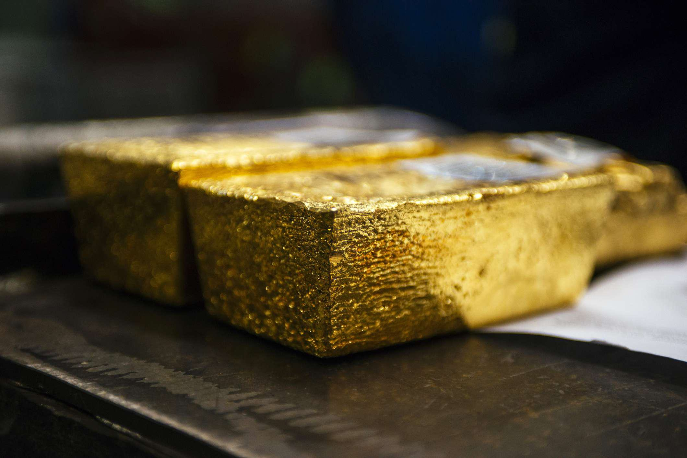

## Table of Contents

## What are ETFs and how do they work?

ETFs, or Exchange-Traded Funds, are a type of investment that combines features of both mutual funds and stocks. They are designed to track the performance of a specific index, like the S&P 500, a commodity, bonds, or a basket of assets. You can buy and sell ETFs on a stock exchange, just like you would with individual stocks. This makes them easy to trade throughout the day at market prices, unlike mutual funds which are only traded once a day after the market closes.

When you invest in an ETF, you're essentially buying a small piece of all the assets that the ETF holds. For example, if an ETF tracks the S&P 500, your investment gives you exposure to all 500 companies in that index. This diversification can help spread out your risk. ETFs are managed by professionals who make sure the fund's holdings match the index it's supposed to track. This passive management usually results in lower fees compared to actively managed mutual funds, making ETFs an attractive option for many investors.

## What are dividend-paying ETFs?

Dividend-paying ETFs are a type of exchange-traded fund that focuses on investing in companies that pay dividends. Dividends are payments that companies make to their shareholders from their profits. When you invest in a dividend-paying ETF, you get a share of these dividends. This can provide you with a regular income stream, which can be especially appealing if you're looking for steady returns from your investments.

These ETFs work by holding a collection of dividend-paying stocks. The [ETF](/wiki/etf-trading-strategies) manager picks stocks that have a history of paying dividends and aims to give investors a diversified way to earn income. The dividends from all the stocks in the ETF are collected and then distributed to the ETF's shareholders, usually on a quarterly basis. This means you can enjoy the benefits of dividend income without having to buy and manage individual stocks yourself.

## Why invest in gold miner ETFs?

Investing in gold miner ETFs can be a smart move if you want to add some sparkle to your investment portfolio. These ETFs focus on companies that dig up gold from the ground. When the price of gold goes up, these companies can make more money, and that can make the ETF's value go up too. It's a way to bet on gold without actually buying the shiny metal yourself.

Another reason to consider gold miner ETFs is that they can help spread out your investment risk. Instead of putting all your money into one gold mining company, you get a piece of many different ones. This can protect you if one company doesn't do well. Plus, these ETFs can be easier to buy and sell than individual stocks, making it simpler to manage your investments.

## How do gold miner ETFs generate dividends?

Gold miner ETFs generate dividends from the profits of the gold mining companies they invest in. When these companies find and sell gold, they make money. Some of this money is given back to their shareholders as dividends. The ETF collects these dividends from all the different gold mining companies it holds and then pays them out to its own investors. This way, people who own shares in the ETF get a piece of the profits without having to own the mining companies directly.

The amount of dividends that gold miner ETFs can pay depends on how well the gold mining companies are doing. If the price of gold is high, the companies can sell their gold for more money, which can lead to bigger profits and bigger dividends. But if the price of gold goes down, the companies might make less money, and the dividends could be smaller. So, the dividends from gold miner ETFs can go up and down, but they give investors a way to earn some income from the gold industry.

## What are the benefits of investing in dividend-paying gold miner ETFs?

Investing in dividend-paying gold miner ETFs can be a good way to earn some extra money while also getting into the gold business. These ETFs put your money into a bunch of different gold mining companies. When these companies do well and make profits from selling gold, they share some of that money with their shareholders as dividends. The ETF collects all these dividends and then gives them to you. This means you can get a regular income from the gold industry without having to pick and manage individual mining companies yourself.

Another benefit is that these ETFs can help spread out your risk. Instead of putting all your money into one gold mining company, you get a piece of many different ones. This can protect you if one company doesn't do well. Plus, gold miner ETFs can be easier to buy and sell than individual stocks, making it simpler to manage your investments. So, you can enjoy the potential for both income and growth from the gold mining sector, all while keeping things simple and diversified.

## What are the risks associated with dividend-paying gold miner ETFs?

Investing in dividend-paying gold miner ETFs comes with some risks that you should know about. One big risk is that the price of gold can go up and down a lot. When gold prices drop, gold mining companies might not make as much money, and that means they might pay smaller dividends or none at all. This can make the value of your ETF go down too. Also, these ETFs can be affected by things like mining costs, how much gold the companies can find, and even problems at the mines themselves, like accidents or strikes.

Another risk is that these ETFs focus on just one industry: gold mining. If something bad happens to the gold mining sector, like new laws that make it harder to mine gold or a big drop in demand for gold, your ETF could lose value quickly. This is different from a more diversified investment that spreads your money across many different industries. So, while dividend-paying gold miner ETFs can give you a chance to earn income and grow your money, they can also be riskier because they depend a lot on what happens in the gold market.

## How can one evaluate the performance of dividend-paying gold miner ETFs?

To evaluate the performance of dividend-paying gold miner ETFs, you need to look at a few key things. First, check the ETF's total return, which includes both the change in the ETF's price and the dividends it pays out. A good total return means the ETF is doing well overall. You can find this information on financial websites or the ETF's own website. Also, look at the dividend yield, which tells you how much income you're getting from your investment compared to its price. A higher yield can be good, but make sure it's not too high because that might mean the ETF is riskier.

Another thing to consider is how the ETF compares to other similar ETFs and to the price of gold itself. If the ETF is doing better than others in its category, that's a good sign. You can also see if it's keeping up with or beating the price of gold. This shows how well the ETF's managers are [picking](/wiki/asset-class-picking) gold mining companies. Lastly, think about the ETF's expense ratio, which is how much you pay in fees each year. Lower fees mean more of your money stays in your pocket, so a lower expense ratio can make a big difference over time.

## What are some popular dividend-paying gold miner ETFs available in the market?

Some popular dividend-paying gold miner ETFs that you might want to check out are the VanEck Vectors Gold Miners ETF (GDX) and the iShares MSCI Global Gold Miners ETF (RING). These ETFs focus on companies that mine gold and pay dividends to their shareholders. The VanEck Vectors Gold Miners ETF is one of the biggest and most well-known in this category. It holds a lot of the big gold mining companies and tries to match the performance of the NYSE Arca Gold Miners Index. The iShares MSCI Global Gold Miners ETF is another good choice. It aims to track the MSCI ACWI Select Gold Miners Investable Market Index and includes companies from around the world.

Another ETF worth mentioning is the Global X Gold Explorers ETF (GOEX). This one is a bit different because it focuses on smaller gold mining companies that are still looking for new gold deposits. These companies can be riskier but might offer bigger rewards if they find a lot of gold. The Global X Gold Explorers ETF pays dividends too, but the amount can change a lot depending on how well the smaller companies are doing. All these ETFs give you a way to earn income from the gold mining industry without having to pick individual companies yourself.

## How do taxes affect returns from dividend-paying gold miner ETFs?

When you earn money from dividends in gold miner ETFs, you have to pay taxes on that income. The tax rate depends on how long you've held the ETF and your overall income. If you hold the ETF for less than a year, the dividends are taxed as regular income. This means they could be taxed at a higher rate, especially if you're in a higher tax bracket. But if you hold the ETF for more than a year, the dividends might be taxed at a lower rate, called the long-term capital gains rate. This can save you money on taxes.

Also, the price of the ETF can go up or down, and if you sell it for more than you paid, you'll have to pay capital gains tax on the profit. Just like with dividends, the tax rate for these gains depends on how long you held the ETF. If you sell it after holding it for more than a year, you'll pay the long-term capital gains tax, which is usually lower. But if you sell it within a year, it's taxed as a short-term capital gain, which is the same as your regular income tax rate. So, taxes can take a bite out of your returns from dividend-paying gold miner ETFs, but holding them for longer periods can help reduce the tax hit.

## What strategies can be used to maximize returns from dividend-paying gold miner ETFs?

One way to get the most out of dividend-paying gold miner ETFs is to keep them for a long time. When you hold onto these ETFs for more than a year, the taxes you pay on the dividends and any profits from selling the ETF can be lower. This means you get to keep more of your money. Also, gold prices can go up and down a lot, so if you hold the ETFs for a longer time, you might be able to ride out the ups and downs and see bigger gains in the end.

Another strategy is to reinvest the dividends you get from these ETFs. Instead of taking the dividend money out to spend, you can use it to buy more shares of the ETF. This can help your investment grow faster because you'll earn dividends on more shares over time. It's like planting a seed and letting it grow into a bigger plant. Also, keep an eye on the fees you're paying for the ETF. Lower fees mean more of your money stays invested, which can lead to higher returns in the long run.

## How do macroeconomic factors influence the performance of dividend-paying gold miner ETFs?

Macroeconomic factors can have a big impact on how well dividend-paying gold miner ETFs do. One important [factor](/wiki/factor-investing) is inflation. When prices for things like food and gas go up, people often start to worry about their money losing value. This can make them want to buy gold because it's seen as a safe place to keep their money. When more people want to buy gold, the price goes up, and gold mining companies can make more money. This can lead to bigger dividends for the ETFs that invest in these companies.

Another factor is interest rates. When interest rates are low, borrowing money is cheaper, and gold mining companies can take out loans to expand their operations or buy new equipment. This can help them find and mine more gold, which can boost their profits and the dividends they pay out. But if interest rates go up, borrowing gets more expensive, and that can slow down the companies' growth. Also, things like the strength of the dollar, global economic growth, and even political events can affect gold prices and the performance of gold miner ETFs. So, keeping an eye on these big economic trends can help you understand how your investment might do.

## What advanced analytical tools can be used to predict the future performance of dividend-paying gold miner ETFs?

To predict how dividend-paying gold miner ETFs might do in the future, you can use some fancy tools like technical analysis. This means looking at charts and patterns to see how the ETF has moved in the price in the past. By spotting trends and patterns, you might guess where the price could go next. There are also special indicators like moving averages and the Relative Strength Index (RSI) that can help you see if the ETF is overbought or oversold. These tools can give you clues about when to buy or sell the ETF to make the most money.

Another tool is [fundamental analysis](/wiki/fundamental-analysis), which looks at the health of the gold mining companies in the ETF. You can check things like how much gold they are finding, their costs, and how much profit they are making. If the companies are doing well and the price of gold is going up, the ETF might do better too. You can also use economic models to see how things like inflation, interest rates, and the strength of the dollar might affect gold prices and the ETFs. By putting all this information together, you can make smarter guesses about where the ETF is headed and how much money you might make from it.

## References & Further Reading

[1]: Graham, B. (2006). ["The Intelligent Investor: The Definitive Book on Value Investing."](https://www.amazon.com/Intelligent-Investor-Definitive-Investing-Essentials/dp/0060555661) Harper Business.

[2]: Malkiel, B. G. (2019). ["A Random Walk Down Wall Street: The Time-Tested Strategy for Successful Investing."](https://www.academia.edu/10850809/A_Random_Walk_Down_Wall_Street_The_Time_Tested_Strategy_for_Successful_Investing) W.W. Norton & Company.

[3]: Chan, E. (2009). ["Algorithmic Trading: Winning Strategies and Their Rationale."](https://github.com/ftvision/quant_trading_echan_book) Wiley.

[4]: Lopez de Prado, M. (2018). ["Advances in Financial Machine Learning."](https://www.amazon.com/Advances-Financial-Machine-Learning-Marcos/dp/1119482089) Wiley.

[5]: Bouchentouf, A. (2010). ["Investing in Gold & Silver For Dummies."](https://www.wiley.com/en-us/Investing+in+Gold+%26+Silver+For+Dummies-p-9781119724049) For Dummies.

[6]: Aronson, D. R. (2006). ["Evidence-Based Technical Analysis: Applying the Scientific Method and Statistical Inference to Trading Signals."](https://www.amazon.com/Evidence-Based-Technical-Analysis-Scientific-Statistical/dp/0470008741) Wiley.

[7]: Hull, J. (2017). ["Options, Futures, and Other Derivatives."](https://www.amazon.com/Options-Futures-Other-Derivatives-10th/dp/013447208X) Pearson.