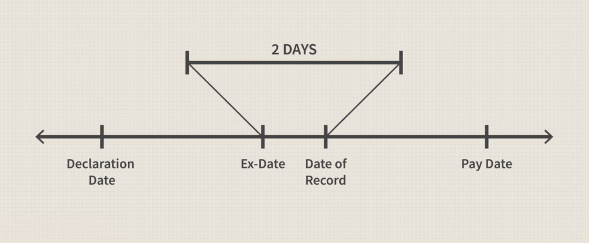

Understanding the nuances of dividend payments is crucial for investors and those involved in algorithmic trading. Dividends are not merely periodic payouts; they are integral to evaluating a company's financial health and future growth prospects. For investors, dividend payments can significantly influence portfolio returns as they offer a source of income distinct from capital gains derived through stock price appreciation. Knowing how dividends affect stock prices and investment returns is essential for making informed decisions.

Dividend payments impact a company's stock price by influencing investor perceptions of its financial health. Typically, when a company announces dividends, it signals a stable cash flow, potentially making the stock more attractive to investors. This can lead to an increase in the stock's demand, thereby influencing its price. Conversely, the stock price may see adjustments post-dividend announcements due to shifts in market dynamics and investor behavior.



Algorithmic trading leverages these dividend payments to strategically buy and sell stocks, taking advantage of these fluctuations for potential profits. Algorithms can process vast amounts of data and execute trades at speeds unattainable by human traders. By understanding the timing and mechanics of dividend payments, algorithmic strategies can be optimized to capitalize on short-term price movements, enhancing overall portfolio performance.

This article will explore the key dates involved in dividend payments and how these dates can be strategically navigated through algorithmic trading. By understanding these components, investors--from the individual retail investor to sophisticated algorithmic traders--can potentially maximize their investment returns while managing associated risks.

## Table of Contents

## What is a Dividend Payment?

A dividend payment is a financial distribution made by a corporation to its shareholders, representing a portion of the company's earnings allocated as a return on their investment. These payments serve as both a reward for the shareholders' ongoing support and an indicator of the company’s financial health and profitability. Typically, dividends are paid at regular intervals, most commonly on a quarterly basis, although some companies may opt for annual, semi-annual, or even monthly schedules.

The determination of dividend amounts and their frequency is usually decided by the company’s board of directors, taking into account various factors such as the company's earnings, revenue projections, and overall strategic financial planning. This decision-making process balances retaining earnings for future growth initiatives with providing immediate returns to investors.

From an investor’s perspective, dividends offer a stable income stream in addition to potential capital gains derived from appreciating stock prices. This can be particularly appealing in market conditions where price [volatility](/wiki/volatility-trading-strategies) makes capital gains uncertain. Furthermore, dividends can be reinvested to purchase more shares through dividend reinvestment plans (DRIPs), enhancing the compound growth potential of an investor’s portfolio.

Dividend payments can take forms such as cash dividends, where shareholders receive a direct cash payment, or stock dividends, where additional shares are allotted to shareholders. Companies might also distribute special dividends in particular circumstances, usually when they have accumulated significant retained earnings or experienced a one-time surge in profitability.

Historically, firms in industries characterized by stable and predictable earnings, such as utilities and consumer staples, are more likely to offer regular dividends. Conversely, growth-oriented companies, especially those in rapidly evolving sectors like technology, often reinvest earnings into business expansion rather than distribute dividends.

Understanding dividend payments is vital for investors seeking income stability and those who employ strategies like dividend capture in their trading activities. It requires an evaluation of the firm's financial stability, dividend payout ratio, and historical payment practices to assess the potential long-term benefits of an investment.

## Key Dates in Dividend Payments

Understanding the timeline of dividend payments is essential for investors looking to maximize their returns and strategize effectively. There are four key dates associated with dividend payments that every investor should be familiar with: the Declaration Date, Ex-Dividend Date, Record Date, and Payment Date.

The Declaration Date is the date on which the company's board of directors announces that a dividend will be paid. This announcement includes vital information about the dividend, such as the amount per share and the payment date. The declaration is typically accompanied by a press release or an official statement, allowing investors to adjust their strategies based on the upcoming dividend distribution.

The Ex-Dividend Date is crucial for determining dividend eligibility. Typically set one business day before the Record Date, this is the date by which an investor must own shares to be eligible to receive the declared dividend. On this date, the stock typically starts trading without the value of the upcoming dividend reflected in its price. For example, if a stock is expected to pay a $1 dividend, the stock price might decrease by approximately $1 on the ex-dividend date. This adjustment mirrors the upcoming cash outflow from the company to its shareholders.

The Record Date follows the ex-dividend date and is set by the company to determine which shareholders are eligible to receive the dividend. Shareholders who are recorded on the company's [books](/wiki/algo-trading-books) as of this date will receive the dividend payment. Due to the way stock transactions are settled, investors need to own the stock before the ex-dividend date to appear on the company's records by the record date.

Finally, the Payment Date is when the dividend is actually distributed to the shareholders. This is the date when eligible shareholders receive the dividend payment, usually in the form of cash or additional shares, depending on the company's payout policy.

Understanding these dates is crucial for investors, particularly those employing dividend capture strategies aimed at profiting from the stock's price movement around the dividend dates. Proper timing and execution based on these dates can significantly impact investment outcomes.

## The Ex-Dividend Date and its Importance

The Ex-Dividend Date is a crucial component in the timeline of dividend payments, especially for traders focusing on dividend capture strategies. This date determines whether an investor is eligible to receive the upcoming dividend payment. To qualify for the dividend, an investor must purchase the stock before the Ex-Dividend Date. If the purchase is made on or after this date, the investor will not receive the dividend.

Algorithmic traders frequently leverage the Ex-Dividend Date to optimize their trading strategies and maximize returns. By employing automated systems, these traders can efficiently track impending Ex-Dividend Dates and execute trades accordingly. An algorithmic approach offers the advantage of swift decision-making based on predefined criteria, allowing traders to capitalize on the price adjustments that typically occur around the Ex-Dividend Date.

In mathematical terms, the adjustment in stock price that can be expected on the Ex-Dividend Date is approximately equal to the dividend amount. This anticipated drop can be represented by the formula:

$$
\Delta P \approx D
$$

where:
- $\Delta P$ is the change in stock price,
- $D$ is the dividend amount.

Python code can aid in the identification of stocks approaching their Ex-Dividend Dates and simulate potential trading outcomes. Consider the following Python example that outlines a simplistic strategy of filtering stocks based on their expected Ex-Dividend Dates:

```python
import pandas as pd
from datetime import datetime, timedelta

# Sample data: list of stocks with their ex-dividend dates
stocks_data = {
    'Stock': ['AAPL', 'MSFT', 'GOOGL', 'AMZN'],
    'ExDividendDate': ['2023-10-20', '2023-10-18', '2023-10-25', '2023-10-21']
}

# Convert to a DataFrame
df = pd.DataFrame(stocks_data)

# Current date
current_date = datetime.now().date()

# Filter stocks by Ex-Dividend Dates approaching in the next 7 days
upcoming_ex_dividend = df[pd.to_datetime(df['ExDividendDate']).dt.date < current_date + timedelta(days=7)]

print("Stocks with approaching Ex-Dividend Dates:")
print(upcoming_ex_dividend)
```

This code determines which stocks have Ex-Dividend Dates within the next week, enabling traders to strategize effectively. Such data-driven strategies are essential for traders seeking to navigate the stock price movements associated with dividend payments proficiently. By understanding and reacting to the Ex-Dividend Date, investors can make informed decisions to potentially enhance their returns.

## Algorithmic Trading and Dividend Capture Strategies

Algorithmic trading utilizes computer algorithms to execute trades at speeds and frequencies far beyond human capability. These algorithms operate according to predefined criteria that can be fine-tuned to capitalize on specific market opportunities, such as dividend capture strategies. Dividend capture involves purchasing stocks just before the ex-dividend date to earn the dividends and then selling them shortly after, often exploiting stock price adjustments related to dividend distributions.

Key to [algorithmic trading](/wiki/algorithmic-trading) is the ability to process vast amounts of data rapidly, identifying patterns that indicate favorable trading conditions. In dividend capture strategies, algorithms can be programmed to detect upcoming ex-dividend dates, analyze historical stock price behavior around these dates, and make buy/sell decisions to optimize for dividend eligibility and subsequent stock price movements.

The effectiveness of dividend capture strategies implemented through algorithmic trading hinges on several factors:

1. **Market Volatility**: The inherent volatility of the stock market can impact the effectiveness of dividend capture. Price movements after the ex-dividend date can sometimes be larger than anticipated, affecting the net gain from dividends.

2. **Price Adjustments**: On the ex-dividend date, stock prices generally drop by an amount approximately equal to the dividend paid. Algorithms need to anticipate these adjustments to avoid diminished returns from holding the stock post-dividend. This can be mathematically represented as:
$$
   P_{\text{adjusted}} = P_{\text{closing}} - D

$$

   Where $P_{\text{adjusted}}$ is the adjusted price on the ex-dividend date, $P_{\text{closing}}$ is the closing price before the ex-dividend date, and $D$ is the dividend per share.

3. **Transaction Costs**: A significant consideration in algorithmic trading is transaction costs. Frequent buying and selling can erode the gains made from dividends. Thus, algorithms must factor in these costs when executing trades.

4. **Regulatory and Tax Considerations**: Algorithms also need to accommodate any regulatory requirements or tax implications associated with dividend capture, such as differences in tax rates between short-term capital gains and dividend income.

Python, a popular language used in algorithmic trading, allows for the development of flexible and sophisticated algorithms. A simplistic example of a dividend capture strategy algorithm may involve setting up a trigger for stocks with upcoming ex-dividend dates:

```python
import yfinance as yf  # For more datasets, visit: https://paperswithbacktest.com/datasets
from datetime import datetime, timedelta

# Define the lookahead period for ex-dividend dates
lookahead_days = 5

# Get the list of stocks to monitor
stocks = ['AAPL', 'MSFT', 'JNJ']

for stock in stocks:
    # Fetch stock data
    data = yf.Ticker(stock)
    cal = data.calendar

    # Get the ex-dividend date
    ex_div_date = cal.loc['Ex-Dividend Date'][0]

    # Check if the ex-dividend date is within the lookahead period
    if datetime.now().date() <= ex_div_date <= (datetime.now() + timedelta(days=lookahead_days)).date():
        print(f"Buy signal for {stock}: ex-dividend date is within the next {lookahead_days} days.")

# Note: Ensure libraries such as 'yfinance' are installed and the script is run in an environment 
# where necessary market data is accessible.
```

This code snippet outlines a basic structure for identifying stocks with imminent ex-dividend dates, a foundational step in a dividend capture strategy. Advanced implementations would involve comprehensive analysis and trading logic that include risk management and after-trade evaluation to continually refine trading strategies.

## Impact of Dividends on Stock Prices

When a company pays a dividend, the immediate impact is typically observed in its stock price, particularly on the ex-dividend date. This date is when the market adjusts the stock price to reflect the dividend payment, often resulting in a dip equivalent to the dividend amount. For instance, if a company's stock closes at $50 and the dividend declared is $2, the stock might open approximately $2 lower on the ex-dividend date, assuming all other market conditions remain constant. This adjustment is based on the principle that the dividend is transferred from the company's retained earnings to the shareholders' hands, thereby reducing the intrinsic value of the stock by the dividend amount.

Traders engaged in dividend capture strategies pay close attention to these price adjustments. The goal is to purchase the stock prior to the ex-dividend date and sell it immediately after, capturing the dividend while potentially mitigating losses from the price drop. This strategy, however, comes with complexities as stock prices are influenced by numerous factors beyond dividends, including market sentiment, macroeconomic indicators, and company-specific news.

Moreover, the adjusted stock price does not always decrease exactly by the dividend amount. Market dynamics, such as investor demand, can influence whether a stock price adjusts fully or partially to the declared dividend. This variance offers both opportunities and risks, making it crucial for traders to incorporate comprehensive market analysis and forecasting models in their strategies.

A simplified Python code snippet for calculating the expected price adjustment could be:

```python
def expected_price_adjustment(closing_price, dividend):
    return closing_price - dividend

# Example usage
closing_price = 50.00
dividend = 2.00
ex_dividend_price = expected_price_adjustment(closing_price, dividend)
print(f"Expected price on ex-dividend date: ${ex_dividend_price:.2f}")
```

This price fluctuation presents a pivotal trading opportunity, emphasizing the need for strategic positioning and timely execution in dividend capture strategies. However, understanding that the market does not always conform to theoretical expectations helps traders manage their risks and optimize potential gains.

## Risks and Considerations

Dividend capture strategies, though potentially rewarding, pose certain risks that need careful consideration. Key among these risks is market volatility. Stock prices can be unpredictable due to numerous factors, including economic indicators, company performance, and geopolitical tensions. Consequently, the anticipated gains from dividend payments can be overshadowed by sudden adverse price shifts, leading to potential losses.

Transaction costs present another significant risk. Frequent buying and selling of stocks to capture dividends can incur substantial brokerage fees and commissions. These costs can erode the profits from dividends, especially if the strategy involves small dividend payouts or is executed over a short period.

Furthermore, investors must be mindful of the tax implications associated with dividend capture strategies. When dividends are obtained through strategies that involve holding the stock for a brief period, the gains are typically classified as short-term. In many tax jurisdictions, short-term gains are taxed at a higher rate than long-term gains, which applies to investments held beyond a specified duration, often one year. This tax treatment can significantly reduce the net return on investment from dividend capture strategies.

The following Python code snippet illustrates the impact of tax rates on dividends:

```python
# Example to calculate taxed dividend with short-term and long-term tax rates
def calculate_dividend_after_tax(dividend, short_term_tax_rate, long_term_tax_rate, is_short_term=True):
    effective_tax_rate = short_term_tax_rate if is_short_term else long_term_tax_rate
    dividend_after_tax = dividend * (1 - effective_tax_rate)
    return dividend_after_tax

# Example usage
dividend = 100  # Assume a dividend of $100
short_term_tax_rate = 0.25  # 25% for short-term gains
long_term_tax_rate = 0.15  # 15% for long-term gains

# Calculate for short-term gain
short_term_dividend = calculate_dividend_after_tax(dividend, short_term_tax_rate, long_term_tax_rate, is_short_term=True)

# Calculate for long-term gain
long_term_dividend = calculate_dividend_after_tax(dividend, short_term_tax_rate, long_term_tax_rate, is_short_term=False)

print(f"Dividend after tax (short-term): ${short_term_dividend:.2f}")
print(f"Dividend after tax (long-term): ${long_term_dividend:.2f}")
```

Investors involved in dividend capture must weigh these risks against potential benefits. Thorough analysis and strategic planning are essential to navigate these challenges and optimize returns effectively.

## Conclusion

Effectively navigating the nuances of dividend payments and employing algorithmic trading strategies can significantly enhance investment opportunities. Investors who comprehend the dividend payment timeline can make better-informed decisions, particularly when leveraging algorithmic trading to capitalize on key dates, such as the ex-dividend date. By automating trades according to pre-defined criteria, traders can exploit patterns around these dates to maximize returns. However, success in these endeavors requires a balanced approach that takes into account the associated risks.

Algorithmic trading systems can process large volumes of data and execute trades with precision and speed, advantages that are particularly beneficial in dynamic markets. For instance, traders can program algorithms to buy stocks before the ex-dividend date to qualify for dividends and subsequently sell them, even accounting for any typical price correction post-dividend. Below is a simple Python example for an algorithm that aims to identify such opportunities:

```python
from datetime import datetime, timedelta
import pandas as pd

def get_ex_dividend_stocks(dataframe):
    # Define the timeframe window for analysis
    window = timedelta(days=30)
    today = datetime.today()

    # Filter stocks where the ex-dividend date falls within the window
    upcoming_dividends = dataframe[
        (dataframe['ex_dividend_date'] >= today) &
        (dataframe['ex_dividend_date'] <= today + window)
    ]
    return upcoming_dividends[['stock_ticker', 'ex_dividend_date', 'dividend_amount']]

# Example usage with an assumed dataframe `df` containing stock data
# Ensure the dataframe has an 'ex_dividend_date' column in datetime format
dividend_opportunities = get_ex_dividend_stocks(df)
print(dividend_opportunities)
```

Despite the potential for profit, investors must account for intrinsic risks such as market volatility, transaction costs, and tax implications, which may erode returns. A robust understanding of tax regulations, particularly those pertaining to short-term gains, is essential as dividends may be taxed at higher rates.

To sum up, while the strategic use of dividend payment schedules and algorithmic trading holds promise for enhanced portfolio performance, each investment decision must be carefully calibrated. Through educated risk assessment and informed planning, investors can position themselves to potentially maximize returns within the bounds of their risk tolerance.

## References & Further Reading

[1]: ["Dynamic Strategies for Dividend Capture"](https://www.investopedia.com/articles/stocks/11/dividend-capture-strategy.asp) by Mikhail Chernov, Michael Johannes, and Gurdip Bakshi, Journal of Financial Economics.

[2]: ["Quantitative Trading: How to Build Your Own Algorithmic Trading Business"](https://github.com/LucindaYa/quant-resources/blob/master/Quantitative%20Trading%20How%20to%20Build%20Your%20Own%20Algorithmic%20Trading%20Business.pdf) by Ernest P. Chan

[3]: ["Machine Learning for Algorithmic Trading"](https://github.com/stefan-jansen/machine-learning-for-trading) by Stefan Jansen

[4]: ["Algorithmic Trading: Winning Strategies and Their Rationale"](https://play.google.com/store/books/details/Algorithmic_Trading_Winning_Strategies_and_Their_R?id=CIwCTVqEj4oC&hl=en-US) by Ernest P. Chan

[5]: Elton, Edwin J., Gruber, Martin J., Blake, Christopher R. (2005). ["The Impact of Mutual Fund Family Membership on Investor Risk."](https://www.jstor.org/stable/2353461) The Review of Financial Studies. 

[6]: Graham, Benjamin. ["The Intelligent Investor: The Definitive Book on Value Investing."](https://www.amazon.com/Intelligent-Investor-Definitive-Investing-Essentials/dp/0060555661) Harper Business. 

[7]: ["Advances in Financial Machine Learning"](https://www.amazon.com/Advances-Financial-Machine-Learning-Marcos/dp/1119482089) by Marcos Lopez de Prado