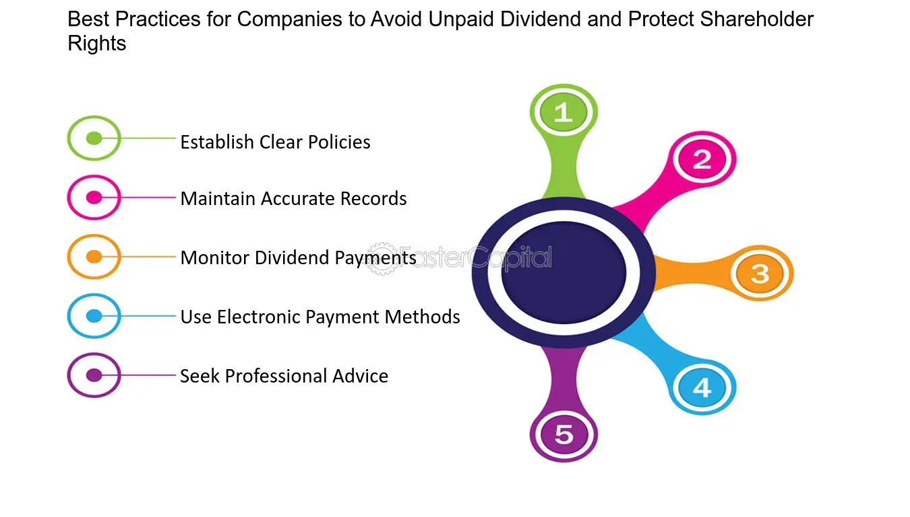

## Table of Contents

## What is a dividend?

A dividend is money that a company pays to its shareholders. When a company makes a profit, it can choose to share some of that profit with the people who own its stock. This payment is called a dividend. Shareholders usually receive dividends every three months, but some companies pay them more or less often.

Dividends are important because they provide investors with a regular income. This can be especially helpful for people who are retired and need money to live on. Not all companies pay dividends, though. Some companies, especially newer ones, might decide to use all their profits to grow the business instead of paying dividends.

## Why do companies pay dividends?

Companies pay dividends because they want to share their profits with the people who own their stock. When a company does well and makes money, it can give some of that money back to its shareholders. This makes the shareholders happy because they get extra money without having to sell their stock. It's like a reward for believing in the company and investing in it.

Paying dividends can also make a company look good to investors. If a company pays regular dividends, it shows that it is stable and successful. This can attract more people to buy its stock, which can help the company grow. Some investors even choose stocks based on how much and how often the company pays dividends, so it can be a big reason why people decide to invest in a company.

## How often are dividends typically paid?

Dividends are usually paid every three months. This means that if you own stock in a company, you might get a dividend payment four times a year. This schedule is common because it gives companies a regular way to share their profits with shareholders without having to do it too often.

However, not all companies follow this schedule. Some companies might pay dividends every month, while others might only pay them once or twice a year. It all depends on the company's policy and how they want to manage their profits. So, if you're thinking about investing in a company for its dividends, it's a good idea to check how often they pay them.

## What are the different types of dividend payments?

There are a few different types of dividend payments. The most common type is a cash dividend, where the company gives money directly to its shareholders. This is what most people think of when they hear about dividends. Another type is a stock dividend, where instead of cash, the company gives out more shares of its stock to its shareholders. This can be good if the stock price goes up later.

There are also special dividends, which are one-time payments that a company might give out if it has extra money or wants to celebrate something big. Property dividends are another type, where the company gives out assets other than cash or stock, like real estate or products. Finally, there are liquidating dividends, which happen when a company is closing down and it gives back the money it has to its shareholders. Each type of dividend has its own reasons and effects, so it's good to know what kind you might get.

## How can shareholders receive dividend payments?

Shareholders can receive dividend payments in different ways, depending on what the company offers. The most common way is by direct deposit. This means the company puts the money right into the shareholder's bank account. It's easy and quick, and shareholders don't have to do anything once they set it up.

Another way is by getting a check in the mail. The company sends a check to the address the shareholder has on file. This can take a bit longer, but some people like having a physical check. For stock dividends, the company adds more shares to the shareholder's account. The shareholder doesn't get money right away, but they own more of the company.

## What is a dividend yield and how is it calculated?

Dividend yield is a way to measure how much money you get back from a company in dividends compared to how much you paid for the stock. It's like figuring out how good of a deal the dividends are. To find the dividend yield, you take the yearly dividend payment and divide it by the price of the stock. Then, you multiply that number by 100 to turn it into a percentage.

For example, if a company pays a yearly dividend of $2 per share and the stock costs $40, you would divide $2 by $40 to get 0.05. Multiply 0.05 by 100, and you find the dividend yield is 5%. This means that for every $40 you spend on the stock, you get back 5% of that amount every year in dividends. It's a useful number for investors who want to know how much income they can expect from their investment.

## How do dividend policies vary across different industries?

Different industries have different ways of handling dividend payments. For example, big, stable companies like those in the utilities or consumer goods industries often pay regular dividends. These companies make steady profits and want to share them with their shareholders. So, if you own stock in a power company or a big food brand, you might get a dividend every few months. This makes these stocks popular with people who want a steady income from their investments.

On the other hand, companies in newer or fast-growing industries, like technology or biotech, usually don't pay dividends. These companies often use all their profits to grow bigger and develop new products. They think that by not paying dividends, they can make their company more valuable in the long run. So, if you invest in a tech startup, you might not get any dividend payments, but the value of your stock could go up a lot if the company does well.

## What are the tax implications of dividend income for investors?

When you get dividend payments, you have to pay taxes on them. In the United States, how much tax you pay depends on whether the dividends are "qualified" or "non-qualified." Qualified dividends are usually from stocks you've held for a while and are taxed at a lower rate, like the capital gains tax rate. This can be 0%, 15%, or 20%, depending on your income. Non-qualified dividends, which come from stocks you haven't held as long, are taxed at your regular income tax rate, which could be higher.

The rules can be different in other countries, so it's important to know the tax laws where you live. Some places might tax dividends at a flat rate, while others might treat them differently based on how long you've owned the stock. It's a good idea to talk to a tax professional to understand exactly how much tax you'll owe on your dividend income. This way, you can plan your investments and know how much money you'll really keep after taxes.

## How do companies decide on the amount of dividends to pay?

Companies decide on the amount of dividends to pay by looking at their profits and what they need for the future. If a company makes a lot of money, it might decide to share some of that with its shareholders as dividends. But, the company also has to think about its plans. If it wants to grow bigger or start new projects, it might keep more of the profits instead of paying them out as dividends. The company's board of directors makes this decision, trying to find a balance between making shareholders happy and keeping enough money to run and grow the business.

Another thing companies think about is what their shareholders expect. If a lot of people who own the company's stock want regular dividends, the company might pay out more. But if the shareholders are okay with waiting for the company to grow and make the stock price go up, the company might pay less or no dividends at all. This can change over time, so companies often look at their past dividend payments and try to keep them steady or increase them slowly to keep shareholders happy.

## What is a dividend reinvestment plan (DRIP) and how does it work?

A dividend reinvestment plan, or DRIP, is a way for shareholders to use their dividend payments to buy more shares of the company's stock instead of getting cash. When a company pays a dividend, instead of sending you money, it automatically uses that money to buy more stock for you. This means you end up owning more of the company without having to spend any extra money.

DRIPs can be good because they help your investment grow over time. When you get more shares, those shares can also pay dividends in the future, which can then buy even more shares. This can make your investment grow faster because you're always adding to it. Plus, some companies offer DRIPs at a discount, so you can buy the shares for less than the normal price, which is like getting a bonus on top of your dividends.

## How do global economic conditions affect dividend payment practices?

Global economic conditions can really change how companies decide to pay dividends. When the economy is doing well, companies usually make more money. This means they can pay bigger dividends to their shareholders. But if the economy is not doing so great, like during a recession, companies might make less money. Then, they might decide to pay smaller dividends or even stop paying them for a while. They need to keep money to stay strong and keep running the business.

Also, different countries can have different rules and taxes about dividends. If a country changes its tax laws, it might make it harder or easier for companies to pay dividends. For example, if taxes go up, companies might pay less in dividends to keep more money for themselves. And if the economy in one country is doing badly but another country is doing well, companies might change how they pay dividends depending on where they are and where their shareholders live. So, the global economy can make a big difference in how and when companies pay dividends.

## What are the strategic considerations behind initiating, increasing, or cutting dividends?

Companies think about many things when they decide to start, increase, or cut dividends. If a company wants to start paying dividends, it might be because they are making good profits and want to share some of that with their shareholders. It can also make the company look stable and attract more investors. But, starting dividends means the company has to keep paying them, so they need to be sure they can afford it. Increasing dividends can make shareholders happy because it means more money for them. It shows that the company is doing well and wants to give more back to its owners. But, if a company increases dividends too much, it might not have enough money left to grow or handle tough times.

On the other hand, cutting dividends can be a tough choice. Companies might cut dividends if they are not making as much money as before or if they need to save money for something important, like expanding the business or dealing with a crisis. Cutting dividends can make shareholders upset because they are getting less money. But sometimes, it's the right thing to do to keep the company strong in the long run. Companies have to balance making their shareholders happy now with making sure the business stays healthy for the future.

## What are the relationships between Corporate Finance and Dividend Policies?

Dividend policies serve as crucial strategic frameworks within corporate finance, directly influencing how companies allocate their earnings. These policies guide the decision-making process regarding the distribution of profits, balancing between rewarding shareholders and reinvesting in growth opportunities. The formulation and implementation of dividend policies can significantly impact a company's financial strategy, investor relations, and market performance.

The allocation of earnings is strategically managed through various dividend policies, each offering distinct advantages and aligning with specific financial objectives. Three primary dividend policy models commonly adopted by corporations are the residual, stable, and hybrid dividend policies.

1. **Residual Dividend Policy**: Under this approach, dividends are paid only after all profitable investment opportunities have been funded. Here, dividends are considered a residual outcome of financing decisions. The primary consideration is to finance all projects with positive net present value (NPV), thereby optimizing capital allocation. Mathematically, the residual dividend can be represented as:
$$
   \text{Dividend} = \text{Net Income} - \text{Retained Earnings for Investment}

$$

   This model prioritizes growth and reinvestment, ensuring that dividends are distributed only when sufficient funds remain after meeting all reinvestment needs.

2. **Stable Dividend Policy**: This policy emphasizes maintaining consistent dividend payments, resembling a predictable return for shareholders. Companies adhering to stable dividend policies often strive to align their dividend rates with long-term earning trends, avoiding fluctuation despite short-term profit variability. This approach aims to build investor trust and confidence through predictable payouts, often targeting a specific payout ratio. The formula for the payout ratio is:
$$
   \text{Payout Ratio} = \frac{\text{Dividends per Share}}{\text{Earnings per Share}}

$$

   Maintaining consistency in dividend payments helps stabilize stock market perception, supporting long-term investment appeal.

3. **Hybrid Dividend Policy**: As a blend of the residual and stable models, the hybrid policy attempts to balance growth and shareholder returns. Companies adopting this policy ensure a stable dividend with potential for additional, variable dividends tied to extraordinary earnings. This approach offers flexibility, allowing companies to maintain a baseline payout while distributing additional dividends during financially robust periods.

Dividend policies also serve as signals to the market, reflecting management’s confidence in future earnings and stability. By strategically implementing and adjusting these policies, companies can align their financial objectives with prevailing economic conditions while meeting shareholder expectations. Ultimately, well-structured dividend policies not only distribute profits but also play a pivotal role in shaping the company’s long-term financial trajectory and market positioning.

## What is the conclusion?

Understanding dividends, dividend policies, and their integration into [algorithmic trading](/wiki/algorithmic-trading) provides a competitive financial edge, offering critical insights into corporate finance. Dividends, representing a portion of corporate profits distributed to shareholders, are more than mere cash returns; they are vital indicators of a company’s financial health and sustainability. Effective dividend policies serve as blueprints for how companies allocate their earnings, balancing reinvestment opportunities with shareholder returns.

By utilizing dividends as key metrics, algorithmic trading strategies can identify potentially lucrative stock opportunities and market trends. Such integration highlights the transformative role that technology and mathematics play in modern finance. For example, trading algorithms can be designed to incorporate dividend yields into their decision-making processes, potentially enhancing the probability of achieving above-average returns.

Mathematically, the dividend yield, $D_y$, can be calculated as:

$$
D_y = \frac{D}{P}
$$

where $D$ represents dividends per share, and $P$ is the price per share. Algorithmic trading systems might use variations of this formula to assess relative valuation across similar equities, further optimizing their buy-sell decisions.

Market behavior is increasingly influenced by dividend-related strategies, as they can alter investor sentiment and capital flow dynamics. These elements collectively underscore the importance of well-crafted dividend strategies, which not only enhance shareholder value but also solidify a company’s market positioning. By striking an optimal balance between dividend payouts and reinvestment, companies can fuel their growth trajectories while maintaining investor confidence.

Investors and corporate managers who cultivate a profound understanding of the interconnectedness of dividends, corporate finance, and algorithmic trading are better poised to achieve long-term success. This alignment of financial strategies with market expectations ensures that an entity can sustain its competitive edge, ultimately shaping the evolving landscape of corporate finance.

## References & Further Reading

[1]: ["Dividend Policy: Theory and Practice"](https://www.amazon.com/Dividend-Policy-Practice-George-Frankfurter/dp/012266051X) by John Lintner

[2]: Damodaran, A. (2006). ["Damodaran on Valuation: Security Analysis for Investment and Corporate Finance."](https://onlinelibrary.wiley.com/doi/book/10.1002/9781119201786) Wiley Finance.

[3]: ["The Intelligent Investor"](https://www.amazon.com/Intelligent-Investor-3rd-Ed/dp/0063356724) by Benjamin Graham

[4]: ["Financial Management: Theory & Practice"](https://faculty.cengage.com/titles/9781305632295) by Eugene F. Brigham and Michael C. Ehrhardt

[5]: Hull, J. C. (2017). ["Options, Futures, and Other Derivatives."](https://www.semanticscholar.org/paper/Options%2C-Futures%2C-and-Other-Derivatives-Hull/89bdee500c8623864fc9eb7a471546aa713acc44) Pearson Education.

[6]: Knight, J. (2007). ["Value Growth: How to succeed in growth investing"](https://www.vaneck.com/us/en/blogs/moat-investing/value-vs-growth-investing/) Harriman House.

[7]: ["Big Data and Machine Learning in Quantitative Investment"](https://onlinelibrary.wiley.com/doi/book/10.1002/9781119522225) by Tony Guida

[8]: Sharpe, W. F., Gordon J. A., Bailey, J. V. (1998). ["Investments"](https://archive.org/details/investments0000shar) Prentice Hall.

[9]: DeAngelo, H., DeAngelo, L., & Skinner, D. J. (2009). ["Corporate Payout Policy."](https://papers.ssrn.com/sol3/papers.cfm?abstract_id=1400682) Foundations and Trends® in Finance.

[10]: ["Investment Valuation: Tools and Techniques for Determining the Value of Any Asset"](https://archive.org/details/investmentvaluat0000damo_n6k9) by Aswath Damodaran