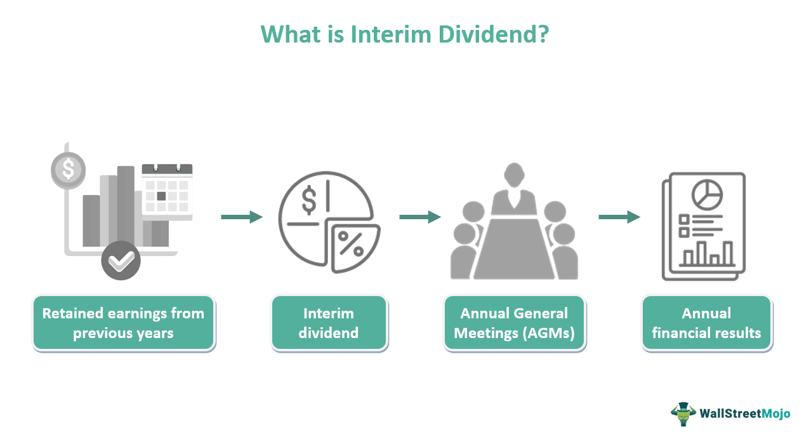

The financial landscape is modulated by a multitude of factors, among which dividends, corporate finance, and algorithmic trading play pivotal roles. Understanding these components and their interactions is pivotal for investors seeking to optimize their portfolios and corporate managers focused on strategically enhancing firm value. Dividends, a direct reflection of a company's profitability and financial health, form a critical linkage between corporate performance and shareholder satisfaction. They represent a portion of a company's earnings distributed to shareholders, often influencing investor behavior and market trends significantly.

Corporate finance is intrinsically linked to the concept of dividends, as corporate managers are tasked with the allocation of profits in a manner that balances immediate shareholder returns and long-term corporate growth. The strategic frameworks guiding dividend policies illuminate how corporate decisions can align with market conditions to maximize shareholder wealth. These policies directly impact financial communication and investor relations, thereby playing a crucial role in corporate strategy.



In algorithmic trading, dividend metrics are increasingly being utilized to sharpen trading strategies. The integration of dividends into algorithmic trading offers a novel dimension to market analysis, with machine learning applications leveraging dividend data to optimize trading algorithms. This melding of traditional financial metrics with cutting-edge technology underscores the growing complexity and sophistication of financial markets.

This article endeavors to elucidate the interconnectedness of dividends, corporate finance, and algorithmic trading. By examining these elements, it aims to offer insights into how they collectively shape the financial landscape, influencing market behaviors and corporate strategies. Understanding these dynamics offers a competitive advantage in navigating the financial markets, ultimately enhancing shareholder value and corporate positioning.

## Table of Contents

## Understanding Dividends and Their Importance

Dividends are a vital aspect of corporate finance, serving as a bridge between a company's earnings and its shareholders. They are portions of a company's profits distributed to its shareholders, typically in the form of cash payments or additional shares. The decision to distribute dividends indicates a company's financial health and management's confidence in its ongoing profitability and cash flow.

Dividends are crucial because they reflect a company's earnings and inherent value, providing insight into its operational success and financial stability. Companies with a consistent history of paying dividends are often perceived as stable and reliable, which can positively influence investor sentiment. Such companies demonstrate the ability to generate regular profit, retaining sufficient earnings after fulfilling all financial obligations and operational requirements.

There are several methods of dividend distribution, each offering strategic advantages. The most common method is the cash dividend, where companies distribute a portion of their earnings in cash. This method provides immediate income to shareholders and is particularly attractive to income-focused investors. Another approach is the issuance of stock dividends, where additional shares are distributed to shareholders, expanding their holdings without altering their proportionate ownership in the company. This method is advantageous for companies wishing to retain cash for reinvestment while still rewarding shareholders. 

Moreover, dividend-paying methods can effectively influence market dynamics. When a company announces an increase in dividend payments, it often signals robust financial health and future earnings potential, leading to positive shifts in stock prices. Conversely, reducing or omitting dividends can signal financial distress or a shift towards reinvestment strategies, potentially impacting investor confidence and stock valuation.

In conclusion, dividends are more than just profit distribution—they are a strategic tool for companies, conveying their financial well-being and future prospects, while also playing a significant role in shaping investor perceptions and market dynamics.

## Corporate Finance and Dividend Policies

Dividend policies serve as crucial strategic frameworks within corporate finance, directly influencing how companies allocate their earnings. These policies guide the decision-making process regarding the distribution of profits, balancing between rewarding shareholders and reinvesting in growth opportunities. The formulation and implementation of dividend policies can significantly impact a company's financial strategy, investor relations, and market performance.

The allocation of earnings is strategically managed through various dividend policies, each offering distinct advantages and aligning with specific financial objectives. Three primary dividend policy models commonly adopted by corporations are the residual, stable, and hybrid dividend policies.

1. **Residual Dividend Policy**: Under this approach, dividends are paid only after all profitable investment opportunities have been funded. Here, dividends are considered a residual outcome of financing decisions. The primary consideration is to finance all projects with positive net present value (NPV), thereby optimizing capital allocation. Mathematically, the residual dividend can be represented as:
$$
   \text{Dividend} = \text{Net Income} - \text{Retained Earnings for Investment}

$$

   This model prioritizes growth and reinvestment, ensuring that dividends are distributed only when sufficient funds remain after meeting all reinvestment needs.

2. **Stable Dividend Policy**: This policy emphasizes maintaining consistent dividend payments, resembling a predictable return for shareholders. Companies adhering to stable dividend policies often strive to align their dividend rates with long-term earning trends, avoiding fluctuation despite short-term profit variability. This approach aims to build investor trust and confidence through predictable payouts, often targeting a specific payout ratio. The formula for the payout ratio is:
$$
   \text{Payout Ratio} = \frac{\text{Dividends per Share}}{\text{Earnings per Share}}

$$

   Maintaining consistency in dividend payments helps stabilize stock market perception, supporting long-term investment appeal.

3. **Hybrid Dividend Policy**: As a blend of the residual and stable models, the hybrid policy attempts to balance growth and shareholder returns. Companies adopting this policy ensure a stable dividend with potential for additional, variable dividends tied to extraordinary earnings. This approach offers flexibility, allowing companies to maintain a baseline payout while distributing additional dividends during financially robust periods.

Dividend policies also serve as signals to the market, reflecting management’s confidence in future earnings and stability. By strategically implementing and adjusting these policies, companies can align their financial objectives with prevailing economic conditions while meeting shareholder expectations. Ultimately, well-structured dividend policies not only distribute profits but also play a pivotal role in shaping the company’s long-term financial trajectory and market positioning.

## The Role of Dividends in Algorithmic Trading

Algorithmic trading integrates vast sets of market data, leveraging statistical and computational techniques to execute trades efficiently and predict future trends. Dividends, as a part of this data spectrum, play an instrumental role in refining the strategies utilized by algorithmic traders. By using dividend metrics, these traders gain insights into stock health and market behavior. 

Dividends, essentially the payouts distributed from a company's earnings to its shareholders, act as vital indicators of a company's financial stability and growth potential. They provide algorithmic models with additional parameters for assessing stock value. Specifically, stocks with consistent and growing dividends often indicate a financially robust company, which could make them attractive targets for [algorithmic trading](/wiki/algorithmic-trading) strategies aiming for stability in returns.

Incorporating dividends into algorithmic models can enhance stock selection processes. For example, algorithms may be programmed to identify patterns in dividend announcements and distributions. Here is a rudimentary example of how one might leverage dividends in Python:

```python
import pandas as pd

# Sample data
data = {'Stock': ['A', 'B', 'C'], 
        'Dividend_Yield': [2.5, 1.8, 3.0],
        'Price_Earnings_Ratio': [15, 18, 12]}

df = pd.DataFrame(data)

# Define a condition to select stocks with high dividend yield and low PE ratio
high_div_yield = df['Dividend_Yield'] > 2.0
low_pe_ratio = df['Price_Earnings_Ratio'] < 16

# Apply condition
selected_stocks = df[high_div_yield & low_pe_ratio]
print(selected_stocks)
```

This script exemplifies a basic dividend-based strategy where stocks with a dividend yield above 2% and a price-earnings ratio below 16 are selected, which may underscore stocks that potentially offer higher value and stability to an investor.

In addition to basic selection algorithms, [machine learning](/wiki/machine-learning) approaches can incorporate dividend metrics to predict stock price movements and market trends more effectively. Machine Learning models, such as Random Forests or Neural Networks, can process dividend data alongside other financial indicators to enhance predictive power and trading strategy robustness. For instance, historical dividend data can be input as features in a classification model to predict whether a stock will outperform the market over a specific period.

The use of dividends in algorithmic trading strategies fortifies decision-making processes, enabling more nuanced and data-driven insights. By meticulously analyzing dividend-related information, algorithmic traders harness these metrics as predictive tools, not only optimizing financial algorithms but also anticipating market movements with greater accuracy.

## Target Payout Ratio: A Strategic Benchmark

The target payout ratio is a key element in a company's financial strategy that reflects its approach to distributing dividends. This ratio indicates the proportion of earnings paid to shareholders in the form of dividends. A well-considered target payout ratio aligns with the company's growth objectives, capital allocation strategy, and market conditions.

Balancing the payout ratio is crucial for a sustainable dividend policy. If a company allocates too high a percentage of earnings to dividends, it might jeopardize its ability to reinvest in growth initiatives or buffer against economic downturns. Conversely, a low payout ratio might signal to investors that the company is overly conservative, which could affect its attractiveness as an investment. Striking the right balance fosters both financial stability and shareholder satisfaction.

The target payout ratio also significantly affects investor relations by signaling the company's confidence in its future profitability. A stable or increasing payout ratio can boost investor confidence and lead to higher market valuations. It reassures investors about the company's consistent performance and reliable income stream, which is particularly appealing to income-focused investors.

Here’s a simple Python script to compute the target payout ratio:

```python
def calculate_target_payout_ratio(dividends_per_share, earnings_per_share):
    return dividends_per_share / earnings_per_share * 100

dividends = 2.5  # Example dividend per share
earnings = 5.0   # Example earnings per share

target_payout_ratio = calculate_target_payout_ratio(dividends, earnings)
print(f"The target payout ratio is {target_payout_ratio}%")
```

The payout ratio significantly influences market performance by integrating shareholder expectations with the company’s strategic outlook. As companies navigate various financial landscapes, maintaining a flexible target payout ratio can enhance market positioning by demonstrating adaptability to changing economic conditions.

In conclusion, the target payout ratio is not merely a financial metric but a strategic tool that helps shape a company's dividend policy, investor relations, and market standing.

## Impact on Financial Strategy and Corporate Growth

Dividend decisions are integral to crafting robust financial strategies, significantly affecting a company's capital allocations. These policies dictate how profits are distributed, directing funds either towards rewarding shareholders or reinvesting in growth initiatives. The impact of dividend policies on financial strategy and corporate growth is profound, shaping investor perceptions and influencing market behavior.

Dividend policies act as a transparent communication tool with investors. By consistently adhering to a well-defined dividend policy, companies can foster trust and boost investor confidence. Investors often interpret stable and predictable dividends as a signal of financial health and operational stability, which can lead to a more favorable view of the company's long-term viability. This confidence, in turn, is critical for enhancing stock valuation and reducing capital costs, as satisfied investors may be less demanding of high returns due to perceived lower risk.

Moreover, aligning shareholder interests with reinvestment strategies is pivotal for sustainable corporate growth. Companies that judiciously allocate a portion of their earnings towards strategic reinvestments can foster innovation, enhance competitiveness, and expand market presence. This approach requires a delicate balance; excessive payouts may limit growth potential, whereas excessively low dividends might deter investors seeking regular income.

In practice, the decision-making process regarding dividend payouts involves evaluating several financial metrics, such as the target payout ratio. This ratio, calculated by dividing dividends by net income, serves as a benchmark for determining the portion of earnings to be distributed. An optimal target payout ratio supports growth objectives, aligns with investor expectations, and ensures financial flexibility. 

The equation for the payout ratio is given by:
$$
\text{Payout Ratio} = \frac{\text{Dividends per Share}}{\text{Earnings per Share}}
$$

By applying this conceptual framework, firms can develop dividend strategies that not only meet the immediate preferences of investors but also contribute to long-term corporate objectives. Balancing these factors ensures that dividend policies support both current income for shareholders and the future prosperity of the enterprise, ultimately driving long-term business success and sustainable growth.

## Conclusion

Understanding dividends, dividend policies, and their integration into algorithmic trading provides a competitive financial edge, offering critical insights into corporate finance. Dividends, representing a portion of corporate profits distributed to shareholders, are more than mere cash returns; they are vital indicators of a company’s financial health and sustainability. Effective dividend policies serve as blueprints for how companies allocate their earnings, balancing reinvestment opportunities with shareholder returns.

By utilizing dividends as key metrics, algorithmic trading strategies can identify potentially lucrative stock opportunities and market trends. Such integration highlights the transformative role that technology and mathematics play in modern finance. For example, trading algorithms can be designed to incorporate dividend yields into their decision-making processes, potentially enhancing the probability of achieving above-average returns.

Mathematically, the dividend yield, $D_y$, can be calculated as:

$$
D_y = \frac{D}{P}
$$

where $D$ represents dividends per share, and $P$ is the price per share. Algorithmic trading systems might use variations of this formula to assess relative valuation across similar equities, further optimizing their buy-sell decisions.

Market behavior is increasingly influenced by dividend-related strategies, as they can alter investor sentiment and capital flow dynamics. These elements collectively underscore the importance of well-crafted dividend strategies, which not only enhance shareholder value but also solidify a company’s market positioning. By striking an optimal balance between dividend payouts and reinvestment, companies can fuel their growth trajectories while maintaining investor confidence.

Investors and corporate managers who cultivate a profound understanding of the interconnectedness of dividends, corporate finance, and algorithmic trading are better poised to achieve long-term success. This alignment of financial strategies with market expectations ensures that an entity can sustain its competitive edge, ultimately shaping the evolving landscape of corporate finance.

## References & Further Reading

[1]: ["Dividend Policy: Theory and Practice"](https://www.amazon.com/Dividend-Policy-Practice-George-Frankfurter/dp/012266051X) by John Lintner

[2]: Damodaran, A. (2006). ["Damodaran on Valuation: Security Analysis for Investment and Corporate Finance."](https://onlinelibrary.wiley.com/doi/book/10.1002/9781119201786) Wiley Finance.

[3]: ["The Intelligent Investor"](https://www.amazon.com/Intelligent-Investor-3rd-Ed/dp/0063356724) by Benjamin Graham

[4]: ["Financial Management: Theory & Practice"](https://faculty.cengage.com/titles/9781305632295) by Eugene F. Brigham and Michael C. Ehrhardt

[5]: Hull, J. C. (2017). ["Options, Futures, and Other Derivatives."](https://www.semanticscholar.org/paper/Options%2C-Futures%2C-and-Other-Derivatives-Hull/89bdee500c8623864fc9eb7a471546aa713acc44) Pearson Education.

[6]: Knight, J. (2007). ["Value Growth: How to succeed in growth investing"](https://www.vaneck.com/us/en/blogs/moat-investing/value-vs-growth-investing/) Harriman House.

[7]: ["Big Data and Machine Learning in Quantitative Investment"](https://onlinelibrary.wiley.com/doi/book/10.1002/9781119522225) by Tony Guida

[8]: Sharpe, W. F., Gordon J. A., Bailey, J. V. (1998). ["Investments"](https://archive.org/details/investments0000shar) Prentice Hall.

[9]: DeAngelo, H., DeAngelo, L., & Skinner, D. J. (2009). ["Corporate Payout Policy."](https://papers.ssrn.com/sol3/papers.cfm?abstract_id=1400682) Foundations and Trends® in Finance.

[10]: ["Investment Valuation: Tools and Techniques for Determining the Value of Any Asset"](https://archive.org/details/investmentvaluat0000damo_n6k9) by Aswath Damodaran