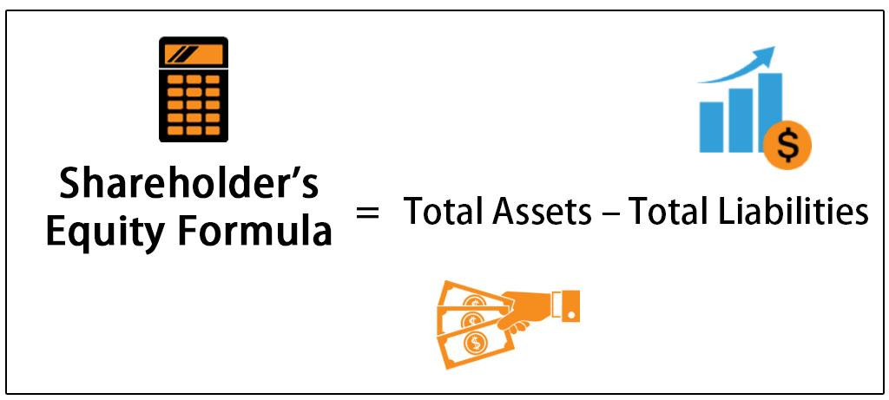

## Table of Contents

## What is a dividend?

A dividend is money that a company gives to its shareholders. It's like a reward for owning part of the company. When a company makes a profit, it can choose to share some of that profit with its shareholders instead of keeping it all for itself.

Companies usually pay dividends a few times a year. The amount you get depends on how many shares you own. If you own more shares, you get more money. Dividends are often seen as a sign that a company is doing well and has enough money to share with its owners.

## How are dividends paid to shareholders?

Dividends are paid to shareholders usually in two ways: by check or by direct deposit into their bank account. If a company decides to pay a dividend, it will announce the amount and the date when the payment will be made. Shareholders need to own the stock before a certain date, called the ex-dividend date, to be eligible to receive the dividend.

Once the company processes the payment, shareholders will either receive a check in the mail or see the money deposited directly into their bank account if they have set up direct deposit. The exact method depends on what the shareholder has chosen or what the company offers. Some companies also allow shareholders to reinvest their dividends automatically to buy more shares, which can help grow their investment over time.

## What is shareholder equity?

Shareholder equity is the money that would be left over for shareholders if a company sold all its assets and paid off all its debts. It's like the net worth of the company from the shareholders' point of view. You can find it on a company's balance sheet, where it's often called "shareholders' equity" or "owners' equity."

To calculate shareholder equity, you start with the total assets of the company and subtract its total liabilities. This gives you an idea of how much the company is really worth to its owners. Shareholder equity is important because it shows how much the shareholders have invested in the company and how well the company is using that money to grow and make profits.

## How do dividend payments affect shareholder equity?

When a company pays dividends, it gives money to its shareholders. This money comes from the company's profits or its cash reserves. When the company pays out these dividends, the amount of cash it has goes down. Since cash is an asset, a decrease in cash means a decrease in the company's total assets. So, when dividends are paid, the shareholder equity goes down because the total assets of the company are lower.

However, paying dividends doesn't always mean the company is worse off. It can show that the company is doing well and has extra money to share with its owners. Some investors like getting dividends because it gives them regular income. But, the company's overall value, or shareholder equity, will be less after paying dividends because the cash used for dividends is no longer part of the company's assets.

## What are the different types of dividends?

There are several types of dividends that companies can pay to their shareholders. The most common type is cash dividends, where the company pays out money directly to shareholders. This is like getting a little bonus for owning the company's stock. Another type is stock dividends, where instead of cash, shareholders get more shares of the company's stock. This can be good because it increases the number of shares you own without you having to buy more.

There are also property dividends, where the company gives out physical assets or products instead of money. This is less common but can happen if a company has a lot of a certain product. Lastly, there are special dividends, which are one-time payments that a company might give if it has a particularly good year or if it wants to share a big profit. Each type of dividend has its own benefits and can affect how shareholders view the company's financial health.

## How can a company decide on the amount of dividends to pay?

A company decides on the amount of dividends to pay by looking at its profits and cash flow. If a company makes a lot of money, it might decide to share some of that money with its shareholders as dividends. The company's board of directors usually makes this decision. They look at how much money the company has made and how much it needs to keep for future growth or to pay its bills. If there's extra money left over, they might choose to pay it out as dividends.

The company also thinks about what its shareholders want. Some shareholders like getting regular dividends because it gives them money they can use or reinvest. Other shareholders might prefer the company to use the money to grow the business, which could make the stock price go up. So, the company tries to balance these different needs. They might decide to pay a small dividend to keep shareholders happy while also keeping enough money to invest in the company's future.

## What is the dividend payout ratio and how is it calculated?

The dividend payout ratio is a number that shows how much of a company's profit it gives back to shareholders as dividends. It helps investors see if a company is sharing a lot or a little of its earnings with them. A high payout ratio means the company is giving a big part of its profits to shareholders. A low payout ratio means the company is keeping more of its profits for itself, maybe to grow the business or save for the future.

To calculate the dividend payout ratio, you divide the total dividends paid by the company's net income. For example, if a company made $100 in profit and paid out $30 in dividends, the payout ratio would be 30 divided by 100, which is 0.3 or 30%. This means the company is giving 30% of its profits back to shareholders. The rest, 70%, is kept by the company for other uses.

## How do dividend policies impact a company's financial strategy?

A company's dividend policy can shape its overall financial strategy in big ways. If a company decides to pay high dividends, it shows shareholders that it's doing well and has extra money to share. This can make shareholders happy and might attract more investors who want regular income from their investments. But, paying high dividends also means the company has less money to use for other things like growing the business, paying off debts, or saving for tough times. So, the company needs to balance giving money to shareholders with keeping enough for its own needs.

On the other hand, if a company chooses a low dividend policy or decides not to pay dividends at all, it can keep more of its profits to reinvest in the business. This might help the company grow faster or develop new products. It can also help the company save money for the future or pay down debts. But, this might make some shareholders unhappy if they were hoping for regular dividend payments. So, the company needs to think carefully about what its shareholders want and what will help the business grow and stay strong in the long run.

## What are the tax implications of receiving dividends for shareholders?

When shareholders receive dividends, they have to pay taxes on that money. In the United States, the tax rate on dividends depends on whether they are qualified or non-qualified dividends. Qualified dividends are taxed at a lower rate, similar to long-term capital gains, which can be 0%, 15%, or 20% depending on your income. Non-qualified dividends are taxed as ordinary income, which means they could be taxed at a higher rate, up to 37% depending on your tax bracket.

The difference between qualified and non-qualified dividends comes down to how long you've owned the stock and the type of company that issued the dividend. To get the lower tax rate on qualified dividends, you usually need to have held the stock for more than 60 days during the 121-day period that begins 60 days before the ex-dividend date. Also, the company paying the dividend needs to be a U.S. corporation or a qualified foreign corporation. If these conditions aren't met, the dividends will be taxed at the higher rate for ordinary income.

## How do retained earnings relate to dividend payments and shareholder equity?

Retained earnings are the money a company keeps after it pays out dividends to its shareholders. This money comes from the company's profits. When a company makes money, it can choose to give some of it back to shareholders as dividends or keep it as retained earnings. Retained earnings are important because they can be used to grow the business, pay off debts, or save for the future. If a company decides to pay more dividends, it will have less money left as retained earnings.

Retained earnings also affect shareholder equity. Shareholder equity is like the value of the company that belongs to the shareholders. It's what's left if you take all the company's assets and subtract all its debts. When a company pays dividends, it uses up some of its retained earnings, which means the total assets go down. Since shareholder equity is based on the company's total assets minus its liabilities, paying dividends reduces shareholder equity. But, if the company keeps more money as retained earnings instead of paying it out as dividends, this can increase shareholder equity because it adds to the company's assets.

## What are the potential impacts of dividend changes on stock prices?

When a company changes its dividend, it can affect its stock price. If a company increases its dividend, it usually means the company is doing well and has more money to share with shareholders. This can make investors feel good about the company and want to buy more of its stock. When more people want to buy the stock, the price can go up. But, if the company cuts its dividend, it might mean the company is having money problems or wants to save cash for other things. This can make investors worried and want to sell the stock, which can make the price go down.

Sometimes, the market might already expect a dividend change. If investors already think a company will increase its dividend, the stock price might already be high. So, when the company actually does increase the dividend, the stock price might not go up as much because the news was already expected. On the other hand, if a company cuts its dividend unexpectedly, the stock price might drop a lot because it surprises investors and makes them lose trust in the company. Overall, dividend changes can show investors what a company thinks about its future, and this can make stock prices move up or down.

## How do international differences in dividend policies affect global investment decisions?

When investors look at companies from different countries, they see that each country has its own way of handling dividends. Some countries have companies that pay big dividends often, while others have companies that pay small dividends or none at all. This can make a big difference in where investors choose to put their money. For example, if an investor wants regular income from their investments, they might choose to invest in a country where companies usually pay high dividends. On the other hand, if an investor is more interested in the company growing and increasing its stock price, they might pick a country where companies keep more of their profits to reinvest in the business.

These differences in dividend policies can also affect how much tax investors have to pay. Different countries have different rules about taxing dividends. Some countries might tax dividends at a lower rate, making it more attractive for investors to buy stocks there. Others might have high taxes on dividends, which could make investors think twice before investing. So, when investors are deciding where to put their money around the world, they need to think about not just the dividend policies, but also how those policies will affect their taxes and overall returns.

## What is involved in decoding financial statements?

Financial statements are formal records that provide an overview of a company's financial performance and position. They are essential tools for investors, analysts, and any party interested in understanding a company's financial health. The primary financial statements include the balance sheet, income statement, and cash flow statement.

The balance sheet presents a snapshot of a company's assets, liabilities, and shareholder equity at a specific point in time. It is crucial for assessing a company's value and financial stability. The formula used to calculate shareholder equity on the balance sheet is:

$$
\text{Shareholder Equity} = \text{Total Assets} - \text{Total Liabilities}
$$

The income statement, also known as the profit and loss statement, details a company's revenues and expenses over a particular period. It ultimately reveals the net profit or loss, helping investors evaluate the company's profitability. This information is vital for understanding the company’s ability to pay dividends; higher net income can often support higher dividend payments.

The cash flow statement records the cash inflows and outflows from operating, investing, and financing activities. It helps in assessing how well a company manages its cash position and finances its operations, which is crucial when evaluating its capacity to sustain dividend payments. 

Analysis of financial statements is essential for investors as it allows them to assess the company's financial health, profitability, and growth potential. For instance, changes in shareholder equity, often seen through retained earnings on the balance sheet, can impact a company’s dividend policy. Companies with increasing retained earnings may opt to reward shareholders with higher dividends or reinvest in growth opportunities.

Algorithmic trading, which involves the use of computer programs to execute trades at high speeds, can be informed by data from financial statements. Algorithms might be coded to evaluate key metrics like price-to-earnings ratios or dividend yields found in these statements. For example, a simple Python snippet might use libraries like pandas to analyze financial data:

```python
import pandas as pd

# Example of loading financial data
data = pd.read_csv('financial_data.csv')
# Calculate dividend yield
data['Dividend Yield'] = data['Annual Dividend'] / data['Stock Price']

# Filter for stocks with high dividend yield
high_yield_stocks = data[data['Dividend Yield'] > 0.05]
print(high_yield_stocks)
```

This script could be part of a more extensive [algorithmic trading](/wiki/algorithmic-trading) strategy targeting high dividend yield stocks, a signal of potential investment returns.

Trends and red flags can also be identified within financial statements. Consistent growth in revenues and net income can indicate a robust growth trajectory. Conversely, red flags might include declining cash reserves, increasing debt levels, or discrepancies in earnings reports, all of which could suggest financial distress or mismanagement, impacting dividend sustainability.

In summary, financial statements are an integral part of investment analysis and decision-making. They provide insights into a company's operations, profitability, and financial stability, which are crucial for both [fundamental analysis](/wiki/fundamental-analysis) and developing algorithmic trading strategies.

## References & Further Reading

[1]: Fama, E. F., & French, K. R. (2001). ["Disappearing Dividends: Changing Firm Characteristics or Lower Propensity to Pay?"](https://www.sciencedirect.com/science/article/pii/S0304405X01000381) Journal of Financial Economics, 60(1), 3-43.

[2]: Gordon, M. J. (1959). ["Dividends, Earnings, and Stock Prices."](https://www.jstor.org/stable/1927792?item_view=read_online) The Review of Economics and Statistics, 41(2), 99-105.

[3]: Penman, S. H. (2009). ["Financial Statement Analysis and Security Valuation"](https://www.mheducation.com/highered/product/financial-statement-analysis-security-valuation-penman/M9780078025310.html) (4th ed.). McGraw-Hill Education.

[4]: Jegadeesh, N., & Titman, S. (1993). ["Returns to Buying Winners and Selling Losers: Implications for Stock Market Efficiency."](https://www.jstor.org/stable/2328882) The Journal of Finance, 48(1), 65–91.

[5]: Ohlson, J. A. (1995). ["Earnings, Book Values, and Dividends in Equity Valuation."](https://onlinelibrary.wiley.com/doi/abs/10.1111/j.1911-3846.1995.tb00461.x) Contemporary Accounting Research, 11(2), 661-687.