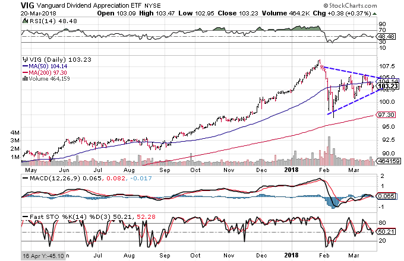

Vanguard ETFs, or Exchange-Traded Funds, have become a crucial component of the investment portfolios of millions of investors globally. By providing broad market exposure combined with cost-effectiveness, these financial instruments offer attractive benefits for both novice and seasoned investors. Vanguard stands out in the ETF marketplace due to its commitment to low-cost, diversified funds, which has contributed significantly to their popularity. 

A pivotal aspect of Vanguard ETFs is their dividend offerings. For income-seeking investors, dividends serve as regular income, essential for those looking to supplement their earnings or reinvest them to enhance their portfolios. Dividends are a portion of a company's earnings distributed to shareholders and, in the context of ETFs, are generated from the stock holdings within the fund. They can significantly impact the total return of an investment, making the understanding of dividend-yielding ETFs particularly important for long-term strategies.



In parallel, algorithmic trading (algo trading) is reshaping the modern financial landscape. This method employs complex algorithms to automate trading decisions, offering increased speed, efficiency, and precision. These systems can analyze vast amounts of data in real time, making them a powerful tool for investors looking to gain an edge in the competitive financial markets. The fusion of algorithmic trading with traditional investment approaches, such as dividend strategies in ETFs, represents a modernized approach to maximizing returns.

This article will explore various facets of Vanguard ETFs and their dividend mechanics. It will also address the nuances of algorithmic trading, including its benefits and challenges. By understanding the interplay between these elements, investors can uncover strategies that combine the stability of dividends with the innovation of algorithmic trading. This integrated approach holds potential for those eager to optimize their investment outcomes in a rapidly evolving market environment.

## Table of Contents

## Understanding Vanguard ETFs

An Exchange-Traded Fund (ETF) is an investment fund that is traded on stock exchanges, much like individual stocks. An ETF holds assets such as stocks, commodities, or bonds and generally operates with an arbitrage mechanism designed to keep trading close to its net asset value, though deviations can occasionally occur.

Vanguard, a pioneer in investment management, significantly shaped the ETF market since its entry. Founded in 1975 by John C. Bogle, Vanguard became synonymous with low-cost investing. In 2001, Vanguard launched its first ETF, taking advantage of the growing interest in low-cost and passive investment strategies. Vanguard ETFs are designed to provide broad market exposure, and they have been a cornerstone of its strategy to offer cost-effective investing solutions.

Vanguard offers a diverse range of ETFs to cater to different investor needs, including equity ETFs, bond ETFs, sector and specialty ETFs, and even international ETFs. These ETFs track various indices such as the S&P 500, FTSE All-World ex-US, and others, providing investors with numerous options to diversify their portfolios across different asset classes and global markets.

Investing in Vanguard ETFs presents several advantages. Their cost-effectiveness stands out, as Vanguard is well-known for its low expense ratios. This is crucial since even small percentage differences in fees can lead to substantial cost savings over the long term. Additionally, Vanguard focuses on transparent and straightforward [ETF](/wiki/etf-trading-strategies) structures, making it easier for investors to understand what they are buying.

Broad market exposure is another key advantage of Vanguard ETFs. By tracking a diverse range of indices, these ETFs enable investors to participate in the general market performance, mitigating the risks associated with individual stock selection. Furthermore, the [liquidity](/wiki/liquidity-risk-premium) of ETFs, including those offered by Vanguard, allows for easy buying and selling on the stock market, providing flexibility to investors who wish to manage their investments actively.

Vanguard's success in the ETF market is largely attributed to its focus on cost-effectiveness and broad market exposure. By ensuring low costs and providing investors with comprehensive market access, Vanguard ETFs have become a preferred choice for both retail and institutional investors. This strategy aligns with Vanguard's philosophy of helping investors increase their chances of investment success while minimizing expenses.

## The Role of Dividends in Vanguard ETFs

Exchange-Traded Funds (ETFs) are investment vehicles that trade on stock exchanges, much like individual stocks. They hold assets such as stocks, commodities, or bonds and generally operate with an [arbitrage](/wiki/arbitrage) mechanism designed to keep trading close to its net asset value, although deviations can occasionally occur. ETFs in the Vanguard family are highly regarded for their cost-effectiveness and broad market exposure. Dividends play a crucial role in the total returns of these ETFs and provide significant advantages to investors, particularly those focused on income generation.

ETF dividends stem from the underlying securities within the fund. If the securities—such as stocks or bonds—pay dividends or interest, these payments are passed through to the ETF investors. Typically, Vanguard ETFs distribute dividends on a quarterly basis, though some may do so monthly or annually depending on the underlying holdings and their distribution policies.

Dividends have immense importance in long-term investment strategies. They not only provide a regular income stream but also have the potential to significantly enhance the overall returns through reinvestment. The power of compounding comes into play when dividends are reinvested, as it allows for growth on both the initial invested capital and the reinvested dividends. This aspect is particularly advantageous in tax-advantaged accounts like IRAs, where dividends can be reinvested without immediate tax consequences.

Popular Vanguard ETFs known for attractive dividend offerings include the Vanguard Dividend Appreciation ETF (VIG) and the Vanguard High Dividend Yield ETF (VYM). These ETFs focus on companies with strong dividend growth records or high dividend yields, making them appealing to income-focused investors.

The impact of dividends on the total return of an ETF is multifaceted. While capital appreciation is a primary driver of returns, dividends provide a cushion during market [volatility](/wiki/volatility-trading-strategies), supplying steady returns even when market conditions are challenging. They serve as a stabilizing [factor](/wiki/factor-investing) in the investors' portfolio, smoothing out the performance peaks and troughs over time.

Tax implications are a vital consideration when receiving dividends from ETFs. In many jurisdictions, dividends are subject to income tax, which may be at a different rate than capital gains. Thus, the investors' net return could vary depending on their tax situation. Qualified dividends, which meet specific Internal Revenue Service (IRS) criteria, are typically taxed at the lower capital gains rate, offering some relief to U.S. taxpayers. However, it is essential for investors to be aware of the tax treatment of dividends in their specific region, as this can influence their overall net return.

In summary, dividends from Vanguard ETFs offer significant value to investors through income generation and enhanced total returns, especially in long-term investment strategies. These benefits are complemented by understanding the tax implications and leveraging reinvestment opportunities for optimal financial growth.

## Algo Trading: A Modern Approach to Investing

Algorithmic trading, commonly known as algo trading, represents a transformative approach to modern investing, leveraging advanced computational techniques and algorithms to execute trades with speed and precision. At its core, [algorithmic trading](/wiki/algorithmic-trading) refers to the use of predefined rules and complex mathematical models to automate trading decisions, reducing the need for human intervention and enhancing trading efficiency.

One of the primary benefits of using algorithms in trading, particularly with Exchange-Traded Funds (ETFs), is the remarkable speed and efficiency they provide. Algorithms can process vast amounts of market data in milliseconds, enabling investors to capitalize on fleeting market opportunities that would be impossible to exploit manually. This speed is particularly advantageous in high-frequency trading environments, where minor price discrepancies can be quickly identified and acted upon.

Efficiency is another significant advantage of algo trading. By automating trading strategies, algorithms can execute large orders by breaking them down into smaller, manageable trades that minimize market impact and reduce transaction costs. This level of precision ensures optimal trade execution, which can lead to better overall portfolio performance.

However, algorithmic trading is not without its risks and challenges. One notable risk is the possibility of algorithmic errors, where flawed code or incorrect assumptions can lead to unintended trading behavior and potential financial losses. Market volatility can also pose a challenge, as unexpected price swings may trigger stop-loss orders or other automated actions that compound losses rather than mitigate them. Additionally, the reliance on algorithms necessitates a thorough understanding of both the programming and the financial models used, which may pose a barrier for some investors.

Despite these challenges, algorithmic trading is revolutionizing the investment landscape. Its impact is particularly pronounced with ETFs, where algos can efficiently manage diverse portfolios and capitalize on sector rotation strategies, risk parity approaches, or arbitrage opportunities. By continuously analyzing market conditions and adjusting holdings accordingly, algorithmic strategies can enhance performance and provide a competitive edge in a dynamic market environment.

Numerous platforms and software facilitate the implementation of algorithmic trading strategies. Popular platforms such as MetaTrader, NinjaTrader, and TradeStation offer robust tools and APIs for developing and testing algorithms. Additionally, modern programming languages like Python are often employed for their versatility and extensive libraries, such as NumPy and Pandas, which provide essential tools for data manipulation and analysis.

Python's prominence in this field is further accentuated by [machine learning](/wiki/machine-learning) libraries like TensorFlow and scikit-learn, which enable the development of predictive models to inform trading decisions. For instance, a simple moving average crossover strategy can be implemented in Python to monitor two moving averages and generate buy or sell signals:

```python
import pandas as pd

# Load historical data
data = pd.read_csv('historical_prices.csv', index_col='Date', parse_dates=True)

# Calculate moving averages
data['short_ma'] = data['Close'].rolling(window=40).mean()
data['long_ma'] = data['Close'].rolling(window=100).mean()

# Generate signals
data['signal'] = 0
data.loc[data['short_ma'] > data['long_ma'], 'signal'] = 1
data.loc[data['short_ma'] < data['long_ma'], 'signal'] = -1

# Plot signals
data[['Close', 'short_ma', 'long_ma']].plot(figsize=(10, 6))
```

This example illustrates the simplicity with which algorithmic trading strategies can be developed and tested, evidencing the democratization of trading opportunities afforded by technological advancements. As algorithmic trading continues to evolve, it is poised to play an increasingly integral role in shaping the future of investment strategies, offering unprecedented opportunities for efficiency and innovation in the financial markets.

## Integrating Dividends and Algo Trading in ETF Strategies

Integrating dividends into algorithmic trading models in the context of ETF strategies involves creating systems that can dynamically assess and respond to dividend events. This integration is particularly relevant for income-seeking investors aiming to optimize their yield while leveraging advanced trading technology.

### Methods for Incorporating Dividends into Algorithmic Trading Models

Algorithmic trading models can incorporate dividend data by parsing announcements of upcoming payments and adjusting positions accordingly. These models typically factor in the ex-dividend date, as buying an ETF before this date qualifies an investor for the dividend. The formula to adjust the price change expectation on the ex-dividend date is:

$$
\text{Adjusted Price} = \text{Closing Price} - \text{Dividend Per Share}
$$

Trading algorithms can be programmed to identify ETF opportunities that offer favorable dividend yields expected to outperform market averages. Moreover, [backtesting](/wiki/backtesting) algorithms with historical dividend data helps refine these models, ensuring they can capitalize on recurring patterns or anomalies that consistently arise before, during, or after dividend events.

### Case Studies of Successful Dividend-Focused Algo Trading Strategies

One successful strategy involves utilizing machine learning methods to predict dividend announcement effects on ETF prices. For instance, a model designed to forecast favorable market responses can exploit price rises resulting from institutional investment increases post-dividend announcements. In practice, hedge funds have used [reinforcement learning](/wiki/reinforcement-learning) models to adaptively manage assets, integrating dividend capture strategies that enhance profitability.

### Comparative Analysis: Human-driven vs. Algorithm-driven ETF Investing Strategies

Human-driven strategies often rely on [fundamental analysis](/wiki/fundamental-analysis) and qualitative assessments of macroeconomic indicators influencing dividends. While this can be effective, it can also be time-consuming and prone to emotional bias. Conversely, algorithm-driven strategies benefit from processing vast datasets at high speed, executing trades based on defined criteria without hesitation. This efficiency is especially pronounced in dividend-focused strategies where timing the market entry and [exit](/wiki/exit-strategy) around dividend events is crucial.

### Considerations for Investors Combining Algo Trading with Dividend-Focused ETFs

Investors looking to integrate these strategies should consider the following:

- **Data Quality:** Reliable and timely dividend data is vital for precise model functioning.
- **Regulatory Constraints:** Be aware of any regional regulations impacting algorithmic trading of dividend-focused ETFs.
- **Cost Implications:** Consider transaction costs that may erode profitability, especially in high-frequency trading environments.
- **Backtesting Framework:** Strong backtesting tools are required to evaluate strategies across different market conditions.

### Best Practices for Managing Risks and Maximizing Returns

When integrating dividends into algo trading strategies, careful risk management is key. The use of stop-loss orders can mitigate downside risks. Moreover, diversification across multiple ETFs can reduce unsystematic risk associated with individual securities. Employing Monte Carlo simulations to assess potential outcomes can be beneficial in strategy development, providing probabilities for return distributions under various economic scenarios. Ultimately, continuous refinement of algorithm parameters based on performance metrics is essential to maintain competitive edge and profitability. 

Combining algorithmic trading and dividend-focused ETF strategies offers a sophisticated investment approach capable of capitalizing on market inefficiencies and enhancing income-focused returns.

## Conclusion

In this article, we explored the landscape of Vanguard Exchange-Traded Funds (ETFs) and their significance for income-seeking investors, particularly those interested in dividend generation. Vanguard ETFs offer a cost-effective and broad market exposure, making them an attractive option for diverse investor needs. Dividends play an essential role in the total return of these funds, providing ongoing income and enhancing investment stability over time.

Algorithmic trading (algo trading) presents a modern approach to investing, leveraging technology for speed and efficiency. While it introduces certain risks and challenges, algo trading has been transformative, notably in the ETF sector. By integrating algorithmic trading with dividend-focused ETF strategies, investors can optimize their portfolio's performance.

The future of Vanguard ETFs and dividend strategies appears promising as investors continue to seek reliable income sources and cost-effective investment options. Additionally, the influence of algo trading will likely expand, further reshaping financial markets by offering sophisticated tools for decision-making and execution.

Investors should consider the synergy between traditional investing and modern technology, as combining these elements can lead to improved outcomes. By exploring these opportunities and staying informed, they can harness the benefits of both established investment practices and innovative strategies. As a call to action, readers are encouraged to deepen their understanding of these techniques, potentially integrating them into their portfolios to achieve optimal financial goals.

## References & Further Reading

[1]: ["Common Sense on Mutual Funds: New Imperatives for the Intelligent Investor"](https://www.amazon.com/Common-Sense-Mutual-Funds-Imperatives/dp/0471392286) by John C. Bogle

[2]: ["Advances in Financial Machine Learning"](https://www.amazon.com/Advances-Financial-Machine-Learning-Marcos/dp/1119482089) by Marcos Lopez de Prado

[3]: ["Exchange-Traded Funds and the New Dynamics of Investing"](https://academic.oup.com/book/3366) by Ananth N. Madhavan

[4]: ["Quantitative Trading: How to Build Your Own Algorithmic Trading Business"](https://www.amazon.com/Quantitative-Trading-Build-Algorithmic-Business/dp/1119800064) by Ernest P. Chan

[5]: ["A Random Walk Down Wall Street: The Time-Tested Strategy for Successful Investing"](https://www.amazon.com/Random-Walk-Down-Wall-Street/dp/0393358380) by Burton G. Malkiel