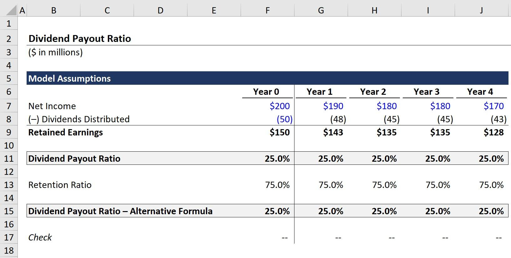

## Table of Contents

## What is a dividend payout ratio?

The dividend payout ratio is a financial measure that shows how much of a company's earnings are paid out to shareholders as dividends. It is calculated by dividing the total dividends paid by the company's net income. This ratio helps investors understand how much money they can expect to receive from their investment in the form of dividends.

A high dividend payout ratio means that a company is giving a large portion of its profits back to shareholders. This can be good for investors looking for regular income from their investments. However, a very high ratio might also mean that the company is not reinvesting enough money back into the business for future growth. On the other hand, a low dividend payout ratio indicates that the company is keeping more of its earnings to reinvest in the business, which could lead to future growth but might not be as attractive to investors seeking immediate income.

## Why is the dividend payout ratio important for investors?

The dividend payout ratio is important for investors because it tells them how much of a company's earnings are being given back to them as dividends. If a company has a high dividend payout ratio, it means they are sharing a big part of their profits with investors. This can be good for people who want to get regular money from their investments. They can use this money for their own needs or to invest in other places.

On the other hand, a low dividend payout ratio means the company is keeping more of its earnings to use for growing the business. This might be good for investors who are looking for the company to get bigger and more valuable over time. But it might not be as good for people who need money right away. So, understanding the dividend payout ratio helps investors decide if a company fits with what they want from their investments.

## How do you calculate the dividend payout ratio using the income statement?

To calculate the dividend payout ratio using the income statement, you need to find two key numbers: the total dividends paid and the net income. The income statement shows you the net income, which is the company's profit after all expenses are subtracted from the revenue. To find the total dividends paid, you might need to look at the cash flow statement or the notes to the financial statements, as this information is not always directly on the income statement.

Once you have these two numbers, you can calculate the dividend payout ratio by dividing the total dividends paid by the net income. The result is usually shown as a percentage. For example, if a company paid out $100,000 in dividends and had a net income of $500,000, the dividend payout ratio would be 20% ($100,000 divided by $500,000). This ratio helps investors see how much of the company's earnings are being given back to them as dividends.

## What are the key components of the income statement used in calculating the dividend payout ratio?

The main thing you need from the income statement to calculate the dividend payout ratio is the net income. The net income is how much money the company made after paying for everything it needed to run the business. It's the profit that's left over at the end of the period, like a year or a quarter. You can find this number at the bottom of the income statement.

The other number you need is the total dividends paid, but this isn't usually on the income statement. You'll have to look at the cash flow statement or the notes to the financial statements to find it. Once you have both numbers, you divide the total dividends paid by the net income. This gives you the dividend payout ratio, which shows what percentage of the company's earnings are given back to shareholders as dividends.

## Can you explain the difference between dividends paid and net income in the context of the dividend payout ratio?

Dividends paid and net income are two important numbers that help us understand the dividend payout ratio. Net income is what's left over after a company pays for everything it needs to run its business. It's like the money a company makes after all the bills are paid. You can find this number on the income statement, which is a report that shows how much money the company made and spent during a certain time.

Dividends paid, on the other hand, is the amount of money the company gives back to its shareholders. Not all companies pay dividends, but for those that do, this money comes from the net income. You usually won't find the dividends paid on the income statement; you might have to look at the cash flow statement or the notes to the financial statements. The dividend payout ratio is calculated by dividing the dividends paid by the net income. This tells us what percentage of the company's profits are being shared with shareholders.

## How does the dividend payout ratio vary across different industries?

The dividend payout ratio can be very different from one industry to another. Some industries, like utilities and consumer staples, often have high dividend payout ratios. These companies usually make steady profits and don't need to spend a lot of money on new things to grow. So, they can give a big part of their earnings back to shareholders as dividends. Investors who want regular income from their investments often like these companies.

On the other hand, industries like technology and biotech usually have lower dividend payout ratios. These companies often need to spend a lot of money on research and development to come up with new products or services. They keep more of their earnings to help the company grow bigger and better in the future. Investors who are looking for the company's value to go up over time might prefer these kinds of companies.

## What are the implications of a high dividend payout ratio?

A high dividend payout ratio means that a company is giving a big part of its profits back to its shareholders as dividends. This can be good for people who want to get regular money from their investments. They might use this money to pay bills or to invest in other places. Investors who need money right away often like companies with high dividend payout ratios because it gives them a steady income.

But a very high dividend payout ratio can also have some downsides. If a company is paying out almost all of its earnings as dividends, it might not have enough money left to grow the business. This could mean the company won't be able to invest in new projects or improve its products. Over time, this could make the company less competitive and might even hurt its stock price. So, while a high dividend payout ratio can be good for income, it's important to think about what it means for the company's future growth.

## What are the implications of a low dividend payout ratio?

A low dividend payout ratio means a company is keeping most of its earnings instead of giving them back to shareholders as dividends. This can be good for the company because it has more money to spend on growing the business. They might use this money to make new products, open new stores, or do other things that can make the company bigger and more successful in the future. Investors who want the value of their shares to go up over time might like this because a growing company can be worth more money.

But a low dividend payout ratio can be a problem for some investors. If you need regular money from your investments, a company that pays low dividends might not be the best choice. You might have to wait a long time to get your money back, and there's no guarantee the company will grow as much as you hope. So, it's important to think about what you want from your investments when you look at a company's dividend payout ratio.

## How can changes in the dividend payout ratio over time inform investment decisions?

Changes in a company's dividend payout ratio over time can tell investors a lot about what the company is doing with its money. If the dividend payout ratio is going up, it means the company is giving more of its earnings back to shareholders. This could be good news for people who need regular money from their investments. But it might also mean the company is not keeping as much money to grow the business, which could be a problem if they need to invest in new projects or ideas.

On the other hand, if the dividend payout ratio is going down, it means the company is keeping more of its earnings. This can be a sign that the company is planning to grow and invest in new things. Investors who are looking for the value of their shares to go up over time might like this because it could mean the company will be worth more in the future. But it could be bad news for people who rely on dividends for income because they might get less money from the company.

By watching how the dividend payout ratio changes, investors can make better decisions about whether to buy, hold, or sell their shares. It helps them understand if the company's goals match their own investment goals, whether they need regular income or are looking for long-term growth.

## What are some limitations of using the dividend payout ratio as an investment metric?

The dividend payout ratio can be a helpful tool for investors, but it has some limitations. One big problem is that it doesn't tell you everything about a company's financial health. A company might have a high dividend payout ratio, but if it's not making enough money or has a lot of debt, it might not be able to keep paying those dividends. Also, the ratio only looks at dividends and earnings, so it doesn't show you other ways a company might be using its money, like buying back its own stock or paying down debt.

Another limitation is that the dividend payout ratio can be affected by things that don't really show how well a company is doing. For example, a company might change its dividend policy because of tax laws or other rules, which can make the ratio go up or down without the company's actual performance changing. Also, different industries have different norms for dividend payout ratios, so what looks like a good or bad ratio in one industry might not mean the same thing in another. This makes it tricky to compare companies across different sectors just by looking at their dividend payout ratios.

## How does the retention ratio relate to the dividend payout ratio, and why is it important?

The retention ratio and the dividend payout ratio are like two sides of the same coin. The retention ratio tells you how much of a company's earnings it keeps to use for things like growing the business or paying off debts. It's calculated by subtracting the dividend payout ratio from 100%. So, if a company has a dividend payout ratio of 40%, its retention ratio would be 60%. This means the company is keeping 60% of its earnings instead of giving them to shareholders as dividends.

The retention ratio is important because it shows how much money a company has to invest in itself. A high retention ratio might mean the company is planning to grow and get bigger, which could make the value of its shares go up over time. Investors who are looking for their investments to grow in value might like a company with a high retention ratio. On the other hand, a low retention ratio means the company is giving more money back to shareholders, which could be good for people who need regular income from their investments. Understanding both the dividend payout ratio and the retention ratio helps investors see the whole picture of how a company is using its earnings.

## How can advanced financial analysis techniques enhance the interpretation of the dividend payout ratio?

Advanced financial analysis techniques can help investors understand the dividend payout ratio better by looking at it in the context of other financial data. For example, using trend analysis, investors can see how the dividend payout ratio has changed over time. This can tell them if the company is becoming more focused on giving money to shareholders or if it's keeping more earnings to grow the business. Another technique, ratio analysis, lets investors compare the dividend payout ratio to other ratios like the earnings growth rate or the debt-to-equity ratio. This can show if the company is in a good position to keep paying dividends or if it might need to cut them because of financial problems.

Another way to enhance the interpretation of the dividend payout ratio is by using cash flow analysis. This technique looks at how much cash the company is bringing in and spending. If a company has a high dividend payout ratio but is also generating a lot of cash, it might be able to keep paying those dividends without hurting its growth. On the other hand, if the company's cash flow is tight, a high dividend payout ratio could be a warning sign that the dividends might not be sustainable. By combining these advanced techniques, investors can get a fuller picture of what the dividend payout ratio really means for a company's future.

## What is the Dividend Payout Ratio?

The dividend payout ratio is a financial metric that measures the proportion of a company's earnings that is distributed to shareholders in the form of dividends. It is an essential tool for investors to assess a company's approach to profit allocation, offering insights into whether a company prioritizes returning capital to shareholders or reinvesting profits into the business for future growth.

Mathematically, the dividend payout ratio can be expressed as:

$$
\text{Dividend Payout Ratio} = \frac{\text{Dividends per Share}}{\text{Earnings per Share}}
$$

Alternatively, it can also be calculated using the total dividends paid:

$$
\text{Dividend Payout Ratio} = \frac{\text{Total Dividends Paid}}{\text{Net Income}}
$$

A high dividend payout ratio generally indicates that a significant portion of the company's earnings is returned to shareholders as dividends. This could imply that the company is mature, with limited opportunities for reinvestment and growth. Such companies often attract investors seeking steady income streams rather than capital appreciation.

On the other hand, a low dividend payout ratio suggests that a company is retaining more of its earnings to fund expansion projects or to invest in new opportunities, which may appeal to growth-oriented investors. These companies are often in industries characterized by rapid growth and high demand for capital to support future profitability.

The dividend payout ratio serves not only as an indicator of a company’s current operational priorities but also reflects its strategic outlook. Companies may adjust their payout ratios in response to changes in their operational environment, strategic objectives, or market conditions, providing a dynamic view of their financial health and investment strategy. Understanding these nuances helps investors make informed decisions based on personal investment goals and risk tolerances.

## How do you calculate the Dividend Payout Ratio?

The dividend payout ratio is a financial metric used to assess the portion of a company's earnings that is distributed to shareholders as dividends. This key ratio can be calculated using two primary methods:

1. **Dividends Per Share (DPS) divided by Earnings Per Share (EPS)**
$$
   \text{Dividend Payout Ratio} = \frac{\text{Dividends Per Share (DPS)}}{\text{Earnings Per Share (EPS)}}

$$

2. **Total Dividends Paid divided by Net Income**
$$
   \text{Dividend Payout Ratio} = \frac{\text{Total Dividends Paid}}{\text{Net Income}}

$$

### Step-by-Step Calculation Methodology

To effectively calculate the dividend payout ratio, you can follow these steps:

1. **Gather Financial Data**: Obtain the company's financial statements to get the necessary data, specifically the net income, total dividends paid, earnings per share, and dividends per share. This information is generally available in annual or quarterly reports.

2. **Choose the Calculation Method**: Decide whether you want to calculate the ratio using total dividends paid and net income or DPS and EPS. The choice may depend on data availability or specific analytical requirements.

3. **Perform the Calculation**: Use one of the formulas mentioned above to compute the dividend payout ratio.

### Example Calculation Using Python

To illustrate the calculation using Python, we can consider a hypothetical example. Assume a company has a net income of $2,000,000, total dividends paid of $500,000, and 1,000,000 shares outstanding. Here's how you could compute the dividend payout ratio programmatically:

```python
# Define the financial parameters
net_income = 2000000  # Net income in dollars
total_dividends_paid = 500000  # Total dividends paid in dollars
shares_outstanding = 1000000  # Total number of shares

# Calculate dividends per share and earnings per share
dps = total_dividends_paid / shares_outstanding
eps = net_income / shares_outstanding

# Calculate the dividend payout ratio
payout_ratio_method1 = dps / eps
payout_ratio_method2 = total_dividends_paid / net_income

# Print the results
print(f"Dividend Payout Ratio (DPS/EPS method): {payout_ratio_method1:.2f}")
print(f"Dividend Payout Ratio (Total Dividends/Net Income method): {payout_ratio_method2:.2f}")
```

This Python code snippet demonstrates how to perform the dividend payout ratio calculation using both available methods. The choice of method may depend on the specific context and available data, but both approaches aim to provide insight into the proportion of earnings being returned to shareholders as dividends.

## What is the difference between Dividend Payout Ratio and Dividend Yield?

The dividend payout ratio and dividend yield are two distinct but related financial metrics that provide insights into a company's dividend policy and offer valuable information for investors. Although they are often confused, understanding their differences is crucial for forming a comprehensive view of a company's dividend strategy and potential income.

The dividend payout ratio indicates the proportion of a company's earnings that are distributed to shareholders as dividends. It is calculated using the following formula:

$$
\text{Dividend Payout Ratio} = \frac{\text{Dividends per Share}}{\text{Earnings per Share}} = \frac{\text{Total Dividends Paid}}{\text{Net Income}}
$$

This metric highlights the company's commitment to returning a portion of its earnings to shareholders, providing insights into its dividend policy. A high payout ratio may signal a mature company with stable earnings, while a low ratio might suggest that the company is reinvesting its earnings for future growth.

On the other hand, the dividend yield measures the income generated from an investment in a stock, relative to its market price. The formula for calculating the dividend yield is:

$$
\text{Dividend Yield} = \frac{\text{Annual Dividends per Share}}{\text{Price per Share}}
$$

This metric provides an investor-focused perspective, illustrating how much return, in the form of dividends, one can expect from their invested capital at the current stock price. A high dividend yield may indicate a potentially lucrative return, but it may also reflect underlying risk or market conditions that have depressed the stock price.

Together, these metrics inform investors about different aspects of a company’s dividend scenario. While the dividend payout ratio offers a view of the relationship between earnings and shareholder distribution, the dividend yield focuses on the potential return on investment. Understanding both metrics is essential for evaluating the attractiveness and sustainability of a company's dividend policy, aiding investors in making informed decisions that align with their financial goals.

## What role does the Dividend Payout Ratio play in investment decisions?

Investors analyze the dividend payout ratio (DPR) to assess the sustainability of a company's dividend payments and its overall financial health. A consistent or increasing payout ratio may indicate stable or robust earnings, suggesting that a company is likely capable of sustaining its dividend payments over the long term. Conversely, a high and increasing DPR could signal that a company is distributing a substantial portion of its earnings as dividends, potentially leaving limited funds for reinvestment in growth opportunities. This might affect the company's financial flexibility and ability to adapt to market changes or economic downturns. 

The DPR is calculated using the formula:

$$
\text{Dividend Payout Ratio} = \frac{\text{Dividends Per Share}}{\text{Earnings Per Share}}
$$

or alternatively:

$$
\text{Dividend Payout Ratio} = \frac{\text{Total Dividends Paid}}{\text{Net Income}}
$$

One of the primary applications of the dividend payout ratio in investment decisions is to evaluate whether a company's dividend strategy aligns with an investor's goals. For instance, investors seeking steady income streams often look for companies with high and stable payout ratios, which indicate reliable dividend payments. On the other hand, growth-oriented investors might prefer companies with lower payout ratios, suggesting that more earnings are being retained for reinvestment into future growth initiatives.

By examining trends in the payout ratio, investors can also infer insights into a company's growth stage and strategic priorities. Younger companies in expansion phases tend to retain a larger share of their earnings to fuel growth, which manifests as lower payout ratios. Mature companies, having reached a steady state of growth, often return more earnings to shareholders, resulting in higher payout ratios.

Understanding these dynamics helps investors make informed decisions based on their investment strategy and risk tolerance. For instance, if a company with historically low payout ratios begins to increase them significantly, it might indicate a shift in strategy toward returning more capital to shareholders, potentially due to a limited scope for profitable reinvestment.

Overall, the dividend payout ratio is a significant tool in financial analysis, aiding investors in distinguishing between companies with sustainable dividend practices and those that might face challenges maintaining their payouts. In this way, it serves as a critical metric for evaluating potential investments in line with one’s strategic objectives.

## References & Further Reading

#