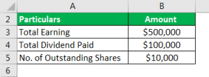

In the landscape of investing, understanding the financial health of a company is essential, particularly when assessing dividend-paying stocks. For investors, dividends represent a tangible return on investment, and evaluating these returns often hinges on understanding key financial metrics. One such metric is the dividend payout ratio, which offers insights into the proportion of a company's earnings that are distributed to shareholders in the form of dividends. This ratio not only reflects a company's dividend policy but also serves as an indicator of its financial strategy regarding profit allocation.

The dividend payout ratio is a pivotal measure for investors analyzing dividend sustainability and the potential for future income. By dividing dividends by net income or using per-share values—dividends per share over earnings per share—investors can gauge how much of a company's profit is shared with shareholders versus reinvested in growth initiatives. This understanding is particularly crucial in contrasting companies with diverse payout strategies, as some firms may prioritize high dividend payouts and others may opt to reinvest earnings to foster expansion. 



Throughout this article, we will examine the dividend payout ratio comprehensively, considering its computation, role in financial analysis, and its significance in algorithmic trading strategies. By contrasting it with other financial metrics, we aim to enhance comprehension of investment strategies and the ramifications for automated investing approaches. Ultimately, a nuanced grasp of the dividend payout ratio equips investors to make informed decisions regarding a company's financial practices and its alignment with their investment goals.

## Table of Contents

## What is the Dividend Payout Ratio?

The dividend payout ratio is a financial metric that measures the proportion of a company's earnings that is distributed to shareholders in the form of dividends. It is an essential tool for investors to assess a company's approach to profit allocation, offering insights into whether a company prioritizes returning capital to shareholders or reinvesting profits into the business for future growth.

Mathematically, the dividend payout ratio can be expressed as:

$$
\text{Dividend Payout Ratio} = \frac{\text{Dividends per Share}}{\text{Earnings per Share}}
$$

Alternatively, it can also be calculated using the total dividends paid:

$$
\text{Dividend Payout Ratio} = \frac{\text{Total Dividends Paid}}{\text{Net Income}}
$$

A high dividend payout ratio generally indicates that a significant portion of the company's earnings is returned to shareholders as dividends. This could imply that the company is mature, with limited opportunities for reinvestment and growth. Such companies often attract investors seeking steady income streams rather than capital appreciation.

On the other hand, a low dividend payout ratio suggests that a company is retaining more of its earnings to fund expansion projects or to invest in new opportunities, which may appeal to growth-oriented investors. These companies are often in industries characterized by rapid growth and high demand for capital to support future profitability.

The dividend payout ratio serves not only as an indicator of a company’s current operational priorities but also reflects its strategic outlook. Companies may adjust their payout ratios in response to changes in their operational environment, strategic objectives, or market conditions, providing a dynamic view of their financial health and investment strategy. Understanding these nuances helps investors make informed decisions based on personal investment goals and risk tolerances.

## Calculating the Dividend Payout Ratio

The dividend payout ratio is a financial metric used to assess the portion of a company's earnings that is distributed to shareholders as dividends. This key ratio can be calculated using two primary methods:

1. **Dividends Per Share (DPS) divided by Earnings Per Share (EPS)**
$$
   \text{Dividend Payout Ratio} = \frac{\text{Dividends Per Share (DPS)}}{\text{Earnings Per Share (EPS)}}

$$

2. **Total Dividends Paid divided by Net Income**
$$
   \text{Dividend Payout Ratio} = \frac{\text{Total Dividends Paid}}{\text{Net Income}}

$$

### Step-by-Step Calculation Methodology

To effectively calculate the dividend payout ratio, you can follow these steps:

1. **Gather Financial Data**: Obtain the company's financial statements to get the necessary data, specifically the net income, total dividends paid, earnings per share, and dividends per share. This information is generally available in annual or quarterly reports.

2. **Choose the Calculation Method**: Decide whether you want to calculate the ratio using total dividends paid and net income or DPS and EPS. The choice may depend on data availability or specific analytical requirements.

3. **Perform the Calculation**: Use one of the formulas mentioned above to compute the dividend payout ratio.

### Example Calculation Using Python

To illustrate the calculation using Python, we can consider a hypothetical example. Assume a company has a net income of $2,000,000, total dividends paid of $500,000, and 1,000,000 shares outstanding. Here's how you could compute the dividend payout ratio programmatically:

```python
# Define the financial parameters
net_income = 2000000  # Net income in dollars
total_dividends_paid = 500000  # Total dividends paid in dollars
shares_outstanding = 1000000  # Total number of shares

# Calculate dividends per share and earnings per share
dps = total_dividends_paid / shares_outstanding
eps = net_income / shares_outstanding

# Calculate the dividend payout ratio
payout_ratio_method1 = dps / eps
payout_ratio_method2 = total_dividends_paid / net_income

# Print the results
print(f"Dividend Payout Ratio (DPS/EPS method): {payout_ratio_method1:.2f}")
print(f"Dividend Payout Ratio (Total Dividends/Net Income method): {payout_ratio_method2:.2f}")
```

This Python code snippet demonstrates how to perform the dividend payout ratio calculation using both available methods. The choice of method may depend on the specific context and available data, but both approaches aim to provide insight into the proportion of earnings being returned to shareholders as dividends.

## Dividend Payout Ratio vs. Dividend Yield

The dividend payout ratio and dividend yield are two distinct but related financial metrics that provide insights into a company's dividend policy and offer valuable information for investors. Although they are often confused, understanding their differences is crucial for forming a comprehensive view of a company's dividend strategy and potential income.

The dividend payout ratio indicates the proportion of a company's earnings that are distributed to shareholders as dividends. It is calculated using the following formula:

$$
\text{Dividend Payout Ratio} = \frac{\text{Dividends per Share}}{\text{Earnings per Share}} = \frac{\text{Total Dividends Paid}}{\text{Net Income}}
$$

This metric highlights the company's commitment to returning a portion of its earnings to shareholders, providing insights into its dividend policy. A high payout ratio may signal a mature company with stable earnings, while a low ratio might suggest that the company is reinvesting its earnings for future growth.

On the other hand, the dividend yield measures the income generated from an investment in a stock, relative to its market price. The formula for calculating the dividend yield is:

$$
\text{Dividend Yield} = \frac{\text{Annual Dividends per Share}}{\text{Price per Share}}
$$

This metric provides an investor-focused perspective, illustrating how much return, in the form of dividends, one can expect from their invested capital at the current stock price. A high dividend yield may indicate a potentially lucrative return, but it may also reflect underlying risk or market conditions that have depressed the stock price.

Together, these metrics inform investors about different aspects of a company’s dividend scenario. While the dividend payout ratio offers a view of the relationship between earnings and shareholder distribution, the dividend yield focuses on the potential return on investment. Understanding both metrics is essential for evaluating the attractiveness and sustainability of a company's dividend policy, aiding investors in making informed decisions that align with their financial goals.

## Dividend Payout Ratio in Investment Decisions

Investors analyze the dividend payout ratio (DPR) to assess the sustainability of a company's dividend payments and its overall financial health. A consistent or increasing payout ratio may indicate stable or robust earnings, suggesting that a company is likely capable of sustaining its dividend payments over the long term. Conversely, a high and increasing DPR could signal that a company is distributing a substantial portion of its earnings as dividends, potentially leaving limited funds for reinvestment in growth opportunities. This might affect the company's financial flexibility and ability to adapt to market changes or economic downturns. 

The DPR is calculated using the formula:

$$
\text{Dividend Payout Ratio} = \frac{\text{Dividends Per Share}}{\text{Earnings Per Share}}
$$

or alternatively:

$$
\text{Dividend Payout Ratio} = \frac{\text{Total Dividends Paid}}{\text{Net Income}}
$$

One of the primary applications of the dividend payout ratio in investment decisions is to evaluate whether a company's dividend strategy aligns with an investor's goals. For instance, investors seeking steady income streams often look for companies with high and stable payout ratios, which indicate reliable dividend payments. On the other hand, growth-oriented investors might prefer companies with lower payout ratios, suggesting that more earnings are being retained for reinvestment into future growth initiatives.

By examining trends in the payout ratio, investors can also infer insights into a company's growth stage and strategic priorities. Younger companies in expansion phases tend to retain a larger share of their earnings to fuel growth, which manifests as lower payout ratios. Mature companies, having reached a steady state of growth, often return more earnings to shareholders, resulting in higher payout ratios.

Understanding these dynamics helps investors make informed decisions based on their investment strategy and risk tolerance. For instance, if a company with historically low payout ratios begins to increase them significantly, it might indicate a shift in strategy toward returning more capital to shareholders, potentially due to a limited scope for profitable reinvestment.

Overall, the dividend payout ratio is a significant tool in financial analysis, aiding investors in distinguishing between companies with sustainable dividend practices and those that might face challenges maintaining their payouts. In this way, it serves as a critical metric for evaluating potential investments in line with one’s strategic objectives.

## The Role of Dividend Payout Ratios in Algorithmic Trading

Algorithmic trading employs a variety of quantitative metrics, among which the dividend payout ratio (DPR) is instrumental. This ratio guides automated strategies by providing insights into a company's financial practices regarding dividend distributions. Understanding and integrating DPR into [algorithmic trading](/wiki/algorithmic-trading) systems aid in differentiating strategies aligned with income-generating objectives from those focusing on growth.

The dividend payout ratio helps in automated trading algorithms by indicating a company's propensity to return earnings as dividends. This information is crucial for algorithms since the data informs investor preference models—whether investors are inclined towards stable income through dividends or capital growth through reinvested earnings. A high DPR might be favored in income-focused strategies, where consistent and high dividend payments are a priority. Conversely, a low DPR can signal growth opportunities, which appeal more to investors looking to benefit from retained earnings' potential for driving future expansion.

Incorporating the DPR into algorithmic models involves examining historical data to predict future company behavior and stock performance. Machine learning models utilize historical DPR data combined with other financial indicators to identify patterns and forecast dividend sustainability and growth prospects. These models apply supervised learning techniques, training algorithms on labeled datasets to predict outcomes based on input features like DPR values, earnings [volatility](/wiki/volatility-trading-strategies), and industry-specific metrics.

For example, a simplified implementation using Python might involve the sklearn library to build a predictive model. Here's a basic outline of using [machine learning](/wiki/machine-learning) for predicting dividend payout trends:

```python
import pandas as pd
from sklearn.model_selection import train_test_split
from sklearn.ensemble import RandomForestRegressor
from sklearn.metrics import mean_squared_error

# Load a dataset containing DPR and other financial metrics
data = pd.read_csv('financial_data.csv')

# Define the independent variables (features) and the target variable
features = data[['revenue_growth', 'profit_margin', 'dpr']]
target = data['future_dpr']

# Split the dataset into training and testing sets
X_train, X_test, y_train, y_test = train_test_split(features, target, test_size=0.2, random_state=42)

# Initialize and train a Random Forest model
model = RandomForestRegressor(n_estimators=100, random_state=42)
model.fit(X_train, y_train)

# Predict using the test dataset
predictions = model.predict(X_test)

# Evaluate the model
mse = mean_squared_error(y_test, predictions)
print(f"Mean Squared Error: {mse}")
```

In this illustration, the model predicts future DPR based on current financial metrics, aiding trading algorithms in identifying potential investment opportunities. Machine learning, through such applications, sharpens algorithmic strategies by refining predictive accuracy, thus enhancing decision-making processes.

Algorithmic strategies might weigh DPR differently, tailoring to various investor objectives—be it ensuring a steady income stream or facilitating long-term wealth creation via growth investments. By leveraging the dynamic capabilities of machine learning algorithms, trading systems can adjust to real-time data, optimizing portfolio management and strategic alignment with market conditions. This integration not only supports making informed investment decisions but also enhances the overall efficiency and adaptability of algorithmic trading strategies.

## Industry Examples and Applications

The dividend payout ratio (DPR) is a pivotal metric utilized across various industries to inform decision-making and direct investment strategies. Different sectors exhibit varying tendencies in their dividend strategies, which can significantly influence investor choices. Here are some illustrative examples:

### Utility Sector
In the utility sector, companies often display high dividend payout ratios. This phenomenon is largely due to the stable cash flows and predictable revenue streams inherent to the industry. Regulatory frameworks generally ensure a steady demand for utilities, which allows companies to distribute a substantial portion of their earnings as dividends without compromising their operational stability. Investors seeking reliable and consistent income often find utility stocks appealing, thus positioning the dividend payout ratio as a critical gauge of a company's financial disposition.

**Example: Consolidated Energy Company**
For instance, Consolidated Energy Company consistently maintains a payout ratio exceeding 70%. Such a policy signals a commitment to returning value to shareholders and aligns with the expectations of conservative investors who prioritize regular income over capital appreciation.

### Technology Sector
Contrastingly, the technology sector typically exhibits lower dividend payout ratios. This practice supports higher reinvestment rates into research and development, which is essential in maintaining competitiveness and fostering innovation. Consequently, tech companies tend to offer dividends only after reaching substantial maturity and stable revenue growth.

**Example: InnovateTech Solutions**
InnovateTech Solutions, a prominent player in the tech industry, maintains a dividend payout ratio of around 20%. The company's strategic approach underscores an emphasis on reinvesting earnings to support growth ventures, appealing to investors interested in capital gains.

### Financial Sector
The financial sector, with its diverse array of firms, demonstrates varied dividend strategies. Banks often maintain balanced payout ratios to navigate regulatory requirements while balancing shareholder returns. Their dividend policies can reflect the broader economic climate and fiscal regulations, affecting how investors perceive risk and return.

**Example: Global Bank Corp**
Global Bank Corp maintains a payout ratio of approximately 50%, aiming to balance shareholder dividends with compliance to capital adequacy standards. This ratio is a critical marker for investors assessing the bank's stability and future [earning](/wiki/earning-announcement) potentials amidst economic volatilities.

### Impact of Sector Differences on Investment Decisions
The divergent dividend payout strategies across sectors necessitate a keen understanding of the industry context for effective investment analysis. A higher payout ratio in a stable industry like utilities may attract risk-averse investors, while lower ratios in tech companies may appeal to those seeking growth opportunities.

In conclusion, recognizing these sector-specific trends and applications of the dividend payout ratio enables investors to refine their investment strategies and align them with their financial goals. It provides transparency into corporate policies and market conditions, assisting in the development of more informed and precise investment strategies.

## Conclusion

The dividend payout ratio (DPR) is a fundamental metric for evaluating a company's financial health and informs investment strategies significantly. By understanding DPR, investors can assess the company's capacity to maintain or enhance its dividend payments over time. A stable or increasing dividend payout may indicate a company's consistent profitability and a robust cash flow position, fostering investor confidence. In contrast, an excessively high payout ratio could signal financial strain, suggesting that a company may be distributing too much of its earnings rather than reinvesting for growth.

Incorporating the dividend payout ratio into both manual and automated trading strategies enhances decision-making and strategy formation. For traditional investors, DPR serves as a tool for evaluating the sustainability of income through dividends, influencing portfolio allocation towards stable dividend-paying stocks. Meanwhile, in algorithmic trading, DPR is utilized to refine quantitative strategies. Algorithms can be programmed to scan for companies with specific payout ratio criteria, thus optimizing the balance between income generation and growth potential.

Furthermore, the integration of DPR data with machine learning models can enhance predictive capabilities, allowing for refined assessments of stock performance and potential future earnings. This integration empowers traders to develop advanced strategies that align with individual or institutional investment objectives, be it income generation or capital appreciation. Thus, the dividend payout ratio remains a crucial element of comprehensive financial analysis, providing insights that guide both short-term and long-term investment decisions.

## References & Further Reading

### References & Further Reading

For those looking to enhance their understanding of dividend payout ratios and their significance in financial analysis, several resources can provide in-depth insights:

1. **Books**:
   - "Financial Statement Analysis" by Martin Fridson and Fernando Alvarez offers a comprehensive guide on interpreting financial statements, including metrics like the dividend payout ratio.
   - "The Intelligent Investor" by Benjamin Graham remains a classic book providing foundational knowledge on value investing and the importance of evaluating company financials.
   - "Algorithmic Trading: Winning Strategies and Their Rationale" by Ernie Chan provides an understanding of how financial metrics, including the dividend payout ratio, are utilized in algorithmic trading strategies.

2. **Academic Articles**:
   - Brigham, E., & Ehrhardt, M. (2013). "Financial Management: Theory & Practice" examines various financial metrics and their applications in strategic financial management.
   - Allen, F., Echenique, F., & Chen, Z. (2010). "Corporate Finance" sheds light on the decisions firms make regarding dividend policies and the implications for investors.

3. **Online Resources and Journals**:
   - Investopedia and the Motley Fool offer accessible articles and tutorials on understanding and calculating the dividend payout ratio.
   - The Harvard Business Review often publishes articles on corporate finance trends and strategies, including discussions on dividend policies.

4. **Reports and Case Studies**:
   - Morningstar and Bloomberg provide financial reports and analyses of companies that can help understand the practical application and implications of different dividend strategies.

5. **Software and Tools**:
   - Financial modeling tools such as Python libraries (e.g., pandas, NumPy) can be deployed for conducting analyses of financial metrics, including scripting for calculating dividend payout ratios.

By exploring these resources, readers can develop a deeper understanding of how dividend payout ratios serve as a critical metric within financial analysis and investment strategies.

