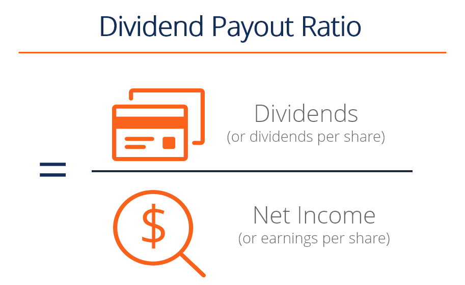

## Table of Contents

## What is the dividend payout ratio?

The dividend payout ratio is a financial measure that shows how much of a company's earnings are paid out to shareholders as dividends. It is calculated by dividing the total dividends paid by the company's net income. This ratio helps investors understand how much money they can expect to receive from their investment in the form of dividends compared to how much the company is keeping to reinvest in the business or use for other purposes.

A high dividend payout ratio means that a company is returning a large portion of its earnings to shareholders, which can be attractive to investors looking for regular income. However, it also might indicate that the company has fewer opportunities to reinvest profits for growth. On the other hand, a low dividend payout ratio suggests that the company is retaining more earnings, possibly to fund expansion or other projects, which might appeal to investors interested in long-term growth rather than immediate income.

## Why is the dividend payout ratio important for investors?

The dividend payout ratio is important for investors because it tells them how much of a company's profits are being given back to shareholders as dividends. This helps investors decide if a company is a good fit for their investment goals. If an investor wants regular income from their investments, they might look for companies with a high dividend payout ratio. These companies give a big part of their earnings to shareholders, which can be good for people who need money regularly from their investments.

On the other hand, if an investor is more interested in the company growing over time, they might prefer a company with a lower dividend payout ratio. A lower ratio means the company is keeping more of its profits to reinvest in the business. This could lead to the company growing bigger and possibly increasing the value of the investor's shares in the future. So, the dividend payout ratio helps investors choose between getting money now or waiting for the company to grow.

## How is the dividend payout ratio calculated?

The dividend payout ratio is calculated by dividing the total dividends paid by the company's net income. For example, if a company has a net income of $100 million and pays out $30 million in dividends, the dividend payout ratio would be $30 million divided by $100 million, which equals 0.30 or 30%. This means that the company is paying out 30% of its earnings as dividends to shareholders.

Sometimes, companies might use a slightly different method to calculate the dividend payout ratio. Instead of using net income, they might use earnings per share (EPS) and dividends per share (DPS). In this case, you divide the dividends per share by the earnings per share. If a company has an EPS of $2 and a DPS of $0.60, the dividend payout ratio would be $0.60 divided by $2, which also equals 0.30 or 30%. Both methods give you an idea of how much of the company's profits are being shared with shareholders.

## What is the formula for the dividend payout ratio?

The dividend payout ratio tells you how much of a company's earnings are given to shareholders as dividends. To find this ratio, you divide the total dividends the company pays by its net income. For example, if a company makes $100 million in profit and pays out $30 million in dividends, you divide $30 million by $100 million. This gives you a dividend payout ratio of 0.30, or 30%. This means the company is giving 30% of its earnings back to shareholders.

There's another way to calculate the dividend payout ratio using earnings per share (EPS) and dividends per share (DPS). You simply divide the dividends per share by the earnings per share. If a company has an EPS of $2 and pays a DPS of $0.60, you divide $0.60 by $2. This also gives you a dividend payout ratio of 0.30, or 30%. Both methods help you understand how much of the company's profits are being shared with shareholders.

## Can you provide an example of calculating the dividend payout ratio?

Let's say a company made a profit of $100 million last year. They decided to give $30 million of that profit back to shareholders as dividends. To find the dividend payout ratio, you divide the dividends paid by the net income. So, you take $30 million and divide it by $100 million. This gives you a ratio of 0.30, or 30%. This means the company is giving 30% of its earnings back to shareholders.

Another way to calculate the dividend payout ratio is by using earnings per share (EPS) and dividends per share (DPS). Imagine a company has an EPS of $2 and pays a DPS of $0.60. To find the dividend payout ratio, you divide the DPS by the EPS. So, you take $0.60 and divide it by $2. This also gives you a ratio of 0.30, or 30%. Both methods show that the company is sharing 30% of its profits with shareholders.

## What does a high dividend payout ratio indicate?

A high dividend payout ratio means that a company is giving a big part of its profits back to shareholders as dividends. This can be good for people who want to get money regularly from their investments. They like knowing they will get a steady income from the company. For example, if a company has a high dividend payout ratio, it might be a good choice for someone who is retired and needs money to live on.

However, a high dividend payout ratio can also mean the company is not keeping much money to grow or improve its business. If a company pays out most of its earnings as dividends, it might not have enough money left to invest in new projects or expand. This could be a concern for investors who are looking for the company to grow bigger in the future. They might worry that the company won't be able to keep up with competitors if it's not reinvesting its profits.

## What does a low dividend payout ratio suggest?

A low dividend payout ratio means that a company is keeping most of its profits instead of giving them to shareholders as dividends. This can be good for people who want the company to grow bigger over time. When a company keeps more of its earnings, it can use that money to invest in new projects, buy new equipment, or expand its business. This might make the company more valuable in the future, which could increase the price of its stock.

However, a low dividend payout ratio might not be what everyone wants. If you're someone who needs regular money from your investments, like a retiree, a company with a low dividend payout ratio might not be the best choice. You would get less money back from the company each year, which could make it harder to live on your investment income. So, it really depends on what you're looking for in an investment.

## How does the dividend payout ratio differ across industries?

The dividend payout ratio can be very different depending on the type of industry a company is in. Some industries, like utilities and consumer staples, usually have high dividend payout ratios. These companies often have steady earnings and don't need to spend a lot of money on growing their business. So, they can give a big part of their profits back to shareholders as dividends. This makes them attractive to investors who want a reliable income from their investments.

On the other hand, industries like technology and biotech often have low dividend payout ratios. These companies are usually focused on growing and need to keep their profits to invest in research, development, and expansion. They might not pay out many dividends because they want to use that money to make their business bigger and better. This can be good for investors who are looking for the company's stock price to go up over time, but not as good for those who need regular income from their investments.

## What are the limitations of using the dividend payout ratio?

The dividend payout ratio has some limitations that investors should know about. One big problem is that it doesn't tell you everything about a company's financial health. A company might have a high dividend payout ratio because it's doing well and can afford to give a lot of money back to shareholders. But it could also mean the company is struggling and trying to keep investors happy by paying out dividends even though it might not be able to keep doing this in the future.

Another limitation is that the dividend payout ratio can be affected by one-time events. For example, if a company sells a big piece of property and uses that money to pay a special dividend, the payout ratio for that year might look very high. But this doesn't mean the company will keep paying out dividends at that rate. It's important to look at the company's regular earnings and dividends over time to get a better idea of what to expect.

## How can the dividend payout ratio be used in conjunction with other financial metrics?

The dividend payout ratio is just one piece of the puzzle when looking at a company's financial health. To get a fuller picture, investors often use it alongside other financial metrics like the price-to-earnings (P/E) ratio, the earnings growth rate, and the return on equity (ROE). For example, if a company has a high dividend payout ratio and a high P/E ratio, it might mean the stock is overvalued, even if the dividends look good. On the other hand, if the company has a low payout ratio but a high earnings growth rate, it could be a good sign that the company is reinvesting its profits wisely and might grow in value over time.

Another important metric to consider with the dividend payout ratio is the company's debt-to-equity ratio. This ratio shows how much the company is relying on borrowed money. If a company has a high dividend payout ratio and a high debt-to-equity ratio, it might be risky because the company is paying out a lot of its profits as dividends while also carrying a lot of debt. Investors need to think about all these things together to make smart choices about where to put their money.

## What are the trends in dividend payout ratios over time?

Over time, dividend payout ratios have shown different trends depending on the economy and what companies are doing. In good economic times, companies often have more profits and might pay out more dividends, which can make the dividend payout ratio go up. But in tough economic times, companies might cut back on dividends to save money, making the ratio go down. Also, the type of industry matters a lot. Companies in stable industries like utilities and consumer goods often keep their dividend payout ratios high because they have steady earnings and don't need to spend a lot on growth.

Another trend is that newer and growing companies, like those in technology, usually have lower dividend payout ratios. These companies want to use their profits to grow bigger instead of paying dividends. Over the years, as these companies get bigger and more stable, they might start to pay more dividends, which would increase their payout ratios. But overall, the dividend payout ratio can change a lot over time because it depends on what's happening in the economy, the industry, and the company's own plans for growth and profit.

## How do global economic conditions affect dividend payout ratios?

Global economic conditions can have a big impact on dividend payout ratios. When the economy is doing well, companies usually make more money. This means they can pay out more dividends to their shareholders, which makes the dividend payout ratio go up. But if the economy is struggling, companies might not make as much money. They might need to save their profits to keep their business running smoothly, so they pay out fewer dividends. This makes the dividend payout ratio go down. For example, during a recession, many companies cut their dividends to save cash, leading to lower payout ratios across the board.

Also, different countries can have different economic conditions that affect dividend payout ratios. If a country's economy is growing fast, companies there might feel confident enough to pay higher dividends. But if a country is going through tough times, like high inflation or political problems, companies might be more careful with their money and pay out less in dividends. This can lead to different trends in dividend payout ratios around the world. So, it's important for investors to keep an eye on what's happening in the global economy when they look at a company's dividend payout ratio.

## What is the Dividend Payout Ratio?

The dividend payout ratio is a fundamental financial metric that represents the fraction of a company's earnings allocated to shareholders in the form of dividends. This ratio is critical for assessing a company's approach to distributing profits and provides insights into its dividend policy. It is calculated using the formula:

$$
\text{Dividend Payout Ratio} = \left( \frac{\text{Dividends Per Share}}{\text{Earnings Per Share}} \right) \times 100
$$

Alternatively, it can be expressed as:

$$
\text{Dividend Payout Ratio} = \left( \frac{\text{Total Dividends Paid}}{\text{Net Income}} \right) \times 100
$$

A high dividend payout ratio indicates that a significant portion of earnings is returned to shareholders rather than being reinvested into the business. This can signal a mature company with limited growth opportunities, where management opts to reward shareholders with consistent income. However, an excessively high payout ratio might raise concerns about the sustainability of such dividend payments, particularly if future earnings falter.

Conversely, a low dividend payout ratio suggests that the company retains most of its earnings for reinvestment and growth. Firms with expansion ambitions often adopt this strategy, as they focus resources on capital projects, research and development, and market expansion. Such reinvestment can lead to higher future earnings, benefiting long-term shareholders through appreciation in stock value.

In summary, the dividend payout ratio serves as a vital tool for investors to gauge a company's financial health and strategic priorities, balancing between rewarding shareholders and fostering long-term growth.

## What is the difference between Dividend Payout Ratio and Dividend Yield?

While both the dividend payout ratio and dividend yield deal with dividends, they offer distinct insights into a company's financial strategy. The dividend payout ratio is concerned with what portion of a company's earnings is distributed to shareholders as dividends. It provides investors with an understanding of how much profit is being returned to them versus being reinvested into the company for potential growth and sustainability. Mathematically, it is expressed as:

$$
\text{Dividend Payout Ratio} = \left( \frac{\text{Dividends Per Share}}{\text{Earnings Per Share}} \right) \quad \text{or} \quad \left( \frac{\text{Total Dividends Paid}}{\text{Net Income}} \right)
$$

On the other hand, the dividend yield measures the return on investment a shareholder receives from the dividend payments relative to the stock price. This metric helps investors understand the income generated from holding a stock, independent of its price fluctuations. The formula for dividend yield is:

$$
\text{Dividend Yield} = \left( \frac{\text{Annual Dividends Per Share}}{\text{Price Per Share}} \right) \times 100\%
$$

Understanding the difference between these two metrics helps investors evaluate the company's dividend policy and investment potential more comprehensively. The dividend payout ratio can indicate whether a company balances returning profits to shareholders and supporting future expansion. Conversely, the dividend yield focuses more on the immediate income potential from dividend payments based on the current stock price.

Investors looking for stable income might prioritize a higher dividend yield, while those interested in long-term growth may focus on a sustainable dividend payout ratio. Therefore, a comprehensive evaluation of both metrics provides a more holistic insight into a company’s financial health and its commitment to providing shareholder value.

## References & Further Reading

[1]: ["Dividends and Dividend Policy"](https://corporatefinanceinstitute.com/resources/equities/dividend-policy/) by H. Kent Baker and Gabriella A. Moldovan

[2]: Sharpe, W. F. (1964). ["Capital Asset Prices: A Theory of Market Equilibrium Under Conditions of Risk"](https://onlinelibrary.wiley.com/doi/full/10.1111/j.1540-6261.1964.tb02865.x). The Journal of Finance, 19(3), 425-442.

[3]: ["The Intelligent Investor"](https://www.amazon.com/Intelligent-Investor-3rd-Ed/dp/0063356724) by Benjamin Graham

[4]: ["Advances in Financial Machine Learning"](https://www.amazon.com/Advances-Financial-Machine-Learning-Marcos/dp/1119482089) by Marcos Lopez de Prado

[5]: Brav, A., Graham, J. R., Harvey, C. R., & Michaely, R. (2005). ["Payout policy in the 21st century."](https://www.nber.org/papers/w9657) Journal of Financial Economics, 77(3), 483-527.

[6]: ["Machine Learning for Algorithmic Trading"](https://github.com/stefan-jansen/machine-learning-for-trading) by Stefan Jansen

[7]: ["Quantitative Trading: How to Build Your Own Algorithmic Trading Business"](https://books.google.com/books/about/Quantitative_Trading.html?id=j70yEAAAQBAJ) by Ernest P. Chan