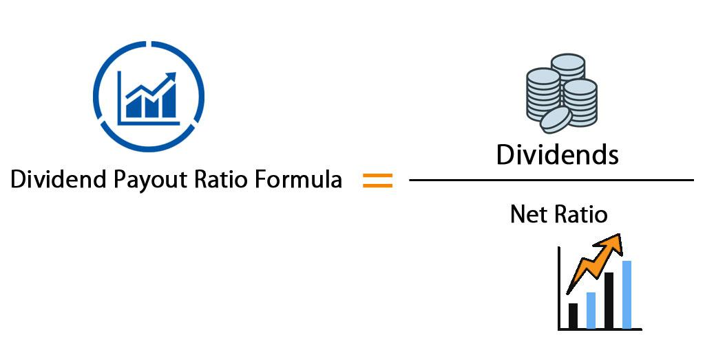

Understanding the financial health of a company is essential for investors, especially when evaluating dividend-paying stocks. One of the primary tools for gauging this financial health is the dividend payout ratio. This ratio provides insight into the proportion of a company’s earnings distributed to shareholders as dividends, serving as an indicator of the company's dividend policy and its approach to balancing immediate shareholder returns with long-term growth potential.

The dividend payout ratio is significant as it helps investors assess the sustainability of a company's dividend payments. A high payout ratio may imply limited reinvestment in the company's growth, potentially signaling a mature business with steady cash flows but fewer growth opportunities. Conversely, a low payout ratio indicates that a company might be reinvesting its earnings into expansion and development, which could be more appealing to growth-oriented investors.



In this article, we explore the importance of the dividend payout ratio in making investment decisions and the methodology for its calculation. Additionally, we examine the role that this ratio plays in algorithmic trading, where quantitative assessments drive automated trading strategies. We will compare the dividend payout ratio with other financial metrics to enhance understanding, provide real-world examples to illustrate its application, and discuss its implications for automated investing systems. This comprehensive analysis aims to equip investors with the insights needed to navigate investment landscapes effectively, utilizing the dividend payout ratio as a fundamental analytical tool.

## Table of Contents

## What is the Dividend Payout Ratio?

The dividend payout ratio is a fundamental financial metric that represents the fraction of a company's earnings allocated to shareholders in the form of dividends. This ratio is critical for assessing a company's approach to distributing profits and provides insights into its dividend policy. It is calculated using the formula:

$$
\text{Dividend Payout Ratio} = \left( \frac{\text{Dividends Per Share}}{\text{Earnings Per Share}} \right) \times 100
$$

Alternatively, it can be expressed as:

$$
\text{Dividend Payout Ratio} = \left( \frac{\text{Total Dividends Paid}}{\text{Net Income}} \right) \times 100
$$

A high dividend payout ratio indicates that a significant portion of earnings is returned to shareholders rather than being reinvested into the business. This can signal a mature company with limited growth opportunities, where management opts to reward shareholders with consistent income. However, an excessively high payout ratio might raise concerns about the sustainability of such dividend payments, particularly if future earnings falter.

Conversely, a low dividend payout ratio suggests that the company retains most of its earnings for reinvestment and growth. Firms with expansion ambitions often adopt this strategy, as they focus resources on capital projects, research and development, and market expansion. Such reinvestment can lead to higher future earnings, benefiting long-term shareholders through appreciation in stock value.

In summary, the dividend payout ratio serves as a vital tool for investors to gauge a company's financial health and strategic priorities, balancing between rewarding shareholders and fostering long-term growth.

## Calculating the Dividend Payout Ratio

The dividend payout ratio is a fundamental metric that offers insight into a company's financial practices concerning dividend distribution. Calculating this ratio is straightforward, requiring either direct data from financial statements or automated tools for precise analysis. There are two primary formulas used to calculate the dividend payout ratio:

1. **Dividends Per Share (DPS) / Earnings Per Share (EPS):** This formula gives the proportion of earnings distributed as dividends for each share. The calculation is performed by dividing the total dividends distributed per share by the earnings per share, providing a clear picture of the dividends relative to the income generated by each stock unit.

2. **Total Dividends Paid / Net Income:** This method involves the overall financials of a company, where the total cash distributed as dividends is divided by the net income. It offers an overarching view of how much of the company's earnings are given back to shareholders.

Here's how one might calculate the dividend payout ratio using Python, a popular choice for automating financial analysis:

```python
def calculate_dividend_payout_ratio(total_dividends_paid, net_income):
    try:
        payout_ratio = total_dividends_paid / net_income
        return payout_ratio
    except ZeroDivisionError:
        return "Net income cannot be zero for valid calculation."

total_dividends_paid = 5000000  # Example value: $5,000,000
net_income = 20000000  # Example value: $20,000,000

payout_ratio = calculate_dividend_payout_ratio(total_dividends_paid, net_income)
print(f"The Dividend Payout Ratio is: {payout_ratio:.2f}")
```

The calculated dividend payout ratio helps in assessing the sustainability of dividends provided by a company. A consistent or a well-justified increase in the payout ratio generally signals that the company is able to generate and maintain adequate earnings to support its dividend policy. Conversely, a significantly fluctuating payout ratio may indicate potential financial instability or strategic shifts in profit allocation. Utilizing tools like Excel or programming languages like Python allows investors to streamline this calculation, enabling them to swiftly process multiple data sets and make informed investment decisions based on projected earnings performance and dividend sustainability.

## Dividend Payout Ratio vs. Dividend Yield

While both the dividend payout ratio and dividend yield deal with dividends, they offer distinct insights into a company's financial strategy. The dividend payout ratio is concerned with what portion of a company's earnings is distributed to shareholders as dividends. It provides investors with an understanding of how much profit is being returned to them versus being reinvested into the company for potential growth and sustainability. Mathematically, it is expressed as:

$$
\text{Dividend Payout Ratio} = \left( \frac{\text{Dividends Per Share}}{\text{Earnings Per Share}} \right) \quad \text{or} \quad \left( \frac{\text{Total Dividends Paid}}{\text{Net Income}} \right)
$$

On the other hand, the dividend yield measures the return on investment a shareholder receives from the dividend payments relative to the stock price. This metric helps investors understand the income generated from holding a stock, independent of its price fluctuations. The formula for dividend yield is:

$$
\text{Dividend Yield} = \left( \frac{\text{Annual Dividends Per Share}}{\text{Price Per Share}} \right) \times 100\%
$$

Understanding the difference between these two metrics helps investors evaluate the company's dividend policy and investment potential more comprehensively. The dividend payout ratio can indicate whether a company balances returning profits to shareholders and supporting future expansion. Conversely, the dividend yield focuses more on the immediate income potential from dividend payments based on the current stock price.

Investors looking for stable income might prioritize a higher dividend yield, while those interested in long-term growth may focus on a sustainable dividend payout ratio. Therefore, a comprehensive evaluation of both metrics provides a more holistic insight into a company’s financial health and its commitment to providing shareholder value.

## Dividend Payout Ratio in Investment Decisions

Investors employ the dividend payout ratio as a significant tool to evaluate a company's dividend distribution policies and financial health. This metric offers insights into how effectively a company manages its profits and whether it can sustain its dividend payments over time. A sustainable payout ratio, typically ranging between 30% and 50% but varying by industry and market conditions, indicates that a company has a stable dividend program. This stability is particularly crucial for retirees or income-focused investors who rely on dividends as a source of regular income. For example, a company with a consistently high payout ratio might attract these investors due to the reliability of its payouts, but it may also suggest limited reinvestment in growth initiatives.

Analyzing trends in the dividend payout ratio can also reveal important aspects of a company's development stage and operational maturity. For instance, a lower payout ratio might indicate that a company is in a growth phase, choosing to reinvest earnings to expand operations and enhance its competitive position. On the other hand, a higher payout ratio could suggest that a company has reached a more mature stage, generating stable revenues with less need for reinvestment, thus returning a larger portion of its profits to shareholders.

Additionally, observing changes in the payout ratio over time can signal shifts in a company's dividend policy or financial performance. An increasing ratio may reflect rising dividends or decreasing earnings, the latter of which could be a red flag indicating potential financial struggles. Conversely, a decreasing ratio might suggest either dividend cuts or an increase in earnings, where the former could discourage income-focused investors. Therefore, the trend of a company's dividend payout ratio can be a barometer for its financial health and strategic priorities, assisting investors in making informed decisions aligned with their investment objectives.

## The Role of Dividend Payout Ratios in Algorithmic Trading

Algorithmic trading leverages quantitative analysis to make informed stock investment decisions, and the dividend payout ratio (DPR) is one of the metrics that can be pivotal in these evaluations. The dividend payout ratio, reflecting the proportion of earnings distributed as dividends relative to net income, provides significant insight into a company's financial health and dividend policies. 

Incorporating DPR into trading models allows investors to tailor strategies that align with their investment objectives. For instance, a model prioritizing income generation might prefer stocks with a higher dividend payout ratio, indicating a strong commitment to returning earnings to shareholders. Conversely, a growth-oriented model might favor companies with lower DPRs, suggesting more retained earnings for reinvestment and growth prospects.

Advanced [algorithmic trading](/wiki/algorithmic-trading) systems employ [machine learning](/wiki/machine-learning) models to process historical DPR data alongside other financial metrics. These models can identify patterns and correlations, improving predictions of future stock performance and assessing the probability of sustained dividend payments. For example, a [neural network](/wiki/neural-network) model could be trained with historical data inputs that include DPR, earnings per share (EPS), and other market conditions to predict future dividend behaviors. Here is a simple illustration using Python with a machine learning framework like scikit-learn:

```python
from sklearn.model_selection import train_test_split
from sklearn.linear_model import LinearRegression
import numpy as np

# Sample historical financial data
data = {
    'DPR': [0.5, 0.6, 0.55, 0.58, 0.62],  # Dividend Payout Ratios
    'EPS': [3.0, 3.2, 3.1, 3.3, 3.4],    # Earnings Per Share
    'Stock Performance': [1.05, 1.07, 1.06, 1.08, 1.09]  # Simplified relative performance
}

# Convert to numpy arrays for processing
X = np.array([[dpr, eps] for dpr, eps in zip(data['DPR'], data['EPS'])])
y = np.array(data['Stock Performance'])

# Split data into training and testing sets
X_train, X_test, y_train, y_test = train_test_split(X, y, test_size=0.2, random_state=42)

# Initialize and train a linear regression model
model = LinearRegression()
model.fit(X_train, y_train)

# Predict stock performance based on DPR and EPS
predictions = model.predict(X_test)

print("Predicted stock performance:", predictions)
```

This example demonstrates how machine learning can aid in predicting stock performance using historical financial indicators, including the dividend payout ratio. The integration of DPR in algorithmic trading supports comprehensive assessment frameworks, ultimately leading to more nuanced and informed investment strategies.

## Industry Examples and Applications

Real-world industry examples highlight the practical application of the dividend payout ratio, demonstrating how it serves as a crucial metric for evaluating a company’s financial health and investment potential. A notable example is Pfizer Inc., a major player in the pharmaceutical industry, which is known for maintaining a sustainable payout ratio that balances shareholder returns with business growth needs. Pfizer's ability to consistently distribute dividends while investing in research and development underscores a well-managed financial strategy that appeals to both income-focused investors and those interested in long-term capital appreciation.

Different industries establish varying norms for dividend payout ratios, influenced by their unique operational demands and growth prospects. For example, technology companies often have lower payout ratios as they typically reinvest earnings to fuel innovation and development. In contrast, utility companies might display higher payout ratios due to their stable revenue streams and mature market positions, making them more attractive to investors seeking reliable income.

Analyzing dividend payout ratios within specific sectors provides a more nuanced perspective that enhances investment analysis precision. By comparing the ratio against industry benchmarks, investors can gauge whether a company is distributing an appropriate level of earnings as dividends or retaining it for future growth, assisting in informed decision-making.

Long-term trends in a company's payout strategy reveal insights into its financial decision-making processes and operational stability. A consistent or gradually increasing payout ratio often suggests confidence in sustained earnings, robust cash flow, and prudent management practices, which can be appealing traits for investors seeking reliable dividend income. Conversely, a fluctuating or decreasing ratio might indicate underlying financial challenges or shifting corporate priorities, warranting closer examination to understand the broader implications for the company's financial trajectory.

## Conclusion

The dividend payout ratio (DPR) is a fundamental metric that plays a crucial role in evaluating the financial health and strategic direction of a company. For investors, understanding and consistently monitoring DPR is essential to making informed investment decisions. By indicating the proportion of earnings paid out as dividends, the DPR provides insights into a company's dividend policy, operational maturity, and reinvestment strategies. This understanding aids investors in assessing whether a company can maintain or grow its dividend payments, which is particularly valuable for income-focused strategies such as retirement planning.

In algorithmic trading, the use of DPR helps inform sophisticated models that automate investment decisions. By incorporating DPR into trading algorithms, investors can obtain a clearer picture of a company's financial strategies and make data-driven predictions about future stock performance and dividend sustainability. For example, a machine learning model can leverage historical DPR data to predict changes in a company's dividend policies, aiding in risk management and portfolio optimization. This quantitative analysis provides a competitive edge in a trading environment where rapid and precise decision-making is paramount.

Both manual and automated trading systems stand to benefit from considering the DPR within a comprehensive investment analysis framework. For manual investors, DPR analysis supports strategic decision-making and the assessment of long-term dividend sustainability, ensuring investments align with financial goals. Automated systems, on the other hand, can integrate DPR data to refine algorithmic strategies, enhance the accuracy of financial models, and adapt to market changes. As a result, DPR knowledge is not only vital for immediate financial evaluations but also for building robust, future-oriented investment strategies.

## References & Further Reading

[1]: ["Dividends and Dividend Policy"](https://corporatefinanceinstitute.com/resources/equities/dividend-policy/) by H. Kent Baker and Gabriella A. Moldovan

[2]: Sharpe, W. F. (1964). ["Capital Asset Prices: A Theory of Market Equilibrium Under Conditions of Risk"](https://onlinelibrary.wiley.com/doi/full/10.1111/j.1540-6261.1964.tb02865.x). The Journal of Finance, 19(3), 425-442.

[3]: ["The Intelligent Investor"](https://www.amazon.com/Intelligent-Investor-3rd-Ed/dp/0063356724) by Benjamin Graham

[4]: ["Advances in Financial Machine Learning"](https://www.amazon.com/Advances-Financial-Machine-Learning-Marcos/dp/1119482089) by Marcos Lopez de Prado

[5]: Brav, A., Graham, J. R., Harvey, C. R., & Michaely, R. (2005). ["Payout policy in the 21st century."](https://www.nber.org/papers/w9657) Journal of Financial Economics, 77(3), 483-527.

[6]: ["Machine Learning for Algorithmic Trading"](https://github.com/stefan-jansen/machine-learning-for-trading) by Stefan Jansen

[7]: ["Quantitative Trading: How to Build Your Own Algorithmic Trading Business"](https://books.google.com/books/about/Quantitative_Trading.html?id=j70yEAAAQBAJ) by Ernest P. Chan