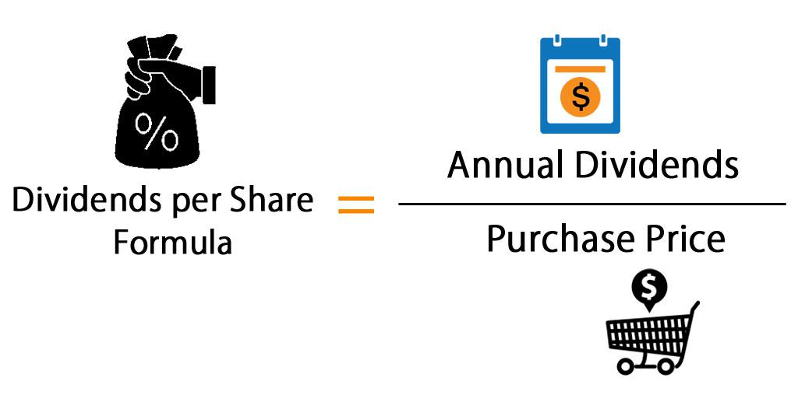

Financial analysis is essential for investors who wish to make informed decisions in the stock market. Two key metrics often evaluated during this process are Dividend Per Share (DPS) and Earnings Per Share (EPS). DPS measures the dividend amount paid to shareholders on a per-share basis, reflecting the company's profitability and its commitment to returning value to shareholders. EPS, on the other hand, provides insight into a company's profitability by indicating how much money it earns for each outstanding share of common stock.

This article focuses on the relationship between financial analysis, DPS, and algorithmic trading, showing how these elements come together to assist investors in their decision-making processes. Algorithmic trading, or algo trading, leverages sophisticated algorithms to execute trades based on predefined criteria, often at speeds surpassing human capability. Integrating financial metrics such as DPS and EPS within these algorithms enhances prediction capabilities and aligns trading strategies with market dynamics.



Understanding the importance of DPS and EPS, as well as their integration into algorithmic trading, offers potential benefits to investors seeking stable returns. This understanding is increasingly vital as algorithmic trading grows more prevalent, impacting both novice and experienced investors alike. By mastering these concepts, investors can optimize their strategies to effectively respond to market conditions and enhance portfolio performance in a rapidly evolving financial landscape.

## Table of Contents

## Understanding Dividend Per Share (DPS)

Dividend Per Share (DPS) is a key financial metric that quantifies the portion of a company's earnings distributed to shareholders in the form of dividends. It serves as an essential indicator of how profits are allocated among shareholders, shedding light on the company's dividend policy and financial health.

DPS is calculated by dividing the total dividends paid out by a company by the number of outstanding shares. Mathematically, it can be expressed as:

$$
\text{DPS} = \frac{\text{Total Dividends Paid}}{\text{Number of Outstanding Shares}}
$$

A higher DPS indicates that a company is distributing a significant portion of its profits to shareholders, often suggesting robust financial health and stability. This is particularly appealing to investors focused on income, as it implies the prospect of steady income through dividends. A consistently increasing DPS may be interpreted as a positive signal reflecting the company's ability to generate recurring profits and its commitment to returning value to its shareholders.

For investors, DPS is critical for evaluating a company's dividend policy. By analyzing DPS, investors can gain insights into a company’s priorities in terms of financial management — whether it emphasizes returning profits to shareholders or reinvesting them for growth and expansion. A company with a stable or growing DPS is often seen as having sound financial management practices, which can be attractive to investors seeking reliable returns.

## The Role of DPS in Financial Analysis

Dividend Per Share (DPS) is an essential metric for financial analysis, particularly for investors who prioritize income through regular dividend payouts. As a measure of the dividends allocated per share, DPS offers critical insights into a company's financial strategies and health.

A consistently high DPS is indicative of a company's robust financial health and its commitment to returning value to shareholders. This consistency can build investor confidence, signaling the company's ability to generate stable profits and its prioritization of shareholder returns. Investors seeking reliable dividend income are thus more attracted to companies with a track record of stable or increasing DPS.

Comparative analysis is a common approach for investors to assess a company's DPS against its peers. Such comparisons can reveal the company's competitive positioning within its industry. A relatively high DPS within an industry might suggest a strong market position, while a low DPS can indicate potential room for growth or a strategic focus on reinvestment rather than immediate shareholder returns.

Changes in DPS can also provide insightful cues about a company's strategic priorities. An increase in DPS might reflect a decision to reward shareholders with more immediacy, possibly due to excess profits or a lack of reinvestment opportunities. Conversely, a decreasing DPS might indicate a shift towards reinvestment in growth opportunities, such as expanding operations, investing in research and development, or acquiring new assets. These changes help investors understand a company’s long-term vision and strategic choices regarding profit allocation.

Overall, DPS is a versatile and informative metric for evaluating investment opportunities, offering insights into both a company's financial health and its strategic intentions regarding profit distribution and reinvestment.

 to Algorithmic Trading

Algorithmic trading, commonly referred to as algo trading, leverages sophisticated algorithms to execute trades based on fixed criteria with a speed and frequency that surpass human capability. This approach uses extensive data analysis to detect and capitalize on fleeting market opportunities, thereby significantly enhancing decision-making accuracy. By processing large volumes of data, algorithms can identify patterns and execute trades faster than traditional methods.

The integration of financial metrics like Dividend Per Share (DPS) within algorithmic models further refines prediction capabilities. By incorporating DPS, algorithms can align trading strategies more effectively with market dynamics, allowing them to consider corporate actions like dividend announcements, which can have short-term impacts on stock prices. For example, an algorithm may take into account an impending dividend payout and adjust its strategy accordingly.

Algo trading also has the advantage of reducing emotional biases often associated with human trading, by relying solely on data-driven decisions. This objectivity ensures that trades are based on statistical and mathematical models rather than psychological factors, which can enhance the consistency of trading outcomes. Moreover, [algorithmic trading](/wiki/algorithmic-trading) improves execution efficiency by automating the process, enabling rapid trade placement, which is critical in a market where conditions can change instantaneously.

In practical terms, an algorithm might be designed to execute trades when certain conditions are met, such as a stock price crossing above its moving average, coupled with a favorable DPS trend. Here's a simplified example of how an algorithm might make decisions based on these conditions using Python:

```python
def make_trade_decision(stock_price, moving_average, dps_growth):
    if stock_price > moving_average and dps_growth > threshold:
        execute_trade("buy")
    else:
        execute_trade("hold")

def execute_trade(action):
    if action == "buy":
        print("Executing buy order.")
    elif action == "hold":
        print("Holding position.")

# Example usage
make_trade_decision(stock_price=105, moving_average=100, dps_growth=0.03)
```
This code demonstrates a basic framework where the algorithm executes a buy order if the stock price exceeds its moving average and the DPS shows positive growth above a defined threshold. Such strategies highlight how financial metrics can be seamlessly integrated into algorithmic models, emphasizing their utility in adapting to and exploiting market fluctuations.

## Integrating DPS with Algorithmic Trading

Integrating Dividend Per Share (DPS) into algorithmic trading strategies offers significant advantages to investors by leveraging real-time financial insights and automating decision-making processes. By utilizing advanced algorithms, traders can swiftly adjust their actions based on fluctuating DPS values, effectively capitalizing on opportunities presented by dividend announcements.

One prevalent strategy is the 'dividend capture' approach, where algorithms are designed to buy shares just before the dividend record date and sell them shortly after receiving the dividend payout. This strategy takes advantage of the stock's price adjustment following the dividend distribution, aiming to capture the dividend while minimizing the risk of holding the stock long-term.

Here is a simple illustration of a dividend capture strategy using Python:

```python
import yfinance as yf  # For more datasets, visit: https://paperswithbacktest.com/datasets
import datetime

def dividend_capture_strategy(ticker, start_date, end_date):
    stock_data = yf.download(ticker, start=start_date, end=end_date)

    # Fetch dividend dates
    dividends = stock_data['Dividends'][stock_data['Dividends'] > 0]

    for date in dividends.index:
        print(f"Dividend of {dividends[date]} on {date}")

        # Buy 2 days before ex-dividend date
        buy_date = date - datetime.timedelta(days=2)
        if buy_date in stock_data.index:
            buy_price = stock_data.loc[buy_date]['Close']
            print(f"Buy on {buy_date}: price {buy_price}")

        # Sell 1 day after dividend date
        sell_date = date + datetime.timedelta(days=1)
        if sell_date in stock_data.index:
            sell_price = stock_data.loc[sell_date]['Close']
            print(f"Sell on {sell_date}: price {sell_price}")

ticker = "KO"
start_date = "2022-01-01"
end_date = "2022-12-31"

dividend_capture_strategy(ticker, start_date, end_date)
```

Incorporating DPS within these algorithms necessitates reconciling DPS data with other crucial financial metrics. This comprehensive approach ensures that potential returns are maximized while risks are mitigated. By assessing DPS alongside factors like Earnings Per Share (EPS) and price-to-earnings (P/E) ratios, algorithms can provide a more holistic analysis of market conditions and investment opportunities.

The integration of DPS with algorithmic trading not only enhances the precision and efficiency of trading strategies but also allows investors to harness the power of data-driven insights to optimize their portfolios systematically. As a result, investors are equipped to make informed, timely decisions that align with their financial goals and market conditions.

## Case Studies: DPS in Action

Examining companies such as Coca-Cola and Walmart provides clear insight into how a consistent increase in Dividend Per Share (DPS) can drive investor attraction, particularly for those seeking stable and reliable income. Coca-Cola, one of the most recognized brands globally, has developed a strong reputation for its continuous dividend growth. Over decades, Coca-Cola has managed to sustain and increase its DPS, which has become a cornerstone of its appeal to income-focused investors. The company's commitment to returning profits to shareholders through annual dividend hikes has reinforced investor trust and confidence in Coca-Cola’s financial stability and growth prospects.

Similar to Coca-Cola, Walmart has demonstrated a strong history of consistent dividend increases. Its strategic initiatives to boost profitability and enhance shareholder value have contributed to steady DPS growth, making it attractive to investors seeking reliable returns. Walmart's robust financial performance supports its ability to maintain an upward trajectory in DPS, thus reinforcing its value proposition to shareholders and sustaining market confidence.

In recent years, algorithmic trading strategies have been developed to capitalize on these DPS trends. Algorithms can efficiently monitor companies like Coca-Cola and Walmart, detecting patterns in dividend announcements and reacting swiftly to market changes. By using algorithmic models, traders can implement 'dividend capture' strategies, which involve purchasing shares before the ex-dividend date to benefit from upcoming dividend payments, then selling shortly thereafter. This approach is especially lucrative for investors looking to exploit short-term profit opportunities associated with dividend distributions.

The integration of DPS data within algorithmic trading frameworks provides a holistic approach to evaluating companies. For instance, incorporating historical DPS growth patterns into algorithmic predictions allows traders to develop buy or hold signals based on empirical data, thereby reducing risk and enhancing return potential. Through these methods, investors can optimize trade execution and align investments closely with their financial objectives, achieving a balance between steady income generation and capital appreciation.

## Conclusion

Dividend Per Share (DPS) serves as a critical metric in financial analysis, providing essential insights into a company's ability to distribute profits to its shareholders. This metric not only reflects the financial health and profitability of a company but also serves as an indication of its management's commitment to rewarding shareholders through dividends.

Integrating DPS with algorithmic trading strategies enhances investors' ability to navigate financial markets efficiently. By incorporating DPS into algorithms, investors can tailor trading strategies to respond swiftly to changing market conditions, thereby maximizing potential income. For example, algorithmic trading can adapt real-time to fluctuations in DPS values, enabling strategies such as 'dividend capture', which involves purchasing shares prior to the ex-dividend date to benefit from dividend payouts and subsequently selling them.

Moreover, algo trading's real-time data processing capabilities offer investors a significant advantage, allowing for the optimization of portfolio performance while aligning with broader financial objectives. This integration ensures that investors can adapt to the ever-evolving market landscape with precision, reducing emotional biases and improving decision-making efficiency.

Ultimately, by mastering the use of DPS within financial and algorithmic frameworks, investors are empowered to make well-informed investment decisions. This understanding not only aids in navigating the complexities of the financial landscape but also helps in achieving stable returns aligned with long-term financial goals. The fusion of DPS insights with algorithmic trading tools can, therefore, be a formidable strategy for modern investors seeking to enhance portfolio performance and achieve financial success.

## References & Further Reading

Investopedia articles provide foundational knowledge on key metrics such as Dividend Per Share (DPS) and Fundamental Analysis, offering valuable insights for both novice and experienced investors. These resources cover the essentials of understanding and evaluating financial health and potential investment returns based on dividend distributions. 

Research papers exploring the impact of algorithmic trading in financial markets analyze how algorithmic models enhance trading efficiency and execution accuracy. These studies typically investigate how algorithms utilize financial metrics, such as DPS, to optimize trading strategies and minimize risks associated with emotional biases.

Books on dividend investing offer comprehensive strategies on building portfolios that focus on companies with consistent dividend payments. These resources delve into identifying firms with sustainable dividend policies and understanding their underlying financial metrics, including DPS.

Additionally, literature on algorithmic trading strategies explores the integration of financial metrics into automated trading systems. These [books](/wiki/algo-trading-books) often include coding examples, primarily in Python, demonstrating how to implement algorithms for analyzing stock performance metrics like DPS and executing trades accordingly. Readers can enhance their technical and analytical skills to effectively employ algorithms in portfolio management, optimizing returns while managing risks.

