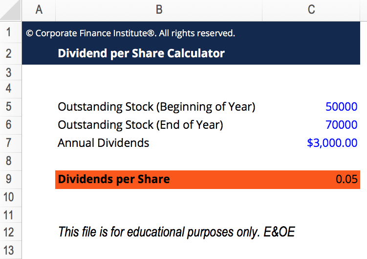

## Table of Contents

## What is a dividend?

A dividend is money that a company pays to its shareholders. It's like a reward for owning part of the company. When a company makes a profit, it can choose to share some of that profit with its shareholders instead of keeping it all for the business.

Companies usually pay dividends a few times a year. The amount you get depends on how many shares you own. If you own more shares, you get more money. Dividends can be a good way to earn extra income, especially if you own a lot of shares in a company that pays high dividends.

## What does Dividend Per Share (DPS) mean?

Dividend Per Share (DPS) is the amount of money a company pays out to each share of its stock. It tells you how much you will get for each share you own when the company decides to share its profits with shareholders. If a company has a DPS of $1, that means for every share you own, you will get $1 as a dividend.

To calculate DPS, you take the total dividends paid by the company and divide it by the number of shares outstanding. This number is important for investors because it helps them understand how much income they can expect from their investment in the company. A higher DPS might mean more money in your pocket, but it's also good to look at other things like the company's overall health and future growth.

## How is Dividend Per Share calculated?

Dividend Per Share (DPS) is figured out by taking the total amount of money a company pays in dividends and dividing it by the total number of shares the company has. So, if a company pays out $100,000 in dividends and has 50,000 shares, the DPS would be $100,000 divided by 50,000, which equals $2 per share.

This calculation helps investors know how much money they will get for each share they own. It's a simple way to see the income part of owning stocks. But remember, DPS can change from one period to another because it depends on how much profit the company makes and how much of that profit they decide to share with shareholders.

## Why is Dividend Per Share important for investors?

Dividend Per Share (DPS) is important for investors because it shows how much money they will get for each share they own. This can be a big part of why people choose to invest in certain companies. If a company has a high DPS, it means investors can earn more money from their shares without having to sell them. This is especially good for people who want to earn regular income from their investments, like retirees.

Also, DPS can tell investors about a company's financial health. If a company keeps paying out high dividends, it might mean they are doing well and making good profits. But, if the DPS goes down or the company stops paying dividends, it could be a sign that they are not doing as well. So, watching the DPS can help investors make smart choices about whether to keep, buy more, or sell their shares.

## How often are dividends typically paid?

Dividends are usually paid out a few times a year. Most companies pay dividends every three months, which is called quarterly. But some companies might pay dividends twice a year, which is called semi-annually, or even once a year, which is called annually. It all depends on the company's policy and how they want to share their profits with shareholders.

Knowing when dividends are paid can help investors plan their finances. If you're counting on that money to come in regularly, it's good to know if it's coming every three months, every six months, or once a year. This can affect how you manage your money and what you expect from your investments.

## What is the difference between DPS and earnings per share?

Dividend Per Share (DPS) and Earnings Per Share (EPS) are both important numbers for investors, but they tell you different things about a company. DPS is the amount of money a company pays out to each share as a dividend. It shows how much income you can get from owning the stock without selling it. If a company has a high DPS, it means they are sharing a lot of their profits with shareholders.

EPS, on the other hand, is the amount of money a company makes for each share of its stock. It's calculated by taking the company's total earnings and dividing it by the number of shares. EPS shows how profitable the company is. A high EPS means the company is making a lot of money, but it doesn't tell you how much of that money they are giving back to shareholders as dividends.

So, while DPS focuses on the dividends paid out to shareholders, EPS focuses on the company's overall earnings. Both are useful for investors, but they give different insights into a company's financial health and how it manages its profits.

## Can Dividend Per Share change over time, and if so, why?

Yes, Dividend Per Share (DPS) can change over time. This happens because DPS depends on how much profit a company makes and how much of that profit they decide to share with shareholders. If a company does really well and makes more money, they might decide to pay out more dividends, which would increase the DPS. But if the company doesn't do as well, they might have less profit to share, and the DPS could go down.

Also, a company might change its dividend policy. Sometimes, a company might want to keep more of its profits to grow the business or pay off debts, so they might lower the DPS. Other times, they might want to attract more investors by offering higher dividends, so they might increase the DPS. These changes in policy can happen because of the company's goals or because of what's happening in the economy or their industry.

## How does a company's payout ratio relate to its Dividend Per Share?

A company's payout ratio is how much of its profits it gives back to shareholders as dividends. It's like a percentage that shows how much of the earnings per share (EPS) turns into dividend per share (DPS). If a company has a high payout ratio, it means they are giving a big part of their profits back to shareholders. So, if the payout ratio is high, the DPS will be higher because more of the earnings are being paid out as dividends.

But if the payout ratio is low, the company is keeping more of its profits for other things like growing the business or paying off debts. This means the DPS will be lower because less of the earnings are being shared with shareholders. The payout ratio can change over time, which affects the DPS. If a company decides to change its payout ratio, either to keep more money or to give more back to shareholders, it will change how much dividend each share gets.

## What are the tax implications of receiving dividends?

When you get dividends, you have to pay taxes on them. The government sees dividends as income, so you need to report them on your tax return. The tax rate you pay on dividends depends on a few things, like how much money you make in total and what kind of dividends they are. There are two main types of dividends: qualified and non-qualified. Qualified dividends are taxed at a lower rate, kind of like the rate for long-term capital gains. Non-qualified dividends are taxed at your normal income tax rate, which can be higher.

The tax rules can be a bit tricky, so it's a good idea to keep good records of your dividends. You'll get a form called a 1099-DIV from the companies that pay you dividends, and you'll need to use this to fill out your tax return. If you have a lot of dividends or if you're not sure how to handle them on your taxes, talking to a tax professional can help make sure you're doing everything right and not paying more than you need to.

## How can investors use Dividend Per Share to compare different companies?

Investors can use Dividend Per Share (DPS) to compare different companies by looking at how much money each company pays out for every share they own. If one company has a higher DPS than another, it means that company is giving more money back to its shareholders. This can be really helpful for investors who are looking for regular income from their investments. For example, if Company A has a DPS of $2 and Company B has a DPS of $1, an investor might choose Company A if they want more income from their shares.

But, it's important not to just look at DPS alone. Investors should also think about other things like how stable the company is, how much it's growing, and what the payout ratio is. A high DPS might look good, but if the company isn't doing well and might have to cut dividends later, it could be risky. So, comparing DPS can give a good first look at how much income a company might provide, but it's smart to look at the whole picture before deciding where to invest.

## What are the limitations of using Dividend Per Share as an investment metric?

Using Dividend Per Share (DPS) as an investment metric has some limitations. One big problem is that DPS doesn't tell you everything about a company's health. A company might have a high DPS, but that doesn't mean it's doing well overall. They might be paying out a lot of dividends because they're not making enough money to grow the business or pay off debts. So, if you just look at DPS, you might think a company is a good investment when it's actually risky.

Another limitation is that DPS can change a lot. Companies can decide to change how much they pay out in dividends based on their profits or their plans for the future. If a company cuts its dividends, the DPS will go down, and that can be bad news for investors who were counting on that income. Also, DPS doesn't show you how much the stock price might go up or down, which is another important thing to think about when you're investing. So, while DPS can help you see how much income you might get, it's not the only thing you should look at when choosing where to invest your money.

## How do special dividends affect the calculation and interpretation of Dividend Per Share?

Special dividends are one-time payments that a company gives to its shareholders, usually when they have extra money from selling a part of their business or having a really good year. These special dividends can make the Dividend Per Share (DPS) look higher for the year they are paid out. But, because special dividends are not regular payments, they can make it hard to figure out what the normal DPS is. If you're trying to compare the DPS of different companies or see how much income you can expect from your shares, special dividends can make things confusing.

When you see a high DPS because of a special dividend, it's important to know that it might not happen again next year. So, if you're using DPS to decide where to invest your money, you need to look at the regular dividends the company pays, not just the special ones. This way, you can get a better idea of what to expect in the future and make a smarter choice about whether a company is a good investment for you.

## What is the DPS Formula?

The Dividend Per Share (DPS) formula serves as an essential tool for investors seeking to understand the dividend income generated per share of stock. At its core, the formula is: 

$$
\text{DPS} = \frac{\text{Total Dividends Paid}}{\text{Number of Shares Outstanding}}
$$

This formula calculates the dividend amount that each shareholder can expect to receive per share. It is a straightforward yet powerful metric to assess the value returned to shareholders through dividends.

In practice, certain adjustments may be necessary to account for specific corporate activities. For example, if a company issues a special dividend, this can be included in the total dividends paid. Special dividends are typically one-time distributions that a company may issue in addition to the regular dividend payments. It is crucial to identify these correctly to ensure the accuracy of the DPS.

Similarly, the number of shares outstanding must accurately reflect any corporate actions such as stock splits or buybacks. In a stock split, the number of shares increases, and consequently, the reported DPS may decrease if the total dividend amount remains unchanged. Conversely, when a company conducts a stock buyback, the number of outstanding shares reduces, potentially increasing the DPS if total dividend payouts stay constant. These adjustments maintain the precision of the DPS calculation, ensuring investors can rely on this metric for evaluating their dividend-based income from an investment in a company's stock. 

Incorporating these considerations ensures that the DPS remains a reliable indicator of the shareholder value derived from dividends, accounting for both consistent distribution patterns and unique corporate actions.

## What is the significance of DPS in stock dividends?

Dividend Per Share (DPS) is a critical metric in evaluating a company's dividend policy and its long-term sustainability. It provides a clear indication of how much money a company returns to its shareholders per share of common stock, reflecting the company's profitability and its commitment to distributing earnings.

A growing DPS is often seen as a positive sign by investors. It typically indicates that a company's management is confident in its current and future financial stability. When a company consistently increases its DPS, it suggests robust earnings and a commitment to return a portion of these earnings to shareholders. This can boost investor confidence and attract more investors, as it is generally perceived as an assurance of the company's growth prospects and stability.

Moreover, DPS is an integral part of calculating other essential financial metrics, such as the dividend yield. The dividend yield is calculated as the DPS divided by the stock's price per share, usually expressed as a percentage:

$$
\text{Dividend Yield} = \left( \frac{\text{DPS}}{\text{Stock Price per Share}} \right) \times 100
$$

This ratio is vital for comparing the relative attractiveness of various dividend-paying stocks, especially for income-focused investors. A higher dividend yield can indicate a more lucrative investment, although it is crucial to ensure that the DPS growth is sustainable. A sudden drop or inconsistency in DPS might signal potential financial troubles or a strategic shift in the company's priorities, thus reducing investor confidence.

In summary, DPS plays a significant role in assessing a company's dividend policy and investment appeal. For investors, monitoring DPS trends can provide valuable insights into a company's financial strength and its ability to maintain and grow shareholder value over time.

## References & Further Reading

[1]: ["The Intelligent Investor: The Definitive Book on Value Investing"](https://www.amazon.com/Intelligent-Investor-Definitive-Investing-Essentials/dp/0060555661) by Benjamin Graham

[2]: ["Common Stocks and Uncommon Profits"](https://www.amazon.com/Common-Stocks-Uncommon-Profits-Writings/dp/0471445509) by Philip A. Fisher

[3]: ["Dividend Policy: Its Impact on Firm Value"](https://www.semanticscholar.org/paper/Dividend-Policy%3A-Its-Impact-on-Firm-Value-Lease-John/729424dc0a79c499797a1609917d0f74b5f6f041) by M. Imad Elhaj, N. M. Amro, and A. M. Deiab

[4]: ["Principles of Corporate Finance"](https://www.mheducation.com/highered/product/principles-corporate-finance-brealey-myers/M9781264080946.html) by Richard A. Brealey, Stewart C. Myers, and Franklin Allen

[5]: ["The Dividend Puzzle: A Progress Report"](https://www.jstor.org/stable/40472953) by Fischer Black