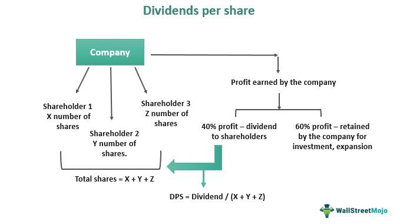

Understanding various financial metrics is crucial for making informed decisions in finance and investing. Among these, Dividend Per Share (DPS) holds notable importance as it provides a window into a company's profitability and dedication to its shareholders. DPS represents the amount of dividend a company distributes to each outstanding share of its common stock. This metric not only reflects the company's ability to generate profits but also indicates its commitment to sharing a portion of these earnings with investors.

This article explores the DPS formula, its role in assessing stock dividends, and how it impacts algorithmic trading strategies. By examining DPS, investors can evaluate a company's dividend policy and gauge its financial health and growth prospects. Additionally, DPS plays a part in other calculations, such as dividend yield, aiding in a comprehensive comparison of investment opportunities.



The article will further delve into the intricacies of DPS and discuss its practical applications using real-world examples. By the conclusion, readers will understand how DPS can shape investment strategies and decisions, providing clarity and confidence in the dynamic stock market environment.

## Table of Contents

## Understanding Dividend Per Share (DPS)

Dividend Per Share (DPS) is an important metric in the financial analysis of a company. It quantifies the amount of dividends distributed by a company to each of its outstanding common stock shares. This metric serves as a vital indicator for investors, providing insight into the potential income they can expect when investing in a company's shares. 

For investors, understanding DPS is essential for evaluating the attractiveness of a stock. A higher DPS implies a larger income stream from dividends, assuming the number of shares held by an investor remains constant. Investors favor companies with stable or increasing DPS, as it can signal robust financial health and promising growth prospects. Such trends in DPS suggest that a company is consistently generating sufficient profits to share with its shareholders, reinforcing its capacity to maintain or increase dividend payouts over time.

Moreover, DPS allows investors to assess a company’s commitment to returning value to shareholders. A company that regularly increases its DPS is likely prioritizing shareholder returns, which can enhance its reputation and attract more long-term investors. Conversely, a declining DPS might indicate potential issues with a company’s earnings or an adjustment in its financial strategy, which might deter investor interest.

The calculation of DPS is straightforward but essential for making informed investment decisions. An accurate understanding and analysis of this metric can guide investors when evaluating whether to enter, hold, or [exit](/wiki/exit-strategy) a position in a particular stock. As such, DPS forms a cornerstone of dividend-focused investment strategies, underscoring its importance in portfolio management and analysis.

## The DPS Formula

The Dividend Per Share (DPS) formula serves as an essential tool for investors seeking to understand the dividend income generated per share of stock. At its core, the formula is: 

$$
\text{DPS} = \frac{\text{Total Dividends Paid}}{\text{Number of Shares Outstanding}}
$$

This formula calculates the dividend amount that each shareholder can expect to receive per share. It is a straightforward yet powerful metric to assess the value returned to shareholders through dividends.

In practice, certain adjustments may be necessary to account for specific corporate activities. For example, if a company issues a special dividend, this can be included in the total dividends paid. Special dividends are typically one-time distributions that a company may issue in addition to the regular dividend payments. It is crucial to identify these correctly to ensure the accuracy of the DPS.

Similarly, the number of shares outstanding must accurately reflect any corporate actions such as stock splits or buybacks. In a stock split, the number of shares increases, and consequently, the reported DPS may decrease if the total dividend amount remains unchanged. Conversely, when a company conducts a stock buyback, the number of outstanding shares reduces, potentially increasing the DPS if total dividend payouts stay constant. These adjustments maintain the precision of the DPS calculation, ensuring investors can rely on this metric for evaluating their dividend-based income from an investment in a company's stock. 

Incorporating these considerations ensures that the DPS remains a reliable indicator of the shareholder value derived from dividends, accounting for both consistent distribution patterns and unique corporate actions.

## Significance of DPS in Stock Dividends

Dividend Per Share (DPS) is a critical metric in evaluating a company's dividend policy and its long-term sustainability. It provides a clear indication of how much money a company returns to its shareholders per share of common stock, reflecting the company's profitability and its commitment to distributing earnings.

A growing DPS is often seen as a positive sign by investors. It typically indicates that a company's management is confident in its current and future financial stability. When a company consistently increases its DPS, it suggests robust earnings and a commitment to return a portion of these earnings to shareholders. This can boost investor confidence and attract more investors, as it is generally perceived as an assurance of the company's growth prospects and stability.

Moreover, DPS is an integral part of calculating other essential financial metrics, such as the dividend yield. The dividend yield is calculated as the DPS divided by the stock's price per share, usually expressed as a percentage:

$$
\text{Dividend Yield} = \left( \frac{\text{DPS}}{\text{Stock Price per Share}} \right) \times 100
$$

This ratio is vital for comparing the relative attractiveness of various dividend-paying stocks, especially for income-focused investors. A higher dividend yield can indicate a more lucrative investment, although it is crucial to ensure that the DPS growth is sustainable. A sudden drop or inconsistency in DPS might signal potential financial troubles or a strategic shift in the company's priorities, thus reducing investor confidence.

In summary, DPS plays a significant role in assessing a company's dividend policy and investment appeal. For investors, monitoring DPS trends can provide valuable insights into a company's financial strength and its ability to maintain and grow shareholder value over time.

## Algorithmic Trading and DPS

Algorithmic trading leverages sophisticated algorithms to execute trades at speeds and frequencies that are impossible for human traders. Within these algorithms, Dividend Per Share (DPS) can be a critical variable, influencing decisions and strategies. DPS represents the income an investor can expect from each share, and its changes can indicate a company's financial health and stability.

In practice, DPS data can be integrated into algorithms that track its trends. For instance, a system might monitor DPS changes over several periods, identifying patterns or anomalies. If a company's DPS shows a consistent upward trend, it might signal stability and growth potential, prompting the algorithm to recommend buying the stock. Conversely, a sudden drop in DPS might trigger a sell signal, suggesting potential financial issues within the company.

Programmatically, algorithms could be implemented in Python to react to DPS changes. Below is a simple example of how such an algorithm might be structured in pseudocode:

```python
def make_trading_decision(dps_history):
    increase_threshold = 0.05  # 5% increase
    decrease_threshold = -0.05  # 5% decrease

    if dps_history[-1] / dps_history[-2] - 1 > increase_threshold:
        return "Buy"
    elif dps_history[-1] / dps_history[-2] - 1 < decrease_threshold:
        return "Sell"
    else:
        return "Hold"
```

Incorporating DPS into trading strategies also helps in refining decisions by aligning them with broader market insights and individual financial goals. Moreover, DPS data enhances the calculation of other key metrics such as dividend yield, which is crucial for holistic stock assessment. This alignment not only optimizes portfolio performance by balancing risk and return but also aids in achieving more precise, data-driven investment decisions.

By embedding DPS fluctuation sensitivity into trading algorithms, investors can bolster their strategies, ensuring actions align with both the evolving market landscape and the fundamental signals from the companies in which they invest. This incorporation of DPS allows for enhanced market responsiveness and potential capital gain, leveraging detailed financial insights to achieve trading success.

## Examples of DPS in Action

Companies like Coca-Cola and Walmart are exemplary cases of how a consistent increase in Dividend Per Share (DPS) can create stable and reliable investment opportunities. By maintaining or gradually increasing their DPS over the years, these companies have demonstrated a commitment to shareholder value, which enhances investor confidence and strengthens their market reputation.

Coca-Cola, for instance, has a longstanding history of annual dividend increases, contributing to its status as a 'dividend aristocrat.' This term is given to companies that have consistently raised their dividends for at least 25 consecutive years. Coca-Cola’s strategy of steady DPS growth reflects its robust financial health and ability to generate continuous revenue, crucial for maintaining investor trust. The stability offered by such consistent dividend payouts makes Coca-Cola an attractive option for income-focused investors seeking long-term capital appreciation.

Similarly, Walmart illustrates the importance of DPS in reinforcing financial stability and growth. Over recent decades, Walmart has incrementally increased its DPS, showcasing its operational efficiency and strategic growth initiatives. This approach not only underscores Walmart's capacity to deliver shareholder returns but also enhances its reputation as a financially prudent organization. Continuous DPS growth signals to investors the company’s ongoing profitability and effective management practices, making Walmart a reliable choice for those prioritizing dividend income.

Both Coca-Cola and Walmart exemplify how sustained increases in DPS can establish a company's reputation as a dividend aristocrat, embodying a promise of reliability and sustained fiscal performance. The incremental rise in DPS not only affirms these companies' commitment to rewarding shareholders but also plays a pivotal role in their inclusion in various dividend-focused investment portfolios. Consequently, investors perceive such companies as more secure investments, given their track record of financial consistency and resilience in diverse market conditions.

## Conclusion

Dividend Per Share (DPS) extends beyond its numeric value, embodying an integral component of a company's fiscal strategy and commitment to its shareholders. It serves as a tangible expression of profitability and corporate mindfulness towards investor interests. As companies strategize their dividend policies, DPS becomes an indicator of their capacity to generate shareholder value over time.

Investors who grasp the intricacies of DPS can derive insights into a company's financial health and future growth prospects. By analyzing trends in DPS, investors can make more informed stock market decisions, determining not only the potential return on investment but also the sustainability of dividends. A consistently rising DPS is often viewed as an assurance of a firm’s financial prudence and its ability to provide a reliable income stream.

For algorithmic traders, the utility of DPS is significant. Incorporating DPS into trading algorithms enhances the sophistication of trading strategies. Tracking DPS changes allows for automatic adjustments in trading actions, either capitalizing on emerging trends or safeguarding against declines. This automated response mechanism aids in optimizing portfolio performance, balancing the twin goals of stability and growth. By continuously monitoring DPS, traders can construct algorithms that respond adeptly to market signals, thereby achieving a competitive edge in the dynamic landscape of stock trading. Thus, DPS is a crucial metric that bridges strategic corporate management and investor decision-making, fostering financial growth and stability across the board.

## References & Further Reading

[1]: ["The Intelligent Investor: The Definitive Book on Value Investing"](https://www.amazon.com/Intelligent-Investor-Definitive-Investing-Essentials/dp/0060555661) by Benjamin Graham

[2]: ["Common Stocks and Uncommon Profits"](https://www.amazon.com/Common-Stocks-Uncommon-Profits-Writings/dp/0471445509) by Philip A. Fisher

[3]: ["Dividend Policy: Its Impact on Firm Value"](https://www.semanticscholar.org/paper/Dividend-Policy%3A-Its-Impact-on-Firm-Value-Lease-John/729424dc0a79c499797a1609917d0f74b5f6f041) by M. Imad Elhaj, N. M. Amro, and A. M. Deiab

[4]: ["Principles of Corporate Finance"](https://www.mheducation.com/highered/product/principles-corporate-finance-brealey-myers/M9781264080946.html) by Richard A. Brealey, Stewart C. Myers, and Franklin Allen

[5]: ["The Dividend Puzzle: A Progress Report"](https://www.jstor.org/stable/40472953) by Fischer Black