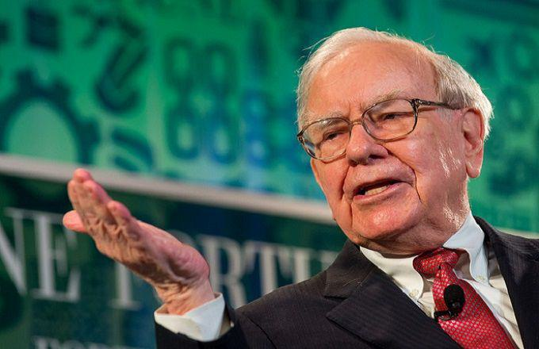

Berkshire Hathaway Inc. stands as a titan in the investment world, renowned for its enormous market capitalization and diverse portfolio. Under the leadership of Warren Buffett, a legendary investor and its CEO since 1965, the company has become synonymous with long-term value investing. Buffett, often referred to as the "Oracle of Omaha," has built Berkshire Hathaway into a conglomerate with subsidiaries operating in a wide range of industries, from insurance and utilities to manufacturing and retail.

Central to the identity of Berkshire Hathaway is its unique dividend policy, or lack thereof. Unlike many large corporations that regularly distribute profits to shareholders in the form of dividends, Berkshire Hathaway famously refrains from paying dividends. This approach is deeply rooted in Buffett’s investment philosophy, which emphasizes the reinvestment of earnings into the business to generate compounded growth over time. This policy has made the company an outlier in the investment community, prompting extensive analysis and discussion about its efficacy and implications for stock performance.



In contrast, algorithmic trading, often called "algo trading," has rapidly gained prominence in financial markets. Leveraging sophisticated algorithms and high-speed data processing, algo trading executes trades at speeds and efficiencies beyond human capability. This advancement in technology allows for benefits such as increased speed, accuracy, and scalability in executing trades. As markets become increasingly data-driven, the significance of algorithmic trading continues to grow.

This article seeks to explore the intersection of Berkshire Hathaway’s distinctive dividend policy and the evolving landscape of algorithmic trading. By examining how Buffett's strategy influences market behavior and considering potential algorithmic approaches to such an investment paradigm, we aim to provide insights into how traditional and modern investment practices may coexist and influence each other.

## Table of Contents

## Berkshire Hathaway's Dividend Policy

Berkshire Hathaway's dividend policy is widely recognized for its deviation from traditional corporate strategies, as the company does not distribute dividends to its shareholders. This policy, led by Warren Buffett, underscores a unique approach to capital allocation that prioritizes reinvestment over regular shareholder payouts.

One of the primary reasons Berkshire Hathaway refrains from paying dividends is Buffett's philosophy on capital retention for reinvestment. Buffett argues that by retaining earnings, the company can allocate capital more efficiently through reinvesting in high-return opportunities. This approach allows Berkshire Hathaway to compound its growth, a principle Buffett emphasizes in wealth creation. He believes that as long as the company can generate returns that exceed the market's average by reinvesting retained earnings, shareholders benefit more than if they received dividends.

Buffett's strategy contrasts with the typical practices of other large corporations which often return profits to shareholders via dividends. Many companies view dividends as a way to signal financial health and reward shareholders. For instance, corporations such as Apple Inc. and Procter & Gamble have substantial dividend payouts, appealing to investors seeking steady income streams. These companies, unlike Berkshire Hathaway, prioritize distributing a portion of their earnings while maintaining enough capital for growth initiatives.

The implications of Berkshire Hathaway's no-dividend approach on its stock performance are noteworthy. Historically, the company's stock has demonstrated robust performance, with returns driven by successful reinvestment strategies. Shareholders who trust Buffett's long-term vision and capital allocation skills have realized significant capital gains. This reinvestment-focused model has contributed to a strong reputation in the market, often attracting investors who are more interested in long-term value appreciation than immediate income.

In comparing dividend strategies, Berkshire Hathaway stands as a distinct case. The company's approach can be seen as a commitment to optimize shareholder value through compounding returns, contrasting with firms that distribute earnings quarterly. As a result, the effectiveness of the company's policy lies in Buffett's ability to identify lucrative investment opportunities, ensuring retained earnings contribute to sustainable and significant growth in the long term. 

Therefore, while Berkshire Hathaway's dividend policy may not align with traditional shareholder expectations of periodic income, it highlights an alternative philosophy of investing that leverages reinvestment as a tool for maximizing shareholder value. This strategy underscores the trust shareholders have in Buffett's leadership and the overall strategic direction of the company.

## Warren Buffett's Investment Philosophy

Warren Buffett's investment philosophy is characterized by several foundational principles, each contributing significantly to his substantial success and shaping the operations of Berkshire Hathaway.

A cornerstone of Buffett's approach is long-term focus and value investing. This strategy involves identifying undervalued companies with strong fundamentals and holding them over extended periods. Buffett is renowned for his ability to assess intrinsic value, a concept that refers to the true worth of a company based on its fundamentals, such as earnings, dividends, and growth potential, as opposed to its current market price. This involves detailed financial analysis, examining cash flows, profit margins, and growth prospects.

Buffett's focus on risk management is evident in his aversion to unnecessary risks and speculative ventures. He famously emphasizes investment in businesses he understands thoroughly, avoiding what he terms the "circle of competence." This approach minimizes exposure to sectors where he has limited insight, thereby controlling potential losses. Diversification, although not excessive, plays a vital role in his risk management strategy. Unlike many investors, Buffett believes in concentrated investments in well-understood businesses rather than spreading investments too thinly, which might dilute returns.

Compounding is another critical element of Buffett's philosophy. He leverages the power of compound interest to grow wealth exponentially over time. By reinvesting profits and dividends into principal investment, he allows earnings to generate their own earnings, creating a snowball effect. This strategy is most effective when investments are maintained over long durations, capitalizing on the exponential growth characteristics of compounding. Mathematically, this can be expressed with the formula for compound interest:

$$
A = P \left(1 + \frac{r}{n}\right)^{nt}
$$

where $A$ is the amount of money accumulated after n years, including interest. P is the principal investment. The annual interest rate is $r$. The number of times the interest is compounded per year is $n$, and $t$ represents the number of years.

These investment principles guide Berkshire Hathaway's business practices. The company engages in strategic acquisitions and investments, focusing on businesses with strong competitive advantages, often referred to by Buffett as "economic moats." This approach helps ensure sustainable profitability and market leadership. By prioritizing the compounding of retained earnings and judicious acquisitions, Berkshire has consistently grown its book value and shareholder equity.

Buffett's philosophy favors simplicity over complexity, patience over haste, and a steadfast commitment to value over mere speculation. The long-term success of Berkshire Hathaway is a testament to the efficacy of these principles, embodying a disciplined approach to investing that prioritizes intrinsic value and sustainable growth.

## Understanding Algo Trading

Algorithmic trading, commonly referred to as algo trading, involves the use of computer algorithms to automate the process of buying and selling financial securities. These predefined instructions or algorithms determine the timing, price, and quantity of trades, often executing strategies at a speed and frequency impossible for human traders. Algo trading has become increasingly prevalent across global financial markets, driven by technological advancements and the pursuit of efficiency and enhanced returns.

Technological advancements have significantly propelled the growth of algo trading. The development of high-speed internet and improvements in computational power have enabled the processing of vast amounts of market data in real time. This progress has facilitated complex algorithms that can analyze multiple indicators simultaneously to identify trading opportunities. Machine learning and [artificial intelligence](/wiki/ai-artificial-intelligence) have further driven the evolution of algo trading, enabling adaptive algorithms that can refine strategies based on market conditions and historical data.

The benefits of algo trading are manifold. Speed is a primary advantage, as algorithms can execute trades within milliseconds after identifying profitable opportunities, capturing price differences even in highly volatile markets. Accuracy is another benefit, with algorithms minimizing the risk of human error by adhering strictly to predefined rules. Scalability also stands out, as these algorithms can handle large volumes of trades across different markets and asset classes, allowing traders to diversify their portfolios with ease.

Algo trading employs several common strategies, each aimed at capitalizing on distinct market trends and inefficiencies. Market making is a strategy where algorithms simultaneously place buy and sell orders for a particular asset, profiting from the bid-ask spread. Arbitrage involves exploiting price differentials between markets or related assets; for instance, purchasing an underpriced asset in one market while simultaneously selling it in another where it is overpriced. These strategies rely heavily on speed and precision to be effective, given the narrow windows of opportunity they often present.

Despite its advantages, [algorithmic trading](/wiki/algorithmic-trading) is not without challenges and criticisms. One criticism is the perceived contribution of algo trading to market [volatility](/wiki/volatility-trading-strategies), as the rapid execution of trades can amplify price movements during periods of instability. The "flash crash" of 2010 is often cited in this context, where a confluence of algorithmic trades led to a temporary but drastic drop in the Dow Jones Industrial Average. Furthermore, the complexity of certain algorithms can render them opaque, making it difficult for traders to fully understand the risks involved. Over-reliance on historical data can also pose limitations, as algorithms might struggle to adapt to unprecedented market events or shifts in economic conditions.

In conclusion, understanding algo trading is crucial for modern finance professionals, as it signifies a shift in how markets operate and provides a foundation for strategic development in trading practices. While technological advancements have unlocked new dimensions of trading efficiency and accuracy, the responsibilities surrounding its impacts on market dynamics necessitate a balanced approach to its implementation and oversight.

## Intersection of Dividend Policies and Algo Trading

Dividend policies play a significant role in shaping the strategies employed by algorithmic traders. These policies can affect stock valuation, volatility, and investor sentiment, all of which are critical variables in algorithmic models. In the case of companies like Berkshire Hathaway, which maintain a unique dividend policy of not offering regular dividends, algorithmic trading strategies may need to adjust significantly.

For algorithmic trading systems, dividend announcements typically signify predictable market behavior that can be exploited. When a company announces a dividend, prices generally increase as the ex-dividend date approaches, reflecting the anticipated distribution of profits to shareholders. In cases where regular dividends are not distributed, such as with Berkshire Hathaway, these systems must rely on alternative indicators and metrics.

### Applying Algorithmic Trading to Non-dividend Stocks

Algorithmic traders dealing with non-dividend-paying stocks like Berkshire Hathaway might capitalise on other factors, such as earnings reports, mergers and acquisitions activity, or macroeconomic indicators. Algorithms could, for instance, be programmed to detect anomalies in such events that might affect stock prices similarly to dividend announcements. 

Additionally, [machine learning](/wiki/machine-learning) models can be trained to recognize complex patterns in trading activity and investor sentiment that traditionally accompany dividend stock cycles. Rather than focusing on dividend yield, algorithms could emphasize intrinsic value, growth potential, or Buffett's investment activity within the portfolio of Berkshire Hathaway.

### Role of Market Data Analytics

Market data analytics plays a critical role in deciphering the impact of dividend patterns through algorithmic approaches. Analytical tools might be used to evaluate historical data to build models that predict the impact of non-dividend-related announcements. This model could involve:
$$
\text{Price Change} = \beta_0 + \beta_1 \times \text{Earnings Rate} + \beta_2 \times \text{Volatility Index} + \epsilon
$$

Here, $\text{Price Change}$ is the dependent variable, while $\text{Earnings Rate}$ and $\text{Volatility Index}$ are independent variables, with $\epsilon$ as the error term. This formula suggests how multiple non-dividend factors might affect price movements.

### Hypothetical Models for Algorithmic Benefit

Hypothetical models where algo trading profits from Berkshire Hathaway’s approach could involve leveraging shareholder returns through reinvestment. Algorithms may predict reinvestment opportunities and anticipate resultant stock performance, attempting to capture gains from future growth rather than current income.

A possible model could integrate earnings releases with market trends, anticipating significant reinvestment signals correlated with positive price movements. Utilizing sentiment analysis tools on CFO and CEO announcements could also serve as a proxy for traditional dividend signals — altering strategic timelines or expectations for price corrections.

### Real-world Examples

While specific real-world examples of algorithmic traders focusing solely on non-dividend policies like Berkshire Hathaway's are limited due to proprietary trading algorithms, sectors with similar strategies can shed light on potential tactics. Hedge funds and proprietary trading firms often deploy algorithmic systems in markets with less predictable dividend behaviors, diversifying strategies to address earnings reinvestment and structural market shifts rather than traditional yield metrics.

In conclusion, while Berkshire Hathaway's refusal to pay dividends might initially seem to deter algorithmic trading interest, adaptive strategies that focus on earnings reports, reinvestment strategies, and market sentiment analysis can serve as profitable alternatives. Algorithms can be designed to account for and leverage this unique approach to capital allocation, capturing market inefficiencies and optimizing trading outcomes.

## Case Study: Berkshire Hathaway's Market Impact through Algo Trading

Algorithmic trading has revolutionized the way stocks are traded, employing complex mathematical models and software to transact at speeds and frequencies impossible for human traders. This section will discuss how algorithmic trading interacts with Berkshire Hathaway's stock, particularly given the company's non-traditional approach to dividends.

### Examination of Trading Volumes and Volatility Patterns

Berkshire Hathaway, led by Warren Buffett, adopts a distinctive no-dividend policy, standing out among its peers that frequently return profits to shareholders through dividends. This policy implicates algorithmic trading strategies, which heavily rely on predictable dividend announcements for crafting trading algorithms. The absence of dividends from Berkshire removes a typical variable from trading models, compelling algorithm designers to focus on other aspects such as earnings reports, mergers, or acquisitions for volatility triggers.

**Trading volumes** in companies that do not pay dividends can be somewhat less predictable, as they lack the regular "earning signals" that dividends often provide. When a dividend event approaches, algorithmic trading systems predictably increase market activity, seeking arbitrage opportunities or adjusting portfolios. Absent such events, algorithms must adjust to evaluate other market signals.

### Case Studies: Impact of Buffett's Decisions on Algorithmic Strategies

One notable scenario was when Warren Buffett announced a significant investment in Apple Inc. This decision, unexpected by many, was not a result of dividend policy, but rather Buffett's strategic pivot, which caught many algorithmic traders off-guard. The immediate impact observed in trading algorithms was a sharp increase in Berkshire Hathaway's stock trading [volume](/wiki/volume-trading-strategy), as models recalibrated to incorporate this new, significant [factor](/wiki/factor-investing) about its portfolio management strategy.

In another instance, the split of Berkshire Hathaway's B shares in 2010 tripled the [liquidity](/wiki/liquidity-risk-premium) of its stock and altered the volatility profile significantly. Algorithms designed to exploit price movements had to adjust their parameters to accommodate this change in market conditions.

### Algorithmic Traders' Perspective on Berkshire Hathaway

Algorithmic traders typically categorize Berkshire Hathaway as a "weather vane" stock, mirroring broader market sentiments rather than reacting to dividend payouts. Algorithms might, hence, be designed to factor in broader economic indicators, sectors in which Berkshire holds major investments, or even Buffett’s public statements, which have historically swayed market opinions.

Given the non-dividend strategy, a hypothetical Python algorithm trading Berkshire Hathaway might place greater weight on sentiment analysis and news impacts over traditional financial indicators, as demonstrated below:

```python
import numpy as np
import pandas as pd
from sklearn.linear_model import LinearRegression

# Simulated sentiment score and stock price data
data = {
    'sentiment_score': np.random.rand(100),
    'stock_price_change': np.random.randn(100)
}

# Create a DataFrame
df = pd.DataFrame(data)

# Define independent and dependent variables
X = df[['sentiment_score']]
y = df['stock_price_change']

# Create a linear regression model
model = LinearRegression()
model.fit(X, y)

# Predict based on sentiment scores
predictions = model.predict(X)
```

### Lessons from Market Interactions

The experience of traders and algorithms engaging with Berkshire's stock underscores the adaptability required when traditional data points, like dividends, are absent. Strategies must adequately balance the lack of dividend data with alternative metrics like news impacts, economic indicators, or corporate announcements.

Market responses to Berkshire's strategic movements reveal that algorithms not only measure typical financial health indicators but often incorporate nuanced analytics stemming from corporate maneuvers, expansions, or high-profile investments. Traders employing such algorithms can witness accelerated market responses, underscoring the importance of flexible and comprehensive algo frameworks.

In conclusion, while lacking in dividend-transmission signals, Berkshire Hathaway offers a unique testing ground for advanced algorithmic strategies that prioritize adaptable, multi-faceted data analysis. This expands the algorithm's scope beyond traditional stock metrics, providing a broad understanding of market signals essential in an evolving financial landscape.

## Future Prospects

Berkshire Hathaway's dividend policy, characterized by its long-standing practice of not paying dividends, is unlikely to change dramatically in the immediate future. Warren Buffett has consistently emphasized the benefits of reinvesting earnings back into the company to enhance shareholder value, a philosophy deeply rooted in his approach to investment. However, as the company evolves and reaches new financial milestones, there may be considerations for subtle shifts in policy, especially in the context of changing leadership or significant legal or market pressures. 

Algorithmic trading technology continues to advance at a rapid pace, potentially redefining traditional investment paradigms. The integration of artificial intelligence and machine learning into algo trading platforms enables more sophisticated analysis of extensive datasets, including company-specific factors such as dividend policies. This enhancement could lead to more nuanced trading strategies that account for companies like Berkshire Hathaway, which operate outside the conventional dividend-paying framework. As algo trading evolves, its capacity to adapt to unique dividend approaches, or lack thereof, positions it to exploit inefficiencies in the market associated with such policies.

The dynamic nature of market conditions could also influence Berkshire Hathaway's stance as an attractive asset for algo traders. Economic cycles, regulatory changes, or macroeconomic variables might impact market sentiment and volatility, providing fertile ground for algorithmic traders to capitalize on non-traditional dividend scenarios like those presented by Berkshire Hathaway. The firm’s robust and diverse portfolio, coupled with its stability, may act as a counterbalance to market fluctuations, further drawing the interest of algo-driven trading strategies.

The influence of Warren Buffett extends beyond current investment methodologies and continues to shape future technology adoption. His principles of value investing and long-term growth offer a blueprint for integrating technological advances into traditional investing frameworks. As algorithmic trading gains prominence, these technologies may increasingly align with or challenge Buffett's principles, fostering a dialogue between time-tested investment strategies and cutting-edge technological innovations.

In conclusion, while Berkshire Hathaway's dividend policy appears steadfast under Warren Buffett's leadership, the evolution of algo trading presents opportunities for new integrations. The rise of data analytics and machine learning provides avenues to reinterpret non-traditional dividend policies, potentially reshaping investment dynamics. The continuing interplay between dividend policies and technological advancements underscores the ongoing transformation of the investment landscape, blending classic investment doctrines with modern computational techniques.

## References & Further Reading

[1]: Bergstra, J., Bardenet, R., Bengio, Y., & Kégl, B. (2011). ["Algorithms for Hyper-Parameter Optimization."](https://dl.acm.org/doi/10.5555/2986459.2986743) Advances in Neural Information Processing Systems 24.

[2]: ["Advances in Financial Machine Learning"](https://www.amazon.com/Advances-Financial-Machine-Learning-Marcos/dp/1119482089) by Marcos Lopez de Prado

[3]: ["The Essays of Warren Buffett: Lessons for Corporate America"](https://www.amazon.com/Essays-Warren-Buffett-Lessons-Corporate/dp/1611637589) by Warren E. Buffett, edited by Lawrence A. Cunningham

[4]: ["Machine Learning for Algorithmic Trading"](https://github.com/stefan-jansen/machine-learning-for-trading) by Stefan Jansen

[5]: ["Quantitative Trading: How to Build Your Own Algorithmic Trading Business"](https://www.amazon.com/Quantitative-Trading-Build-Algorithmic-Business/dp/1119800064) by Ernest P. Chan

[6]: ["From Graham to Buffett and Beyond"](https://www.amazon.com/Value-Investing-Graham-Buffett-Finance-ebook/dp/B08M5C79D9) by Bruce C. N. Greenwald

[7]: ["Evidence-Based Technical Analysis: Applying the Scientific Method and Statistical Inference to Trading Signals"](https://www.amazon.com/Evidence-Based-Technical-Analysis-Scientific-Statistical/dp/0470008741) by David Aronson