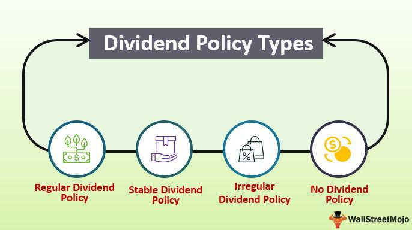

Dividend policy serves as a cornerstone in corporate finance, encapsulating a company's strategic decisions regarding the distribution of profits to shareholders. This policy is crucial as it directly influences investor satisfaction and impacts a company’s market perception and financial stability. Divergent dividend policies exist, ranging from stable and constant to residual and hybrid approaches, each reflecting different commitments to returning value to shareholders.

Investment strategies centered on dividend policies are esteemed for their potential to generate reliable income streams and enhance portfolio resilience. Investors often consider dividend stocks as fundamental components of their portfolios, analyzing companies with robust dividend histories to identify lucrative investment opportunities. Key metrics such as dividend yield and payout ratio are pivotal in informing investment decisions, offering insights into a company's financial health and its capacity for sustained payouts.



In recent years, algorithmic trading has emerged as a transformative force in augmenting dividend investment strategies. By leveraging sophisticated algorithms, traders can optimize strategies to maximize dividend incomes, employing techniques such as dividend capture and growth investing. Algorithmic trading offers advantages like efficient execution and enhanced risk management, making it an indispensable tool in the modernization of dividend-based strategies.

This article aims to explore the intersection of dividend policy, investment strategy, corporate finance, and algorithmic trading. It examines how integrating these elements can optimize returns and guide investors in developing personalized approaches to dividend investing.

## Table of Contents

## Understanding Dividend Policy: A Corporate Finance Perspective

Dividend policy is a critical component of corporate finance, shaping how a company distributes profits to its shareholders. It delineates the guidelines a company follows in deciding the magnitude and timing of dividends to be paid out. The strategic definition and execution of a dividend policy are vital as they reflect a company's financial health and capacity to generate free cash flow. These policies play a significant role in attracting and retaining investors by instilling confidence and serving as a signal of the company’s stability and future prospects.

### Types of Dividend Policies

Several types of dividend policies exist:

1. **Stable Dividend Policy**: Under this policy, companies pay a fixed dividend per share, and this dividend does not fluctuate with earnings. The advantage of a stable dividend policy is that it provides consistent income to shareholders, enhancing loyalty and predictability.

2. **Constant Dividend Policy**: Companies distribute a fixed percentage of their earnings as dividends. This means that dividends can vary based on the company’s profit levels. This policy aligns with the company's profitability and is directly dependent on earnings performance.

3. **Residual Dividend Policy**: In this approach, dividends are based on the leftover or residual earnings after all optimal investment opportunities have been funded. It reflects a company’s primary focus on business growth over shareholder payouts.

4. **Hybrid Dividend Policy**: This policy combines elements of both stable and residual approaches. Companies maintain a baseline regular dividend, but they also issue additional dividends when earnings are high, thus capturing the advantages of both stability and growth.

### Impact on Investor Satisfaction and Market Perception

Dividend policies significantly influence investor satisfaction. Regular, predictable payouts based on a stable dividend policy are often viewed favorably by investors looking for steady income, such as retirees and institutional investors. Conversely, a company that consistently pays dividends is perceived as more stable and confident about its future cash flows. An unexpected change in dividends can lead to shifts in investor sentiment, affecting the company's stock price and long-term investor relations.

### Influence on Capital Structure and Financial Health

Dividend policies also affect a company’s capital structure. A company that maintains a high dividend payout ratio may have less retained earnings available for reinvestment and growth. This could necessitate increased borrowing, modifying the company’s debt-equity ratio. While this can leverage growth, it also introduces higher financial risk, particularly if market conditions lead to destabilizing earnings.

For a firm actively investing in its growth, residual dividend policy helps in maintaining an optimal capital structure by prioritizing profitable investment projects over dividend payments. Consequently, the policy chosen can indicate underlying strategic priorities—balancing between diverting profits as returns to shareholders and reinvesting in the company's expansion and innovation.

In conclusion, dividend policy is not merely an operational decision but a strategic tool that impacts a company's market perception, investor satisfaction, and overall financial strategy. Understanding the nuances of each type of dividend policy can enable investors to align their financial goals with the operational directions of a company, while simultaneously allowing companies to communicate their financial health and strategic priorities effectively.

## Dividend Policy as an Investment Strategy

Dividend stocks play a crucial role in investment portfolios, offering a balance between income generation and capital appreciation. These stocks are shares in companies that have a history of paying regular dividends, which are portions of a company’s earnings distributed to shareholders. Investors often include dividend stocks in their portfolios as they provide a relatively stable source of income, especially important in volatile markets or during retirement.

To effectively utilize dividend policy as an investment strategy, investors must carefully analyze companies with robust dividend policies. This involves examining the consistency, sustainability, and growth potential of a company’s dividend payments. Companies that consistently pay and increase dividends tend to be financially healthy and have a reliable cash flow, making them attractive investment opportunities.

**Key Metrics in Investment Decisions**

Two critical metrics in evaluating dividend stocks are the dividend yield and the dividend payout ratio. The dividend yield is expressed as a percentage and calculated by dividing the annual dividend per share by the stock's price per share:

$$
\text{Dividend Yield} = \left( \frac{\text{Annual Dividend per Share}}{\text{Price per Share}} \right) \times 100
$$

This metric provides a snapshot of how much cash flow an investor is getting for each dollar invested in an equity position, which is crucial for assessing whether a stock is a suitable income generator.

The dividend payout ratio, on the other hand, indicates what portion of a company's earnings is being paid out as dividends. It can be calculated as:

$$
\text{Dividend Payout Ratio} = \left( \frac{\text{Dividends per Share}}{\text{Earnings per Share}} \right) \times 100
$$

An optimal payout ratio suggests that a company retains adequate profits for reinvestment while distributing sufficient dividends to satisfy shareholders.

**Case Studies: Apple and Kinder Morgan**

Apple Inc. and Kinder Morgan are exemplars of distinct approaches to dividend policies.

Apple, a technology giant, returned to paying dividends in 2012 after a long hiatus, reflecting its strong cash reserves and commitment to returning value to shareholders. Apple's dividend policy is characterized by consistent payouts and gradual increases, aligning with its substantial earnings growth and robust financial health. The company maintains a moderate dividend yield coupled with significant stock buybacks, indicating a balanced approach towards rewarding investors.

Kinder Morgan, a prominent energy infrastructure company, offers a contrasting strategy. Known for its high dividend yield, Kinder Morgan appeals to investors seeking substantial income streams. The company's dividend policy reflects its stable cash flows generated from fee-based assets in the energy sector. However, the nature of its industry necessitates careful management of dividend payouts to navigate market [volatility](/wiki/volatility-trading-strategies) and capital expenditures.

These case studies illustrate diverse strategies employed by companies in managing their dividend policies, emphasizing the importance of aligning such policies with overall corporate strategy and market conditions. Investors should assess these elements in conjunction with their financial goals to select stocks that fit within their investment portfolios.

## Role of Algorithmic Trading in Dividend Investment

Algorithmic trading, often abbreviated as algo trading, involves the use of pre-programmed trading instructions accounting for variables such as time, price, and [volume](/wiki/volume-trading-strategy). The relevance of [algorithmic trading](/wiki/algorithmic-trading) in dividend investment lies in its ability to efficiently manage and optimize dividend income strategies. 

One of the ways algorithms enhance dividend strategies is through dividend capture. This strategy involves buying stocks just before the ex-dividend date—the cutoff date on which you must own the stock to receive the dividend—and selling them shortly after to capture the dividend payment. An algorithm can execute this strategy by scanning multiple securities, determining optimal purchase and sale times, and executing trades at high speeds, thus optimizing the dividend capture process.

Another significant strategy supported by algorithmic trading is dividend growth investing. This involves investing in companies with a consistent track record of increasing dividends over time. Algorithms can analyze historical dividend data and other financial indicators to identify potential investments that fit this profile. By continuously monitoring market conditions and dividend announcements, algorithms can adjust investment positions dynamically, taking advantage of growth opportunities promptly.

A notable advantage of using algorithmic trading in dividend strategies is the increased efficiency in trade execution. Algorithms can process data faster than human traders, reducing latency and execution time. This speed is critical in capturing timed opportunities such as those presented in dividend capturing strategies. Moreover, algorithms help in risk management by allowing for the implementation of stop-loss orders, limiting potential losses if the market moves against the trade.

For example, consider a Python-based algorithm designed to implement a simple dividend capture strategy:

```python
import yfinance as yf  # For more datasets, visit: https://paperswithbacktest.com/datasets
import datetime
import numpy as np

def dividend_capture(stock_symbol):
    stock = yf.Ticker(stock_symbol)
    # Get historical market data, here for the past 60 days
    hist = stock.history(period="60d")

    # Look for the ex-dividend date in the recent history
    ex_dividends = stock.actions['Dividends']
    recent_ex_div = ex_dividends[ex_dividends.index >= datetime.datetime.now() - datetime.timedelta(days=60)]

    for date in recent_ex_div.index:
        # Approximate best purchase and sell date
        purchase_date = date - np.timedelta64(1, 'D')
        sell_date = date + np.timedelta64(3, 'D')

        buy_price = hist.loc[str(purchase_date)]['Close']
        sell_price = hist.loc[str(sell_date)]['Open']

        # Calculate dividend capturing profit
        dividend = recent_ex_div[date]
        profit = (sell_price - buy_price) + dividend

        print(f"For {stock_symbol}: Buy on {purchase_date}, Sell on {sell_date}, Profit: {profit}")

dividend_capture('AAPL')
```

This example illustrates a basic framework that could be expanded for live trading with additional features such as dynamic data feeds, risk management protocols, and market condition adjustments.

In summary, algorithmic trading brings several advantages to dividend investment strategies, including optimized execution of trading strategies, enhanced risk management, and the ability to process vast amounts of data swiftly. These capabilities provide investors with the tools to potentially improve their returns from dividend-focused strategies.

## Formulating an Effective Dividend-Based Strategy

Formulating an effective dividend-based strategy involves integrating dividend policies with algorithmic trading to create a strong and adaptable investment framework. This approach seeks to maximize shareholder value while accommodating growth and market fluctuations. Here we explore how these elements can be harmoniously aligned to craft comprehensive investment strategies.

### Balancing Reinvestment for Growth with Shareholder Returns

A successful dividend-based strategy requires a delicate balance between reinvesting profits for future growth and distributing earnings to satisfy shareholders. Companies must assess their growth prospects and capital needs before determining their dividend payouts. The key is to optimize capital allocation:

$$
\text{Net Income} = \text{Dividends} + \text{Reinvestment in Business}
$$

Reinvestment can drive future earnings and ultimately increase the capacity for larger dividends. However, prioritizing reinvestment at the expense of shareholder returns may diminish investor satisfaction and impact stock market perception negatively.

### Considerations for Crafting Dividend Policies

Several factors influence the formulation of an effective dividend policy:

1. **Growth Opportunities**: Companies with significant potential for expansion may prioritize reinvestment over immediate dividend payments. Conversely, firms with limited growth prospects might focus on consistent dividend distributions to attract investors.

2. **Tax Implications**: Taxation can significantly impact net returns for both companies and investors. Understanding jurisdictional tax obligations and optimizing dividend policies accordingly can enhance overall returns. For instance, qualified dividends are often taxed at a lower rate compared to ordinary income, offering potential tax advantages.

3. **Market Conditions**: Prevailing economic conditions can impact a company's earnings and ability to pay dividends. Flexible dividend strategies that adjust to market volatility can provide stability and maintain investor confidence. In uncertain times, a hybrid policy that combines stable and residual policies may offer a balanced approach.

### Developing a Tailored Strategy

Creating a dividend strategy requires aligning corporate financial objectives with the prevailing market environment. Companies can employ algorithmic trading to enhance strategy execution and adapt to dynamics swiftly:

#### Python Example for Dividend Strategy Simulation

Using Python, investors can simulate different dividend scenarios to evaluate potential outcomes. For instance:

```python
import numpy as np

# Simulate annual dividend payments over 10 years
dividend_growth_rate = 0.05
initial_dividend = 2.00
years = np.arange(10)
dividends = initial_dividend * ((1 + dividend_growth_rate) ** years)

# Calculate and print future dividends
print("Future Dividends: ", dividends)
```

This basic script provides insights into how potential dividends might grow over a decade, helping to form realistic expectations and align investment strategies with financial goals.

Overall, a well-formulated dividend strategy should accommodate both the company's ambitions and the investor's need for returns. By leveraging algorithmic trading, investors can execute these strategies with precision and make informed adjustments to account for market evolutions. Ultimately, personalized dividend strategies can facilitate optimal financial outcomes and advance corporate financial policy effectively.

## Challenges and Risks in Dividend Strategies

Dividend strategies, while attractive for their potential to generate steady income, come with inherent challenges and risks. Investors need to consider market volatility and dividend cut risks, which can significantly impact expected returns. Additionally, the integration of algorithmic trading into dividend strategies introduces its own set of challenges, such as system failures and market anomalies. However, these risks can be mitigated through careful planning and continuous monitoring.

Market and dividend cut risks are primary concerns for dividend investors. Market risk encompasses the broader economic factors that can lead to a decline in stock prices, thereby affecting the value of dividend-based portfolios. For example, economic downturns can result in reduced corporate earnings, prompting companies to cut dividends to conserve cash. Dividend cut risk specifically addresses the likelihood of firms reducing or eliminating their dividend payouts. Companies may opt to cut dividends in response to deteriorating financial conditions or shifts in strategic priorities.

Algorithmic trading in dividend strategies can amplify certain risks but also offers potential benefits. Algorithmic systems can misinterpret market data or execute trades based on flawed logic, leading to significant losses. These risks are largely attributed to technical failures, insufficient testing, or inadequate algorithms. However, through the use of sophisticated risk management techniques and rigorous testing, the stability and effectiveness of algorithmic trading can be enhanced.

To mitigate these risks while maximizing returns, several strategies can be employed. Diversification is essential; by investing across various sectors and geographical regions, an investor can reduce dependency on any single dividend source. Implementing a stop-loss mechanism within trading algorithms can further protect against drastic downturns. Additionally, maintaining a cash buffer within the portfolio provides [liquidity](/wiki/liquidity-risk-premium) to manage unforeseen market movements or dividend cuts.

Continuous monitoring and adjustments are crucial in algorithmic strategies. Market conditions are dynamic, and algorithms must adapt to remain effective. Regular review and recalibration of algorithms ensure they align with the current market landscape and financial objectives. Moreover, deploying [machine learning](/wiki/machine-learning) techniques can aid in refining algorithmic strategies by learning from past market data and improving prediction accuracy.

Overall, while challenges exist in dividend investing and its algorithmic execution, they can be navigated effectively through strategic planning and constant vigilance. By recognizing potential pitfalls and employing proactive measures, investors can optimize returns in dividend-based strategies.

## Conclusion

Dividend policy plays a pivotal role in corporate finance by significantly influencing how a company's earnings are allocated between reinvestment for growth and distribution to shareholders. The strategy a company adopts regarding dividend payouts can affect investor satisfaction and perceptions in the market, as well as impact the company's capital structure and financial health. Companies with a well-defined and consistent dividend policy are often perceived as financially stable, which can attract and retain investors seeking predictable returns. As such, dividend-paying stocks frequently form a core element of investment portfolios, catering to investors who value income generation alongside capital appreciation.

Algorithmic trading introduces a sophisticated dimension to dividend investment strategies by utilizing data-driven, automated processes to optimize returns. By rapidly analyzing vast amounts of market data, algorithmic systems can execute trades with precision that human traders might find challenging. Strategies such as dividend capture and dividend growth investing leverage algorithms to identify optimal entry and [exit](/wiki/exit-strategy) points, manage risk, and enhance the efficiency of dividend-focused investments. This synergy allows for a more proactive approach to managing portfolios, enabling investors to not only maximize dividend income but also adjust swiftly to changing market conditions.

With the integration of algorithmic trading, investors can leverage dividend policy more effectively. By combining the stability and attractiveness of dividend-paying stocks with the analytical power of algorithms, investors have the potential to achieve optimized returns while managing risk more effectively. This approach can be particularly advantageous in volatile markets, where quick decision-making is crucial.

There is substantial potential for further exploration and development of personalized dividend strategies. Investors are encouraged to deepen their understanding of both dividend policies and algorithmic trading techniques to tailor strategies that align with individual financial objectives and market conditions. By continuously refining their approach and staying informed about advancements in financial technologies, investors can craft robust strategies that underpin long-term financial success.

## References & Further Reading

[1]: Bragg, S. M. (2012). ["Dividend Policy: Corporate Finance and Strategy"](https://books.google.com/books/about/Financial_Analysis.html?id=Ek1USXpyeKkC). Wiley.

[2]: Bodie, Z., Merton, R., & Cleeton, D. (2009). ["Financial Economics"](https://archive.org/details/financialeconomi0002bodi). Prentice Hall.

[3]: Murphy, M. J. (2020). ["Dividend Investing: Decoding the Dividend Puzzle"](https://www.researchgate.net/publication/13185791_CEO_incentives-its_not_how_much_you_pay_but_how). Independently published.

[4]: Damodaran, A. (2014). ["Investment Valuation: Tools and Techniques for Determining the Value of Any Asset"](https://books.google.com/books/about/Investment_Valuation.html?id=5SRHAAAAQBAJ). Wiley Finance.

[5]: Chan, E. P. (2013). ["Algorithmic Trading: Winning Strategies and Their Rationale"](https://github.com/ftvision/quant_trading_echan_book). Wiley.