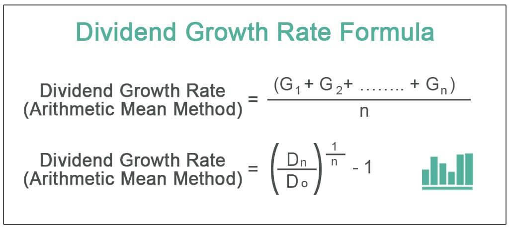

## Table of Contents

## What is a dividend rate?

A dividend rate is the amount of money a company pays out to its shareholders for each share they own. It is usually given as a percentage of the share's price or as a dollar amount per share. For example, if a company has a dividend rate of 5% and the share price is $100, the shareholder would get $5 for each share they own.

Companies usually pay dividends every three months, which is called a quarterly dividend. But some companies might pay them yearly or even monthly. The dividend rate can change depending on how well the company is doing. If the company makes more money, it might increase the dividend rate to give more money to its shareholders. If it makes less money, it might lower the dividend rate or stop paying dividends altogether.

## How is the dividend rate different from the dividend yield?

The dividend rate and the dividend yield are two different things, but they are connected. The dividend rate is the actual amount of money a company pays out to its shareholders for each share they own. It can be given as a dollar amount, like $1 per share, or as a percentage of the share's price. For example, if a company says it pays a dividend rate of $1 per share, that's how much you get for each share you own.

The dividend yield, on the other hand, is a percentage that shows how much the dividend rate is compared to the price of the stock. You find it by dividing the dividend rate by the stock's price and then turning that into a percentage. For example, if a stock costs $50 and the dividend rate is $1 per share, the dividend yield would be 2% (which is $1 divided by $50, then times 100 to get a percentage). The dividend yield helps investors see how much they are [earning](/wiki/earning-announcement) from dividends compared to what they paid for the stock.

## Why is the dividend rate important for investors?

The dividend rate is important for investors because it tells them how much money they will get back from the company just for owning its stock. This can be like getting a regular paycheck from the company, which can help investors earn money without selling their shares. For people who want a steady income, like retirees, knowing the dividend rate helps them plan their finances better because they can count on this money coming in regularly.

Also, the dividend rate can show how healthy and stable a company is. If a company keeps paying or even increasing its dividend rate over time, it usually means the company is doing well and making good profits. This can make investors feel more confident about keeping their money in the company. On the other hand, if a company cuts its dividend rate or stops paying dividends, it might be a sign that the company is having financial problems, which could make investors think twice about investing in it.

## How is the dividend rate calculated?

The dividend rate is the amount of money a company pays to its shareholders for each share they own. It can be given as a dollar amount per share or as a percentage of the share's price. For example, if a company says it will pay $1 for each share, that's the dividend rate. If it's given as a percentage, like 5% of the share's price, and the share costs $100, then the dividend rate would be $5 per share.

To find the dividend rate when it's given as a percentage, you multiply the share's price by the percentage. So, if the share price is $100 and the company says it will pay a 5% dividend, you do the math: $100 times 0.05 equals $5. That's how much you get for each share you own. Companies usually tell investors about the dividend rate when they announce their dividend payments, which can be quarterly, yearly, or even monthly.

## Can you provide an example of calculating the dividend rate?

Let's say a company decides to pay a dividend of 4% on its shares. If the price of each share is $50, we can find out the dividend rate in dollars. To do this, we take the share price, which is $50, and multiply it by the dividend percentage, which is 4%. In math terms, that's $50 times 0.04, which equals $2. So, the dividend rate for this company is $2 per share.

This means that if you own one share of this company, you will get $2 every time the company pays its dividends. If you own 10 shares, you would get $20 each time. Knowing the dividend rate helps you understand how much money you can expect to receive from the company without selling your shares.

## What factors influence a company's dividend rate?

A company's dividend rate can be affected by many things. One big thing is how much money the company is making. If the company is doing well and making more profit, it might decide to pay a higher dividend rate to share that success with its shareholders. On the other hand, if the company is not doing so well and making less money, it might lower the dividend rate or even stop paying dividends to save money and use it for other things like growing the business.

Another factor is the company's plans for the future. If a company wants to grow and needs money to do that, it might choose to keep more of its profits instead of paying them out as dividends. This can mean a lower dividend rate. Also, the overall economy can play a role. In good economic times, companies might feel more confident about paying higher dividends. But if the economy is not doing well, companies might be more careful and pay less or no dividends at all.

## How often are dividends typically paid, and does this affect the dividend rate?

Dividends are usually paid every three months, which is called quarterly. Some companies might pay them once a year, which is called annually, or even once a month, which is called monthly. How often a company pays its dividends doesn't change the dividend rate itself. The dividend rate is just how much money you get for each share you own, no matter how often you get it.

But, the frequency of dividend payments can affect how you think about the dividend rate. If you get dividends every month, you might feel like you're getting a steady income from your shares. This can make the dividend rate seem more important to you, especially if you need regular money. On the other hand, if you get dividends only once a year, you might not feel the same way about the dividend rate because you have to wait longer to get your money.

## What is the relationship between a company's earnings and its dividend rate?

A company's earnings are really important when it comes to deciding its dividend rate. Earnings are the money a company makes after paying all its costs. If a company is making a lot of money, it might choose to share some of that money with its shareholders by paying a higher dividend rate. This can make shareholders happy because they get more money for each share they own. But if the company isn't making much money, it might need to keep more of its earnings to run the business or to grow, which could mean a lower dividend rate or no dividends at all.

The decision about the dividend rate also depends on what the company plans to do with its earnings. If the company wants to grow and needs money to do that, it might decide to pay a smaller dividend rate so it can keep more of its earnings. This way, the company can use the money to buy new things or start new projects. On the other hand, if the company is doing well and doesn't need all its earnings to grow, it might choose to give more money back to its shareholders by increasing the dividend rate. So, the relationship between earnings and the dividend rate is all about how the company chooses to use its profits.

## How can changes in the dividend rate impact stock prices?

When a company changes its dividend rate, it can affect the price of its stock. If a company raises its dividend rate, it usually means the company is doing well and making more money. This can make investors feel good about the company, and they might want to buy more of its stock. When more people want to buy the stock, the price can go up. On the other hand, if a company lowers its dividend rate or stops paying dividends, it might mean the company is not doing so well. This can make investors worried, and they might want to sell their stock. When more people want to sell, the price of the stock can go down.

The impact on stock prices can also depend on what investors expect. If investors were expecting a big increase in the dividend rate but the company only raises it a little, they might be disappointed. This could make the stock price go down because investors might think the company isn't doing as well as they hoped. But if the company raises the dividend rate more than expected, investors might be really happy and the stock price could go up a lot. So, it's not just about the change in the dividend rate itself, but also about how that change matches up with what investors were expecting.

## What are the tax implications of dividend rates for investors?

When you get dividends from a company, you usually have to pay taxes on that money. In the United States, the tax you pay on dividends depends on whether they are "qualified" or "non-qualified." Qualified dividends are taxed at a lower rate, like the capital gains tax rate, which can be 0%, 15%, or 20% depending on your income. Non-qualified dividends are taxed at your regular income tax rate, which can be higher. To be considered qualified, the dividends must meet certain rules, like being paid by a U.S. company or a qualified foreign company, and you must have held the stock for a certain amount of time.

The tax you pay on dividends can affect how much money you actually get to keep. For example, if you get $100 in qualified dividends and you're in the 15% tax bracket for capital gains, you would owe $15 in taxes, leaving you with $85. If those dividends were non-qualified and you're in a 22% income tax bracket, you would owe $22 in taxes, leaving you with $78. So, knowing whether your dividends are qualified or non-qualified can help you understand how much of the dividend rate you'll actually get to keep after taxes.

## How do different types of stocks (e.g., common vs. preferred) affect dividend rates?

Different types of stocks, like common and preferred stocks, can affect the dividend rates that investors receive. Common stocks usually have variable dividend rates, which means the amount of money shareholders get can change depending on how well the company is doing. If the company makes more money, it might decide to pay a higher dividend rate to common stockholders. But if the company doesn't make as much money, it might lower the dividend rate or not pay any dividends at all. Common stockholders are usually the last to get paid dividends, after other types of investors like bondholders and preferred stockholders.

Preferred stocks, on the other hand, often have fixed dividend rates. This means that the amount of money preferred shareholders get stays the same, no matter how the company is doing. Preferred stockholders get paid their dividends before common stockholders, which makes their dividends more predictable and stable. But, because preferred stocks have this extra security, they might not offer the chance for the dividend rate to go up like common stocks can. So, the type of stock you own can really change how much money you get from dividends and how often that amount might change.

## What advanced strategies can investors use to optimize returns based on dividend rates?

One way investors can optimize their returns based on dividend rates is by using a strategy called dividend reinvestment. This means instead of taking the dividend money as cash, investors use it to buy more shares of the same company. Over time, this can help grow the number of shares they own, which means they get even more dividends in the future. It's like a snowball effect where the more shares you have, the more dividends you get, and the more you can reinvest. This strategy works best when the company's stock price stays steady or goes up, because then the reinvested dividends can buy more shares at a good price.

Another strategy is to focus on companies that have a history of increasing their dividend rates over time. These companies are often called "dividend aristocrats" because they've raised their dividends for at least 25 years in a row. By investing in these companies, investors can benefit from not just the current dividend rate, but also from the potential for that rate to keep going up. This can help protect against inflation and grow their income over time. It's important to do research and pick companies that are likely to keep increasing their dividends, because not all companies can do this year after year.

Lastly, investors can use a strategy called "dividend capture." This involves buying a stock just before the dividend is paid out and then selling it soon after. The goal is to get the dividend without holding onto the stock for a long time. This can work if the stock price doesn't drop by more than the dividend amount after the payment. But it's a bit riskier because stock prices can be unpredictable, and if the price drops a lot, the investor might lose money overall. So, it's important to be careful and understand the risks before trying this strategy.

## How do you calculate dividend rates?

Calculating dividend rates is a fundamental step for investors seeking to assess the income potential of their stock investments. The dividend rate represents the total dividends expected to be received on an annual basis from an investment. To calculate the dividend rate, one needs to multiply the most recent periodic dividend payments by the frequency of those payments in a year and add any special or extra annual dividends.

For example, assume a stock pays a regular dividend of $0.50 per quarter and also issues an additional annual dividend of $0.12. The calculation of the annual dividend rate involves two components: the regular dividends and the extra annual dividend. The steps are as follows:

1. Calculate the total regular annual dividends by multiplying the quarterly dividend by the number of quarters in a year: 
$$
   \text{Total Regular Annual Dividends} = 0.50 \times 4 = 2.00

$$

2. Add the extra annual dividend to determine the total dividend rate: 
$$
   \text{Dividend Rate} = 2.00 + 0.12 = 2.12

$$

Through this calculation, the stock's annual dividend rate is $2.12. Understanding how to compute the dividend rate equips investors with the ability to compare different stocks and investment opportunities based on their potential to generate income. This comparison is essential for making informed investment choices and optimizing portfolio returns. Calculating dividend rates helps in evaluating the steadiness and growth potential of dividends over time, enabling a comparison between stocks that have similar prices but differing dividend policies.

## What is the Role of Dividend Payout and Growth?

Dividend payout ratios and dividend growth are critical metrics for evaluating a company's financial health and its capacity to sustain or enhance dividend distributions over time. These factors provide investors with insights into a company's potential for long-term profitability and stability.

The dividend payout ratio is a key indicator in this assessment. It is calculated as follows:

$$
\text{Dividend Payout Ratio} = \left(\frac{\text{Dividends Per Share}}{\text{Earnings Per Share}}\right) \times 100
$$

A low dividend payout ratio suggests that a company retains a significant portion of its earnings, which can be reinvested for growth or used to strengthen the balance sheet. This typically indicates that the company is well-positioned to maintain its dividend payments even during financial downturns. Conversely, a high payout ratio could suggest that the company distributes most of its earnings as dividends, which might limit its capacity to absorb financial shocks or invest in future growth. Such a scenario could signify potential financial stress, especially if earnings fall short of expectations.

In addition to the payout ratio, dividend growth is another vital [factor](/wiki/factor-investing). Consistent dividend growth over time indicates a company's robust financial performance and its ability to generate increasing levels of cash flow. Companies that have a strong track record of raising dividends often demonstrate resilient business models and disciplined financial management. These companies, often referred to as "dividend growers" or "dividend aristocrats", have become attractive to investors seeking both income and capital appreciation.

Understanding these metrics aids investors in making informed decisions. Companies with sustainable payout ratios and consistent dividend growth are often seen as more reliable investments, providing both stability and potential for appreciation. As a result, investors should not only consider the dividend yield but also analyze the company's payout ratio and historical dividend growth to gauge the potential risk and reward of the investment.

## How can dividend strategies be integrated with algorithmic trading?

Integrating dividend strategies with [algorithmic trading](/wiki/algorithmic-trading) offers a contemporary approach to optimizing investment outcomes. This integration leverages the computational power and speed of algorithms to automate and refine stock selection processes, focusing particularly on stocks with attractive dividend rates and sustainable payout ratios.

One of the key advantages of algorithmic trading is its capability to process large data sets efficiently. Algorithms can be programmed to identify stocks that not only offer high dividend yields but also maintain a healthy balance between earnings and dividends. An optimal dividend strategy often seeks high dividend yield with a low payout ratio to ensure sustainability. The payout ratio is calculated as:

$$
\text{Payout Ratio} = \left( \frac{\text{Dividends Per Share}}{\text{Earnings Per Share}} \right) \times 100
$$

Implementing algorithms that continuously scan and review these metrics enables investors to maintain a portfolio aligned with their income objectives and risk tolerances.

Various tools and platforms facilitate this integration. Python, for instance, offers libraries like Pandas for data manipulation, NumPy for numerical operations, and APIs that connect to platforms like Bloomberg or Yahoo Finance for real-time data retrieval. Below is a simple example code snippet demonstrating how to screen stocks based on dividend yield and payout ratio using Python:

```python
import pandas as pd

# Sample data (in practice, this would be retrieved from a financial API)
data = {
    'Stock': ['AAPL', 'MSFT', 'T', 'VZ'],
    'Dividends Per Share': [0.82, 2.04, 2.08, 2.56],
    'Earnings Per Share': [5.61, 8.12, 3.02, 4.18]
}

df = pd.DataFrame(data)

# Calculate Dividend Yield and Payout Ratio
df['Dividend Yield'] = (df['Dividends Per Share'] / 100) * 100
df['Payout Ratio'] = (df['Dividends Per Share'] / df['Earnings Per Share']) * 100

# Screening based on criteria (e.g., Payout Ratio < 70%)
screened_stocks = df[df['Payout Ratio'] < 70]

print(screened_stocks)
```

Integrating these technological advances with strategic investment principles empowers investors to automate and execute dividend strategies efficiently, aiming for a portfolio optimized for yield and minimized risk. As algorithmic trading continues to evolve, it provides an increasingly effective means to achieve more consistent returns through rigorous analysis and execution of dividend strategies.

## References & Further Reading

[1]: ["The Intelligent Investor: The Definitive Book on Value Investing"](https://www.amazon.com/Intelligent-Investor-Definitive-Investing-Essentials/dp/0060555661) by Benjamin Graham

[2]: ["Dividend Growth Machine: How to Supercharge Your Investment Returns with Dividend Stocks"](https://www.amazon.com/Dividend-Growth-Machine-Supercharge-Investment/dp/1541117077) by Nathan Winklepleck

[3]: ["Algorithmic and High-Frequency Trading"](https://www.amazon.com/Algorithmic-High-Frequency-Trading-Mathematics-Finance/dp/1107091144) by Álvaro Cartea, Sebastian Jaimungal, and José Penalva

[4]: ["Python for Finance: Analyze Big Financial Data"](https://books.google.com/books/about/Python_for_Finance.html?id=E93SBQAAQBAJ) by Yves Hilpisch

[5]: ["Common Stocks and Uncommon Profits and Other Writings"](https://www.amazon.com/Common-Stocks-Uncommon-Profits-Writings/dp/0471445509) by Philip A. Fisher