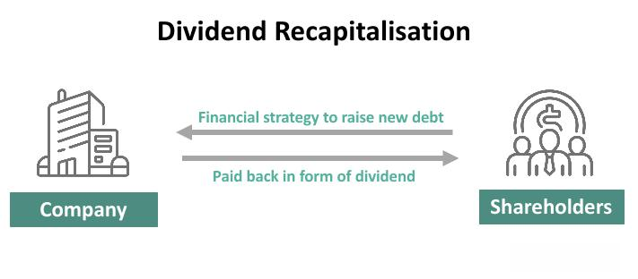

## Table of Contents

## What is dividend recapitalization?

Dividend recapitalization is when a company takes out a loan to pay a big dividend to its shareholders. It's like the company is borrowing money to give a gift to its owners. This is often done by private equity firms that own the company. They do this to get some of their money back while still keeping control of the company.

This can be risky because the company now has more debt. If the company can't pay back the loan, it might have financial problems. But if the company is doing well, it might be able to handle the extra debt. Some people like dividend recaps because they get money without selling their shares. But others worry about the added risk to the company's future.

## How does dividend recapitalization work?

Dividend recapitalization happens when a company borrows money from a bank or another lender. Instead of using this money to grow the business or buy new things, the company gives it to its shareholders as a dividend. This is like the company taking out a loan to give a gift to its owners. The shareholders get extra money without having to sell their shares in the company.

This can be a good thing for the shareholders because they get money without giving up their ownership. But it can also be risky for the company. After the dividend recapitalization, the company has more debt to pay back. If the company does well and can handle the extra debt, everything might be fine. But if the company struggles, the added debt could make things worse and lead to financial problems.

## What are the benefits of dividend recapitalization for shareholders?

Dividend recapitalization can be really good for shareholders. When a company does a dividend recap, it borrows money and gives it to the shareholders as a dividend. This means shareholders get extra money without having to sell their shares. It's like getting a bonus without losing any ownership in the company. This can be especially nice for shareholders who want to get some cash back from their investment but still want to keep their shares.

However, there are some risks too. If the company takes on too much debt and can't pay it back, it might run into financial trouble. But if the company is doing well and can handle the extra debt, shareholders can enjoy the benefits of the dividend without worrying too much. So, while dividend recapitalization can be a great way for shareholders to get some extra money, it's important to think about the company's ability to manage the new debt.

## What are the potential risks associated with dividend recapitalization?

Dividend recapitalization can be risky for a company. When a company borrows money to pay a dividend, it increases its debt. This means the company now has to pay back more money in the future. If the company's business isn't doing well, it might struggle to make these payments. This could lead to financial problems, like not being able to pay its bills or even going bankrupt. The added debt can also make it harder for the company to borrow more money if it needs to in the future, because lenders might see it as too risky.

Shareholders also face risks with dividend recapitalization. While they get extra money right away, the company's increased debt can lower the value of their shares. If the company runs into financial trouble because of the debt, the share price could drop. This means that even though shareholders got a dividend, the overall value of their investment might go down. It's important for shareholders to think about these risks and whether the short-term gain of a dividend is worth the potential long-term problems for the company.

## How does dividend recapitalization affect a company's financial health?

Dividend recapitalization can hurt a company's financial health if it's not careful. When a company borrows money to pay a dividend, it adds more debt to its balance sheet. This means the company has to pay back more money in the future, which can be tough if the business isn't doing well. If the company can't make these payments, it might struggle to pay its bills or even go bankrupt. The added debt can also make it harder for the company to borrow more money if it needs to, because lenders might see it as too risky.

On the other hand, if the company is doing well and can handle the extra debt, dividend recapitalization might not be a big problem. The company can keep running its business and paying back the loan without much trouble. But it's a balancing act. The company needs to make sure it doesn't take on too much debt that it can't handle. If it does, the short-term gain of paying a dividend could lead to long-term financial problems.

## Can you provide an example of a company that has used dividend recapitalization?

One example of a company that used dividend recapitalization is Toys "R" Us. Back in 2005, the private equity firms that owned Toys "R" Us decided to borrow a lot of money. Instead of using that money to improve the business, they gave it to themselves as a dividend. This meant the private equity firms got a big payout, but Toys "R" Us was left with a lot more debt.

This extra debt made things hard for Toys "R" Us. It had to pay back the loans, and that money could have been used to make the stores better or keep prices low. Over time, the company struggled with the debt and eventually went bankrupt in 2017. This shows how dividend recapitalization can be risky if a company can't handle the added debt.

## What are the key differences between dividend recapitalization and traditional dividends?

Dividend recapitalization and traditional dividends are two ways a company can give money to its shareholders, but they work differently. With traditional dividends, a company uses its profits to pay shareholders. This means the company is sharing its earnings with its owners. It doesn't take on any new debt to do this. Traditional dividends are seen as a sign that the company is doing well and making money.

Dividend recapitalization, on the other hand, involves the company borrowing money to pay a dividend. Instead of using profits, the company takes out a loan and gives that money to shareholders. This means the company ends up with more debt, which it has to pay back later. While shareholders get money without selling their shares, the company's financial health can be at risk if it can't handle the new debt. This method is often used by private equity firms to get some of their money back while still keeping control of the company.

## How do lenders view dividend recapitalization?

Lenders often see dividend recapitalization as risky. When a company borrows money to pay a dividend, it means the company is taking on more debt. Lenders worry that if the company can't pay back the loan, they might lose their money. They look at how much debt the company already has and how well it's doing. If the company seems like it might struggle to pay back the new loan, lenders might be less willing to lend money or might charge higher interest rates to cover the risk.

On the other hand, if the company is doing well and has a good track record, lenders might be more okay with dividend recapitalization. They might see it as a sign that the company is confident in its future and can handle the extra debt. But even then, lenders will be careful and might set strict terms to make sure the company can pay back the loan. So, while lenders can be okay with dividend recapitalization in some cases, they always think about the risks and how it might affect the company's ability to pay them back.

## What role does the company's debt level play in dividend recapitalization?

A company's debt level is really important when it comes to dividend recapitalization. If a company already has a lot of debt, adding more to pay a dividend can be risky. Lenders and investors might worry that the company won't be able to pay back all the money it owes. This could make it harder for the company to borrow more money in the future because it might seem too risky to lenders. If the company can't handle the extra debt, it could run into big financial problems, like not being able to pay its bills or even going bankrupt.

On the other hand, if a company doesn't have much debt, it might be able to handle a dividend recapitalization better. The company can borrow money to pay a dividend without putting too much strain on its finances. This can be a good way for shareholders to get some money back without selling their shares. But even then, the company needs to be careful not to take on too much debt. It's all about finding a balance so that the company can pay back the loan while still running its business well.

## How is dividend recapitalization taxed for both the company and the shareholders?

When a company does a dividend recapitalization, it borrows money and gives it to shareholders as a dividend. For the company, the interest it pays on the loan is usually a tax-deductible expense. This means the company can lower its taxable income by the amount of interest it pays, which can save it some money on taxes. But the company doesn't get a tax break for the dividend itself because dividends are paid out of after-tax profits.

For shareholders, the money they get from the dividend is usually taxed as income. In the United States, for example, dividends can be taxed at different rates depending on whether they are qualified or ordinary dividends. Qualified dividends are taxed at the lower capital gains rate, while ordinary dividends are taxed at the shareholder's regular income tax rate. So, shareholders need to think about how the extra money from the dividend will affect their taxes.

## What are the strategic considerations a company should evaluate before pursuing dividend recapitalization?

Before a company decides to do a dividend recapitalization, it needs to think about its financial health. The company should look at how much debt it already has and whether it can handle more. If the company is already struggling with debt, adding more to pay a dividend could be risky. It's important to make sure the company can still pay its bills and keep running its business well after taking on the new loan. The company should also think about its future plans and whether the extra debt will make it harder to grow or invest in new projects.

Another thing to consider is how lenders and investors will react. Lenders might be worried about the company taking on more debt and could charge higher interest rates or be less willing to lend money in the future. Investors might see the dividend recapitalization as a good sign that the company is doing well, or they might worry about the added risk. The company needs to think about how this will affect its relationships with lenders and investors. It's also important to consider the tax impact for both the company and the shareholders, as the interest on the loan can be tax-deductible for the company, but the dividend will be taxed as income for the shareholders.

## How has the use of dividend recapitalization evolved in recent years, and what trends are emerging?

In recent years, the use of dividend recapitalization has changed a bit. It used to be something private equity firms did a lot, especially when interest rates were low. They would borrow money cheaply to pay themselves big dividends. But as interest rates have gone up, it's become more expensive to borrow money. This has made companies think more carefully about whether dividend recapitalization is a good idea. They don't want to take on too much debt if it's going to cost them a lot in interest.

Even with these changes, dividend recapitalization is still used, but companies are being more careful. They're looking at their overall financial health and making sure they can handle the extra debt before they go through with it. There's also a trend towards using dividend recapitalization not just to pay out money, but also to help with other financial strategies, like buying back shares or investing in the business. Companies are trying to balance the short-term benefits of giving shareholders money with the long-term risks of having more debt.

## What is Understanding Corporate Finance?

Corporate finance is a branch of finance concentrated on maximizing shareholder value through sound financial management, encompassing both long-term and short-term financial planning. This discipline covers various strategic areas, including investment analysis, [capital raising](/wiki/hedge-fund-capital-raising), risk management, and financial reporting.

### Investment Analysis

Investment analysis is a crucial component of corporate finance, involving the evaluation of potential investments to determine their viability and profitability. This process often includes methods such as Net Present Value (NPV), Internal Rate of Return (IRR), and Payback Period, which help in assessing the expected return on investment relative to cost. For example, the NPV formula is expressed as:

$$

NPV = \sum \frac{C_t}{(1 + r)^t} - C_0 
$$

where:
- $C_t$ is the cash inflow at time $t$,
- $r$ is the discount rate,
- $C_0$ is the initial investment cost.

### Capital Raising

Capital raising is integral to supporting a company's operations and growth initiatives. This involves sourcing funds through equity, debt, or a combination thereof. Equity financing might include issuing shares in the stock market, while debt financing could entail taking loans or issuing bonds. The choice between equity and debt affects the company's capital structure and financial strategy, demanding a careful balance to minimize cost and maximize value.

### Risk Management

In risk management, firms identify, assess, and prioritize risks, followed by coordinated efforts to minimize the impact of unfortunate events. Companies employ various financial instruments and strategies to hedge against risks, such as derivatives for managing currency and [interest rate](/wiki/interest-rate-trading-strategies) fluctuations. This process aims to maintain a company's stability and support continual growth amidst uncertainty.

### Financial Reporting

Financial reporting involves the systematic preparation of financial statements, offering a clear representation of a company's financial position and performance. It ensures transparency and accountability, providing stakeholders with essential information to make informed decisions. Key statements include the balance sheet, income statement, and cash flow statement, each serving distinct purposes and collectively offering a comprehensive financial overview.

### Adapting to Market Dynamics

As market conditions and economic landscapes continually evolve, corporations must adapt their financial strategies accordingly. This might involve restructuring debt, diversifying investment portfolios, or adjusting capital expenditures. Staying responsive to changes is vital for maintaining competitiveness and supporting strategic objectives.

In sum, corporate finance plays a pivotal role in steering companies toward financial success. It necessitates a dynamic approach to managing resources effectively, ensuring resilience against market fluctuations and aligning with overarching corporate goals.

## What is the Role of Financial Strategy?

Financial strategy is integral to the functioning and growth of a corporation, primarily focusing on the optimal mix of financing sources and the strategic utilization of funds to meet predetermined corporate objectives. An effective financial strategy aligns with enhancing shareholder value, supporting the corporation's mission through sound financial decisions. 

Central to financial strategy is the management of capital structure. This involves determining the right balance between debt and equity financing to minimize the cost of capital while maximizing company value. The formula for the weighted average cost of capital (WACC) is often used to assess the cost-effectiveness of a company's capital structure:

$$

\text{WACC} = \left(\frac{E}{V} \times \text{Re}\right) + \left(\frac{D}{V} \times \text{Rd} \times (1 - \text{Tc})\right) 
$$

Where:
- $E$ is the market value of equity
- $V$ is the total market value of equity and debt
- $\text{Re}$ is the cost of equity
- $D$ is the market value of debt
- $\text{Rd}$ is the cost of debt
- $\text{Tc}$ is the corporate tax rate

Balancing these elements effectively is crucial for maintaining financial flexibility and ensuring funds are available to capitalize on potential opportunities or weather economic downturns. 

Another critical aspect of financial strategy is the dividend policy, which dictates whether profits will be distributed to shareholders or reinvested in the business. This decision impacts investor perception and can influence stock prices. Companies often aim for a dividend policy that maintains investor satisfaction while reinvesting enough profits to fuel growth.

Lastly, mergers and acquisitions (M&A) are principal components of a robust financial strategy. These transactions are strategic tools employed by corporations to expand market presence, diversify product lines, or achieve cost efficiencies through synergies. A well-executed M&A strategy can significantly contribute to a company achieving its corporate growth objectives.

Incorporating these various elements into a cohesive financial strategy enables companies to adapt to market dynamics and maintain competitive advantage. Effective management of these strategies ensures operational efficiency, positioning a corporation for long-term success and stability.

## What is Exploring Dividend Recapitalization?

Dividend recapitalization is a financial strategy wherein a company takes on additional debt to fund a significant dividend payout to shareholders. This approach is typically employed by private equity firms that seek to extract immediate returns from their investments without resorting to selling the underlying assets, specifically the portfolio companies in which they hold stakes.

### Mechanism of Dividend Recapitalization

The dividend recapitalization process begins when a company issues new debt securities. The capital raised through this debt issuance is subsequently distributed as a dividend to the shareholders. This action alters the company's capital structure by increasing its leverage, which is the ratio of debt to equity within the company.

The formula for financial leverage post-recapitalization can be expressed as:

$$
\text{Leverage} = \frac{\text{Total Debt + New Debt}}{\text{Shareholders' Equity}}
$$

This increase in debt can have multiple implications:

1. **Enhanced Shareholder Returns**: Shareholders receive immediate cash distributions, which can be particularly attractive when the market conditions are favorable, or the cost of borrowing is low.

2. **Increased Leverage**: While leverage can amplify potential returns, it also heightens the risk profile of the company. An increased debt burden necessitates careful interest and principal repayment management.

3. **Impact on Credit Rating**: A significant rise in debt may lead to a reassessment of the company's creditworthiness. Credit rating agencies could potentially downgrade the firm, reflecting heightened financial risk, which may increase future borrowing costs.

### Private Equity Utilization

Private equity firms use dividend recapitalization as a tool to derive [liquidity](/wiki/liquidity-risk-premium) from their investments. This practice enables them to realize returns before exiting the investment. It serves as a mechanism to distribute profits to the fund's investors, augmenting the internal rate of return (IRR) of the investment without necessitating an outright sale.

However, frequent application of dividend recaps can stretch a company's balance sheet. Ensuring that the company maintains adequate cash flows to meet debt obligations is crucial. An example of its application is when a private equity firm identifies a stable and cash-generative business, capable of sustaining higher leverage post-recap.

### Risk Management

To manage the financial risks associated with increased leverage from dividend recapitalization, companies can implement the following strategies:

- **Prudent Debt Management**: Establishing a structured debt repayment plan and exploring options such as refinancing can help in managing the burden.

- **Operational Efficiency**: Strengthening operational metrics can stabilize cash flow, mitigating the risk of financial distress.

- **Strategic Financial Planning**: Aligning recapitalization efforts with long-term strategic goals to ensure they enhance rather than hinder the company’s competitive positioning.

In summary, while dividend recapitalization can serve as an effective means for shareholders, especially private equity firms, to extract substantial value from their investments, it requires meticulous planning and risk management to ensure that the resultant financial leverage does not imperil the company's long-term stability and credit profile.

## What is the role of Algorithmic Trading in Modern Finance?

Algorithmic trading employs sophisticated algorithms to execute trades with precision and speed, leveraging predefined strategies to navigate the complexities of financial markets. These algorithms analyze multifaceted market data, integrating various indicators, including dividend metrics, to enhance trading strategies and maximize portfolio performance. A dividend metric, such as the dividend yield, can be computed as follows:

$$
\text{Dividend Yield} = \frac{\text{Annual Dividends per Share}}{\text{Price per Share}}
$$

By considering such metrics, [algorithmic trading](/wiki/algorithmic-trading) systems can adjust strategies to capitalize on price movements influenced by corporate actions, such as dividend announcements or changes.

The increasing adoption of algorithmic trading is attributable to its capability to manage complex trades across diverse asset classes, achieving high throughput and minimal latency. This technology-driven approach enables traders to process vast volumes of trades efficiently, reducing human errors and exploiting market opportunities that arise within fractions of a second.

In a typical algorithmic trading framework, Python is often used for its powerful libraries and ease of use. The following is a basic example of how a trading strategy might account for dividend yield using Python:

```python
import pandas as pd

# Example dataset
data = {
    'price': [100, 102, 101, 105],
    'dividends': [2, 2, 2, 2]
}

df = pd.DataFrame(data)

# Calculate dividend yield
df['dividend_yield'] = df['dividends'] / df['price']

# Simple strategy to buy if the dividend yield is above a threshold
threshold = 0.02
df['signal'] = df['dividend_yield'].apply(lambda x: 'Buy' if x > threshold else 'Hold')

print(df)
```

This code snippet demonstrates a rudimentary decision-making model where a buy signal is generated if the dividend yield surpasses a defined threshold. Such adaptability illustrates how algorithmic trading systems utilize financial data to refine trading tactics dynamically.

As algorithmic trading continues to evolve, its ability to incorporate real-time data and adapt to ever-shifting market conditions strengthens its position as a cornerstone technique in modern financial markets. The integration of [machine learning](/wiki/machine-learning) and [artificial intelligence](/wiki/ai-artificial-intelligence) into these algorithms further enhances their capability to predict market trends and execute trades with increased efficacy, thus maintaining the competitive edge necessary in today's fast-paced financial environment.

## References & Further Reading

[1]: Palepu, K. G., & Healy, P. M. (2008). "Business Analysis and Valuation: Using Financial Statements." Thomson South-Western.

[2]: Frykman, D., & Tolleryd, J. (2010). ["Corporate Valuation: An Easy Guide to Measuring Value."](https://www.semanticscholar.org/paper/Corporate-Valuation%3A-An-Easy-Guide-to-Measuring-Frykman-Tolleryd/1c4aeae51849224dd6a0f9db219b7a43274d196c) Pearson Education.

[3]: ["Principles of Corporate Finance"](https://www.fincart.com/blog/corporate-finance-importance-types-principles/) by Richard A. Brealey, Stewart C. Myers, and Franklin Allen.

[4]: Harris, L. (2003). "Trading and Exchanges: Market Microstructure for Practitioners." Oxford University Press.

[5]: ["Algorithmic Trading and DMA: An Introduction to Direct Access Trading Strategies"](https://www.amazon.com/Algorithmic-Trading-DMA-introduction-strategies/dp/0956399207) by Barry Johnson.

[6]: Asness, C. S. (1994). "Variables that Explain Stock Returns." Ph.D. Dissertation, University of Chicago.

[7]: Lo, A. W., & MacKinlay, A. C. (1999). "A Non-Random Walk Down Wall Street." Princeton University Press.