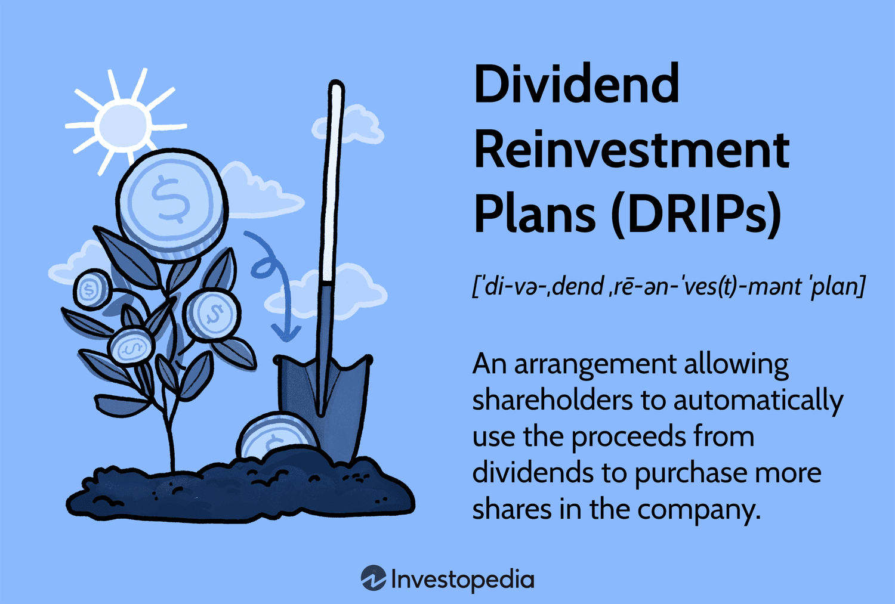

## Table of Contents

## What is a Dividend Reinvestment Plan (DRIP)?

A Dividend Reinvestment Plan, or DRIP, is a program that lets you use your dividend payments to buy more shares of the same company instead of getting the money. When a company pays dividends, which are like rewards for owning their stock, you can choose to automatically use those dividends to get more stock. This means you can grow your investment over time without needing to add more money from your pocket.

Using a DRIP can be a smart way to increase your investment because it takes advantage of compounding. Compounding happens when the dividends you earn start earning their own dividends. Over time, this can make your investment grow faster. Plus, many companies offer DRIPs at a discount, so you can buy more shares for less money than you would on the open market. This makes DRIPs a popular choice for long-term investors who want to build their wealth slowly and steadily.

## How does a DRIP work?

A DRIP works by letting you use the money you get from dividends to buy more shares of the same company. When a company pays out dividends, instead of getting that money in cash, you can choose to have it automatically used to buy more stock. This means you don't need to do anything extra; the process happens on its own. You can often buy these new shares at a lower price than what they cost on the stock market, which is a nice bonus.

Over time, using a DRIP can help your investment grow. This is because the new shares you buy with your dividends can also earn more dividends. This is called compounding, and it's like [earning](/wiki/earning-announcement) interest on your interest. The more shares you own, the more dividends you can earn, and the more you can reinvest. This cycle can help your investment get bigger and bigger without you adding any more money from your pocket.

## What are the benefits of using a DRIP?

Using a DRIP can help your investment grow over time without you needing to add more money. When you reinvest your dividends, you buy more shares of the company. These new shares can then earn their own dividends, which you can use to buy even more shares. This is called compounding, and it's like your money making more money on its own. The more shares you own, the more dividends you can earn, and the bigger your investment can grow.

Another benefit of using a DRIP is that you can often buy shares at a lower price than what they cost on the stock market. Many companies offer a discount on shares bought through a DRIP, which means you get more for your money. This can make your investment grow even faster. Plus, since the reinvestment happens automatically, you don't have to do anything extra. It's a simple way to build your wealth over time without much effort.

## Can you explain the concept of earnings compounding?

Earnings compounding is like a snowball rolling down a hill, getting bigger as it goes. When you reinvest your earnings, like the dividends from stocks, you use that money to buy more of the same investment. Those new investments then earn their own money, which you can reinvest again. This cycle keeps going, and over time, your original investment grows bigger because you're earning money on top of money.

Think of it this way: if you have a small plant and you keep watering it with the money it produces, that plant will grow bigger and produce more money. The more you reinvest, the faster your investment grows. This is why compounding is powerful – it helps your money grow faster without you having to add more from your pocket.

## How does earnings compounding relate to DRIPs?

Earnings compounding and DRIPs go hand in hand. When you use a DRIP, you take the dividends you earn from a company and use them to buy more shares of that same company. This is where compounding comes in. The new shares you buy with your dividends can then earn their own dividends. Over time, this cycle of earning and reinvesting can make your investment grow bigger and bigger, just like a snowball rolling down a hill.

The beauty of using a DRIP for compounding is that it happens automatically. You don't have to do anything extra; the dividends are reinvested for you. This means your money can keep growing without you needing to add more from your pocket. It's a simple way to build your wealth over time, and it's why many people like using DRIPs to take advantage of the power of compounding.

## What are the tax implications of participating in a DRIP?

When you participate in a DRIP, you still have to pay taxes on the dividends you receive, even though you're using them to buy more shares. The IRS sees those dividends as income, so you'll need to report them on your tax return. The amount of tax you pay depends on your income and the tax laws in place, but you'll usually pay at your regular income tax rate or a special rate for qualified dividends, which is often lower.

One thing to keep in mind is that when you reinvest your dividends, you increase the number of shares you own. If you sell those shares later, you might have to pay capital gains tax on the profit you make. The tax rate for capital gains can be different from your income tax rate, and it depends on how long you held the shares. So, while DRIPs can help your investment grow, they also come with some tax responsibilities that you need to think about.

## How can DRIPs contribute to long-term wealth creation?

DRIPs can help you build wealth over a long time because they let you use your dividends to buy more shares without spending extra money. When you reinvest your dividends, you get more shares, and those new shares can earn their own dividends. This cycle keeps going, making your investment grow bigger and bigger. It's like planting a small tree and watching it grow into a big one just by using the fruits it produces.

Over many years, this can make a big difference. Because you're buying more shares at a lower price and letting them grow through compounding, your investment can become much larger than if you just took the dividends as cash. It's a simple way to build your wealth slowly and steadily, without needing to add more money from your pocket. This makes DRIPs a smart choice for people who want to save for the future and see their money grow over time.

## What are the potential risks or drawbacks of using a DRIPs?

Using a DRIP can have some risks and drawbacks. One big one is that you're putting all your money into one company. If that company does badly, your investment could go down a lot. It's like putting all your eggs in one basket. Also, even though you're reinvesting your dividends, you still have to pay taxes on them. This means you might owe money to the government every year, even if you're not getting any cash from your dividends.

Another thing to think about is that DRIPs can make it harder to keep track of your investments. Because you're buying more shares all the time, it can be tricky to know exactly how much your investment is worth and how much you're paying in taxes. Plus, if you need money quickly, it might take longer to sell your shares because they're all tied up in the DRIP. So, while DRIPs can help your money grow over time, they come with some challenges you need to be aware of.

## How do you enroll in a DRIP and what are the requirements?

To enroll in a DRIP, you usually need to own shares in a company that offers a DRIP program. You can find out if a company has a DRIP by checking their investor relations website or by contacting their investor services. Once you know a company offers a DRIP, you can enroll by filling out a form, either online or by mail. Some brokerages also let you sign up for DRIPs through their platforms, making it easier to manage your investments all in one place.

The requirements for enrolling in a DRIP can be different depending on the company. Usually, you need to own at least one share of the company's stock to join their DRIP. Some companies might have a minimum number of shares you need to own, or they might charge a small fee for enrolling. It's a good idea to read the company's DRIP plan details carefully so you know exactly what you need to do and what fees you might have to pay.

## Can you compare DRIPs with other investment strategies like direct stock purchases?

DRIPs and direct stock purchases are two ways to invest in a company, but they work differently. With a DRIP, you use the dividends you earn from a company to buy more shares of that same company. This means you don't need to add more money from your pocket; the dividends do the work for you. Over time, this can help your investment grow because you're buying more shares without spending extra money. On the other hand, direct stock purchases mean you buy shares directly with your own money. You decide when and how much to buy, and you can choose from any company you want, not just the one you already own.

Both strategies have their own benefits and drawbacks. DRIPs are great for long-term investors who want to build their wealth slowly and steadily. They take advantage of compounding, where your dividends earn more dividends, making your investment grow faster. However, DRIPs tie your money to one company, which can be risky if that company doesn't do well. Direct stock purchases give you more control and flexibility. You can spread your money across different companies to lower your risk, but you need to keep adding money to buy more shares. So, while DRIPs can help your money grow without extra effort, direct stock purchases let you manage your investments more actively.

## What advanced strategies can be used to maximize returns from DRIPs?

To get the most out of DRIPs, you can use a strategy called dollar-cost averaging. This means you put a set amount of money into the DRIP regularly, no matter what the stock price is. Over time, this can help you buy more shares when the price is low and fewer when it's high, which can lower your average cost per share. Another way to boost your returns is to focus on companies that not only offer DRIPs but also give discounts on the shares you buy through the plan. This means you can get more shares for your dividends, making your investment grow faster.

Another advanced strategy is to use DRIPs in a tax-advantaged account like an IRA or 401(k). This can help you avoid paying taxes on the dividends each year, letting your money grow even more through compounding. You can also think about reinvesting in companies that have a history of increasing their dividends over time. These companies can give you more money to reinvest, which can make your investment grow even bigger. By combining these strategies, you can really make the most of what DRIPs have to offer.

## How do international DRIPs differ from domestic ones, and what are the considerations for investing in them?

International DRIPs are similar to domestic ones because they let you use your dividends to buy more shares of a company. The big difference is that international DRIPs involve companies from other countries. This means you have to think about things like currency exchange rates. When you get dividends from a foreign company, you might get them in a different currency. If that currency gets weaker compared to your own, your dividends might be worth less when you convert them back. Also, different countries have different rules about taxes, so you might have to pay taxes in both the country where the company is and your own country.

Investing in international DRIPs can be a good way to spread out your money and lower your risk. If you only invest in companies from one country, your money might be hurt if that country's economy does badly. By investing in companies from different countries, you can protect your money better. But, it can also be more complicated. You might need to learn about the laws and rules of other countries, and it can be harder to get information about foreign companies. So, while international DRIPs can help your money grow in new ways, they come with extra things to think about.

## What is the Role of Compounding in Investment Growth?

Compounding is the process by which an investment grows exponentially as the earnings generated by the investment itself begin to generate earnings. This snowball effect is a critical [factor](/wiki/factor-investing) in wealth accumulation, as it allows investors to earn returns not just on their initial capital but also on the accumulated gains from earlier periods.

### Example of Compounding with Reinvested Dividends

Dividend Reinvestment Plans (DRIPs) are a prime example of utilizing compounding. When dividends are reinvested through DRIPs, investors purchase additional shares, increasing their investment base without injecting additional capital. For instance, consider an investor owning 100 shares of a company paying a $1 annual dividend per share. Instead of taking the $100 in cash, the investor reinvests it, acquiring more shares. Over time, as the number of shares owned increases, the amount of dividend income—and thereby the reinvestment—grows, leading to a compounding effect.

### Importance of Time Horizon

The effectiveness of compounding is directly linked to the time horizon of the investment. The longer the period, the more pronounced the compounding effect becomes. To illustrate, consider the formula for compound interest: 

$$
A = P \left(1 + \frac{r}{n}\right)^{nt}
$$

where $A$ is the amount of money accumulated after n years, including interest. $P$ is the principal amount (initial investment), $r$ is the annual interest rate (as a decimal), $n$ is the number of times that interest is compounded per unit year, and $t$ is the time the money is invested for. As $t$ increases, the total accumulated amount $A$ grows exponentially, highlighting the power of compounding over long durations.

### Psychological Benefits of Compounding

A disciplined approach to compounding, such as through automated DRIP investments, can offer psychological benefits to investors. Consistent reinvestment without the emotional interference of market fluctuations instills a sense of stability and avoids the pitfalls of impulsive decision-making. This discipline supports a clear focus on long-term goals, reducing stress and enhancing financial resilience.

### Case Study: DRIP Growth Over Decades

A historical analysis of a long-standing company like Coca-Cola reveals the potential growth from compounding through DRIPs. Assuming an average 3% annual dividend yield and a modest share appreciation rate, an investor who began with $10,000 in the 1980s and reinvested all dividends would see their investment grow significantly over 30 years. Here's a simplified Python simulation demonstrating this concept:

```python
initial_investment = 10000
annual_dividend_yield = 0.03
annual_share_appreciation = 0.05
years = 30

investment_value = initial_investment

for year in range(years):
    dividends = investment_value * annual_dividend_yield
    investment_value += dividends
    investment_value *= (1 + annual_share_appreciation)

print(f"The investment value after {years} years is: ${investment_value:.2f}")
```

Over decades, the investment compounds considerably, reinforcing the argument for a sustained, patience-driven investment strategy. By acknowledging and leveraging the role of compounding through vehicles such as DRIPs, investors can effectively enhance their financial growth potential over the long run.

 to Algorithmic Trading

Algorithmic trading is a method of executing trades using automated and pre-programmed trading instructions, accounting for variables such as time, price, and [volume](/wiki/volume-trading-strategy). It leverages complex mathematical models and formulas to make decisions effectively within financial markets. Rapid advancements in technology and access to vast datasets have revolutionized the use of [algorithmic trading](/wiki/algorithmic-trading), making it a staple in modern financial markets.

Different types of algorithms are utilized in algorithmic trading. Simple strategies include moving averages, where the algorithm triggers buy or sell signals based on the moving average crossover points. For example, a basic moving average strategy might involve buying a stock when its short-term moving average crosses above a long-term moving average and selling when it crosses below. More complex strategies incorporate [machine learning](/wiki/machine-learning) and [artificial intelligence](/wiki/ai-artificial-intelligence) algorithms, allowing systems to adapt to market conditions by learning from patterns in historical data.

One of the primary benefits of algorithmic trading is speed, as algorithms can evaluate multiple market conditions in a few milliseconds and execute orders faster than any human. This speed advantage often translates to more favorable prices than manual trading. Additionally, algorithmic trading increases accuracy by eliminating human error and emotional biases. Traders are commonly affected by emotions such as greed and fear, but algorithms execute trades based solely on factual data and pre-defined criteria.

The basic components of an algorithmic trading system include a trading platform, connectivity to exchanges for data and orders, risk management and portfolio management tools, and a robust computational infrastructure capable of performing complex calculations efficiently. These systems continuously analyze market conditions, gauge opportunities, and place orders accordingly.

Data is crucial for the success of algorithmic trading. Historical data is used to backtest and optimize algorithms, ensuring they perform well under various market scenarios before deployment. Real-time data feeds enable the system to assess current conditions and make real-time decisions. Data accuracy and access speed are critical, making high-quality data access a competitive advantage for traders.

In summary, algorithmic trading combines technology and finance, providing numerous advantages such as speed, precision, and objectivity. As data availability and computational power continue to expand, algorithmic trading will likely play an increasingly central role in investment strategies across markets.

## References & Further Reading

[1]: Carlson, C. B. (2010). ["The Little Book of Big Dividends: A Safe Formula for Guaranteed Returns."](https://www.amazon.com/Little-Book-Big-Dividends-Guaranteed/dp/0470567996) Wiley.

[2]: Chan, E. P. (2009). ["Quantitative Trading: How to Build Your Own Algorithmic Trading Business."](https://github.com/ftvision/quant_trading_echan_book) Wiley.

[3]: Jansen, S. (2020). ["Machine Learning for Algorithmic Trading: Second Edition."](https://github.com/stefan-jansen/machine-learning-for-trading) Packt Publishing.

[4]: Klugman, R. (1996). ["The Dividend Growth Investment Strategy: How to Keep Your Retirement Income Doubling Every Five Years."](https://play.google.com/store/books/details/The_Dividend_Growth_Investment_Strategy_How_to_Kee?id=6bbWjDN8Zi8C&hl=en-GB) Kendall Hunt Publishing.

[5]: Lopez de Prado, M. (2018). ["Advances in Financial Machine Learning."](https://www.amazon.com/Advances-Financial-Machine-Learning-Marcos/dp/1119482089) Wiley.