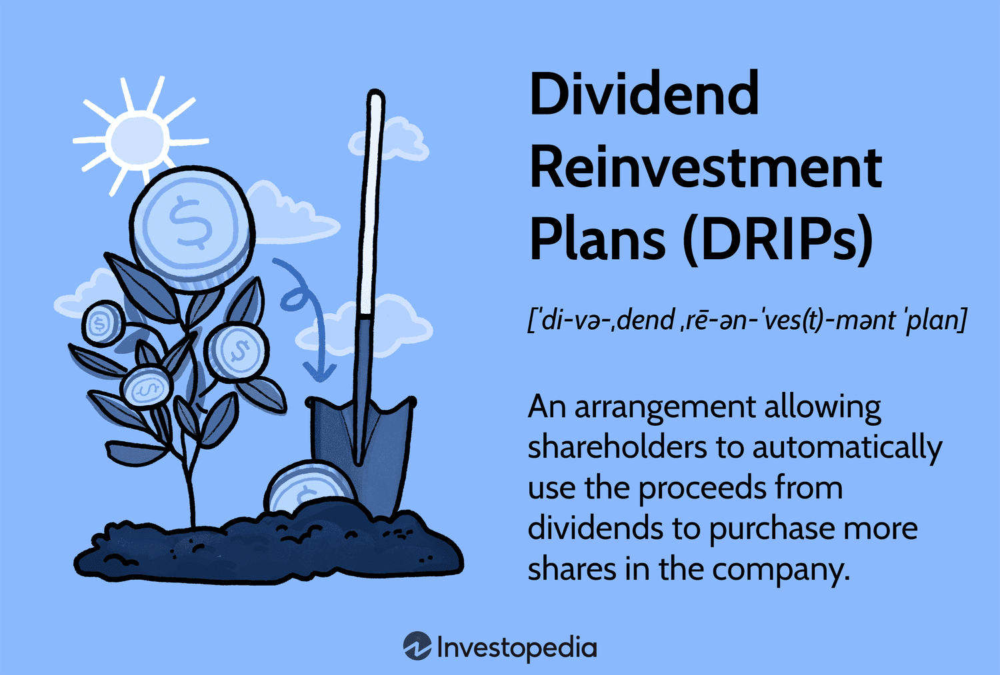

## Table of Contents

## What is a dividend?

A dividend is money that a company pays to its shareholders. When a company makes a profit, it can choose to share some of that profit with the people who own its stock. This payment is called a dividend. Shareholders usually receive dividends every three months, but some companies pay them more or less often.

Dividends are important because they give investors a regular income from their investments. This can be especially helpful for people who are retired and need money to live on. Not all companies pay dividends, though. Some companies, especially newer ones, might decide to use all their profits to grow the business instead of paying dividends.

## What is dividend reinvestment?

Dividend reinvestment is when you use the money you get from dividends to buy more shares of the same company instead of taking the cash. This can help your investment grow over time because you are using the dividends to own more of the company. Many companies offer a special plan called a Dividend Reinvestment Plan (DRIP) that makes it easy to do this automatically.

By reinvesting dividends, you can benefit from something called compounding. Compounding means that the more shares you own, the more dividends you get, and the more dividends you get, the more shares you can buy. Over many years, this can make your investment much bigger than if you had just taken the cash and spent it. It's like planting a seed and watching it grow into a big tree over time.

## Why should someone consider reinvesting dividends?

Someone should consider reinvesting dividends because it can help their investment grow bigger over time. When you reinvest dividends, you use the money to buy more shares of the company. This means you own a bigger piece of the company without spending any extra money. Over many years, this can make your investment much larger than if you just took the cash and spent it.

Reinvesting dividends also helps you benefit from something called compounding. Compounding is like a snowball rolling down a hill, getting bigger and bigger. The more shares you own, the more dividends you get, and the more dividends you get, the more shares you can buy. This cycle can make your investment grow a lot over time. It's a simple way to make your money work harder for you.

## How does dividend reinvestment work in practice?

When you choose to reinvest your dividends, the money you would normally get as a cash payment from the company is used to buy more shares of that same company. This happens automatically if you are part of a Dividend Reinvestment Plan (DRIP). Instead of getting a check in the mail or money in your bank account, the company uses your dividend money to buy more stock for you. This means you end up owning more shares without having to spend any extra money.

Over time, as you own more shares, you will get more dividends. This is called compounding. It's like a snowball that gets bigger as it rolls down a hill. The more shares you have, the more dividends you get, and the more dividends you get, the more shares you can buy. This cycle can help your investment grow a lot bigger over many years. It's a simple way to make your money work harder for you without doing anything extra.

## What are the tax implications of dividend reinvestment?

When you reinvest your dividends, you still have to pay taxes on them, just like if you got the money in cash. The IRS sees the dividends as income, so you need to report them on your tax return. The tax you pay depends on whether the dividends are qualified or non-qualified. Qualified dividends are taxed at a lower rate, like the rate for long-term capital gains. Non-qualified dividends are taxed at your regular income tax rate.

Even though you use the dividends to buy more shares, you still need to keep track of how much you got in dividends each year. This is important for your taxes. If you are in a Dividend Reinvestment Plan (DRIP), the company or the plan administrator will usually send you a tax form, like a 1099-DIV, that shows how much you got in dividends. You can use this form to fill out your tax return. Remember, reinvesting dividends can help your investment grow, but you still need to pay taxes on the dividends every year.

## Can dividend reinvestment be automated, and how?

Yes, dividend reinvestment can be automated through a Dividend Reinvestment Plan, often called a DRIP. When you sign up for a DRIP, the company takes the dividends you earn and automatically uses that money to buy more shares of the same company. You don't have to do anything; it all happens on its own. Many companies offer DRIPs, and you can usually sign up for them through their investor relations website or through your brokerage account.

Using a DRIP makes things easy because you don't need to remember to reinvest your dividends. It's a great way to grow your investment over time without any extra work. Just make sure you keep track of your dividends for tax purposes because you still need to pay taxes on them, even if you're reinvesting.

## What are the different types of dividend reinvestment plans (DRIPs)?

There are two main types of dividend reinvestment plans (DRIPs): company-operated DRIPs and broker-managed DRIPs. Company-operated DRIPs are run by the company itself. When you sign up for one of these, the company uses your dividends to buy more shares directly from them. This can sometimes be cheaper because there are no broker fees. You can usually sign up for a company-operated DRIP through the company's investor relations website.

Broker-managed DRIPs are handled by your brokerage firm. If you have a brokerage account, you can often set up a DRIP through the broker's platform. The broker will use your dividends to buy more shares of the company on the open market. This type of DRIP might have some fees, but it's convenient because you can manage all your investments in one place. Both types of DRIPs help you grow your investment over time by automatically reinvesting your dividends.

## How does compounding affect dividend reinvestment strategies?

Compounding can make your investment grow a lot bigger over time when you reinvest your dividends. Imagine you own shares in a company, and they pay you dividends. Instead of taking that money out, you use it to buy more shares. Now you have more shares, so the next time the company pays dividends, you get even more money. You use that money to buy even more shares. This cycle keeps going, and each time, you own a little bit more of the company. It's like a snowball rolling down a hill, getting bigger and bigger as it goes.

This is why compounding is so powerful in dividend reinvestment strategies. Over many years, the small amounts of money you reinvest can add up to a lot more than if you just took the cash. It's a simple way to make your money work harder for you without doing anything extra. Just keep reinvesting those dividends, and let compounding do its magic.

## What are the risks associated with dividend reinvestment?

One risk of dividend reinvestment is that the value of the company's stock might go down. If you keep buying more shares with your dividends, and the stock price drops, your investment could be worth less than you expected. It's like betting more money on something that might not work out. So, it's important to think about whether the company is doing well before you keep reinvesting.

Another risk is that you might not have the cash you need when you need it. When you reinvest your dividends, you're not getting that money in your pocket. If something unexpected happens and you need money, you might have to sell your shares instead. This can be a problem if the stock price is low at that time, because you'll get less money for your shares. So, it's good to think about whether you can afford to keep all your dividends in the stock, or if you need some of that money for other things.

## How can one evaluate the performance of a dividend reinvestment strategy?

To evaluate the performance of a dividend reinvestment strategy, you can look at how much your investment has grown over time. When you reinvest your dividends, you buy more shares of the company. This means you own a bigger piece of the company without spending extra money. Over many years, you can see if the total value of your shares has gone up. This includes both the price of the shares and the extra shares you got from reinvesting dividends. If the total value is higher than what you started with, your strategy is working well.

Another way to evaluate the performance is by comparing it to other investments. You can see if your dividend reinvestment strategy is doing better than if you had just taken the cash and spent it, or if you had invested in something else like a different stock or a savings account. If your reinvested dividends are helping your investment grow more than these other options, then your strategy is successful. It's important to keep track of your dividends and the growth of your shares to see if reinvesting is the right choice for you.

## What advanced techniques can be used to optimize dividend reinvestment?

One advanced technique to optimize dividend reinvestment is called dollar-cost averaging. This means you spread out your investments over time instead of putting all your money in at once. When you reinvest your dividends, you can use this technique by buying more shares regularly, no matter if the stock price is high or low. This can help you buy shares at a lower average price over time, making your investment grow more. It's like buying groceries on sale when you can, so you save money in the long run.

Another technique is to focus on companies with a history of increasing their dividends. These are called dividend growth stocks. When you reinvest dividends from these companies, your dividends keep getting bigger each year. This can make your investment grow even faster because you're buying more shares with bigger dividends. It's like getting a raise at work every year, so you can buy more with the extra money. By choosing the right companies and using these techniques, you can make your dividend reinvestment strategy work better for you.

## How do market conditions influence the effectiveness of dividend reinvestment strategies?

Market conditions can really change how well your dividend reinvestment strategy works. When the stock market is doing well, and stock prices are going up, your reinvested dividends can buy more shares at a higher price. This can make your investment grow faster because you're owning a bigger piece of a company that's doing well. But if the market is not doing so well, and stock prices are going down, your reinvested dividends will buy more shares at a lower price. This might seem good at first, but if the company's stock keeps going down, your investment could lose value.

It's also important to think about what's happening in the economy. In good economic times, companies usually make more money and might pay bigger dividends. This means you get more money to reinvest, which can help your investment grow. But in bad economic times, companies might cut their dividends or stop paying them altogether. If this happens, you won't have any dividends to reinvest, and your strategy might not work as well. So, keeping an eye on the market and the economy can help you understand how your dividend reinvestment strategy might perform.

## What is Understanding Dividend Reinvestment?

Dividend reinvestment plans (DRIPs) are a strategy employed by investors to grow their investment portfolios by reinvesting dividends received from a company's stock directly back into additional shares of the same company, rather than receiving them as cash. This approach allows investors to leverage the benefits of compounding, an essential principle in long-term investment strategies.

DRIPs offer a structured framework for accumulating wealth over time. Instead of manually purchasing additional shares, investors who participate in a company's DRIP have dividends automatically used to acquire more shares. This process often incurs little or no commission fees, reducing the overall transaction cost compared to purchasing shares through a broker. Additionally, some companies offer shares at a discount through their DRIP, further incentivizing participation.

The primary benefit of DRIPs lies in the power of compounding. When dividends are reinvested, future dividends are then calculated on a larger base of shares. Over time, this can result in exponential portfolio growth. For instance, if an investor owns 100 shares of a company that pays an annual dividend of 5% and opts to reinvest their dividends, they will own more than 100 shares at the end of the year without additional capital outlay. As the cycle continues, the shares and dividends grow, accelerating the portfolio's growth rate.

However, DRIPs are not without drawbacks, especially in fluctuating market conditions. During market downturns, reinvesting dividends might result in acquiring shares at lower prices, which could be beneficial in the long run if the market recovers. Conversely, in an overvalued market, automatic reinvestment could mean purchasing shares at a higher price, potentially reducing overall returns. Therefore, the timing of dividend reinvestment can impact the strategy's effectiveness, although this risk is partially mitigated by the dollar-cost averaging effect that DRIPs naturally provide.

The formula for calculating the future value of an investment with reinvested dividends is:

$$

FV = P \times (1 + r)^n + \sum_{k=1}^{n} D_k \times (1 + r)^{n-k} 
$$

where:
- $FV$ is the future value of the investment,
- $P$ is the initial principal invested,
- $r$ is the annual rate of return,
- $n$ is the number of years the money is invested,
- $D_k$ is the dividend received at year $k$.

Illustrating with a Python snippet, investors can evaluate potential portfolio growth with DRIPs:

```python
def future_value_with_drip(P, r, n, dividends):
    FV = P * (1 + r)**n
    for k in range(1, n + 1):
        FV += dividends[k-1] * (1 + r)**(n-k)
    return FV

initial_investment = 1000
annual_return = 0.05
years = 10
annual_dividends = [50] * years

fv = future_value_with_drip(initial_investment, annual_return, years, annual_dividends)
print(f"The future value of the investment is: ${fv:.2f}")
```

In summary, DRIPs enable investors to harness compounding effectively, facilitating significant portfolio growth over time. While they provide automated, low-cost reinvestment opportunities, investors need to be mindful of market conditions to maximize returns. Despite inherent market risks, DRIPs remain a valuable component of a diversified investment strategy.

## What are the best practices for maximizing returns?

Maximizing returns in a diversified investment strategy combining dividend reinvestment and algorithmic trading requires adherence to several best practices. These practices entail setting clear investment objectives, diligently monitoring and optimizing algorithms, and diversifying investment choices to mitigate risk.

### Setting Clear Investment Objectives and Defining Reinvestment Criteria

Establishing well-defined investment objectives is fundamental to a successful strategy. Investors should reference financial goals, risk tolerance, and timeline aspirations to set appropriate objectives. For instance, individuals nearing retirement may prioritize capital preservation and steady income over aggressive growth, whereas younger investors may focus on long-term capital accumulation.

Defining reinvestment criteria is similarly crucial in aligning with investment goals. This involves setting thresholds for transaction costs, targets for dividend yields, and stipulations on which dividends to reinvest. For example, reinvestment might occur only when dividend yields exceed a certain percentage, ensuring cost-effectiveness and alignment with the broader investment strategy.

### Regularly Monitoring and Optimizing Algorithms

Algorithmic trading systems require continuous monitoring and optimization to maintain efficiency and adaptability. Market conditions evolve, necessitating updates to algorithmic models to ensure strategies remain effective. Key activities here include [backtesting](/wiki/backtesting) with historical data, conducting sensitivity analyses, and implementing improvements based on performance metrics.

Algorithm optimization can occur through parameter adjustment and feature selection, or by leveraging machine learning to refine trading strategies. For example, genetic algorithms or reinforcement learning can be employed to enhance decision-making processes. Here's a simple example showcasing how machine learning might optimize a trading algorithm in Python using a reinforcement learning framework:

```python
import gym
import numpy as np

# Example of using reinforcement learning to learn optimal dividend reinvestment strategy
env = gym.make('StockTrading-v0')
state = env.reset()

for _ in range(1000):
    action = np.random.choice(env.action_space.n)  # Randomly choose an action
    next_state, reward, done, _ = env.step(action)
    if done:
        break
    state = next_state

env.close()
```

Optimization efforts should also include setting alerts for significant deviations in algorithm performance, ensuring timely intervention when necessary.

### Importance of Diversifying Investment Choices to Mitigate Risk

Diversification is a cornerstone of risk management in investment portfolios. By spreading investments across various asset classes, sectors, and geographical regions, it effectively reduces the impact of any single underperforming asset on overall portfolio returns. This approach enhances the stability of returns over time and lowers the volatility that can arise from concentrated positions. Classic portfolio theory, as encapsulated in the formula for portfolio variance, underlines this concept:

$$
\sigma_p^2 = \sum_{i=1}^{n} w_i^2 \sigma_i^2 + \sum_{i=1}^{n} \sum_{j \neq i} w_i w_j \text{Cov}(R_i, R_j)
$$

where $\sigma_p^2$ is the variance of the portfolio, $w_i$ is the weight of the $i$-th asset, $\sigma_i^2$ is the variance of the $i$-th asset, and $\text{Cov}(R_i, R_j)$ is the covariance between the returns of assets $i$ and $j$.

Diversification is not limited to asset types but also extends to strategy types. By combining algorithmic trading with dividend reinvestment plans (DRIPs), investors can benefit from the compounding effects of reinvestments alongside the rapid execution and data-driven decision-making prowess of algorithms.

In conclusion, a strategic focus on clear objective setting, meticulous algorithm optimization, and thoughtful diversification remains paramount for investors aiming to maximize their financial returns while minimizing exposure to risk.

## References & Further Reading

[1]: ["The Intelligent Investor"](https://en.wikipedia.org/wiki/The_Intelligent_Investor) by Benjamin Graham

[2]: ["Trading and Exchanges: Market Microstructure for Practitioners"](https://www.amazon.com/Trading-Exchanges-Market-Microstructure-Practitioners/dp/0195144708) by Larry Harris

[3]: Chan, Ernest P. ["Algorithmic Trading: Winning Strategies and Their Rationale"](https://github.com/ftvision/quant_trading_echan_book) 

[4]: Rosenthal, Lee, & Young, Mark. ["The Performance of Dividend Reinvestment Plans"](https://faculty.bentley.edu/profile/lrosenthal)

[5]: Gatheral, J. ["The Volatility Surface: A Practitioner's Guide"](https://www.amazon.com/Volatility-Surface-Practitioners-Guide/dp/0471792519)