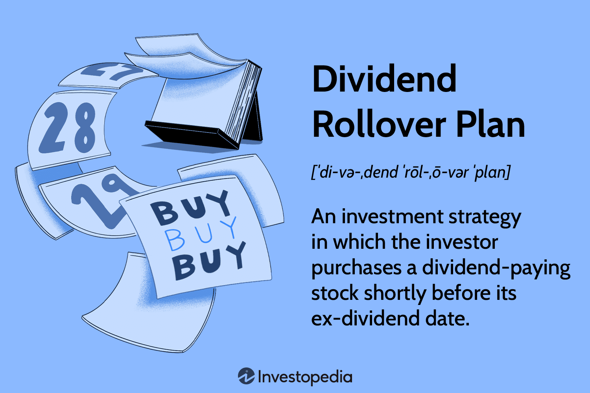

In today's digital age, financial strategies have evolved significantly, combining traditional methods with modern technology. This evolution has led to the development of a diverse range of investment strategies that aim to optimize returns while managing risk effectively. Among these, four strategies stand out for their potential to enhance portfolio performance: investment planning, rollover plans, dividend investing, and algorithmic trading.

Investment strategies play a vital role in achieving financial goals by dictating how assets are allocated and managed within a portfolio. Such strategies are essential for building wealth, ensuring long-term financial security, and adapting to changing market conditions. They incorporate core principles like diversification, risk management, and goal setting to align investments with the investor's financial objectives and risk tolerance.



Rollover plans are crucial for managing retirement funds optimally. They involve transferring funds from one retirement account to another, such as from a 401(k) to an Individual Retirement Account (IRA). This strategy allows individuals to benefit from continued tax deferral and streamlined management of retirement accounts, potentially enhancing their overall financial standing.

Dividend investing offers a steady stream of passive income by focusing on stocks that consistently pay dividends. This strategy not only provides income but also contributes to long-term wealth accumulation, making it an attractive option for investors seeking financial stability. Assessing key metrics like dividend yield, payout ratio, and dividend growth rate is essential for selecting the right dividend-paying stocks.

Algorithmic trading leverages computer algorithms to execute trades based on predefined criteria. This technologically advanced approach allows traders to analyze vast datasets and conduct transactions with precision and speed that exceed human capabilities. Benefits of algorithmic trading include reduced transaction costs, improved portfolio management, and minimized human error, making it a crucial tool for contemporary investors.

The interplay between these strategies can lead to a well-rounded approach to investing. By integrating rollover plans, dividend investing, and algorithmic trading, investors can cultivate a strategy that is both balanced and robust, catering to various financial objectives and risk profiles. The integration of traditional and modern investment methodologies signifies a new era in financial planning, opening avenues for maximizing investment potential in diverse economic climates.

## Table of Contents

## Understanding Investment Strategies

Investment strategies are key to building wealth and securing financial futures. These strategies, when effectively crafted and executed, can guide individuals and institutions towards achieving their financial objectives over varying time horizons. The foundation of an effective investment strategy is built upon several core principles: diversification, risk management, and setting clear financial goals.

**Diversification**

Diversification involves spreading investments across different asset classes, sectors, and geographies to reduce exposure to any single asset or risk. The underlying principle is that a diversified portfolio is less sensitive to market [volatility](/wiki/volatility-trading-strategies), as the poor performance of some investments can be offset by the good performance of others. Mathematically, diversification can be analyzed through the covariance or correlation between the returns of different assets. A low or negative correlation between asset returns typically leads to a more diversified and resilient portfolio.

**Risk Management**

Risk management is another pillar of investment strategies. It involves identifying, assessing, and prioritizing potential risks followed by the application of resources to minimize, control, and monitor the impact of such events. Techniques include asset allocation adjustments, the use of derivatives for hedging, and setting stop-loss orders in trading. The goal is to maximize returns while keeping risk within acceptable levels, aligning with the investor's risk tolerance.

Considerations of risk can be formalized through measures like Standard Deviation (a measure of volatility) and Value at Risk (VaR), which estimates the maximum loss within a given confidence interval. Employing these tools allows investors to quantify risk and adjust their portfolios accordingly.

**Setting Financial Goals**

Clear financial goals provide direction and purpose to investment strategies. These goals can be short-term, such as saving for a vacation, or long-term, like retirement planning. Establishing specific, measurable, achievable, relevant, and time-bound (SMART) objectives allows investors to map out a pathway to achieve these aims. Such goals should align with the investor's time horizon, risk appetite, and income requirements.

**Short-term Gains vs. Long-term Growth**

A well-crafted investment strategy considers both short-term gains and long-term growth. Short-term strategies might focus on capitalizing on market inefficiencies or short-lived opportunities, whereas long-term strategies aim for sustained appreciation through compounding returns. Balancing these components efficiently is vital for creating a comprehensive strategy that addresses immediate [liquidity](/wiki/liquidity-risk-premium) needs while securing future financial stability.

In conclusion, an understanding of these core principles is essential for constructing and maintaining an effective investment strategy. Incorporating diversification, risk management, and goal setting within a flexible framework allows investors to navigate the complexities of financial markets, ultimately achieving both short-term objectives and long-term prosperity.

## Exploring Rollover Plans

Rollover plans are a critical mechanism in retirement planning, facilitating the transfer of funds from one retirement account to another without incurring immediate tax liabilities. Such plans are particularly relevant for individuals transitioning between jobs or consolidating multiple retirement accounts, such as 401(k) plans, into a single Individual Retirement Account (IRA). The primary advantage of rollover plans is the continued tax deferral on the transferred assets, allowing investors to maintain their tax-deferred status and better manage retirement savings.

To initiate a rollover, account holders typically must execute a direct rollover, where funds are directly transferred from one financial institution to another, thus avoiding mandatory withholding taxes that are associated with indirect rollovers. In an indirect rollover, the account owner receives the funds and is obliged to deposit them into another retirement account within 60 days. Failure to complete this transfer within the stipulated period results in the distribution being subject to income tax, and potentially early withdrawal penalties if the individual is under 59½ years of age. To prevent such penalties, it is crucial to adhere to the IRS rules governing rollovers.

Furthermore, a successful rollover offers simplified management of retirement savings, consolidating multiple accounts into one can minimize administrative fees and enhance the oversight of asset allocation strategies. Additional benefits of rollover plans include the freedom to choose from a broader array of investment options typically available in IRAs compared to employer-sponsored plans, thus allowing for a more tailored investment strategy aligned with an individual's risk tolerance and retirement goals.

In recent years, digital platforms and financial advisory services have made the process of managing rollovers more accessible and efficient. These services provide tools for evaluating and executing rollovers while ensuring compliance with relevant regulations. As financial markets and regulations continue to evolve, staying informed about the intricacies of rollover plans remains essential for optimizing their benefits.

## Dividend Investing: A Strategy for Passive Income

Dividend investing is an investment strategy that prioritizes acquiring stocks from companies that consistently distribute a portion of their earnings to shareholders in the form of dividends. This approach aims to provide investors with a stable and reliable stream of passive income, which contributes to long-term wealth accumulation.

### Core Principles of Dividend Investing

1. **Dividend Yield**: This metric measures the ratio of a company's annual dividend payments to its share price, expressed as a percentage. It serves as an indicator of the income an investor can expect to receive relative to the stock price. The formula for dividend yield is given by:
$$
   \text{Dividend Yield} = \left( \frac{\text{Annual Dividends per Share}}{\text{Price per Share}} \right) \times 100

$$

   A higher dividend yield can indicate a more attractive income stream but may also imply potential risks, as it could signal a declining stock price or an unstable company.

2. **Payout Ratio**: This metric represents the proportion of a company’s earnings paid out as dividends to shareholders, reflecting the sustainability of the dividends. It is calculated using the formula:
$$
   \text{Payout Ratio} = \left( \frac{\text{Dividends per Share}}{\text{Earnings per Share}} \right) \times 100

$$

   A lower payout ratio suggests that a company retains more earnings for growth, indicating a potentially sustainable dividend policy. However, an excessively high payout ratio may raise questions about a company’s ability to maintain its dividend payments.

3. **Dividend Growth Rate**: This reflects the annualized percentage growth rate of a company's dividend payments over a given period. Consistent growth in dividends suggests a robust financial performance and management's confidence in future earnings. It can be expressed using the formula for the compound annual growth rate (CAGR):
$$
   \text{Dividend Growth Rate} = \left( \left( \frac{\text{Dividend at Year End}}{\text{Dividend at Year Start}} \right)^{\frac{1}{n}} - 1 \right) \times 100

$$

   Where $n$ represents the number of years over which the growth is measured.

### Benefits of Dividend Investing

Dividend investing provides a means for generating passive income, playing a critical role in enhancing an investor’s returns independently of market conditions. This income stream can be particularly valuable during market downturns when capital gains may be limited. Furthermore, reinvested dividends can compound over time, significantly boosting the overall value of an investment portfolio.

Investors seeking stability may gravitate toward dividend-paying stocks, which often belong to well-established companies with proven track records and predictable cash flows. Such investments are generally considered lower risk compared to non-dividend-paying stocks, although they are not completely immune to market volatility. 

### Strategic Considerations

When implementing a dividend-focused investment strategy, investors should carefully evaluate the sustainability and growth potential of a company’s dividends. This involves analyzing the financial health of the company, including its cash flow, debt levels, and industry positioning. Additionally, investors must consider tax implications, as dividend income may be subject to different tax treatment depending on jurisdiction.

Successful dividend investing requires ongoing monitoring and analysis to adapt to changes in company performance and broader economic conditions. Through informed decisions and strategic allocations, dividend investing can substantially contribute to passive income generation and long-term financial growth.

## Algorithmic Trading: Leveraging Technology

Algorithmic trading, commonly referred to as algo trading, leverages advanced computer algorithms to automate and execute financial trades at unprecedented speeds and efficiencies. These algorithms are designed to follow predefined criteria, allowing for the rapid analysis and execution of trade orders. With the ability to process large datasets in real-time, [algorithmic trading](/wiki/algorithmic-trading) significantly enhances decision-making processes by evaluating vast amounts of market data instantaneously, thereby identifying profitable opportunities that humans might overlook due to time constraints or cognitive limitations.

One of the primary advantages of algorithmic trading is its capacity to reduce transaction costs. By automating trades, it eliminates the need for manual intervention and, as a result, reduces the possibility of human error. Additionally, algorithms can execute trades at optimal prices by reacting instantaneously to market fluctuations, which minimizes slippage—the difference between the expected price of a trade and the actual price at which it is executed.

Moreover, algorithmic trading enhances portfolio management by enabling the execution of complex strategies that would be challenging to implement manually. These can include [arbitrage](/wiki/arbitrage) strategies, market-making, and trend-following systems. For instance, an arbitrage algorithm might be designed to exploit price discrepancies of a security in different markets, buying low in one market and simultaneously selling high in another. 

A basic algorithm might be written in Python as follows:

```python
import numpy as np

def moving_average_strategy(prices, window_size):
    moving_averages = np.convolve(prices, np.ones(window_size), 'valid') / window_size
    buy_signals = [(i + window_size, price) for i, price in enumerate(prices[window_size:]) if price > moving_averages[i]]
    sell_signals = [(i + window_size, price) for i, price in enumerate(prices[window_size:]) if price < moving_averages[i]]
    return buy_signals, sell_signals

# Example usage:
prices = [120, 122, 121, 119, 123, 125, 127, 126, 125, 128]
buy, sell = moving_average_strategy(prices, 3)
print("Buy signals:", buy)
print("Sell signals:", sell)
```

This simple moving average strategy generates buy and sell signals based on whether the current price is above or below the calculated moving average. While simplistic, it illustrates the fundamental logic behind many algorithmic trading strategies.

Another key benefit of algorithmic trading is its ability to minimize human error. Human traders are susceptible to cognitive biases and emotional decision-making, which can lead to suboptimal trades. In contrast, algorithms execute trades based purely on logical criteria, devoid of emotions such as fear or greed. This objectivity ensures that trades are executed consistently and according to the strategy’s defined parameters.

In conclusion, algorithmic trading represents a technological evolution in financial markets, providing traders with tools to optimize their trading strategies. By reducing transaction costs, enhancing portfolio management strategies, and minimizing human error, algorithmic trading embodies a significant advancement in achieving more efficient and effective trading outcomes.

## Implementing an Integrated Investment Approach

Combining rollover plans, dividend investing, and algorithmic trading offers a robust strategy that leverages the strengths of each approach to create a well-balanced investment portfolio. These strategies, when integrated, can offer both stability and growth potential, catering to varying risk appetites and investment objectives.

The integration of these strategies heavily relies on the role of technology. Modern investment platforms facilitate the seamless execution of these strategies, providing tools for analysis, trade execution, and portfolio management. Algorithmic trading, in particular, benefits from technological advancements, using sophisticated algorithms to optimize trade execution, thereby enhancing returns while minimizing costs. By utilizing platforms that support automation, investors can efficiently manage dividend portfolios, execute rollover plans, and conduct algorithmic trades in a cohesive manner.

Investors must tailor their approach to align with their risk tolerance, financial goals, and desired level of involvement in their investments. Rollover plans might be more suitable for those seeking tax advantages and long-term growth, whereas dividend investing appeals to those desiring passive income. Algorithmic trading attracts investors looking for dynamic trading opportunities and who are comfortable with technology-driven approaches.

A personalized investment strategy can integrate these components in varying proportions. For instance, an investor with a higher risk tolerance might allocate more capital to algorithmic trading, whereas a conservative investor might prefer a larger investment in dividend-paying stocks and stable rollover plans. The key is to maintain a balanced approach that aligns with individual preferences and objectives.

In summary, the successful implementation of an integrated investment approach requires an understanding of how each strategy functions independently and synergistically, as well as the prudent use of technological resources to streamline and manage investments effectively. Such an approach not only diversifies risk but also enhances the potential for maximizing investment returns over the long term.

## Conclusion: Maximizing Investment Potential

In the modern financial landscape, investors have a plethora of strategies at their disposal to optimize financial growth. By understanding and effectively implementing these diverse investment strategies, individuals can significantly enhance their potential for returns.

Rollover plans offer an efficient means of managing retirement accounts by providing the benefits of tax deferral and streamlined administration. These plans can help align retirement savings with long-term financial goals, mitigating the risk of penalties through informed handling.

Dividend investing stands as a reliable approach for generating passive income. By focusing on stocks that yield regular dividends, investors can build a consistent income stream that supports wealth accumulation. The strategy requires careful analysis of key metrics such as dividend yield, payout ratio, and dividend growth rate to ensure sustainable and favorable outcomes.

Algorithmic trading introduces the element of advanced technology into investment practices, allowing for swift and precise trade execution. By leveraging algorithms to analyze extensive datasets, traders can reduce transaction costs, improve portfolio management, and eliminate the human error [factor](/wiki/factor-investing). This method is particularly beneficial in volatile markets where quick decision-making is crucial.

Investors are increasingly combining these strategies to form a balanced investment portfolio that aligns with their risk tolerance and financial objectives. The integration of rollover plans, dividend investing, and algorithmic trading is facilitated by technological advancements, providing numerous platforms to efficiently manage and execute these strategies.

To maintain and evolve successful investment practices, ongoing education and adaptation to market changes are vital. By continuously updating their knowledge and strategies, investors can respond adeptly to shifting market dynamics and optimize their financial growth potential.

## References & Further Reading

[1]: Bengen, W. P. (1994). ["Determining Withdrawal Rates Using Historical Data."](https://www.financialplanningassociation.org/sites/default/files/2021-04/MAR04%20Determining%20Withdrawal%20Rates%20Using%20Historical%20Data.pdf) Journal of Financial Planning.

[2]: Bodie, Z., Kane, A., & Marcus, A. J. (2013). ["Investments."](https://www.mheducation.com/highered/product/Investments-Bodie.html) McGraw-Hill Education.

[3]: Fabozzi, F. J., & Markowitz, H. M. (2011). ["The Theory and Practice of Investment Management: Asset Allocation, Valuation, Portfolio Construction, and Strategies."](https://onlinelibrary.wiley.com/doi/book/10.1002/9781118267028) Wiley.

[4]: Lynch, P. (2000). ["One Up on Wall Street: How to Use What You Already Know to Make Money in the Market."](https://archive.org/details/oneuponwallstree00lync) Simon & Schuster.

[5]: O'Shaughnessy, J. P. (2005). ["What Works on Wall Street: A Guide to the Best-Performing Investment Strategies of All Time."](https://www.amazon.com/What-Works-Wall-Street-Fourth/dp/0071625763) McGraw-Hill Education.