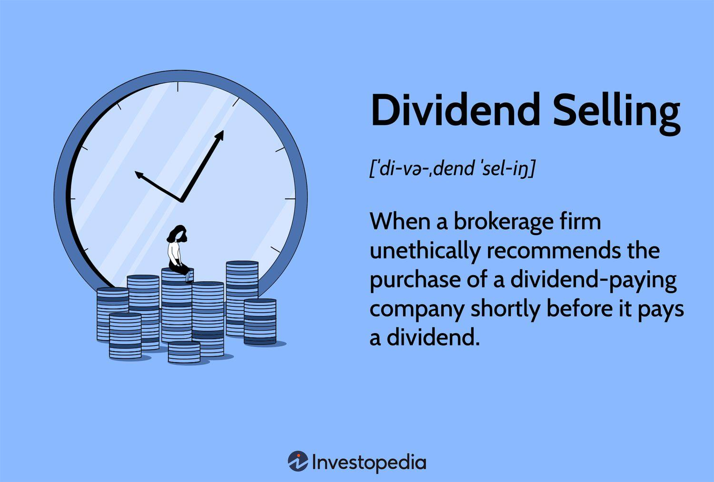

The landscape of stock market investments is rapidly evolving, driven largely by the advancements in technology and the emergence of innovative strategies. In contemporary financial markets, dividend investing and algorithmic trading are two strategies that have garnered significant attention. Each provides unique opportunities and benefits for investors. Dividend investing focuses on acquiring shares of companies that distribute a portion of their profits to shareholders, offering the dual advantage of regular income and potential capital appreciation. On the other hand, algorithmic trading utilizes computer algorithms to execute trades at speeds and frequencies impossible for a human trader. This method seeks to exploit market inefficiencies and trends through automation and quantitative analysis.

This article explores how dividend investing and algorithmic trading can be combined effectively to optimize investment performance. By understanding the core principles of dividend investing, along with the mechanics of algorithmic trading, investors can potentially create a synergistic strategy. The integration of these approaches offers the possibility of enhanced returns, risk management, and a more disciplined investment process.



The potential interplay between dividend investing and algorithmic trading represents a modern approach to investment management. As both fields continue to evolve, investors seeking to optimize their strategies need to stay informed about the latest developments and methodologies. This combination could not only appeal to those looking for steady income but also to traders aiming to capitalize on real-time market analytics for improved investment outcomes.

## Table of Contents

## Understanding Dividend Investing

Dividend investing involves acquiring shares in companies that distribute a portion of their profits to shareholders in the form of dividends. This strategy is particularly appealing to investors due to its dual potential for generating regular income and achieving capital growth. The regular payouts provide a cash flow stream, which can be especially beneficial in a low-interest-rate environment where yields from fixed-income products may be unattractive.

Key metrics in evaluating dividend stocks are the dividend yield and the payout ratio. The dividend yield is a financial ratio that shows how much a company pays out in dividends each year relative to its stock price. It is calculated as follows:

$$
\text{Dividend Yield} = \left( \frac{\text{Annual Dividends Per Share}}{\text{Price Per Share}} \right) \times 100
$$

A higher dividend yield indicates a potentially higher income, but it must be assessed relative to industry standards and historical performance, ensuring that it is sustainable. A very high yield might be a red flag, suggesting that the stock price has fallen or that the dividend may not be sustainable.

The payout ratio is another crucial parameter, measuring the proportion of earnings paid out as dividends. It is given by:

$$
\text{Payout Ratio} = \left( \frac{\text{Dividends Per Share}}{\text{Earnings Per Share}} \right) \times 100
$$

A moderate payout ratio suggests that a company retains sufficient earnings for reinvestment and growth while distributing a significant portion to shareholders. Companies with very high payout ratios might be at risk of cutting dividends, especially during financial stress, while very low payout ratios could suggest under-utilization of earnings.

Dividend-paying stocks are typically issued by financially sound companies, often characterized by stable cash flows and strong balance sheets. These companies, usually established with a track record of profitability, provide a degree of assurance to investors. They are often found in mature industries, such as utilities, consumer goods, and financial services, where growth rates might be lower, but business stability supports regular dividend payments.

Despite potential advantages, investors should conduct thorough due diligence. Market changes, economic cycles, and company-specific challenges can influence both the payout capacity and growth prospects of dividend stocks. Thus, understanding these aspects is critical in crafting a resilient dividend investment strategy.

## Exploring Algorithmic Trading

Algorithmic trading leverages computer algorithms, offering the capability to execute trades with speed and precision that surpasses human traders. At its core, this method involves using pre-defined rules or instructions to make trading decisions, which can be based on timing, price, quantity, or any other mathematical model. This automation minimizes human intervention, consequently reducing emotional bias and encouraging more disciplined, data-driven decision-making.

**Key Strategies**

Among the most prevalent strategies in [algorithmic trading](/wiki/algorithmic-trading) are trend-following, mean reversion, and [arbitrage](/wiki/arbitrage). Each targets distinct market scenarios and relies on different underlying assumptions:

1. **Trend-Following**: This strategy capitalizes on the belief that price movements tend to persist in a particular direction over time. Algorithms identify a trend from historical data and attempt to generate profits by riding the trend until signs of reversal appear.

2. **Mean Reversion**: Based on the principle that prices eventually revert to their historical averages, this strategy involves buying assets when prices are low and selling when they are high. Algorithms detect deviations from the mean, indicating potential trade opportunities.

3. **Arbitrage**: This involves exploiting price differentials of identical or similar financial instruments across different markets or forms. Algorithms quickly identify and capitalize on these inconsistencies, assuming negligible risk.

**Technical Requirements**

Successful algorithmic trading necessitates a robust understanding of programming languages such as Python, R, or C++. Traders often use Python due to its extensive libraries like NumPy and pandas for data manipulation, as well as SciPy and scikit-learn for quantitative analysis.

Here is a simple Python example for a moving average crossover strategy, a type of trend-following strategy:

```python
import pandas as pd

# Load historical data into a pandas DataFrame
data = pd.read_csv('stock_data.csv')

# Calculate moving averages
data['Short_MA'] = data['Close'].rolling(window=20).mean()
data['Long_MA'] = data['Close'].rolling(window=50).mean()

# Define buy and sell signals
data['Signal'] = 0
data.loc[data['Short_MA'] > data['Long_MA'], 'Signal'] = 1
data.loc[data['Short_MA'] < data['Long_MA'], 'Signal'] = -1

# Identify trade signals
data['Trade'] = data['Signal'].diff()
```

**Understanding Market Dynamics and Quantitative Analysis**

Beyond coding skills, a deep comprehension of market dynamics and quantitative analysis is vital. This includes understanding [liquidity](/wiki/liquidity-risk-premium), [volatility](/wiki/volatility-trading-strategies), and price formation processes within financial markets. Quantitative analysis enables traders to model and predict asset price movements, calculate risk metrics such as Value at Risk (VaR), and optimize portfolios using statistical methods. 

Algorithmic trading offers a sophisticated pathway to harness computational technologies and mathematical algorithms for strategic advantage in the stock market, but it requires a synthesis of programming knowledge and market acumen for successful implementation.

## Integration of Dividend Investing and Algorithmic Trading

The integration of dividend investing with algorithmic trading represents a sophisticated approach to portfolio management, combining the reliability of dividend returns with the technical advantages of automated trading systems. Algorithms in this context can be leveraged to streamline processes such as dividend reinvestments, where dividends received from stock holdings are automatically reinvested into the stock or potentially more lucrative opportunities. This automation enables consistent application of a reinvestment strategy without the need for manual intervention.

Moreover, algorithmic trading systems can be designed to assess the optimal timing for buy and sell decisions, taking into account market conditions, price trends, and dividend schedules. By using algorithms to parse through vast amounts of financial data, investors can identify patterns and predictions that may not be immediately visible to the human eye. For example, simple trading strategies like moving average crossovers can be enhanced by incorporating dividend metrics, allowing for a hybrid strategy that benefits from both price movements and steady income generation.

A fundamental benefit of using algorithms in dividend investing lies in the data-driven insights that can be systematically applied to manage risks and potentially improve returns. Investors can set specific parameters, such as acceptable price ranges or threshold dividend yields, to guide the algorithm's operations. This can increase the discipline in trading practices, reducing the impact of human emotion and bias that often affect investment decisions.

The integration of these strategies must account for the complexity involved in developing and maintaining efficient algorithms. Investors need to carefully weigh the costs, such as technology expenditures and transaction fees, against the anticipated benefits. Programming and [backtesting](/wiki/backtesting) these algorithms require both financial expertise and technical skills to ensure they align with investment goals. 

Although the potential for enhanced returns is significant, the strategy must be adaptable and continuously refined to reflect evolving market dynamics. This adaptability ensures that investors remain ahead of market trends and can adjust their strategies in response to new patterns or shifts in dividend policies. By successfully integrating dividend investing techniques within an algorithmic framework, investors can strike a balance between capital appreciation and income generation, thus optimizing their portfolios.

## Enhancing Investment Strategies with Technology

Utilizing technology for investment has become a pivotal strategy in modern finance, primarily through the application of algorithmic trading systems. These sophisticated tools automate investment processes, allowing for rapid execution and strategic adaptation to volatile market conditions. The efficiency of trading algorithms is significantly enhanced by their ability to rapidly adapt to market changes without the hesitations often induced by human emotions.

A popular methodology in this domain is employing Python programming to develop and implement algorithmic trading strategies. Python is favored due to its extensive libraries and frameworks that support data analysis, financial modeling, and [machine learning](/wiki/machine-learning), such as Pandas, NumPy, and Scikit-learn. These tools enable investors to create bespoke algorithms designed to identify optimal market opportunities while managing risk efficiently.

For instance, a basic Python script can be designed to track moving averages or RSI (Relative Strength Index) indicators for particular dividend stocks:

```python
import pandas as pd
import yfinance as yf  # For more datasets, visit: https://paperswithbacktest.com/datasets

# Fetch data for a given stock
data = yf.download('AAPL', start='2020-01-01', end='2023-01-01')

# Calculate moving averages
data['MA20'] = data['Close'].rolling(window=20).mean()
data['MA50'] = data['Close'].rolling(window=50).mean()

# Simple buy signal
data['Signal'] = 0
data['Signal'][data['MA20'] > data['MA50']] = 1

# Check for buy signals
buy_signals = data[data['Signal'] == 1]
```

In this example, the algorithm identifies potential buy signals when the short-term moving average exceeds the long-term moving average, a common strategy known as a moving average crossover.

Continuous review and optimization are crucial for maintaining the efficacy of these algorithms. Market conditions can shift rapidly, rendering previously effective strategies obsolete. Investors must, therefore, regularly recalibrate their algorithms to ensure they remain consistent with current market trends. This may involve backtesting against historical data to refine the strategy or integrating real-time data feeds to ensure decisions are based on the latest market information.

In summary, the integration of advanced technology in investment not only improves the execution speed and accuracy of trading strategies but also provides a robust framework for adapting to the ever-changing landscape of financial markets. By incorporating cutting-edge tools and continuously updating their algorithms, investors are better positioned to maximize the potential of their investment strategies and achieve advantageous financial outcomes.

## Risks and Considerations

Both dividend investing and algorithmic trading are associated with inherent risks largely influenced by market dynamics and operational complexities.

Market Volatility: One major risk linked to these investment strategies is market volatility. The stock market is inherently volatile, and fluctuations can impact both dividend returns and algorithmic trades. For dividend investors, market volatility may lead to unstable dividend yields and potential cuts by companies during economic downturns. Algorithmic trading, while designed to leverage quick market movements, can suffer during sudden market changes when algorithms fail to adapt swiftly.

Reliance on Data Accuracy: Technological reliance in algorithmic trading necessitates precise data inputs. The efficacy of algorithmic models is highly dependent on the accuracy and timeliness of data feeds. Errors or latency in data can lead to incorrect trade executions and potential financial loss. Furthermore, data inaccuracies can misinform dividend yield calculations, leading investors to make flawed decisions regarding stock purchases.

Algorithm Testing and Monitoring: Thorough testing of algorithms is crucial to mitigate financial risks. Algorithms must undergo rigorous backtesting using historical data and be subjected to different market scenarios to understand their performance dynamics. Regular monitoring ensures that algorithms remain aligned with intended strategies. A poorly designed or unchecked algorithm can incur significant losses, highlighting the importance of routine assessments and adjustments.

Regulatory and Tax Implications: Investors need to be aware of regulatory frameworks governing the markets where they operate. Trading and dividend policies vary across jurisdictions, affecting both algorithmic trading practices and dividend taxation. Compliance with market regulations and understanding tax obligations of dividend gains is essential to avoid legal repercussions and optimize post-tax returns.

Risk Tolerance and Investment Objectives: It is pivotal for investors to evaluate their risk tolerance and align it with their investment strategies. Those opting for the integration of dividend investing and algorithmic trading should have a clear understanding of their financial goals and the risks they are willing to undertake. Investment objectives should guide the choice of algorithms, dividend stock selections, and overall portfolio structuring, ensuring adherence to personal financial targets and risk profiles. 

In summary, while the combination of dividend investing and algorithmic trading presents opportunities for enhanced investment outcomes, understanding and managing the associated risks are crucial for sustained financial success.

## Conclusion

The fusion of dividend investing with algorithmic trading represents a modern approach to optimizing stock market investments. By integrating these strategies, investors can potentially benefit from the advantages each offers—steady income from dividends and precise execution from algorithmic trading. It is important to understand both disciplines comprehensively to harness their full potential, as they each bring unique complexities.

Investors who adopt this combined strategy must remain adaptable to technological advancements and ever-changing market conditions. As algorithmic trading relies heavily on automation and data analysis, staying updated with the latest technologies and market data is crucial for maintaining a competitive edge. Efficiently combining these strategies requires testing and refining algorithms to ensure they align with investment goals and adapt to dynamic market environments.

Ultimately, the goal is to achieve a balance between risk and reward. While the anticipation of superior returns is enticing, it requires a disciplined approach in managing both the stability offered by dividends and the agility provided by algorithmic trading. By leveraging technology effectively, investors aim to enhance their financial outcomes and minimize risks, creating a more robust and responsive investment portfolio.

## References & Further Reading

1. **Books on Dividend Investing and Algorithmic Trading:**
   - "The Intelligent Investor" by Benjamin Graham: This classic book offers insights into value investing principles, which include dividend investing basics.
   - "Quantitative Trading: How to Build Your Own Algorithmic Trading Business" by Ernie Chan: A thorough introduction to algorithmic trading, suitable for new and experienced traders.
   - "Dividend Growth Investing: Get Rich Buying and Holding" by Derek Foster: This book specifically focuses on the strategy of investing in dividend-growth stocks.
   - "Algorithmic Trading: Winning Strategies and Their Rationale" by E.P. Chan: Explains various strategies used in algorithmic trading including statistical arbitrage and market-making.

2. **Academic Papers and Studies:**
   - "Dividend policy: A review of theories and empirical evidence", by Allen and Michaely (2003), which examines the role of dividend-paying stocks in portfolio performance.
   - "High Frequency Trading and Price Discovery", by Jonathan A. Brogaard, Terrence Hendershott, and Ryan Riordan: This paper discusses the implications of algorithmic trading in terms of market efficiency and liquidity.
   - "Algorithmic Trading and Information" by Terrence Hendershott, Charles Jones, and Albert Menkveld, provides insights into how algorithmic trading affects the information environment of financial markets.

3. **Online Courses and Programming Resources:**
   - [Coursera: Machine Learning for Trading by Georgia Tech](https://www.coursera.org/learn/machine-learning-trading): Offers comprehensive training on how to implement machine learning in trading strategies, including dividend investment analysis.
   - [edX: Python for Data Science](https://www.edx.org/course/python-for-data-science): Essential for programming skills needed in algorithmic trading.
   - [OpenCourseWare - MIT: Introduction to Algorithms](https://ocw.mit.edu/courses/electrical-engineering-and-computer-science/6-006-introduction-to-algorithms-fall-2011/): Provides foundational knowledge beneficial for developing trading algorithms with Python or other programming languages.

4. **Websites and Articles:**
   - [Investopedia Dividend Articles](https://www.investopedia.com/dividends-4427762): Offers a wide range of articles explaining the basics and complexities of dividend investing.
   - [QuantStart: Algorithmic Trading Articles](https://www.quantstart.com/articles/): Provides detailed guides on setting up algorithmic trading systems, including various quantitative strategies.
   - [Khan Academy: Finance and Capital Markets](https://www.khanacademy.org/economics-finance-domain/core-finance/stock-and-bond): Offers excellent free resources to understand the foundational concepts of stock markets, including dividend policies.

These resources provide a comprehensive framework for understanding and implementing strategies in dividend investing and algorithmic trading, advancing your knowledge and practical skills in the stock market domain.

