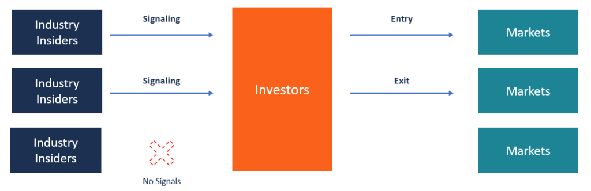

## Table of Contents

## What is Dividend Signaling Theory?

Dividend Signaling Theory is an idea in finance that says when a company changes its dividend payments, it's sending a message to investors about its future. If a company increases its dividends, it might be telling investors that it expects to do well in the future. On the other hand, if a company cuts its dividends, it might be signaling that it's facing some challenges or expects lower profits.

This theory is important because it helps investors make decisions. When investors see a change in dividends, they try to figure out what the company is trying to say. For example, if a company raises its dividends, investors might buy more of its stock, thinking the company will do well. But if dividends are cut, investors might sell their stock, worried about the company's future. So, dividend changes can really affect how people see and act towards a company's stock.

## How does Dividend Signaling Theory relate to a company's financial health?

Dividend Signaling Theory connects directly to a company's financial health because changes in dividends can tell us about how the company is doing. When a company decides to increase its dividends, it's often a sign that it's feeling good about its financial future. It's like the company is saying, "We're doing well, and we expect to keep doing well, so we can share more profits with our shareholders." This can make investors feel more confident and might even make the company's stock price go up because people want to invest in a company that's doing well.

On the flip side, if a company cuts its dividends, it might be a warning sign about its financial health. It could mean the company is facing some money troubles or expects lower profits in the future. When investors see a dividend cut, they might start to worry and could decide to sell their shares, which might cause the stock price to drop. So, by looking at how a company changes its dividends, we can get a clue about whether it's financially healthy or if it's going through a rough patch.

## Can you explain the concept of dividend signaling with a simple example?

Imagine a small bakery called "Sweet Treats" that has been doing well for the past few years. The owners decide to increase the dividend they pay to their shareholders from $1 per share to $1.50 per share. This change sends a signal to the shareholders that "Sweet Treats" is expecting to keep making good profits in the future. The shareholders see this as good news and feel more confident about the bakery's future, so they might decide to buy more shares or hold onto the ones they have.

Now, let's say a year later, "Sweet Treats" starts facing some challenges. Maybe the cost of ingredients goes up, or fewer people are coming into the bakery. The owners then decide to cut the dividend back to $1 per share. This action signals to the shareholders that the bakery might not be doing as well as before. Some shareholders might get worried about the bakery's future and decide to sell their shares, thinking it's a good idea to get out before things get worse.

## What are the key assumptions behind Dividend Signaling Theory?

Dividend Signaling Theory is based on the idea that company leaders know more about their business than investors do. When these leaders change the dividends, they're trying to share some of that inside information with investors. The theory assumes that if a company increases its dividends, it's because the leaders believe the company will keep making good profits in the future. They're confident enough to share more money with shareholders.

On the other hand, if a company cuts its dividends, the theory assumes it's because the leaders are worried about the company's future profits. They might be facing some challenges and need to keep more money in the business. Investors pay close attention to these changes because they believe the leaders are giving them important clues about what's going on inside the company.

## How do investors interpret changes in dividend policies according to this theory?

When a company decides to increase its dividends, investors see it as good news. They think the company's leaders are saying, "We're doing well and expect to keep doing well." This makes investors feel more confident about the company's future. They might decide to buy more shares or keep the ones they have, hoping the company will keep doing well and the stock price will go up.

On the other hand, if a company cuts its dividends, investors might get worried. They think the company's leaders are signaling that the business might not be doing as well as before. This can make investors nervous about the company's future profits. Some might decide to sell their shares, thinking it's better to get out before things get worse. So, changes in dividend policies can really influence what investors think and do.

## What are the potential limitations or criticisms of Dividend Signaling Theory?

One big problem with Dividend Signaling Theory is that it assumes that when a company changes its dividends, it's always trying to send a clear message about its future. But sometimes, companies change dividends for other reasons that don't have anything to do with their future profits. For example, a company might cut its dividends to save money for a big project, not because it's in trouble. So, investors might get the wrong idea if they always think a dividend change is a signal about the company's health.

Another criticism is that not all investors pay attention to dividend changes in the same way. Some investors might not care about dividends at all and focus more on other things like the company's growth or its stock price. Also, different investors might interpret the same dividend change differently. What one investor sees as a good sign, another might see as a warning. This means that the signals sent by dividend changes might not be as clear or useful as the theory suggests.

## How does Dividend Signaling Theory differ from other dividend theories, such as the Dividend Irrelevance Theory?

Dividend Signaling Theory and Dividend Irrelevance Theory have different ideas about what dividend changes mean. Dividend Signaling Theory says that when a company changes its dividends, it's trying to send a message to investors about its future. If a company increases its dividends, it might be saying it expects to do well, and if it cuts dividends, it might be warning about tough times ahead. Investors watch these changes closely because they think they can learn something important about the company's health from them.

On the other hand, Dividend Irrelevance Theory, which was proposed by economists Modigliani and Miller, says that changes in dividends don't really matter to a company's value. They believe that whether a company pays high dividends or low dividends, or even no dividends at all, it doesn't change how much the company is worth. According to this theory, what really matters is how well the company is doing overall, not how it decides to share its profits with shareholders. So, while Dividend Signaling Theory sees dividend changes as important signals, Dividend Irrelevance Theory thinks they're not that big of a deal.

## Can you provide a real-world example where Dividend Signaling Theory was evident in a company's actions?

In 2012, Microsoft decided to increase its dividend from $0.20 per share to $0.28 per share. This was a big deal because it was the first time in 16 years that Microsoft had raised its dividend. Investors saw this as a signal that Microsoft was feeling good about its future. They thought the company was saying, "We're doing well and expect to keep doing well." This made investors feel more confident, and many decided to buy more Microsoft stock or keep the shares they already had.

A few years later, in 2014, Microsoft announced another dividend increase, this time from $0.28 to $0.31 per share. Again, investors took this as a positive sign. They believed Microsoft was still confident about its future and expected to keep making good profits. These dividend increases helped boost investor confidence and showed how Microsoft was using dividend changes to signal its strong financial health and positive outlook.

## What role does asymmetric information play in Dividend Signaling Theory?

Asymmetric information is a big part of Dividend Signaling Theory. It means that the people running a company know more about how the business is doing than the investors do. When a company changes its dividends, it's like the leaders are trying to share some of their inside knowledge with the investors. If a company raises its dividends, it might be telling investors, "We think we're going to do well in the future." But if a company cuts its dividends, it might be warning, "We're facing some challenges."

This sharing of information is important because it helps investors make better decisions. When investors see a dividend change, they try to figure out what the company is saying about its future. If they believe the signal, they might buy more stock if dividends go up or sell some if dividends go down. So, asymmetric information is what makes dividend changes a useful way for companies to communicate with their investors about their financial health and future expectations.

## How can Dividend Signaling Theory be used to predict future company performance?

Dividend Signaling Theory can help investors guess how a company might do in the future by looking at changes in its dividends. When a company decides to increase its dividends, it's like they're telling investors, "We're doing well and expect to keep doing well." This makes investors think the company will keep making good profits. For example, if a company raises its dividends, investors might decide to buy more of its stock, hoping the company will keep doing well and the stock price will go up.

On the other hand, if a company cuts its dividends, it might be a warning sign that the company is facing some challenges or expects lower profits in the future. When investors see a dividend cut, they might start to worry and could decide to sell their shares, thinking it's a good idea to get out before things get worse. By watching how a company changes its dividends, investors can get a clue about whether the company is likely to do well or face tough times ahead.

## What are the implications of Dividend Signaling Theory for corporate governance?

Dividend Signaling Theory has big implications for how companies are run. When a company's leaders decide to change the dividends, they need to think carefully about what message they're sending to investors. If they raise dividends, they're telling investors that the company is doing well and expects to keep doing well. This can make investors feel more confident and might even help the company's stock price go up. But if leaders cut dividends, they might be signaling that the company is facing some challenges. This can make investors worried and might cause the stock price to drop. So, leaders need to make sure their dividend decisions match what's really going on inside the company.

This theory also means that company leaders need to be honest and clear in their communication. If they use dividend changes to send signals about the company's future, they need to make sure those signals are true. If investors find out that the signals were misleading, they might lose trust in the company's leaders. This can hurt the company's reputation and make it harder to attract investors in the future. So, good corporate governance means being open and honest with investors, especially when it comes to important decisions like changing dividends.

## How have empirical studies tested the validity of Dividend Signaling Theory, and what are their findings?

Empirical studies have tried to check if Dividend Signaling Theory is true by looking at what happens to a company's stock price and future earnings after it changes its dividends. Researchers often look at data from many companies over a long time to see if there's a pattern. They might compare what happens to the stock prices of companies that increase their dividends with those that cut them. They also look at how well these companies do in the years after the dividend change to see if the signals they sent were accurate.

The findings from these studies have been mixed. Some studies have found that when a company raises its dividends, its stock price often goes up, and the company usually does well in the future. This supports the idea that dividend increases are a good signal. But other studies have shown that dividend cuts don't always mean a company will do badly. Sometimes, a company might cut dividends for other reasons, like saving money for a big project, and still do well later. So, while some evidence supports Dividend Signaling Theory, it's not a perfect way to predict a company's future performance.

## What is Understanding Dividend Signaling?

Dividend signaling is a theory that posits that changes in a company's dividend policy can predict future financial health and performance. This theory stems from the belief that dividends convey information about a company's profitability and stability that other financial statements may not fully capture.

**Key Concepts:**

1. **Dividend Yield:** This is a financial ratio that shows how much a company pays out in dividends each year relative to its stock price. It is calculated as:
$$
   \text{Dividend Yield} = \frac{\text{Annual Dividends per Share}}{\text{Price per Share}}

$$

   A high dividend yield could indicate a potentially undervalued stock, while a low yield might suggest overvaluation or a focus on growth and reinvestment rather than disbursement of earnings.

2. **Payout Ratio:** This ratio indicates what proportion of earnings a company is paying out as dividends to shareholders. It is calculated as:
$$
   \text{Payout Ratio} = \frac{\text{Dividends per Share}}{\text{Earnings per Share}}

$$

   A low payout ratio suggests that a company is reinvesting most of its earnings back into operations, possibly signaling growth, whereas a high payout ratio may indicate a mature company with stable earnings.

3. **Growth:** This concept pertains to how dividend changes reflect a company’s long-term growth prospects. Consistent increase in dividends is often taken as a signal by management of sustained earning power, while a cut or irregularity in dividends could indicate financial distress or a shift in strategic focus.

**Empirical Evidence:**

The dividend signaling theory draws mixed empirical support. Several studies conclude that dividend announcements, increases, or cuts provide significant information that can affect a company's stock price. For instance, a 2015 study by Michaely, Thaler, and Womack found that dividend initiations and omissions [carry](/wiki/carry-trading) information about future [earning](/wiki/earning-announcement) changes and, consequently, stock prices.

However, opposing evidence takes the view that dividend changes might not always signal future profitability or that their informational content may not be as significant as contended. Critics argue that other factors, such as market trends or macroeconomic conditions, could equally influence dividend policy changes without directly reflecting a company’s operational performance.

To illustrate, companies like Coca-Cola and Lowe’s are often examined due to their long-standing track record of consistent dividend payments, which many investors interpret as signals of solid financial health and stability.

This variance in empirical findings underscores the complexity of market perceptions and investor interpretations. While dividend signaling can offer insights into company valuations, it is clear that other financial indicators and market conditions must also be factored into any comprehensive investment decision-making process.

## References & Further Reading

[1]: Michaely, R., Thaler, R. H., & Womack, K. L. (1995). ["Price Reactions to Dividend Initiations and Omissions: Overreaction or Drift?"](https://www.jstor.org/stable/2329420) Journal of Finance, 50(2), 573-608.

[2]: Miller, M. H., & Modigliani, F. (1961). ["Dividend Policy, Growth, and the Valuation of Shares."](https://www.semanticscholar.org/paper/DIVIDEND-POLICY%2C-GROWTH%2C-AND-THE-VALUATION-OF-Miller-Modigliani/a1311751c645153306dcdeadd1821708ffa595e6) The Journal of Business, 34(4), 411-433.

[3]: Holland, J. (2015). ["Machine Learning in Asset Management—Part I: Portfolio Construction—Forecasting Returns and A Plausibility Framework."](https://www.healthcare4ppl.com/physician/wisconsin/sheboygan/lindsay-connon-1811474604.html) ArXiv preprint arXiv:1810.09948.

[4]: Marcos López de Prado (2018). ["Advances in Financial Machine Learning."](https://www.amazon.com/Advances-Financial-Machine-Learning-Marcos/dp/1119482089) Wiley.

[5]: Chan, E. P. (2009). ["Quantitative Trading: How to Build Your Own Algorithmic Trading Business."](https://github.com/ftvision/quant_trading_echan_book) Wiley.

[6]: Jansen, S. (2020). ["Machine Learning for Algorithmic Trading."](https://github.com/stefan-jansen/machine-learning-for-trading) Packt Publishing.