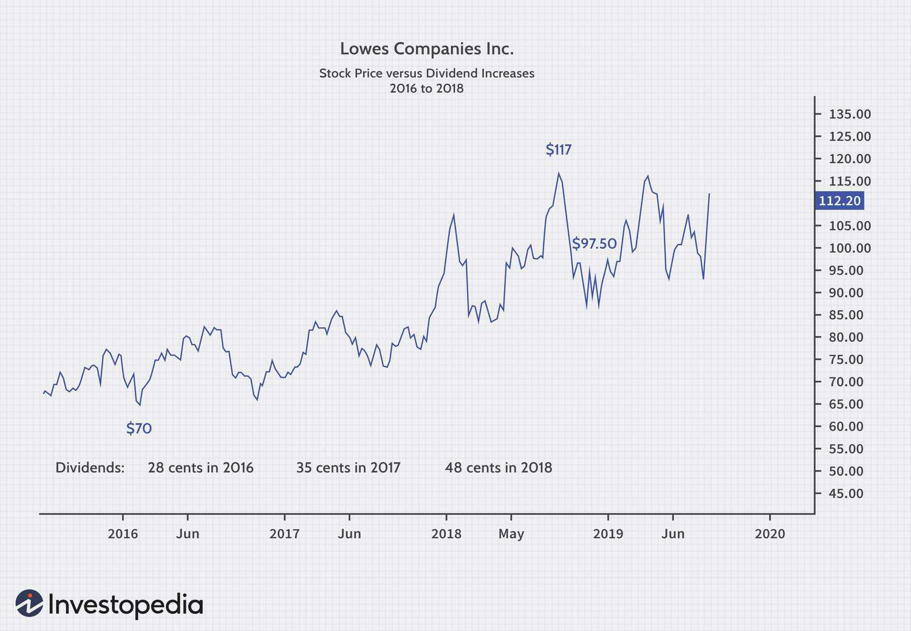

Investment strategies are continuously advancing as new financial theories and technological solutions emerge. These developments are particularly evident at the intersection of dividend signaling, financial theory, and algorithmic trading. Dividend signaling, a financial theory, proposes that changes in dividends can be indicative of a company's future financial health and prospects. This concept is built on the premise that management possesses more information about a company's future earnings than investors, and thus uses dividend changes as a communication tool.

Financial theories related to dividends include foundational concepts such as the Dividend Irrelevance theory by Miller and Modigliani, which suggests that under perfect market conditions, dividend policy does not affect a company's valuation. However, real-world market imperfections and investor behaviors significantly influence how dividends are perceived and how they affect investment decisions. Understanding these financial principles allows investors to better navigate the nuances of dividend signaling and yields insights into corporate management's strategic decision-making.



Algorithmic trading further revolutionizes investment strategies by leveraging technology to execute trades with speed and precision unattainable by human traders alone. By utilizing sophisticated algorithms, investors can perform extensive analyses and backtest strategies, thereby optimizing their dividend-focused investment portfolios. The integration of algorithmic trading with dividend signaling represents a powerful combination, enabling investors to forecast dividend changes and evaluate potential investments more effectively.

The convergence of these elements—dividend signaling, financial theory, and algorithmic trading—not only fosters innovative investment strategies but also presents new opportunities to enhance portfolio performance. This synthesis provides a sophisticated toolkit for investors seeking to capitalize on dividend policies and market inefficiencies while utilizing the precision and speed of modern trading technologies. Such a holistic approach to investment promises to redefine portfolio management in the current financial landscape.

## Table of Contents

## Understanding Dividend Signaling

Dividend signaling is a theory that posits that changes in a company's dividend policy can predict future financial health and performance. This theory stems from the belief that dividends convey information about a company's profitability and stability that other financial statements may not fully capture.

**Key Concepts:**

1. **Dividend Yield:** This is a financial ratio that shows how much a company pays out in dividends each year relative to its stock price. It is calculated as:
$$
   \text{Dividend Yield} = \frac{\text{Annual Dividends per Share}}{\text{Price per Share}}

$$

   A high dividend yield could indicate a potentially undervalued stock, while a low yield might suggest overvaluation or a focus on growth and reinvestment rather than disbursement of earnings.

2. **Payout Ratio:** This ratio indicates what proportion of earnings a company is paying out as dividends to shareholders. It is calculated as:
$$
   \text{Payout Ratio} = \frac{\text{Dividends per Share}}{\text{Earnings per Share}}

$$

   A low payout ratio suggests that a company is reinvesting most of its earnings back into operations, possibly signaling growth, whereas a high payout ratio may indicate a mature company with stable earnings.

3. **Growth:** This concept pertains to how dividend changes reflect a company’s long-term growth prospects. Consistent increase in dividends is often taken as a signal by management of sustained earning power, while a cut or irregularity in dividends could indicate financial distress or a shift in strategic focus.

**Empirical Evidence:**

The dividend signaling theory draws mixed empirical support. Several studies conclude that dividend announcements, increases, or cuts provide significant information that can affect a company's stock price. For instance, a 2015 study by Michaely, Thaler, and Womack found that dividend initiations and omissions [carry](/wiki/carry-trading) information about future [earning](/wiki/earning-announcement) changes and, consequently, stock prices.

However, opposing evidence takes the view that dividend changes might not always signal future profitability or that their informational content may not be as significant as contended. Critics argue that other factors, such as market trends or macroeconomic conditions, could equally influence dividend policy changes without directly reflecting a company’s operational performance.

To illustrate, companies like Coca-Cola and Lowe’s are often examined due to their long-standing track record of consistent dividend payments, which many investors interpret as signals of solid financial health and stability.

This variance in empirical findings underscores the complexity of market perceptions and investor interpretations. While dividend signaling can offer insights into company valuations, it is clear that other financial indicators and market conditions must also be factored into any comprehensive investment decision-making process.

## Financial Theory behind Dividend Signaling

The concept of dividend signaling is deeply rooted in financial theory, with several seminal theories providing foundational insights. One of the key theories is the Dividend Irrelevance Theory proposed by Franco Modigliani and Merton Miller in 1961. Their proposition, known as the MM Theory, asserts that in a perfect capital market—where there are no taxes, transaction costs, or informational asymmetries—dividend policy is irrelevant to a firm's value. According to this theory, investors are indifferent to whether they receive returns in the form of dividends or capital gains. The firm's value is determined by its earning power and risk of its underlying assets, not by how it distributes its earnings.

However, real-world markets are not perfect and present several imperfections that challenge the irrelevance proposition. Market imperfections include taxes, asymmetric information, agency costs, and transaction costs which play a significant role in shaping dividend policies. For instance, due to differential tax treatment, dividends can be taxed more heavily than capital gains, which might disincentivize firms from paying out dividends. Investors might also interpret dividend announcements as signals from management about the firm’s future prospects. This is especially relevant in cases where there exists asymmetric information between management and investors.

Investor behavior also significantly influences dividend policies. Behavioral finance suggests that investors have preferences and biases affecting how they perceive dividends. Some investors might prefer regular income through dividends (the so-called dividend clientele effect), while others might view dividend declarations as a signal of a firm’s health and future performance.

Game theory further enhances the understanding of management decisions regarding dividends. In game theoretical terms, the interaction between company management and investors can be seen as a strategic game where each party has its own strategies, payoffs, and information sets. The management, acting as a 'player' in this game, might make dividend decisions not only based on the firm’s financial health but also on investor expectations and reactions. A classic application of game theory in dividend policy is the signaling game, where management chooses a dividend policy to signal private information to the market. For example, increasing dividends might be used as a signal to indicate strong future cash flows, whereas a cut might signal caution.

In summary, while the Dividend Irrelevance Theory lays a foundational understanding of dividend policy under certain assumptions, the presence of market imperfections and investor behavior patterns necessitate a more nuanced analysis. Game theory offers important insights into how these interactions unfold, providing a structured framework to understand management decisions regarding dividends.

## Algorithmic Trading in Dividend Investment Strategies

Algorithmic trading, often referred to as algo trading, represents a paradigm shift in the financial world, leveraging computer algorithms to automate trading decisions and executions based on predetermined sets of rules. This form of trading is distinguished by its advantages in speed and precision, as it circumvents the limitations of human intervention, allowing for the rapid execution of trades and the ability to process vast datasets in real-time. These capabilities are particularly beneficial in the context of dividend investment strategies, where timing and accuracy are of the essence.

In dividend investment strategies, [algorithmic trading](/wiki/algorithmic-trading) enhances the analytical and execution process through advanced [backtesting](/wiki/backtesting) and real-time execution. Backtesting is the process of testing a trading strategy on historical data to evaluate its viability before actual execution. By utilizing extensive historical data, algorithms can simulate trades based on dividend policy changes, thus enabling investors to identify patterns and predict future movements. This ability to iteratively test and refine strategies ensures that only the most effective approaches are employed.

Real-time execution, a cornerstone of algorithmic trading, allows investors to capitalize on dividend announcements instantaneously. When a company announces a dividend, the window for opportunity is often brief. Algorithms can react to these announcements within milliseconds, executing buy or sell orders with high precision, in contrast to human reactions which might be delayed. This real-time capability ensures that investors can maximize returns or mitigate potential losses the moment new information becomes available.

Examples of algorithms used in dividend capture and growth strategies illustrate their efficacy. Dividend capture strategies focus on buying stocks just before the ex-dividend date and selling them shortly after, with the aim of collecting the dividend payout. Here, algorithms can be fine-tuned to identify stocks that are reliable candidates for such a strategy, based on historical performance and [volatility](/wiki/volatility-trading-strategies). A simple Python example might involve:

```python
def calculate_capture_opportunity(stock_data):
    opportunities = []
    for stock in stock_data:
        if stock['dividend_yield'] > threshold and stock['volatility'] < max_volatility:
            opportunities.append(stock['symbol'])
    return opportunities
```

In growth strategies, algorithms might employ a different set of criteria to identify stocks that not only pay consistent dividends but also demonstrate strong earnings growth potential. Such algorithms would focus on metrics like dividend growth rate and a company's reinvestment rate, aligning investment choices with companies poised for long-term appreciation.

Overall, algorithmic trading has revolutionized dividend investment strategies by combining thorough analytical processes and prompt execution, allowing investors to implement sophisticated strategies swiftly and with high accuracy. This intersection of computational power and strategic thinking underpins the evolving landscape of financial investment, optimizing portfolios for both immediate returns and sustained growth.

## Integrating Algorithmic Trading with Dividend Signaling

Algorithmic trading has transformed the investment landscape, providing tools for precision and efficiency in executing trades. When combined with dividend signaling, algorithmic trading can serve as a potent predictive tool to enhance investment strategies. Dividend signaling theory suggests that changes in dividend payouts can serve as indicators of a company's financial prospects. By leveraging algorithmic trading's capabilities, investors can potentially capitalize on these signals more effectively.

**Quantitative Models for Forecasting and Execution**

Quantitative models are at the heart of integrating algorithmic trading with dividend signaling. These models can analyze historical data, market conditions, and corporate announcements to forecast dividend changes. Machine learning techniques, such as regression analysis, neural networks, and decision trees, can be employed to predict both the magnitude and the direction of future dividend changes.

A simple example of a quantitative model could involve using historical dividend data alongside financial metrics to predict the probability of a dividend increase. For instance, a logistic regression model could be built to predict dividend increases based on predictors like earnings growth, free cash flow, and past dividend trends:

```python
import pandas as pd
from sklearn.model_selection import train_test_split
from sklearn.linear_model import LogisticRegression
from sklearn.metrics import accuracy_score

# Example dataset
data = pd.DataFrame({
    'Earnings_Growth': [...],
    'Free_Cash_Flow': [...],
    'Past_Dividend_Trends': [...],
    'Dividend_Increase': [...]
})

# Splitting the data
X = data[['Earnings_Growth', 'Free_Cash_Flow', 'Past_Dividend_Trends']]
y = data['Dividend_Increase']
X_train, X_test, y_train, y_test = train_test_split(X, y, test_size=0.3, random_state=42)

# Training the model
model = LogisticRegression()
model.fit(X_train, y_train)

# Predictions and accuracy
predictions = model.predict(X_test)
accuracy = accuracy_score(y_test, predictions)
print(f"Model Accuracy: {accuracy:.2f}")
```

Once a forecast is made, the algorithm can be configured to execute trades automatically. This allows investors to capitalize on dividend announcements in real-time, potentially capturing the upside from anticipated dividend changes.

**Challenges and Opportunities**

Integrating algorithmic trading with dividend signaling presents both challenges and opportunities. Among the challenges, data quality and availability are paramount. Reliable and timely financial data is essential for developing robust models. Additionally, the complexity of financial markets implies that algorithms must be adaptive to new information and unexpected events.

Another challenge is the risk management aspect. Algo trading can execute trades at a high speed, which means any errors in the model could lead to significant financial losses. Incorporating risk management strategies such as stop-loss orders and position sizing rules can mitigate these risks.

Despite these challenges, the opportunities remain substantial. Algorithmic trading can continuously monitor market conditions and execute trades far more efficiently than human traders. This allows the exploitation of fleeting opportunities that may arise from dividend announcements. Furthermore, the refinement of predictive models through [machine learning](/wiki/machine-learning) techniques offers the potential for higher accuracy in forecasting dividend changes.

In summary, the integration of algorithmic trading with dividend signaling represents a promising advancement in investment strategies. While challenges exist, particularly concerning data quality and risk management, the opportunities for improved accuracy and execution efficiency make this an attractive domain for further exploration and development.

## Real-World Applications and Case Studies

Examples of companies effectively utilizing dividend signaling often include Coca-Cola and Lowe’s, both renowned for their consistent dividend policies and the messages these convey to investors.

Coca-Cola, a stalwart in the beverage industry, has long been admired for its commitment to returning value to shareholders through dividends. The company's dividend signaling strategy is evident in its track record of increasing dividends over 60 consecutive years, reflecting management's confidence in Coca-Cola’s financial stability and future earnings. This commitment to dividends not only signals financial health but also appeals to income-oriented investors seeking reliable returns. Coca-Cola's ongoing dividend increases align with the dividend signaling theory that suggests modifications in dividend policies can indicate management’s positive outlook on future performance.

Lowe’s, a major player in the home improvement sector, provides another illustration of dividend signaling. The company has a robust history of dividend growth, having increased its dividend annually for over 45 years. Lowe's strategic decision to boost its dividend payouts signals to the market its strong cash flow position and profitable growth prospects. By consistently increasing its dividends, Lowe's communicates to investors its confidence in sustaining long-term financial performance, thereby attracting a steady base of income-seeking investors.

Both companies serve as strategic benchmarks in the stock market, exemplifying how dividend signaling can be an effective tool for communicating financial strength and strategic direction. Through their consistent dividend increases, these companies demonstrate a commitment to shareholder value, reinforcing the premise that dividends can be a vital indicator of a company’s financial health and future prospects.

The successes and failures in implementing dividend signaling strategies offer several key takeaways. First, a carefully managed dividend policy can enhance investor confidence and stabilize a company’s stock price, even amid market volatility. Investors often perceive stable or growing dividends as a sign of corporate strength, making these stocks particularly attractive during uncertain economic times.

However, there are also lessons to be learned from potential pitfalls. Companies that overcommit to dividends without adequate cash flow may face financial strain, leading to cutbacks that could negatively impact their stock valuation and investor trust. Therefore, it is crucial for companies to align dividend policies with their long-term financial strategy and operational realities.

Overall, Coca-Cola and Lowe's exemplify how strategic utilization of dividend signaling can reinforce a company's market position by aligning investor expectations with corporate financial capabilities. The lessons learned underscore the importance of maintaining a balance between payout commitments and financial sustainability.

## Conclusion

The convergence of dividend signaling, financial theory, and algorithmic trading presents a transformative approach to investment strategies. Dividend signaling, at its core, offers insights into a company's future financial health through its dividend policies, appealing to investors by indicating potential growth or stability. This concept is rooted in financial theories, such as those proposed by Miller and Modigliani, which underscore the role of market imperfections and investor psychology in shaping dividend policies.

Algorithmic trading, characterized by its speed and precision, can significantly enhance dividend investment strategies by implementing quantitative models to analyze and predict dividend changes. Through real-time execution and backtesting, algorithmic trading integrates historical patterns and prospective signals to optimize decision-making processes. The synergy between algorithmic models and dividend signaling not only facilitates a more nuanced approach to stock selection but also enhances the ability to swiftly capitalize on market opportunities.

Looking ahead, the potential of algorithm-enhanced dividend strategies appears promising, as technological advancements in data processing and machine learning continue to evolve. The increasing availability of big data enables more sophisticated pattern recognition and predictive analytics, amplifying the accuracy and efficacy of algorithmic trading systems. As these technologies mature, investors can anticipate more refined models capable of dynamically adjusting to market conditions, ultimately improving portfolio performance.

Investors are encouraged to adopt a holistic approach by combining algorithm-driven insights with human intuition. While algorithms provide the rigor and systematic analysis needed to navigate complex markets, human judgment remains essential in interpreting qualitative factors and market sentiments that machines cannot fully grasp. By leveraging the strengths of both technological innovation and human expertise, investors can develop robust strategies that are adaptable and resilient in the face of market volatility. This balanced approach will be key in capitalizing on the evolving landscape of dividend-enhanced investment strategies.

## References & Further Reading

[1]: Michaely, R., Thaler, R. H., & Womack, K. L. (1995). ["Price Reactions to Dividend Initiations and Omissions: Overreaction or Drift?"](https://www.jstor.org/stable/2329420) Journal of Finance, 50(2), 573-608.

[2]: Miller, M. H., & Modigliani, F. (1961). ["Dividend Policy, Growth, and the Valuation of Shares."](https://www.semanticscholar.org/paper/DIVIDEND-POLICY%2C-GROWTH%2C-AND-THE-VALUATION-OF-Miller-Modigliani/a1311751c645153306dcdeadd1821708ffa595e6) The Journal of Business, 34(4), 411-433.

[3]: Holland, J. (2015). ["Machine Learning in Asset Management—Part I: Portfolio Construction—Forecasting Returns and A Plausibility Framework."](https://www.healthcare4ppl.com/physician/wisconsin/sheboygan/lindsay-connon-1811474604.html) ArXiv preprint arXiv:1810.09948.

[4]: Marcos López de Prado (2018). ["Advances in Financial Machine Learning."](https://www.amazon.com/Advances-Financial-Machine-Learning-Marcos/dp/1119482089) Wiley.

[5]: Chan, E. P. (2009). ["Quantitative Trading: How to Build Your Own Algorithmic Trading Business."](https://github.com/ftvision/quant_trading_echan_book) Wiley.

[6]: Jansen, S. (2020). ["Machine Learning for Algorithmic Trading."](https://github.com/stefan-jansen/machine-learning-for-trading) Packt Publishing.