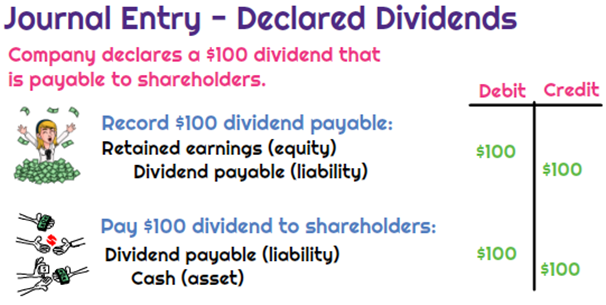

## Table of Contents

## What is a dividend?

A dividend is money that a company pays to its shareholders. When a company makes a profit, it can choose to share some of that profit with the people who own its stocks. This payment is called a dividend. Shareholders usually get dividends a few times a year, and the amount can change based on how well the company is doing.

Dividends are important because they can provide a steady income for investors. For example, if you own stocks in a company that pays dividends, you can receive regular payments without selling your stocks. This can be especially helpful for people who need income, like retirees. However, not all companies pay dividends. Some companies, especially newer ones, might use their profits to grow the business instead of paying dividends.

## How are dividends different from company expenses?

Dividends and company expenses are different things. Dividends are payments that a company gives to its shareholders from its profits. They are like a reward for owning part of the company. When a company does well and makes money, it might decide to share some of that money with the people who own its stocks. This is not something the company has to do, but it can choose to do it if it wants to.

On the other hand, company expenses are the costs that a company has to pay to keep running. These can include things like rent for office space, salaries for employees, and the cost of materials needed to make products. Expenses are necessary for the company to operate and are taken out of the company's revenue before any profits are calculated. Unlike dividends, which are optional, expenses are required for the business to function properly.

## Can dividends be considered an expense for a company?

Dividends cannot be considered an expense for a company. Expenses are the costs a company has to pay to keep running, like rent, salaries, and materials. These costs are subtracted from the company's revenue to figure out if it made a profit. Dividends, on the other hand, are payments made to shareholders from the company's profits. They are not necessary for the company to operate and are more like a reward for owning part of the company.

When a company decides to pay dividends, it is using its profits to give money back to its shareholders. This decision is made after all the expenses have been paid and the company knows how much profit it has left. Because dividends come from profits and not from the money needed to run the business, they are not considered an expense. Instead, they are seen as a way to share the company's success with its owners.

## What is the accounting treatment of dividends?

When a company decides to pay dividends, it does not count them as an expense on its income statement. Instead, dividends are shown on the company's balance sheet and in its cash flow statement. On the balance sheet, dividends are treated as a reduction in the company's retained earnings, which is part of the shareholders' equity section. Retained earnings are the profits the company has kept over time, and when dividends are paid out, this amount goes down.

In the cash flow statement, dividends are listed under the financing activities section. This is because paying dividends is seen as a way the company is using its cash to give money back to its shareholders. It shows how much cash the company is sending out to its owners. So, while dividends affect the company's cash and its equity, they are not treated as an expense like rent or salaries would be.

## How are dividends reported on financial statements?

Dividends are not shown as an expense on the income statement. Instead, they are reported on the balance sheet and the cash flow statement. On the balance sheet, dividends are treated as a reduction in retained earnings, which is part of the shareholders' equity section. Retained earnings are the profits the company has kept over time. When dividends are paid out, the amount of retained earnings goes down.

On the cash flow statement, dividends are listed under the financing activities section. This section shows how the company is using its cash to give money back to its shareholders. It tells you how much cash the company is sending out to its owners. So, while dividends affect the company's cash and its equity, they are not treated as an expense like rent or salaries would be.

## What are the tax implications of dividends for a company?

When a company pays dividends, it doesn't get a tax break for those payments. Dividends are paid out of the company's profits after it has already paid its corporate taxes. So, the company can't deduct the dividends it pays from its taxable income. This means the company pays taxes on its profits first, and then it pays out the remaining money as dividends to its shareholders.

For shareholders, the tax treatment of dividends depends on where they live and the type of dividends they receive. In many places, dividends are considered income and shareholders have to pay taxes on them. Some countries have different tax rates for different types of dividends, like qualified dividends which might be taxed at a lower rate than ordinary dividends. It's important for shareholders to know the tax rules in their country so they can understand how much they'll have to pay on the dividends they receive.

## How do dividends affect a company's cash flow?

When a company pays dividends, it uses some of its cash to give money to its shareholders. This means the company's cash flow goes down because it is sending money out. The cash flow statement will show this as a negative number under the financing activities section. This part of the cash flow statement tells you how the company is using its cash to pay back its owners.

Even though paying dividends reduces the company's cash, it can still be a good thing for the company. Paying dividends can make shareholders happy because they are getting money back from the company. Happy shareholders might want to keep their stocks or even buy more, which can help the company's stock price. So, while dividends do take away from the company's cash, they can also help in other ways by keeping shareholders satisfied.

## What are the legal considerations for paying dividends?

When a company wants to pay dividends, it has to follow certain legal rules. One big rule is that a company can only pay dividends if it has enough profit or money saved up. This means the company can't pay dividends if it is losing money or if paying dividends would make it unable to pay its bills. This rule helps make sure the company stays healthy and can keep running.

Another important thing is that the company's rules or the laws where it is based might have special rules about dividends. For example, some companies might need to get permission from their board of directors or shareholders before they can pay dividends. Also, if a company has borrowed money, the loan agreement might say the company can't pay dividends until it pays back some of the loan. These rules are there to protect the company and its shareholders.

## How do different jurisdictions treat dividends as expenses?

In most places, dividends are not treated as expenses for a company. This means that when a company pays dividends, it can't take that money off its taxes like it can with other costs like rent or salaries. Dividends are paid from the company's profits after it has already paid its taxes. So, the company has to pay taxes on its profits first, and then it can give the rest to its shareholders as dividends.

Different countries might have different rules about how dividends are treated, but usually, they are not seen as an expense. For example, in the United States, dividends are not deductible as a business expense. This is the same in many other countries too. The idea is that expenses are what a company needs to spend to keep running, while dividends are extra money that the company gives to its owners from its profits.

## What is the impact of dividend policy on company valuation?

A company's dividend policy can have a big impact on how much people think the company is worth. When a company pays regular dividends, it can make shareholders happy because they get money back from their investment. This can make the company's stock more attractive to investors who want a steady income. As a result, the demand for the company's stock might go up, which can push the stock price higher and increase the company's overall value.

On the other hand, if a company decides to keep its profits instead of paying dividends, it can use that money to grow the business. This can be good for the company's long-term value if the investments pay off. But, it might make some investors unhappy if they were counting on getting dividends. So, the company's stock price might not go up as much, or it could even go down if investors think the company isn't doing a good job with the money it's keeping. The key is finding a balance that keeps shareholders happy and helps the company grow.

## How do companies decide on the amount of dividends to pay?

Companies decide on the amount of dividends to pay by looking at how much money they have made and how much they need to keep for future plans. They start by figuring out their profits after paying all their bills and taxes. If they have money left over, they might choose to share some of it with their shareholders as dividends. But, they also need to think about keeping enough money to grow the business, pay for new projects, or save for tough times. So, they have to balance between giving money to shareholders and keeping enough for the company's future.

Another thing companies consider is what their shareholders want. Some shareholders might really like getting regular dividends because it gives them a steady income. If a company knows its shareholders want dividends, it might decide to pay more. But if the shareholders are more interested in the company growing and making more money in the long run, the company might pay less in dividends and use the money to grow the business instead. In the end, the company tries to make a choice that keeps its shareholders happy while also making sure it can keep running and growing.

## What are the strategic considerations of treating dividends as an expense?

Treating dividends as an expense could be a strategic move for a company if it helps them manage their finances better. If dividends were considered an expense, the company might be able to reduce its taxable income by the amount of dividends paid. This could mean paying less in taxes, which would leave more money for the company to use in other ways. But, since dividends usually aren't treated as expenses, a company would need to find a way to make this work within the rules of their country's tax laws.

However, there are also risks to thinking of dividends as an expense. If a company starts treating dividends this way, it might make shareholders think the company is spending money it shouldn't. Shareholders might worry that the company is not using its profits wisely or that it's not keeping enough money for future growth. This could make the stock price go down and make it harder for the company to raise money in the future. So, even though it might seem like a good idea to treat dividends as an expense, it's important for a company to think about how this could affect what shareholders think and the company's long-term plans.

## What are the basics of understanding dividends?

Dividends are a fundamental aspect of shareholder return, representing payments made by a company to distribute profits to its shareholders. These disbursements signal a company's financial health and profitability, enhancing investor confidence and potentially attracting further investment. Companies can distribute dividends in various forms, primarily as cash or stock dividends. 

Cash dividends are the most common type, involving direct payments to shareholders, often on a quarterly basis. This type gives shareholders immediate value and reflects directly on the company's [liquidity](/wiki/liquidity-risk-premium) and ability to generate cash flow. Stock dividends, on the other hand, allocate additional shares to shareholders, increasing their overall holdings without immediately altering cash reserves. While cash dividends provide immediate financial benefits, stock dividends can result in capital gains over time as share values appreciate.

The decision to issue dividends involves comprehensive financial analysis. Management must assess the company's profitability, cash flow stability, and future investment projects. A company's dividend policy—a strategic decision—affects its retained earnings, impacting reinvestment opportunities and future growth. 

The dividend yield and payout ratio are critical metrics for evaluating dividends. The dividend yield, expressed as a percentage, is calculated by dividing the annual dividends paid per share by the stock's current market price:

$$
\text{Dividend Yield} = \left( \frac{\text{Annual Dividends per Share}}{\text{Current Stock Price}} \right) \times 100
$$

This metric provides insight into the return on investment from dividends alone. In contrast, the payout ratio compares the dividends paid to the company's net income:

$$
\text{Payout Ratio} = \left( \frac{\text{Dividends Paid}}{\text{Net Income}} \right) \times 100
$$

A higher payout ratio could imply that a company prioritizes returning profits to shareholders over reinvestment. A very high ratio might raise sustainability concerns depending on the industry and economic context.

In conclusion, understanding dividends is crucial for investment decisions, signifying a balance between immediate financial return to shareholders and the retention of earnings for future company growth. These decisions reflect broader strategic considerations within a company’s financial accounting and operational framework.

## How does the interconnection of merging dividends, expenses, accounting, and trading work?

The interplay between dividends, expenses, financial accounting, and [algorithmic trading](/wiki/algorithmic-trading) is a defining [factor](/wiki/factor-investing) in the financial performance and strategic direction of modern companies. Each element, while distinct in its function, contributes to a cohesive financial strategy that inevitably impacts market outcomes and shareholder value.

### Managing Expenses and Dividend Policies

Effective expense management is crucial in shaping a company's dividend policies and financial statements. By optimizing operational costs, firms can enhance their profitability, which may provide room for consistent and potentially higher dividend payouts to shareholders. The relationship between these variables is significant, as excessive costs can erode profit margins, thus reducing the funds available for dividends. Conversely, judicious cost management can lead to increased retained earnings, giving companies the flexibility to reinvest in growth opportunities or increase shareholder returns. A key metric often analyzed is the Dividend Payout Ratio, calculated as:

$$
\text{Dividend Payout Ratio} = \frac{\text{Dividends Paid}}{\text{Net Income}}
$$

A lower ratio may suggest a company is reinvesting profits back into the business, while a higher ratio indicates a focus on returning earnings to shareholders.

### Influence of Algorithmic Trading on Financial Strategies

Algorithmic trading introduces automation and precision into the financial strategy, affecting how financial data is interpreted and utilized. Algorithms can rapidly analyze complex datasets, identifying market patterns and executing trades at speeds beyond human capability. This technological edge allows firms to hedge against risks and exploit market inefficiencies, which can lead to optimized financial outcomes.

The integration of [machine learning](/wiki/machine-learning) and [artificial intelligence](/wiki/ai-artificial-intelligence) in these algorithms further enhances predictive capabilities, enabling sophisticated market forecasts and strategic planning. For example, companies can predict the impact of macroeconomic changes on their expense structure and consequently on their dividend policies, allowing for preemptive adjustments.

### Case Studies of Strategic Balance

Companies that successfully balance these financial aspects often exhibit a strategic harmony that maximizes overall performance. Consider a tech firm that uses advanced algorithmic trading to hedge foreign exchange exposure while maintaining strict expense controls. Such a company may report stable profit margins, enabling a steady dividend payout despite market [volatility](/wiki/volatility-trading-strategies).

Another example is a consumer goods company employing financial accounting analytics to trim unnecessary costs, ensuring that released capital can be routed to sustainable dividend increases or share buybacks, thus boosting shareholder value over time.

### Strategic Advantages Through Interconnections

Understanding the interconnections between dividends, expenses, accounting, and trading offers a significant competitive edge. Businesses that align their expense management with productive use of capital through dividends and strategically leverage algorithmic trading insights can navigate financial uncertainties effectively. This synthesis provides not only resilience but also the ability to capitalize on emerging opportunities, leading to sustained growth and shareholder satisfaction. 

Continuing to develop competencies in each of these areas is essential for maintaining a strategic advantage in increasingly complex financial landscapes. By appreciating their interconnectedness, businesses and investors can enhance decision-making processes and achieve robust financial outcomes.

## References & Further Reading

[1]: ["Advances in Financial Machine Learning"](https://www.amazon.com/Advances-Financial-Machine-Learning-Marcos/dp/1119482089) by Marcos Lopez de Prado

[2]: ["Machine Learning for Algorithmic Trading"](https://github.com/stefan-jansen/machine-learning-for-trading) by Stefan Jansen

[3]: ["Quantitative Trading: How to Build Your Own Algorithmic Trading Business"](https://www.amazon.com/Quantitative-Trading-Build-Algorithmic-Business/dp/1119800064) by Ernest P. Chan

[4]: "The New Financial Order: Risk in the 21st Century" by Robert J. Shiller

[5]: Fama, Eugene F., and Kenneth R. French. "The Cross‐Section of Expected Stock Returns.” The Journal of Finance 47.2 (1992): 427-465.

[6]: ["International Financial Reporting Standards (IFRS)"] (https://www.ifrs.org/content/dam/ifrs/publications/pdf-standards/english/2021/issued/part-a/conceptual-framework-for-financial-reporting.pdf)

[7]: Hull, John C. "Risk Management and Financial Institutions." John Wiley & Sons, 2018. 

[8]: Pompian, Michael M. "Behavioral Finance and Wealth Management: How to Build Optimal Portfolios That Account for Investor Biases." John Wiley & Sons, 2012.

[9]: Simon, Herbert A. "Models of Bounded Rationality: Empirically Grounded Economic Reason." Vol. 3. MIT press, 1997.