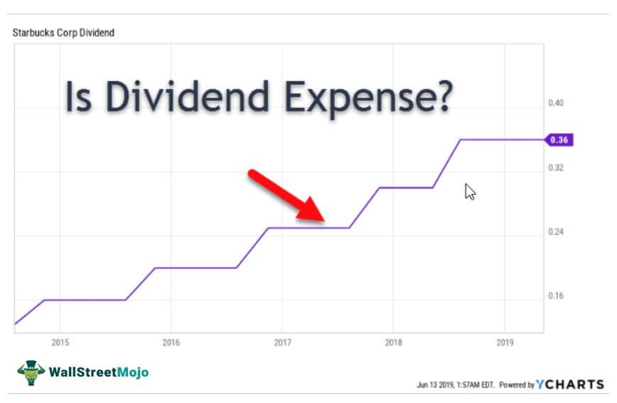

In the ever-evolving world of finance, the interplay between dividends, company expenses, financial accounting, and algorithmic trading is vital for navigating the modern market landscape. Understanding these components is essential for companies striving to achieve financial health and strategic market positioning.

Dividends, as a reflection of a company's profitability and stability, directly influence investor perceptions and market value. They represent a tangible connection between a company's operational success and shareholder benefit. Simultaneously, company expenses highlight the cost efficiency and operational strategies that underpin profitability. Expenses such as operating costs and research and development investments must be carefully managed to optimize financial performance.

Financial accounting serves as the backbone of transparent and compliant business operations, facilitating informed decision-making through accurate reporting of financial transactions. It ensures stakeholders have a clear understanding of a company's fiscal health and operational efficiency.

Algorithmic trading introduces a new dimension to financial markets, utilizing algorithms to execute trades with speed and precision. The rise of machine learning and artificial intelligence in trading strategies marks a significant shift in market dynamics, offering both opportunities and challenges for investors and institutions.

This article examines how businesses effectively manage these components to maximize profits and minimize risks. By analyzing the interconnected nature of these financial elements, stakeholders can gain insights into corporate strategies and make informed investment decisions. Understanding these concepts is essential for anyone looking to adapt to the complexities of modern finance and leverage strategic advantages in a competitive environment.

## Table of Contents

## Understanding Dividends: The Basics

Dividends are a fundamental aspect of shareholder return, representing payments made by a company to distribute profits to its shareholders. These disbursements signal a company's financial health and profitability, enhancing investor confidence and potentially attracting further investment. Companies can distribute dividends in various forms, primarily as cash or stock dividends. 

Cash dividends are the most common type, involving direct payments to shareholders, often on a quarterly basis. This type gives shareholders immediate value and reflects directly on the company's [liquidity](/wiki/liquidity-risk-premium) and ability to generate cash flow. Stock dividends, on the other hand, allocate additional shares to shareholders, increasing their overall holdings without immediately altering cash reserves. While cash dividends provide immediate financial benefits, stock dividends can result in capital gains over time as share values appreciate.

The decision to issue dividends involves comprehensive financial analysis. Management must assess the company's profitability, cash flow stability, and future investment projects. A company's dividend policy—a strategic decision—affects its retained earnings, impacting reinvestment opportunities and future growth. 

The dividend yield and payout ratio are critical metrics for evaluating dividends. The dividend yield, expressed as a percentage, is calculated by dividing the annual dividends paid per share by the stock's current market price:

$$
\text{Dividend Yield} = \left( \frac{\text{Annual Dividends per Share}}{\text{Current Stock Price}} \right) \times 100
$$

This metric provides insight into the return on investment from dividends alone. In contrast, the payout ratio compares the dividends paid to the company's net income:

$$
\text{Payout Ratio} = \left( \frac{\text{Dividends Paid}}{\text{Net Income}} \right) \times 100
$$

A higher payout ratio could imply that a company prioritizes returning profits to shareholders over reinvestment. A very high ratio might raise sustainability concerns depending on the industry and economic context.

In conclusion, understanding dividends is crucial for investment decisions, signifying a balance between immediate financial return to shareholders and the retention of earnings for future company growth. These decisions reflect broader strategic considerations within a company’s financial accounting and operational framework.

## Impact of Company Expenses on Financial Health

Company expenses are a pivotal component in assessing the financial health of a business. These expenses encompass a wide range of costs incurred in the pursuit of operational activities, including operating costs, salaries, research and development (R&D), and other related expenditures. A comprehensive understanding and analysis of these expenses are crucial for evaluating a company's cost management strategies and operational efficiency.

Operating costs, often referred to as operating expenses (OPEX), typically include day-to-day expenses necessary to keep the business running, such as rent, utilities, and office supplies. Salaries and wages form a significant portion of these costs, representing compensation for the workforce that drives the company's operations. Research and development expenses are also crucial as they reflect a company's efforts to innovate and stay competitive in its industry.

Analyzing company expenses provides valuable insights into a firm's operational discipline. Efficient cost management can lead to enhanced profit margins, as cost savings directly translate into increased profitability. For example, streamlining a supply chain or adopting energy-efficient technologies can reduce overhead expenses and subsequently boost net income.

Companies often optimize their expenses by employing various strategic measures. Budgeting and forecasting are commonly used tools to anticipate future expenditures and align them with revenue expectations. Additionally, adopting lean management practices can eliminate waste and optimize resource allocation throughout the business processes.

Financial accounting plays a vital role in tracking and managing these expenses, ensuring accurate recording and reporting of financial transactions. Through structured financial statements, like the income statement and balance sheet, stakeholders can gain insights into expense patterns and identify areas for potential savings. Key accounting principles, such as accrual accounting, ensure that expenses are recorded in the period they are incurred, providing a true depiction of financial performance.

Moreover, technology is instrumental in transforming traditional accounting practices. Advanced software solutions facilitate real-time expense tracking, automated reporting, and detailed financial analysis, aiding businesses in maintaining a dynamic overview of their financial health.

In summary, company expenses significantly influence financial performance and present opportunities for strategic improvements. By focusing on effective cost management strategies and leveraging financial accounting tools, businesses can enhance their operational efficiency and competitive positioning.

## The Role of Financial Accounting

Financial accounting is an essential function within any business organization, critical for maintaining transparency, compliance, and supporting informed decision-making. This domain of accounting is rooted in fundamental principles and practices that guide the accurate and systematic recording, summarizing, and reporting of a company's financial transactions. It forms the backbone of a company's financial health assessment and aids stakeholders in evaluating both fiscal stability and operational efficiency.

At its core, financial accounting involves the preparation of key financial statements, which include the balance sheet, income statement, and cash flow statement. These documents provide a structured representation of the financial outcomes and positions of a business. The balance sheet shows a company's assets, liabilities, and equity at a specific point in time, while the income statement details revenue, expenses, and profitability over a period. The cash flow statement, on the other hand, tracks the inflow and outflow of cash, helping to assess liquidity and cash management practices.

Adherence to generally accepted accounting principles (GAAP) or international financial reporting standards (IFRS) ensures consistency and comparability of financial data. These standards dictate the accounting methods and disclosure requirements, forming a framework within which financial information is prepared and presented. The application of these principles facilitates the generation of reliable financial information, which is crucial for making strategic business decisions.

Technology advancements are reshaping traditional accounting practices through automation, [artificial intelligence](/wiki/ai-artificial-intelligence), and data analytics. These tools enhance the accuracy and efficiency of financial reporting, allowing accountants to focus on higher-order analytical tasks rather than manual data entry. For instance, automation software can streamline the processing of transactions, reducing errors and saving time. Advanced data analytics provide deeper insights into financial trends and predictive modeling, empowering businesses to anticipate market changes and adjust strategies accordingly.

Moreover, the advent of blockchain technology in financial accounting holds the potential for radical transparency and security in financial reporting. By providing an immutable ledger, blockchain ensures transaction integrity and can significantly reduce the risk of fraud. Such technological innovations continue to transform financial accounting, making it more dynamic and robust in response to evolving business environments.

In light of these developments, understanding financial accounting is indispensable for stakeholders aiming to accurately assess a company’s financial narrative. As these practices continue to evolve, businesses must adapt to modern accounting processes to maintain competitiveness and ensure regulatory compliance.

## Algorithmic Trading: A New Frontier

Algorithmic trading, or algo trading, represents a paradigm shift in trading practices by employing advanced algorithms and high-speed computing to automate the execution of trading strategies. This technology affords traders with the ability to execute orders with unprecedented speed and precision, far surpassing human capabilities. One of the primary advantages of algo trading is its capacity to process vast amounts of market data quickly, enabling traders to make informed decisions in real time. Algorithms can be designed to follow complex mathematical models, analyzing multiple markets and instruments simultaneously to identify [arbitrage](/wiki/arbitrage) opportunities or optimal trading times.

Despite its benefits, [algorithmic trading](/wiki/algorithmic-trading) presents several challenges. One significant issue is the risk of market [volatility](/wiki/volatility-trading-strategies), which can be exacerbated by large volumes of automated trades executing simultaneously. Moreover, algo trading necessitates robust risk management and security measures to prevent malfunctions or exploitation by malicious actors. Technical failures or inaccurate models can lead to substantial financial losses, underscoring the importance of continuous testing and refinement.

The integration of [machine learning](/wiki/machine-learning) and artificial intelligence within algorithmic trading is further transforming the financial landscape. These technologies enable the development of sophisticated models that can learn from historical data, adapt to changing market conditions, and predict future trends with improved accuracy. AI-driven algorithms can identify subtle patterns and correlations that traditional models might overlook, offering a strategic edge in fast-paced markets.

Algorithmic trading significantly impacts both individual investors and institutional trading practices. For institutional investors, algo trading enhances efficiency, reduces transaction costs, and improves execution quality. It also allows large financial institutions to employ strategies across diverse asset classes and geographical markets seamlessly. For individual investors, algorithmic trading platforms offer access to sophisticated trading strategies that were once the exclusive domain of professional traders. However, this democratization of trading also presents a learning curve, as individual investors must understand complex algorithms and market dynamics to utilize these tools effectively.

In conclusion, while algorithmic trading offers substantial advantages in speed, precision, and analytical capacity, it also demands diligent risk management and an understanding of advanced technological concepts. As machine learning and artificial intelligence continue to evolve, they will likely play an increasingly crucial role in shaping the future of financial markets.

## Interconnection: Merging Dividends, Expenses, Accounting, and Trading

The interplay between dividends, expenses, financial accounting, and algorithmic trading is a defining [factor](/wiki/factor-investing) in the financial performance and strategic direction of modern companies. Each element, while distinct in its function, contributes to a cohesive financial strategy that inevitably impacts market outcomes and shareholder value.

### Managing Expenses and Dividend Policies

Effective expense management is crucial in shaping a company's dividend policies and financial statements. By optimizing operational costs, firms can enhance their profitability, which may provide room for consistent and potentially higher dividend payouts to shareholders. The relationship between these variables is significant, as excessive costs can erode profit margins, thus reducing the funds available for dividends. Conversely, judicious cost management can lead to increased retained earnings, giving companies the flexibility to reinvest in growth opportunities or increase shareholder returns. A key metric often analyzed is the Dividend Payout Ratio, calculated as:

$$
\text{Dividend Payout Ratio} = \frac{\text{Dividends Paid}}{\text{Net Income}}
$$

A lower ratio may suggest a company is reinvesting profits back into the business, while a higher ratio indicates a focus on returning earnings to shareholders.

### Influence of Algorithmic Trading on Financial Strategies

Algorithmic trading introduces automation and precision into the financial strategy, affecting how financial data is interpreted and utilized. Algorithms can rapidly analyze complex datasets, identifying market patterns and executing trades at speeds beyond human capability. This technological edge allows firms to hedge against risks and exploit market inefficiencies, which can lead to optimized financial outcomes.

The integration of machine learning and artificial intelligence in these algorithms further enhances predictive capabilities, enabling sophisticated market forecasts and strategic planning. For example, companies can predict the impact of macroeconomic changes on their expense structure and consequently on their dividend policies, allowing for preemptive adjustments.

### Case Studies of Strategic Balance

Companies that successfully balance these financial aspects often exhibit a strategic harmony that maximizes overall performance. Consider a tech firm that uses advanced algorithmic trading to hedge foreign exchange exposure while maintaining strict expense controls. Such a company may report stable profit margins, enabling a steady dividend payout despite market volatility.

Another example is a consumer goods company employing financial accounting analytics to trim unnecessary costs, ensuring that released capital can be routed to sustainable dividend increases or share buybacks, thus boosting shareholder value over time.

### Strategic Advantages Through Interconnections

Understanding the interconnections between dividends, expenses, accounting, and trading offers a significant competitive edge. Businesses that align their expense management with productive use of capital through dividends and strategically leverage algorithmic trading insights can navigate financial uncertainties effectively. This synthesis provides not only resilience but also the ability to capitalize on emerging opportunities, leading to sustained growth and shareholder satisfaction. 

Continuing to develop competencies in each of these areas is essential for maintaining a strategic advantage in increasingly complex financial landscapes. By appreciating their interconnectedness, businesses and investors can enhance decision-making processes and achieve robust financial outcomes.

## Conclusion

In conclusion, understanding the complexities of dividends, company expenses, financial accounting, and algorithmic trading is crucial for stakeholders in the modern financial landscape. Each of these components plays a significant role in shaping a company's financial narrative and market strategy. Dividends reflect a company's profitability and reward its investors, while effective management of company expenses is essential for maintaining financial stability and operational efficiency. Financial accounting serves as the backbone of corporate transparency and informed decision-making, offering insights into a company's fiscal health. Meanwhile, algorithmic trading represents an innovative approach to market interactions, leveraging technology for enhanced trading efficiency and data analysis.

As financial environments constantly evolve, continuous analysis and adaptation are necessary. Adopting new technologies, such as artificial intelligence and machine learning, can provide sophisticated tools for managing these financial components. For instance, algorithmic trading platforms utilize these technologies to process vast amounts of market data and execute trades with precision, offering a competitive edge to those who master them.

By maintaining an informed perspective on these elements, investors and companies can make more strategic, informed decisions that align with their financial goals. This requires an awareness of how these components interact and influence each other, as well as a readiness to adopt new methodologies and technologies that can optimize performance.

We hope this exploration provides you with a comprehensive understanding of the intricate and interconnected domains within modern finance, empowering you to navigate this complex landscape with greater insight and strategic capability.

## References & Further Reading

[1]: ["Advances in Financial Machine Learning"](https://www.amazon.com/Advances-Financial-Machine-Learning-Marcos/dp/1119482089) by Marcos Lopez de Prado

[2]: ["Machine Learning for Algorithmic Trading"](https://github.com/stefan-jansen/machine-learning-for-trading) by Stefan Jansen

[3]: ["Quantitative Trading: How to Build Your Own Algorithmic Trading Business"](https://www.amazon.com/Quantitative-Trading-Build-Algorithmic-Business/dp/1119800064) by Ernest P. Chan

[4]: "The New Financial Order: Risk in the 21st Century" by Robert J. Shiller

[5]: Fama, Eugene F., and Kenneth R. French. "The Cross‐Section of Expected Stock Returns.” The Journal of Finance 47.2 (1992): 427-465.

[6]: ["International Financial Reporting Standards (IFRS)"] (https://www.ifrs.org/content/dam/ifrs/publications/pdf-standards/english/2021/issued/part-a/conceptual-framework-for-financial-reporting.pdf)

[7]: Hull, John C. "Risk Management and Financial Institutions." John Wiley & Sons, 2018. 

[8]: Pompian, Michael M. "Behavioral Finance and Wealth Management: How to Build Optimal Portfolios That Account for Investor Biases." John Wiley & Sons, 2012.

[9]: Simon, Herbert A. "Models of Bounded Rationality: Empirically Grounded Economic Reason." Vol. 3. MIT press, 1997.